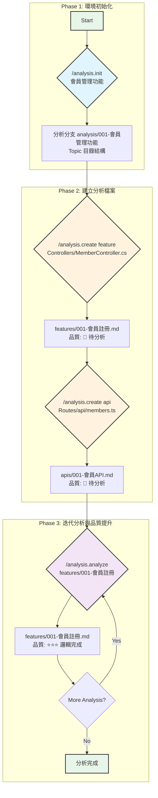

# Analysis Tool Kit V2

> 程式碼分析與文檔生成工具包 - 支援 Topic 和 Shared 雙層架構

## 📖 概述

Analysis Tool Kit V2 是一個專為程式碼分析和架構文檔生成設計的工具包。它提供了一套完整的腳本和範本系統，幫助開發團隊系統化地分析程式碼、追蹤依賴關係，並生成高品質的技術文檔。

### 🎯 核心特性

- **雙層架構設計**: Topic（特定功能）+ Shared（共用元件）
- **自動編號系統**: `###-name.md` 格式，自動計算序號
- **品質追蹤機制**: 5 級品質等級系統，自動計算完成度
- **智能追蹤系統**: overview.md 自動追蹤所有分析檔案
- **多技術棧支援**: .NET MVC, React, Vue, Node.js
- **依賴關係追蹤**: 自動掃描和提示未分析的依賴項

---

## 📁 目錄結構

```
.analysis-kit/
├── README.md                    # 本檔案 - 工具包總覽
├── memory/
│   └── constitution.md          # 分析規則憲法
├── scripts/                     # 核心腳本（6 個）
│   ├── README.md
│   ├── common.sh                # 核心工具函式庫
│   ├── feature-utils.sh         # 功能建立工具
│   ├── analysis-init.sh         # 初始化 Topic 環境
│   ├── analysis-create.sh       # 建立分析檔案
│   ├── analysis-analyze.sh      # 深度分析更新
│   ├── analysis-deps.sh         # 更新依賴關係
│   └── analysis-paths.sh        # 路徑除錯工具
└── templates/                   # 分析範本（8 個）
    ├── overview-template.md     # 追蹤清單範本
    ├── server-template.md       # 後端分析範本
    ├── client-template.md       # 前端分析範本
    ├── feature-template.md      # 功能分析範本
    ├── api-template.md          # API 規格範本
    ├── helper-template.md       # 輔助函式範本
    └── request-pipeline-template.md  # Pipeline 範本
```

---

## 🚀 快速開始

### 前置需求

- Git 倉庫環境
- Bash shell（macOS/Linux）或 PowerShell（Windows）
- Cursor IDE（使用 AI 指令）或直接執行腳本

### Step 1: 初始化分析環境

```bash
# 使用 Cursor AI 指令
/analysis.init 會員管理功能

# 或直接執行腳本
./.analysis-kit/scripts/analysis-init.sh "會員管理功能"
```

**結果：**
- ✅ 建立分支 `analysis/001-會員管理功能`
- ✅ 建立 Topic 目錄和基礎結構
- ✅ 建立 `server.md`, `client.md`, `overview.md`
- ✅ 建立 `analysis/shared/` 結構（首次）

### Step 2: 建立分析檔案

```bash
# 建立功能分析（Topic）
/analysis.create feature Controllers/MemberController.cs

# 建立 API 分析（Topic）
/analysis.create api Routes/api/members.ts

# 建立共用元件分析（Shared）
/analysis.create component Components/LoginForm.tsx
```

### Step 3: 深度分析與品質提升

```bash
# 深度分析功能
/analysis.analyze "features/001-會員註冊" \
  Controllers/MemberController.cs \
  Services/MemberService.cs \
  Views/Member/Register.cshtml
```

### Step 4: 查看環境狀態

```bash
./.analysis-kit/scripts/analysis-paths.sh
```

---

## 📊 分析結果目錄結構

執行工具後，會在專案根目錄下建立以下結構：

```
analysis/
├── 000-shared/                  
└── 001-會員管理功能/                  # Topic 分析
    ├── overview.md                  # Topic 追蹤清單
    ├── server.md                    # 後端分析
    ├── client.md                    # 前端分析
    ├── request-pipeline/
    │   ├── 001-auth-filter.md
    │   └── 002-logging-middleware.md
    ├── components/
    │   ├── 001-login-form.md
    │   └── 002-data-table.md
    ├── helpers/
    │   ├── 001-date-helper.md
    │   └── 002-validation-helper.md
    ├── features/                    # 功能分析
    │   ├── 001-會員註冊.md
    │   ├── 002-會員登入.md
    │   └── 002-個人資料管理.md
    └── apis/                        # API 分析
        ├── 001-註冊API.md
        ├── 002-登入API.md
        └── 002-更新資料API.md
```

---

## 🎯 分析類型說明

### Topic 類型（建立在 Topic 目錄下）

| 類型 | 檔案位置 | 用途 |
|------|---------|------|
| `server` | Topic 根目錄 | 後端頁面渲染邏輯分析 |
| `client` | Topic 根目錄 | 前端頁面驅動邏輯分析 |
| `feature` | Topic/features/ | 重點功能分析 |
| `api` | Topic/apis/ | API Endpoint 規格（含前後端調用） |
| `request-pipeline` | shared/request-pipeline/ | Filter/Middleware 分析 |
| `helper` | shared/helpers/ | 共用輔助函式分析 |

---

## 📈 品質等級系統

每個分析檔案都有品質等級追蹤，基於檔案末尾的品質檢查清單自動計算：

| 等級 | 標記 | 完成度 | 說明 |
|------|------|--------|------|
| 📝 待分析 | `📝 待分析` | 0% | 檔案已建立，但無實質內容 |
| ⭐ 基礎框架 | `⭐ 基礎框架` | 1-40% | 填充基本結構和佔位符 |
| ⭐⭐⭐ 邏輯完成 | `⭐⭐⭐ 邏輯完成` | 41-70% | 主要業務邏輯和流程已分析 |
| ⭐⭐⭐⭐ 架構完整 | `⭐⭐⭐⭐ 架構完整` | 71-90% | 所有依賴注入和架構層級已分析 |
| ⭐⭐⭐⭐⭐ 完整分析 | `⭐⭐⭐⭐⭐ 完整分析` | 91-100% | 所有章節完成，含圖表和最佳實踐 |

### 品質檢查要點

- **⭐ 基礎框架**：基本章節結構、檔案連結、功能描述
- **⭐⭐⭐ 邏輯完成**：核心業務邏輯、互動流程圖、主要程式碼片段
- **⭐⭐⭐⭐ 架構完整**：所有依賴注入已追蹤分析、服務層完整、資料流向清晰
- **⭐⭐⭐⭐⭐ 完整分析**：最佳實踐建議、效能考量、安全性評估、可維護性分析

---

## 🔧 核心元件說明

### 1. Scripts（腳本系統）

位於 `scripts/` 目錄，提供完整的自動化工作流程：

#### 核心工具庫
- **`common.sh`** - 路徑管理、品質計算、overview.md 更新等 20+ 個工具函式
- **`feature-utils.sh`** - 自動編號、分支建立、目錄結構管理

#### 指令驅動腳本
- **`analysis-init.sh`** - 初始化 Topic 環境（對應 `/analysis.init`）
- **`analysis-create.sh`** - 建立分析檔案（對應 `/analysis.create`）
- **`analysis-analyze.sh`** - 深度分析更新（對應 `/analysis.analyze`），支援單檔或批次模式
- **`analysis-deps.sh`** - 更新依賴關係（對應 `/analysis.deps`）

#### 除錯工具
- **`analysis-paths.sh`** - 顯示環境路徑和狀態

詳細說明請參閱：[scripts/README.md](scripts/README.md)

---

### 2. Templates（範本系統）

位於 `templates/` 目錄，提供標準化的分析範本：

#### Topic 範本
- **`server-template.md`** - 後端頁面渲染邏輯分析範本
- **`client-template.md`** - 前端頁面驅動邏輯分析範本
- **`feature-template.md`** - 重點功能分析範本
- **`api-template.md`** - API Endpoint 規格分析範本

#### Shared 範本
- **`request-pipeline-template.md`** - Filter/Middleware 分析範本
- **`helper-template.md`** - 共用輔助函式分析範本

#### 系統範本
- **`overview-template.md`** - 分析總覽追蹤檔案範本

**所有範本都包含：**
1. 標準章節結構
2. `[待補充]` 佔位符
3. 末尾的品質檢查清單
4. 依賴關係追蹤表

---

### 3. Constitution（分析規則憲法）

位於 `memory/constitution.md`，定義所有分析指令的核心規則：

- **分析深度標準**：各品質等級的具體要求
- **命名規範**：檔案、變數、函式的命名慣例
- **Mermaid 圖表規範**：流程圖、序列圖的繪製標準
- **程式碼摘錄原則**：如何選取和註解關鍵程式碼
- **架構模式識別**：如何識別 MVC、DDD、Clean Architecture 等

**所有 AI 指令（create, analyze）都必須遵循 constitution.md 的規則進行分析。**

---

## 🔄 工作流程

### 分析指令流程



**Step 1: 初始化 (`/analysis.init`)**
- **目的**: 建立一個獨立的 Topic 分析環境。
- **動作**:
    - 建立新的 Git 分支 (`analysis/###-topic-name`)。
    - 在 `analysis/` 目錄下建立 Topic 資料夾。
    - 產生基礎分析檔案 (`overview.md`, `server.md`, `client.md`)。

**Step 2: 建立檔案 (`/analysis.create`)**
- **目的**: 針對特定程式碼檔案，建立對應的分析文檔。
- **動作**:
    - 根據指定的類型 (`feature`, `api`, `component` 等) 和路徑，在對應目錄下建立 `.md` 檔案。
    - 檔案會被自動編號，並填充對應的範本內容。
    - 初始品質等級為「📝 待分析」。

**Step 3: 迭代分析 (`/analysis.analyze`)**
- **目的**: 深度分析檔案內容，提升其品質等級。
- **動作**:
    - 使用者提供要分析的 `.md` 檔案和相關的原始碼檔案。
    - AI 根據 `constitution.md` 的規則進行分析，填充內容、產生圖表。
    - 腳本會根據檔案末尾的品質檢查清單，自動重新計算品質等級。
    - 此步驟可以反覆執行，直到達到「⭐⭐⭐⭐⭐ 完整分析」。

### Scripts 與 AI 指令的對應關係

| AI 指令 | Shell Script | 職責分工 |
|---------|--------------|---------|
| `/analysis.init` | `analysis-init.sh` | Script 建立環境，AI 無需介入 |
| `/analysis.create` | `analysis-create.sh` | Script 驗證+建檔，AI 填充初始內容 |
| `/analysis.analyze` | `analysis-analyze.sh` | Script 驗證+計算品質，AI 深度分析 |

**設計原則：**
- Script 負責：環境驗證、檔案操作、路徑計算、品質計算
- AI 負責：內容分析、智能填充、程式碼理解、圖表生成

---

## 💡 使用技巧

### 1. 循序漸進策略

```bash
# 第一次：UI 層分析
/analysis.analyze "features/001-會員註冊" Views/Member/Register.cshtml
→ 達到 ⭐⭐⭐ (UI 層完成)

# 第二次：邏輯層分析
/analysis.analyze "features/001-會員註冊" Controllers/MemberController.cs
→ 達到 ⭐⭐⭐⭐ (邏輯層完成)

# 第三次：架構層分析
/analysis.analyze "features/001-會員註冊" Services/MemberService.cs
→ 達到 ⭐⭐⭐⭐⭐ (架構完整)
```

### 2. 一次性完整分析

```bash
# 提供所有相關檔案，一次完成
/analysis.analyze "features/001-會員註冊" \
  Views/Member/Register.cshtml \
  Controllers/MemberController.cs \
  Services/MemberService.cs
→ 直接達到 ⭐⭐⭐⭐⭐
```

### 3. 依賴追蹤

```bash
# 先分析底層服務
/analysis.create helper Utils/DateHelper.ts
/analysis.analyze "helpers/001-date-helper" Utils/DateHelper.ts

# 再分析使用該服務的元件
/analysis.create component Components/DatePicker.tsx
/analysis.analyze "components/001-date-picker" Components/DatePicker.tsx
```

---

## 🎨 支援的技術棧

### .NET MVC
- **View**: `.cshtml`
- **Controller**: `*Controller.cs`
- **Service**: `*Service.cs`
- **Filter**: `*Filter.cs`, `*Attribute.cs`

### React / Node.js
- **Component**: `.tsx`, `.jsx`
- **API Route**: `*/api/*.ts`, `*/routes/*.ts`
- **Service**: `*Service.ts`, `*Service.js`
- **Utility**: `*/utils/*.ts`, `*/helpers/*.ts`

### Vue
- **Component**: `.vue`
- **Store**: `*/store/*.ts`
- **Service**: `*Service.ts`

### 通用
- **Config**: `.json`, `.yaml`, `.env`
- **Documentation**: `.md`

---

## 📝 Overview.md 檔案格式

每個 `overview.md`（Topic 或 Shared）都作為該範圍的分析檔案追蹤清單。

### 標準格式

```markdown
# [Topic Name] 分析總覽

## 📊 分析進度

- 開始日期：YYYY-MM-DD
- 最後更新：YYYY-MM-DD
- 整體完成度：XX%

## 📂 分析檔案清單

| 檔案 | 品質等級 |
|------|----------|
| [server.md](./server.md) | ⭐⭐⭐ 邏輯完成 |
| [client.md](./client.md) | 📝 待分析 |
| [features/001-會員註冊](./features/001-會員註冊.md) | ⭐⭐⭐⭐⭐ 完整分析 |
| [apis/001-登入API](./apis/001-登入API.md) | ⭐ 基礎框架 |

## 📝 變更記錄

### YYYY-MM-DD
- ✅ 建立 server.md 基礎框架
- ✅ 完成 features/001-會員註冊 完整分析

### YYYY-MM-DD
- ✅ 初始化 Topic 結構
```

### 更新規則

- 每次 `/analysis.create` 新增檔案時，追加到「分析檔案清單」
- 每次 `/analysis.analyze` 更新品質時，同步更新對應檔案的品質等級欄位
- 可選：更新「變更記錄」區塊（用於人工追蹤）

---

## ⚠️ 注意事項

### 執行環境要求

1. **必須在 Git 倉庫內執行**
2. **init 前確保沒有未提交的變更**
3. **create 和 analyze 需在 analysis 分支上執行**
4. **腳本需要執行權限** (`chmod +x scripts/*.sh`)

### 檔案管理

1. **overview.md 會自動更新**，不要手動編輯品質等級欄位
2. **品質等級基於檔案末尾的 checklist 計算**
3. **檔案命名使用中文**，提升可讀性
4. **自動編號由腳本管理**，不要手動調整

### 依賴追蹤

1. **分析時會自動掃描依賴項**
2. **未分析的依賴會影響品質等級上限**
3. **建議按依賴順序建立分析檔案**

---

## 🔍 常見問題

### Q: 如何驗證環境是否正確設置？
**A:** 執行 `./scripts/analysis-paths.sh` 檢查所有路徑和目錄狀態

### Q: 品質等級如何計算？
**A:** 基於檔案末尾的品質檢查清單，計算已勾選項目的百分比：
- 0% → 📝 待分析
- 1-40% → ⭐ 基礎框架
- 41-70% → ⭐⭐⭐ 邏輯完成
- 71-90% → ⭐⭐⭐⭐ 架構完整
- 91-100% → ⭐⭐⭐⭐⭐ 完整分析

### Q: 如何新增自訂分析類型？
**A:** 
1. 在 `templates/` 建立新範本
2. 更新 `analysis-create.sh` 的 `VALID_TYPES`
3. 新增對應的目錄處理邏輯

### Q: Shared 和 Topic 的差異？
**A:** 
- **Topic**：特定功能的分析，專注於單一業務領域
- **Shared**：跨功能的共用元件分析，可被多個 Topic 參考

### Q: 如何處理大型專案？
**A:** 
1. 將專案拆分為多個 Topic
2. 共用元件統一放在 Shared
3. 使用依賴追蹤確保完整性
4. 循序漸進提升品質等級

---

## 📚 延伸閱讀

### 核心文件
- **[Scripts 說明](scripts/README.md)** - 腳本詳細技術文檔
- **[指令說明](.cursor/commands/README.md)** - Cursor AI 指令使用指南
- **[分析憲法](memory/constitution.md)** - 分析規則和標準

### 範本參考
- **[Templates 目錄](templates/)** - 所有可用的分析範本
- **[指令範本](.cursor/command-template.md)** - 自訂指令的範本格式

---

## 🤝 貢獻與回饋

### 如需擴充功能

1. **修改核心函式** → 編輯 `scripts/common.sh` 或 `scripts/feature-utils.sh`
2. **新增分析類型** → 更新 `analysis-create.sh` 並建立對應範本
3. **調整品質標準** → 修改 `scripts/common.sh` 的 `calculate_quality_level()`
4. **新增 AI 指令** → 參考 `.cursor/command-template.md` 建立新指令

### 版本資訊

- **Current Version:** 2.0
- **Release Date:** 2025-10-21
- **Breaking Changes from V1:**
  - 目錄結構改為 Topic + Shared 雙層架構
  - README.md 改為 overview.md
  - analysis.update 改為 analysis.analyze
  - 新增 5 級品質等級系統

---

## 📄 授權

本工具包為內部開發工具，版權歸屬專案團隊所有。

---

**Analysis Tool Kit V2** - 讓程式碼分析變得系統化、可追蹤、高品質 🚀

