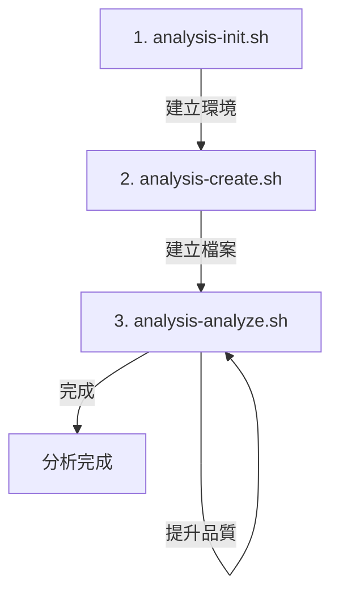

# Analysis Tool Kit V2 - Scripts

這個目錄包含 Analysis Tool Kit V2 的核心腳本，用於支援程式碼分析和文檔生成工作流。

## 📁 目錄結構

```
.analysis-kit/scripts/
├── common.sh                 # 核心工具函式庫
├── feature-utils.sh          # 功能建立工具函式
├── analysis-init.sh          # 初始化 Topic 環境
├── analysis-create.sh        # 建立分析檔案
├── analysis-analyze.sh       # 深度分析更新
├── analysis-deps.sh          # 更新依賴關係
├── analysis-paths.sh         # 路徑除錯工具
└── refactor-doc.sh           # 建立重構規格文件
```

## 🔧 核心腳本

### 1. common.sh
**性質：** 工具函式庫（被其他腳本引用）

**功能：**
- 日誌輸出函式（`log_info`, `log_success`, `log_error`, `log_warning`）
- Git 操作函式（取得 repo root、當前分支、分支驗證）
- 路徑管理函式（`get_analysis_paths`）
- V2 特定函式：
  - `get_overview_path()` - 取得 overview.md 路徑
  - `ensure_shared_structure()` - 確保 shared/ 目錄結構完整
  - `get_file_category()` - 判斷檔案屬於 Topic 還是 Shared
  - `get_target_directory()` - 取得目標目錄路徑
  - `calculate_quality_level()` - 計算品質等級
  - `update_overview_manifest()` - 更新 overview.md 檔案清單
  - `update_quality_level()` - 更新品質等級
  - `count_checked_items()` - 計算已完成項目百分比

**使用方式：**
```bash
source "$SCRIPT_DIR/common.sh"
eval $(get_analysis_paths)
```

---

### 2. feature-utils.sh
**性質：** 功能建立工具函式庫（被其他腳本引用）

**功能：**
- `get_next_number()` - 掃描目錄計算下一個序號
- `get_next_file_number()` - 計算檔案序號（用於 features/, apis/）
- `format_number()` - 格式化序號（例如：5 → 005）
- `sanitize_name()` - 清理名稱為安全的檔案/分支名
- `create_branch_name()` - 自動生成分支名稱
- `create_dir_name()` - 自動生成目錄名稱
- `create_feature_environment()` - 建立完整的功能環境（分支+目錄+範本）
- `create_shared_environment()` - 建立 shared/ 完整結構
- `validate_requirements()` - 驗證必要工具
- `validate_directory_structure()` - 驗證目錄結構

**使用方式：**
```bash
source "$SCRIPT_DIR/feature-utils.sh"
RESULT=$(create_feature_environment "analysis" "$NAME" "$PARENT_DIR" "$TEMPLATE")
eval "$RESULT"
```

---

### 3. analysis-init.sh
**對應指令：** `/analysis.init <name>`

**功能：**
1. 建立 Git 分支 `analysis/###-<name>`
2. 檢查並建立 `analysis/shared/` 結構（首次）
   - 建立 `shared/overview.md`
   - 建立所有子目錄（request-pipeline/, components/, helpers/）
3. 計算 Topic 序號（掃描 analysis/ 目錄）
4. 建立 Topic 目錄 `analysis/###-<topic-name>/`
5. 建立標準檔案：
   - `server.md` ← server-template.md
   - `client.md` ← client-template.md
   - `features/` 空目錄
   - `apis/` 空目錄
   - `overview.md` ← overview-template.md
6. 初始化 Topic overview.md：
   - 註冊 server.md 和 client.md
   - 設定初始品質等級為「📝 待分析」

**執行範例：**
```bash
./analysis-init.sh "會員管理功能"
```

**輸出：**
```json
{
  "BRANCH_NAME": "analysis/###-<name>",
  "TOPIC_DIR": "analysis/###-<topic-name>/",
  "DIR_NAME": "###-<topic-name>"
}
```

---

### 4. analysis-create.sh
**對應指令：** `/analysis.create <type> [source-files...]`

**功能：**
1. 驗證 `<type>` 參數合法性
2. 智能路由判斷目標目錄：
   - Topic 類型 → `analysis/###-[topic-name]/`
   - Shared 類型 → `analysis/shared/`
3. 計算檔案序號
4. 從 source-files 推導檔案名稱
5. 複製對應範本建立新檔案 `###-<name>.md`
6. 更新對應的 overview.md：
   - 追加新檔案到「分析檔案清單」
   - 格式：`| [檔案名稱](路徑) | 📝 待分析 |`

**支援類型：**
- **Topic:** server, client, feature, api
- **Shared:** request-pipeline, component, helper

**執行範例：**
```bash
# 建立 Topic 功能分析
./analysis-create.sh feature Controllers/MemberController.cs

# 建立 Shared 元件分析
./analysis-create.sh component Components/LoginForm.tsx

# 建立 API 規格
./analysis-create.sh api Routes/api/members.ts
```

**輸出：**
```json
{
  "CREATED_FILE": "###-<name>.md",
  "FILE_PATH": "完整路徑",
  "OVERVIEW_UPDATED": "overview.md 路徑",
  "QUALITY_LEVEL": "📝 待分析"
}
```

---

### 5. analysis-analyze.sh
**對應指令：** `/analysis.analyze <target.md> [source-files...]`

**功能：**
1. 驗證目標檔案存在
2. 讀取目標檔案現有內容
3. 分類原始碼檔案（View/Controller/Service）
4. 提供環境資訊給 AI 執行深度分析
5. AI 更新完成後，腳本執行：
   - 解析品質檢查清單（計算已勾選項目）
   - 計算品質等級
   - 同步更新 overview.md 的品質等級欄位

**品質等級計算邏輯：**
- 0% → 📝 待分析
- 1-40% → ⭐ 基礎框架
- 41-70% → ⭐⭐⭐ 邏輯完成
- 71-90% → ⭐⭐⭐⭐ 架構完整（需確認所有依賴已分析）
- 91-100% → ⭐⭐⭐⭐⭐ 完整分析

**執行範例：**
```bash
./analysis-analyze.sh "features/001-會員註冊" \
  Controllers/MemberController.cs \
  Services/MemberService.cs
```

**輸出：**
```json
{
  "TARGET_FILE": "features/001-會員註冊.md",
  "UPDATED_SECTIONS": ["介面分析", "業務邏輯"],
  "QUALITY_CHANGE": "📝 待分析 → ⭐⭐⭐ 邏輯完成",
  "OVERVIEW_SYNCED": true
}
```

---

### 6. analysis-deps.sh
**對應指令：** `/analysis.deps [target.md] [source-files...]`

**功能：**
1. **更新依賴關係**：分析指定的 `.md` 檔案所關聯的原始碼，並自動更新其「依賴關係」區塊。
2. **批次模式**：如果未提供 `target.md`，則會掃描 `overview.md` 並處理所有列出的檔案。
3. **新增原始碼關聯**：如果提供了 `source-files`，會先將其添加到 `.md` 檔案的「分析檔案資訊」區塊，然後再進行分析。

**執行範例：**
```bash
# 更新單一檔案的依賴
./analysis-deps.sh "features/001-會員註冊.md"

# 批次更新所有檔案的依賴
./analysis-deps.sh

# 將新原始碼加入關聯並更新依賴
./analysis-deps.sh "features/001-會員註冊.md" "new-source.ts"
```

---

### 7. analysis-paths.sh
**性質：** 除錯工具

**功能：**
- 顯示當前分析環境的所有路徑變數
- 用於除錯和驗證環境配置
- 檢查目錄結構完整性
- 統計 Topics、Features、APIs 數量

**執行範例：**
```bash
./analysis-paths.sh
```

**輸出範例：**
```
=== Analysis Tool Kit V2 - Environment Paths ===

Git & Repository:
  REPO_ROOT:           /path/to/repo
  CURRENT_BRANCH:      analysis/001-member-management

Tool Kit:
  KIT_DIR:             /path/to/.analysis-kit
  TEMPLATES_DIR:       /path/to/.analysis-kit/templates
  CONSTITUTION_FILE:   /path/to/.analysis-kit/memory/constitution.md

Analysis Structure:
  ANALYSIS_BASE_DIR:   /path/to/analysis
  SHARED_DIR:          /path/to/analysis/shared
  TOPIC_DIR:           /path/to/analysis/001-member-management

Directory Structure Status:
  ✓ Analysis base directory exists
  ✓ Topics found: 3
  ✓ Shared directory exists
  ✓ Current topic directory exists
    📝 Features: 5
    🔌 APIs: 3
```

---

### 8. refactor-doc.sh
**性質：** 重構規格文件生成器

**功能：**
- 從 legacy 分析檔案創建重構規格文件
- 自動計算 `refactors/` 目錄的序號
- 從分析檔案推導功能名稱
- 複製並填充 refactor template
- 輸出環境變數供 AI 填充內容

**支援類型：**
- 單一分析檔案
- 多個分析檔案（用於合併多個功能的重構規格）

**執行範例：**
```bash
# 從單一分析檔案創建重構規格
./refactor-doc.sh analysis/001-topic/features/002-MediaGallery.md

# 從多個分析檔案創建重構規格
./refactor-doc.sh \
  analysis/001-topic/features/002-MediaGallery.md \
  analysis/001-topic/features/005-MediaCarousel.md
```

**輸出：**
```json
{
  "REFACTOR_DOC_FILE": "refactors/001-media-gallery-refactor.md",
  "LEGACY_ANALYSIS_FILES": "002-MediaGallery.md 005-MediaCarousel.md",
  "CONSTITUTION_FILE": ".analysis-kit/memory/refactor-constitution.md"
}
```

**檔名規則：**
- 從第一個分析檔案提取名稱
- 移除序號前綴（`002-MediaGallery.md` → `MediaGallery`）
- 轉換為 kebab-case（`MediaGallery` → `media-gallery`）
- 添加 `-refactor` 後綴
- 加上自動序號：`001-media-gallery-refactor.md`

---

## 🔄 Scripts 執行順序

典型的分析流程：



**Step 1:** `analysis-init.sh` 建立分支和基礎結構  
**Step 2:** `analysis-create.sh` 建立具體分析檔案（可多次呼叫）  
**Step 3:** `analysis-analyze.sh` 反覆更新檔案內容，提升品質等級  

---

## 🔗 Scripts 與 AI 指令的對應關係

| AI 指令 | Shell Script | 職責分工 |
|---------|--------------|---------|
| `/analysis.init` | `analysis-init.sh` | Script 建立環境，AI 無需介入 |
| `/analysis.create` | `analysis-create.sh` | Script 驗證+建檔，AI 填充初始內容 |
| `/analysis.analyze` | `analysis-analyze.sh` | Script 驗證+計算品質，AI 深度分析 |

**設計原則：**
- Script 負責：環境驗證、檔案操作、路徑計算、品質計算
- AI 負責：內容分析、智能填充、程式碼理解、圖表生成

---

## 📝 使用注意事項

1. **所有腳本都需要在 Git 倉庫內執行**
2. **analysis-init.sh** 會自動建立 Git 分支，請確保沒有未提交的變更
3. **analysis-create.sh** 和 **analysis-analyze.sh** 需要在 analysis 分支上執行
4. **品質等級計算** 基於檔案末尾的品質檢查清單（Checklist）
5. **overview.md** 是追蹤系統的核心，會自動更新

---

## 🛠️ 開發與維護

如需修改或擴充功能：

1. **修改核心函式** → 編輯 `common.sh` 或 `feature-utils.sh`
2. **新增分析類型** → 更新 `analysis-create.sh` 的 `VALID_TYPES` 和 `get_target_directory()`
3. **調整品質標準** → 修改 `common.sh` 的 `calculate_quality_level()`
4. **除錯環境問題** → 使用 `analysis-paths.sh` 檢查

---

## 📚 相關文件

- **V2 架構文件：** `.cursor/refactors/Analysis Tool V2.md`
- **範本目錄：** `.analysis-kit/templates/`
- **分析憲法：** `.analysis-kit/memory/constitution.md`

---

## 🔍 常見問題

**Q: 如何驗證環境是否正確設置？**  
A: 執行 `./analysis-paths.sh` 檢查所有路徑和目錄狀態

**Q: 品質等級如何計算？**  
A: 基於檔案末尾的品質檢查清單，計算已勾選項目的百分比

**Q: 如何新增自訂分析類型？**  
A: 1) 在 templates/ 建立新範本 2) 更新 analysis-create.sh 的 VALID_TYPES 3) 新增對應的目錄處理邏輯

**Q: Shared 和 Topic 的差異？**  
A: Topic 是特定功能分析，Shared 是跨功能的共用元件分析

---

**Version:** 2.0  
**Last Updated:** 2025-10-21  
**Maintainer:** Analysis Tool Kit Team

