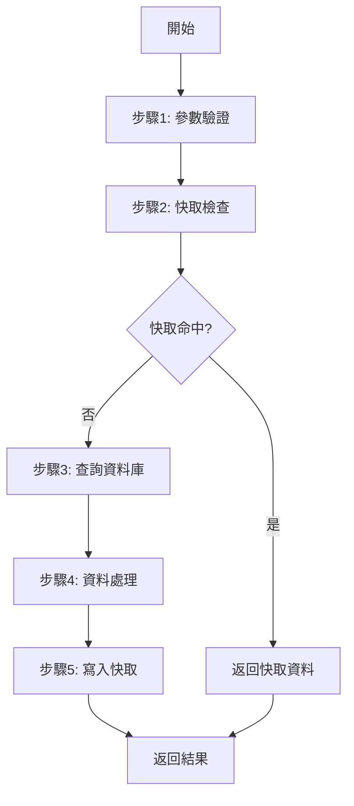
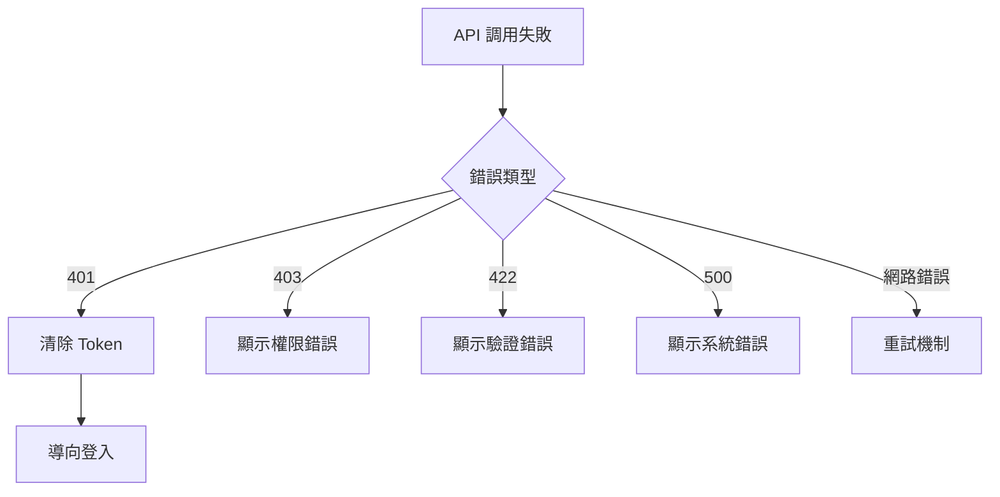

# __NAME__ - API Endpoint Analysis

> **🎯 分析品質**：⭐ 基礎框架 (0%)  
> **📅 開始日期**：__CURRENT_DATE__  
> **📅 最後更新**：__CURRENT_DATE__  
> **📊 分析階段**：📝 待分析  
> **🔗 相關文件**：[連結到 overview.md](./overview.md)

---

## 1. 📝 核心摘要與依賴 (Core Summary & Dependencies)

### 1.1 📂 分析檔案資訊 (Analyzed Files)

| 檔案路徑 |
|---------|
| [待補充：被分析的原始檔案完整路徑] |

### 1.2 📦 依賴關係 (Dependencies)

**後端依賴：**

| 類型 | 名稱 | 用途 | 檔案連結 |
|------|------|------|----------|
| Service | [服務名稱] | [服務用途] | [分析文件連結] |
| Repository | [Repository名稱] | [資料存取用途] | [分析文件連結] |
| Helper | [工具名稱] | [工具用途] | [分析文件連結] |

**前端依賴：**

| 類型 | 名稱 | 用途 | 檔案連結 |
|------|------|------|----------|
| Helper | [工具名稱] | [前端工具用途] | [分析文件連結] |
| Type | [型別定義] | [TypeScript 型別] | [分析文件連結] |

**說明：** 此表格追蹤本 API 端點在前後端的所有依賴。

---

## 2. 📋 分析指引 (Analysis Guidelines)

**此文件的分析目標：**

本文件用於分析**API 端點的完整規格與實作**，重點在於：

1. **API 規格**：定義 HTTP Method、路由、請求/回應格式、狀態碼
2. **後端實作**：分析 Controller → Service → Repository 的業務邏輯鏈路
3. **前端調用**：記錄前端如何封裝和調用此 API（Service 層）
4. **依賴追蹤**：追蹤後端和前端的所有依賴，建立完整的依賴關係表
5. **效能與安全**：評估快取策略、資料庫優化、安全防護措施

**AI Agent 注意事項：**
- 此為 API 端點分析，涵蓋後端實作和前端調用兩個層面
- 請求/回應規格必須詳細，包含所有參數、欄位說明、範例
- 必須用流程圖展示從接收請求到返回回應的完整邏輯，包含錯誤處理分支
- 後端依賴和前端依賴要分開列表
- 重點關注安全性（授權、輸入驗證、注入防護）和效能（快取、查詢優化）
- **必須追蹤 Controller 的依賴注入，並在依賴關係表中詳述每個依賴的用途。**
- **必須附上關鍵業務邏輯的程式碼片段，並逐行註解說明。**
- **資料流分析需包含從 DTO 到 Model，再到 ViewModel 的完整轉換過程。**

---

## 3. 後端規格與實作 (Backend Specification & Implementation)

### 3.1 API 基本資訊 (API Basic Information)

#### 3.1.1 端點定義

**基本資訊：**
- **HTTP Method**：GET / POST / PUT / PATCH / DELETE
- **端點路徑**：`/api/resource/{id}`
- **API 版本**：v1 / v2
- **回應格式**：JSON / XML

---

#### 3.1.2 認證授權

**認證方式：**
- [ ] Bearer Token
- [ ] API Key
- [ ] OAuth 2.0
- [ ] Basic Auth
- [ ] Cookie Session

**授權要求：**
- **權限**：[待補充：所需權限]
- **角色**：[待補充：允許的角色]

---

### 3.2 請求規格 (Request Specification)

#### 3.2.1 路徑參數 (Path Parameters)

| 參數名稱 | 類型 | 必需 | 說明 | 範例 |
|---------|------|------|------|------|
| `id` | integer | 是 | [待補充：說明] | `12345` |

---

#### 3.2.2 查詢參數 (Query Parameters)

| 參數名稱 | 類型 | 必需 | 預設值 | 說明 | 範例 |
|---------|------|------|--------|------|------|
| `page` | integer | 否 | `1` | [待補充：頁碼] | `1` |
| `limit` | integer | 否 | `10` | [待補充：每頁筆數] | `20` |
| `sort` | string | 否 | `id` | [待補充：排序欄位] | `createdAt` |

---

#### 3.2.3 請求主體 (Request Body)

**Content-Type**: `application/json`

**資料結構：**
```typescript
interface RequestBody {
    // [待補充：請求主體結構]
    field1: string;
    field2: number;
    field3?: boolean;
}
```

**欄位說明：**
- `field1` - [必需] [待補充：欄位說明]
- `field2` - [必需] [待補充：欄位說明]
- `field3` - [可選] [待補充：欄位說明]

**範例：**
```json
{
    "field1": "value",
    "field2": 123,
    "field3": true
}
```

---

#### 3.2.4 請求標頭 (Request Headers)

| 標頭名稱 | 必需 | 說明 | 範例 |
|---------|------|------|------|
| `Authorization` | 是 | 授權 Token | `Bearer eyJhbGc...` |
| `Content-Type` | 是 | 內容類型 | `application/json` |
| `Accept` | 否 | 接受格式 | `application/json` |

---

### 3.3 回應規格 (Response Specification)

#### 3.3.1 成功回應 (Success Response)

**HTTP 狀態碼：** `200 OK` / `201 Created` / `204 No Content`

**回應結構：**
```typescript
interface SuccessResponse {
    // [待補充：成功回應結構]
    success: boolean;
    data: {
        // 資料內容
    };
    message?: string;
}
```

**範例：**
```json
{
    "success": true,
    "data": {
        "id": 12345,
        "name": "範例資料"
    },
    "message": "操作成功"
}
```

---

#### 3.3.2 錯誤回應 (Error Response)

**HTTP 狀態碼與說明：**

| 狀態碼 | 說明 | 情境 |
|--------|------|------|
| `400` | Bad Request | 參數格式錯誤或缺少必要參數 |
| `401` | Unauthorized | 未登入或 Token 過期 |
| `403` | Forbidden | 無權限存取此資源 |
| `404` | Not Found | 資源不存在 |
| `409` | Conflict | 資源衝突（例如：重複建立） |
| `422` | Unprocessable Entity | 業務邏輯驗證失敗 |
| `500` | Internal Server Error | 伺服器內部錯誤 |

**錯誤回應結構：**
```typescript
interface ErrorResponse {
    success: false;
    error: {
        code: string;
        message: string;
        details?: any;
    };
}
```

**範例：**
```json
{
    "success": false,
    "error": {
        "code": "VALIDATION_ERROR",
        "message": "欄位驗證失敗",
        "details": {
            "field1": "此欄位為必填"
        }
    }
}
```

---

#### 3.3.3 回應標頭 (Response Headers)

| 標頭名稱 | 說明 | 範例 |
|---------|------|------|
| `Content-Type` | 內容類型 | `application/json` |
| `X-Total-Count` | 總筆數（分頁） | `150` |
| `X-Page-Count` | 總頁數（分頁） | `15` |

---

### 3.4 業務邏輯 (Business Logic)

#### 3.4.0 核心 Controller 方法 (Core Controller Method)
**程式碼片段：**
```csharp
// [待補充：貼上 Controller Action 的完整程式碼]
[HttpGet("{id}")]
public async Task<IActionResult> GetById(int id)
{
    // ...
}
```

#### 3.4.1 核心流程 (Core Flow)
[待補充：此方法的主要業務邏輯步驟，使用流程圖或編號列表]

**執行步驟**：
1. [待補充：第一步]
2. [待補充：第二步]
3. [待補充：第三步]

**流程圖**（Mermaid）：


---

#### 3.4.2 資料存取層調用 (Data Access Layer Calls)
[待補充：此方法調用的所有 Repository 或 DAL 方法]

| Repository | 方法名稱 | 用途 | 查詢條件 | 回傳值 |
|-----------|---------|------|---------|--------|
| [Repository名] | [方法名] | [用途說明] | [查詢條件] | [回傳型別] |

**範例**：
```csharp
// 取得商品頁資料
var salePageData = _salePageRepository.GetSalePageById(salePageId);

// 取得SKU資訊
var skuList = _salePageRepository.GetSaleProductSKUBySKUIds(shopId, skuIds);
```

---

#### 3.4.3 其他服務調用 (Service Calls)
[待補充：此方法調用的其他 Service 方法]

| 服務名稱 | 方法名稱 | 用途 | 參數 | 回傳值 |
|---------|---------|------|------|--------|
| [服務名] | [方法名] | [用途說明] | [參數列表] | [回傳型別] |

**範例**：
```csharp
// 取得多語系內容
var multilingualData = _multilingualService.GetList<SalePageMultilingualEntity>(
    MultilingualModuleTypeEnum.SalePage,
    salePageIds,
    shopId,
    language
);

// 取得商店預設設定
var shopDefault = _shopDefaultService.GetShopDefaultValue(
    shopId,
    ShopDefaultGroupTypeDefEnum.SalePage,
    ShopDefaultKeyEnum.EnableIsComingSoon,
    true
);
```

---

#### 3.4.4 資料處理與轉換 (Data Processing & Transformation)
[待補充：資料驗證、轉換、映射邏輯]

**資料驗證**：
- [待補充：輸入驗證規則]
- [待補充：業務規則驗證]

**資料轉換**：
```csharp
// [待補充：資料映射、格式轉換範例]
var entity = Mapper.Map<TargetEntity>(sourceEntity);
```

**資料聚合**：
- [待補充：如何組合多個來源的資料]

---

### 3.5 資料模型轉換 (Data Model Transformation)

### 3.5.1 請求模型 (Request DTO) -> 業務模型 (Business Model)
**轉換邏輯：**
[待補充：描述從 Request DTO 如何轉換/映射到後端內部使用的業務模型或實體]

**程式碼範例 (e.g., AutoMapper / Manual Mapping)：**
```csharp
// [待補充：DTO 到 Model 的轉換程式碼]
var businessModel = _mapper.Map<BusinessModel>(requestDto);
```

### 3.5.2 業務模型 (Business Model) -> 回應模型 (Response DTO)
**轉換邏輯：**
[待補充：描述從業務模型如何轉換/映射到最終的 Response DTO]

**程式碼範例：**
```csharp
// [待補充：Model 到 DTO 的轉換程式碼]
var responseDto = _mapper.Map<ResponseDto>(resultModel);
```

---

### 3.6 快取策略分析 (Caching Strategy Analysis)

#### 3.6.1 快取機制 (Cache Mechanism)
[待補充：此方法的快取策略]

**快取類型**：
- [ ] Memory Cache (記憶體快取)
- [ ] Redis Cache (分散式快取)
- [ ] 無快取

**快取設定**：
```csharp
// [待補充：快取相關程式碼]
var cacheKeyEntity = this.GetCacheKey("TypeName", new string[] { key1, key2 });
var result = this.DataCacheService.GetRedisCacheData<T>(
    cacheKeyEntity.ServiceName,
    cacheKeyEntity.TypeName,
    cacheKeyEntity.Key,
    () => {
        // 快取未命中時的處理邏輯
        return fetchData();
    },
    expirationSeconds: 900, // 15 分鐘
    enableCache: true,
    cleanCache: false
);
```

**快取策略**：
- **快取 Key 格式**：[待補充]
- **過期時間**：[待補充：秒數]
- **更新策略**：[待補充：主動更新 / 被動失效]
- **快取穿透防護**：[待補充：是否有防護機制]

---

#### 3.6.2 快取 Key 管理 (Cache Key Management)
[待補充：快取 Key 的生成與管理邏輯]

**CacheKey 結構**：
```
ServiceName:TypeName-Version:Key
例如：SalePageV2:SalePageV2ProcessContext-2023121401:100-12345-secret-Web-0
```

**版本控制**：
- [待補充：如何管理快取版本]

---

## 4. 前端調用封裝 (Frontend Integration)

### 4.1 Service 類別封裝

**前端服務封裝：**
```typescript
class ApiService {
    // [待補充：封裝此 API 的前端 Service 類別]
    
    /**
     * 調用此 API
     * @param data - 請求資料
     * @returns Promise<Response>
     */
    public async callApi(data: RequestType): Promise<ResponseType> {
        try {
            const response = await fetch('/api/endpoint', {
                method: 'POST',
                headers: {
                    'Content-Type': 'application/json',
                    'Authorization': `Bearer ${this.getToken()}`
                },
                body: JSON.stringify(data)
            });
            
            if (!response.ok) {
                throw new Error(`HTTP ${response.status}`);
            }
            
            return await response.json();
        } catch (error) {
            this.handleError(error);
            throw error;
        }
    }
}
```

---

### 4.2 錯誤處理封裝

**前端錯誤處理：**
```typescript
private handleError(error: Error): void {
    if (error.message.includes('401')) {
        // 導向登入頁
        router.push('/login');
    } else if (error.message.includes('403')) {
        // 顯示權限錯誤
        showNotification('無權限存取', 'error');
    } else {
        // 一般錯誤處理
        showNotification(error.message, 'error');
    }
    
    // 記錄錯誤
    logger.error('API Error:', error);
}
```

**錯誤處理流程：**


---

### 4.3 快取與優化

**快取策略：**
```typescript
// 簡單的快取實作
private cache = new Map<string, CacheEntry>();

public async getWithCache(key: string): Promise<Data> {
    // 檢查快取
    const cached = this.cache.get(key);
    if (cached && Date.now() - cached.timestamp < 5 * 60 * 1000) {
        return cached.data;
    }
    
    // 調用 API
    const data = await this.callApi(key);
    this.cache.set(key, { data, timestamp: Date.now() });
    return data;
}
```

**優化建議：**
- [ ] 實作請求去重（避免重複請求）
- [ ] 實作請求取消（AbortController）
- [ ] 實作重試機制（指數退避）

---

## 5. 範例與測試 (Examples & Testing)

### 5.1 請求範例

**cURL 範例：**
```bash
curl -X POST "https://api.example.com/api/resource" \
  -H "Authorization: Bearer YOUR_TOKEN" \
  -H "Content-Type: application/json" \
  -d '{
    "field1": "value",
    "field2": 123
  }'
```

**JavaScript/Fetch 範例：**
```javascript
const response = await fetch('https://api.example.com/api/resource', {
    method: 'POST',
    headers: {
        'Authorization': 'Bearer YOUR_TOKEN',
        'Content-Type': 'application/json'
    },
    body: JSON.stringify({
        field1: 'value',
        field2: 123
    })
});
const data = await response.json();
```

---

### 5.2 測試案例

**正常流程測試：**
1. **案例1**：[正常操作]
   - 請求：[待補充]
   - 預期回應：[待補充]

**異常流程測試：**
1. **案例1**：缺少必要參數
   - 請求：[待補充]
   - 預期回應：400 Bad Request

2. **案例2**：未授權存取
   - 請求：[待補充]
   - 預期回應：401 Unauthorized

---

## 6. 架構與品質分析 (Architecture & Quality Analysis)

### 6.1 效能考量

**效能檢查清單：**
- [ ] **資料庫查詢優化**：是否有 N+1 查詢問題？是否已建立適當索引？
- [ ] **快取策略**：是否對常用資料或高成本計算結果使用快取（Redis/Memory Cache）？
- [ ] **分頁實作**：針對大量資料返回的端點，是否已實作分頁？
- [ ] **非同步處理**：是否有長時間執行的操作？是否已改為非同步處理以避免阻塞？
- [ ] **回應壓縮**：是否已啟用 Gzip 等回應壓縮機制？

---

### 6.2 安全性評估

**安全檢查清單：**
- [ ] 輸入驗證（防止注入攻擊）
- [ ] SQL 注入防護（使用參數化查詢）
- [ ] XSS 防護（輸出編碼）
- [ ] CSRF 防護（Token 驗證）
- [ ] 授權檢查 (Authorization Check)
- [ ] 速率限制（Rate Limiting）
- [ ] 敏感資料加密
- [ ] HTTPS 強制使用

**安全風險：**
- [待補充：已識別的安全風險]

---

### 6.3 錯誤處理策略

**錯誤處理原則：**
- 所有錯誤都應返回標準格式
- 敏感資訊不應暴露在錯誤訊息中
- 系統錯誤應記錄日誌

**異常類型**：
- `[ExceptionType]` - [待補充：處理方式]

**錯誤處理範例**：
```csharp
try
{
    // 業務邏輯
}
catch (WebException ex)
{
    var msg = $"外部服務異常：{ex.Message}";
    this.Logger.Error(msg);
    throw new ServiceException(msg, ex);
}
catch (Exception ex)
{
    this.Logger.Error(ex.ToString());
    throw;
}
```

**日誌記錄**：
- [待補充：日誌記錄策略]

---

## 7. 📋 品質檢查清單 (Quality Checklist)

### ⭐ 基礎框架級 (Foundation Level)
- [ ] **1.1 📂 分析檔案資訊**：至少一個被分析的檔案路徑已填寫。
- [ ] **3.1 API 基本資訊**：端點定義與認證授權方式已填寫完整。
- [ ] **3.2 請求規格**：路徑、查詢、主體等請求規格已定義。
- [ ] **3.3 回應規格**：成功與錯誤的回應結構皆已定義。

### ⭐⭐ 核心邏輯級 (Core Logic Level)
- [ ] **1.2 📦 依賴關係**：後端依賴關係表已填寫。
- [ ] **3.4.0 核心 Controller 方法**：Controller 的核心方法程式碼已貼上。
- [ ] **3.4.1 核心流程**：業務邏輯的 Mermaid 流程圖已繪製完成。
- [ ] **3.5 資料模型轉換**：DTO 與業務模型之間的轉換邏輯已說明。

### ⭐⭐⭐ 整合分析級 (Integration Analysis Level)
- [ ] **3.4.2 資料存取層調用**：所有 Repository/DAL 的調用皆已列表說明。
- [ ] **3.4.3 其他服務調用**：所有內部服務的調用皆已列表說明。
- [ ] **3.6 快取策略分析**：後端的快取機制、Key 格式、過期策略皆已詳細描述。
- [ ] **4. 前端調用封裝**：前端 Service 的封裝、錯誤處理、快取策略皆已提供程式碼範例。

### ⭐⭐⭐⭐ 架構品質級 (Architecture Quality Level)
- [ ] **5.2 測試案例**：正常與異常流程的測試案例皆已定義。
- [ ] **6.1 效能考量**：效能檢查清單已完成評估。
- [ ] **6.2 安全性評估**：安全性檢查清單已完成評估。
- [ ] **6.3 錯誤處理策略**：後端的錯誤處理原則、範例與日誌策略皆已說明。

---

**當前品質等級**：⭐ 基礎框架 (0%)

