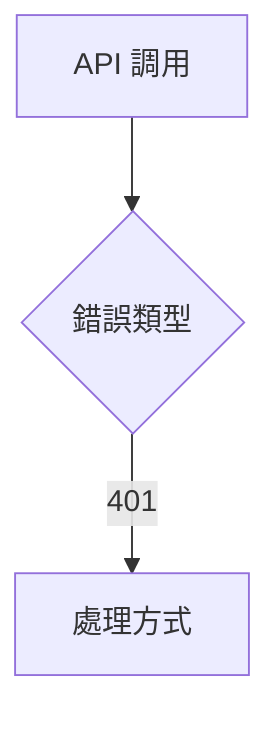

# __NAME__ - Frontend API Service Analysis

---

## 1. 📝 核心摘要與依賴 (Core Summary & Dependencies)

### 1.1 📂 分析檔案資訊 (Analyzed Files)

| 檔案路徑 |
|---------|
| [待補充：被分析的前端 Service 檔案完整路徑] |

### 1.2 📦 依賴關係 (Dependencies)

| 類型 | 名稱 | 用途 | 檔案連結 |
|------|------|------|----------|
| Store | [Store 名稱] | [狀態管理用途] | [分析文件連結] |
| Helper| [工具名稱] | [前端工具用途] | [分析文件連結] |
| Type | [型別定義] | [TypeScript 型別] | [分析文件連結] |
| Service | [其他服務] | [依賴的其他服務] | [分析文件連結] |

**說明：** 此表格追蹤本 Service 的所有前端依賴。

---

## 2. 📋 分析指引 (Analysis Guidelines)

**目標：** 分析前端 API Service 封裝實作（職責定義、Endpoint 規格、實作邏輯、錯誤處理、依賴追蹤）

**規則：**
- 章節結構不變 | 來源限定 1.1 節 | 依賴記錄於 1.2 節
- 程式碼真實性：禁止 `...` 省略或編造 | 品質清單：僅更新勾選狀態
---

## 3. 🔧 Service 總體分析 (Overall Service Analysis)

### 3.1 職責說明 (Responsibilities)

[待補充：說明此 Service 的主要職責]

### 3.2 錯誤處理策略 (Error Handling Strategy)

[待補充：說明此 Service 的錯誤處理實作方式]

**錯誤處理特點**：
- [待補充：如 Promise 包裝、錯誤上拋、統一攔截器等]

**錯誤處理流程圖**（可選，僅在複雜處理邏輯時使用）：


**程式碼範例**（若有統一錯誤處理）：
```typescript
// [待補充：貼上實際錯誤處理程式碼，若無統一處理則省略此區塊]
```

---

## 4. 🚀 Endpoints 規格與實作 (Endpoints Specification & Implementation)

*針對此 Service 中的每一個 Endpoint，複製並填寫以下區塊。*

### 4.1 `[HTTP_METHOD]` `[ENDPOINT_PATH]`

[待補充：說明此 Endpoint 的功能]

#### 4.1.1 請求規格 (Request Specification)

**路徑/查詢參數:**

| 參數名稱 | 位置 | 類型 | 必需 | 說明 |
|----------|------|------|------|------|
| `userId` | Path | string | 是 | 使用者 ID |
| `includeDetails`| Query | boolean| 否 | 是否包含詳細資料 |

**請求主體:**
```typescript
// [待補充：完整實際程式碼，禁止使用 ... 省略]
interface UpdateUserRequest {
    name: string;
    email: string;
}
```

**欄位說明:**

| 欄位名稱 | 類型 | 必需 | 說明 |
|----------|------|------|------|
| `name`   | string | 是 | [待補充] |
| `email`  | string | 是 | [待補充] |

**範例 (JSON):**
```json
{
    "name": "John Doe",
    "email": "john.doe@example.com"
}
```

#### 4.1.2 回應規格 (Response Specification)

> **📌 格式建議：**
> - 簡單回應（boolean/string/number/null）：直接說明值的意義
> - 複雜回應（Object/Array）：使用完整的欄位說明表格

**成功回應:** `200 OK`
```typescript
interface UserProfile {
    id: string;
    name: string;
    email: string;
    createdAt: string;
}
```

**欄位說明:**

| 欄位名稱 | 類型 | 說明 |
|----------|------|------|
| `id` | string | [待補充] |
| `name` | string | [待補充] |
| `email` | string | [待補充] |
| `createdAt` | string | [待補充] |

**範例 (JSON):**
```json
{
    "id": "user-123",
    "name": "John Doe",
    "email": "john.doe@example.com",
    "createdAt": "2023-10-27T10:00:00Z"
}
```

**常見錯誤回應:**

| 狀態碼 | 錯誤碼 (可選) | 說明 |
|--------|---------------|------|
| `404` | `USER_NOT_FOUND`| 使用者不存在 |
| `422` | `VALIDATION_FAILED`| 提交的資料驗證失敗 |

#### 4.1.3 前端方法實作 (Frontend Method Implementation)

**程式碼片段:**
```typescript
// [待補充：完整實際程式碼，禁止使用 ... 省略]
async function getUserProfile(userId: string): Promise<UserProfile> {
    try {
        const response = await apiClient.get<UserProfile>(`/users/${userId}`);
        return response.data;
    } catch (error) {
        handleError(error);
        throw error;
    }
}
```

**邏輯說明:**
1. **接收參數**: [待補充]
2. **API 調用**: [待補充]
3. **資料回傳**: [待補充]
4. **錯誤處理**: [待補充]

---

## 5. 📋 品質檢查清單 (Quality Checklist)

### ⭐ 基礎框架級 (Foundation Level)
- [ ] **1.1 📂 分析檔案資訊**：被分析的前端 Service 檔案路徑已填寫。
- [ ] **3.1 職責說明**：Service 的核心職責已清晰描述。
- [ ] **4. Endpoints**：至少有一個 Endpoint 已被分析，包含其用途說明。
- [ ] **4.x.1 請求規格**：Endpoint 的請求規格（參數、主體型別）已定義。
- [ ] **4.x.2 回應規格**：Endpoint 的成功回應規格（主體型別）已定義。

### ⭐⭐ 核心邏輯級 (Core Logic Level)
- [ ] **1.2 📦 依賴關係**：前端依賴關係表已填寫。
- [ ] **3.2 錯誤處理策略**：全域錯誤處理的 Mermaid 流程圖已繪製完成。
- [ ] **4.x.2 回應規格**：Endpoint 的常見錯誤回應狀態碼與說明已填寫。
- [ ] **4.x.3 前端方法實作**：Endpoint 對應的方法實作程式碼片段已貼上。

### ⭐⭐⭐ 整合分析級 (Integration Analysis Level)
- [ ] **3.2 錯誤處理策略**：錯誤處理的核心程式碼範例已提供（若有統一處理）。
- [ ] **4.x.1 請求規格**：請求實體的欄位說明表格已詳細填寫。
- [ ] **4.x.2 回應規格**：回應實體的欄位說明表格已詳細填寫。
- [ ] **4.x.3 前端方法實作**：Endpoint 方法的詳細邏輯說明已完成。

### ⭐⭐⭐⭐ 架構品質級 (Architecture Quality Level)
- [ ] **完整性**：文件內所有 `[待補充]` 標記皆已移除，並替換為基於原始碼的真實分析內容。
- [ ] **程式碼真實性**：所有程式碼片段皆為專案中的**實際程式碼**，**逐字複製**，無任何省略或編造。
- [ ] **流程圖真實性**：所有 Mermaid 圖表中的元素（函式名、類別名、流程步驟）皆能在原始碼中找到明確對應。
- [ ] **無推測性內容**：文件中所有分析內容皆基於**已提供的原始碼檔案**，無任何基於推測的內容。

### ⭐⭐⭐⭐⭐ 功能實作完整分析 (Full Implementation Analysis)
- [ ] **文件準確性**：所有技術細節（API 規格、型別定義、參數說明）與實際程式碼完全一致。
- [ ] **依賴關係最終確認**：`1.2 📦 依賴關係` 表中的所有依賴項皆有對應的分析文件連結，且無懸空的依賴。
- [ ] **程式碼完整性驗證**：所有關鍵邏輯的程式碼片段皆完整呈現，無使用 `...` 或註解省略。
- [ ] **可驗證性**：所有分析結果皆可透過閱讀原始碼檔案進行驗證，無法驗證的內容必須明確標記為「推測」或「建議」。

---

> **🎯 分析品質**：⭐ 基礎框架  
> **📅 開始日期**：__CURRENT_DATE__  
> **📅 最後更新**：__CURRENT_DATE__  
