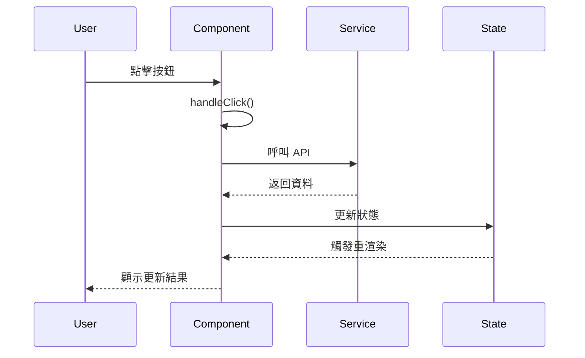
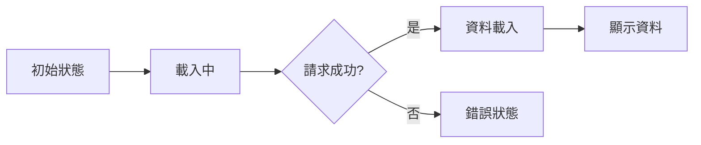

# __TOPIC_NAME__ - Client Analysis

> **🎯 分析品質**：⭐ 基礎框架 (0%)  
> **📅 開始日期**：__CURRENT_DATE__  
> **📅 最後更新**：__CURRENT_DATE__  
> **📊 分析階段**：📝 待分析  
> **🔗 相關文件**：[連結到 overview.md](./overview.md)

---

## 1. 📝 核心摘要與依賴 (Core Summary & Dependencies)

### 1.1 📂 分析檔案資訊 (Analyzed Files)

| 檔案路徑 |
|---------|
| [待補充：被分析的原始檔案完整路徑] |

### 1.2 📦 依賴關係 (Dependencies)

| 類型 | 名稱 | 用途 | 檔案連結 |
|------|------|------|----------|
| Component | [元件名稱] | [元件用途] | [分析文件連結] |
| Service | [服務名稱] | [服務用途] | [分析文件連結] |
| Hook | [Hook名稱] | [Hook用途] | [分析文件連結] |
| Helper | [工具名稱] | [工具用途] | [分析文件連結] |

**說明：** 此表格追蹤本元件依賴的所有外部元件、服務與工具。

---

## 2. 📋 分析指引 (Analysis Guidelines)

**此文件的分析目標：**

本文件用於分析**前端頁面元件的驅動邏輯**，重點在於：

1. **UI 結構**：記錄元件的 HTML/JSX 結構、樣式方案
2. **互動流程**：分析使用者操作如何觸發事件、更新狀態、重渲染 UI
3. **狀態管理**：梳理 State、Props、生命週期的完整運作
4. **依賴追蹤**：追蹤所有使用的 Component、Service、Hook 並建立依賴關係表
5. **效能與可訪問性**：評估渲染效能、a11y 支援、可重用性

**AI Agent 注意事項：**
- 此為前端頁面級元件分析，通常對應一個完整的路由頁面
- 必須用序列圖清楚展示使用者操作 → 事件處理 → 狀態更新 → UI 回饋的完整流程
- 所有依賴的元件/服務都必須記錄到依賴關係表，並確認是否已建立分析檔案
- Props 介面和狀態變數必須詳細說明用途

---

## 3. 前端架構藍圖 (Frontend Architecture Blueprint)

### 3.1 View 引擎 / 框架架構 (View Engine / Framework)
**技術選型**：
- [描述使用的前端技術及其版本]
**架構模式**：
- [描述使用的架構模式與設計原則]

### 3.2 資料初始化流程 (Data Initialization)
**伺服器端資料 (Server-Side Data)**：
- **主要資料模型**：`[資料模型名稱]`
- **初始資料注入**：[描述如何將資料從伺服器傳遞到客戶端]
**客戶端初始化 (Client-Side Initialization)**：
- **資料取得方式**：[描述前端如何取得初始資料]
- **載入策略**：[描述同步/非同步載入模式]

### 3.3 狀態管理策略 (State Management)
**狀態管理方案**：
- [描述使用的狀態管理方案]
**狀態結構**：
- [描述主要的狀態結構]
**狀態更新模式**：
- [描述狀態如何更新、誰可以更新、更新流程]

### 3.4 前端路由 (Frontend Routing)
**路由方案**：
- [描述路由方案]
**路由配置**：
```typescript
// 路由表範例
const routes = [
  { path: '/vip-member', component: VipMemberPage },
  { path: '/vip-member/profile', component: ProfilePage },
];
```

---

## 4. 元件基本資訊 (Component Information)

### 4.1 元件定義

**基本資訊：**
- **元件名稱**：[待補充]
- **檔案路徑**：[待補充]
- **元件類型**：📄 頁面元件 / 🎨 展示型元件 / 📦 容器型元件
- **技術框架**：React / Vue / Angular / Vanilla JS

---

### 4.2 元件職責

**核心職責：**
- [待補充：描述此元件的主要責任]

**使用場景：**
- [待補充：在哪些情況下使用此元件]

---

## 5. UI 結構與互動 (UI Structure & Interaction)

### 5.1 元件結構

**HTML/JSX 結構：**
```html
<!-- [待補充：元件的 HTML/JSX 結構] -->
<div class="container">
    <header>...</header>
    <main>...</main>
    <footer>...</footer>
</div>
```

**關鍵 DOM 元素：**
- `.container` - [待補充：用途說明]
- `#element-id` - [待補充：用途說明]

---

### 5.2 關鍵 DOM 結構

**重要 DOM 節點：**
- [待補充：列出關鍵的 DOM 元素及其選取器]
- 範例：
  - `#main-container` - 主容器
  - `.product-list` - 商品列表容器
  - `[data-action="submit"]` - 提交按鈕

**DOM 層級結構：**
```
[待補充：用純文字或樹狀圖展示 DOM 層級關係]
例如：
html
  └── body
      └── #app
          ├── header.site-header
          │   ├── .logo
          │   └── nav.main-nav
          ├── main#content
          │   ├── .product-list
          │   │   └── .product-item (多個)
          │   └── .pagination
          └── footer.site-footer
```

**關鍵 DOM 操作：**
- [待補充：JavaScript/Framework 如何操作這些 DOM 節點]

---

### 5.3 樣式分析

**CSS 類別：**
- `.class-name` - [待補充：樣式用途]

**樣式方案：**
- [ ] CSS Modules
- [ ] Styled Components
- [ ] Tailwind CSS
- [ ] SCSS/LESS
- [ ] Inline Styles

---

### 5.4 互動流程

**使用者操作流程：**
1. **操作1**：使用者點擊按鈕
2. **操作2**：觸發事件處理
3. **操作3**：更新狀態
4. **操作4**：UI 重新渲染

**互動序列圖：**


---

## 6. 狀態與業務邏輯 (State & Business Logic)

### 6.1 狀態管理

**狀態變數：**
```typescript
// [待補充：狀態變數定義]
const [state1, setState1] = useState(initialValue);
const [state2, setState2] = useState(initialValue);
```

**狀態說明：**
- `state1` - [待補充：用途說明]
- `state2` - [待補充：用途說明]

**狀態流向圖：**


---

### 6.2 Props 介面

**Props 定義：**
```typescript
interface ComponentProps {
    // [待補充：Props 介面定義]
    prop1: string;
    prop2?: number;
    onAction?: () => void;
}
```

**Props 說明：**
- `prop1` - [必需] [待補充：用途]
- `prop2` - [可選] [待補充：用途]
- `onAction` - [可選] [待補充：回調函式用途]

---

### 6.3 事件處理

**事件處理函式：**

**處理流程：**
1. **驗證輸入**：[描述驗證邏輯]
2. **調用服務**：[描述服務調用]
3. **更新狀態**：[描述狀態更新]
4. **UI 回饋**：[描述使用者回饋]

**程式碼範例：**
```typescript
const handleSubmit = async () => {
    // 1. 驗證
    if (!validate(data)) return;
    
    // 2. 調用服務
    const result = await service.submit(data);
    
    // 3. 更新狀態
    setState(result);
    
    // 4. UI 回饋
    showNotification('成功');
};
```

---

### 6.4 生命週期 / Hooks

**生命週期方法：**
- `componentDidMount` / `useEffect` - [待補充：用途]
- `componentWillUnmount` / `cleanup` - [待補充：清理邏輯]

**副作用處理：**
```typescript
useEffect(() => {
    // [待補充：副作用邏輯]
    
    return () => {
        // 清理邏輯
    };
}, [dependencies]);
```

---

## 7. 架構與品質分析 (Architecture & Quality Analysis)

### 7.1 效能優化

**效能檢查清單：**
- [ ] 使用 React.memo / Vue.memo 避免不必要的重渲染
- [ ] 使用 useMemo 快取計算結果
- [ ] 使用 useCallback 快取回調函式
- [ ] 實作虛擬滾動（大量資料）
- [ ] 圖片懶加載
- [ ] 程式碼分割（Code Splitting）

**優化建議：**
- [待補充：具體的優化方案]

---

### 7.2 可訪問性 (Accessibility)

**a11y 檢查清單：**
- [ ] 語義化 HTML 標籤
- [ ] ARIA 屬性完整
- [ ] 鍵盤導航支援
- [ ] 焦點管理
- [ ] 色彩對比度符合標準
- [ ] 螢幕閱讀器友善

**可訪問性說明：**
- [待補充：已實作的 a11y 特性]

---

### 7.3 可重用性評估

**可重用性分析：**
- **當前使用場景**：[待補充]
- **潛在重用場景**：[待補充]
- **抽象化建議**：[待補充]

---

### 7.4 測試覆蓋

**測試策略：**
- [ ] 單元測試（Jest/Vitest）
- [ ] 元件測試（React Testing Library）
- [ ] 快照測試
- [ ] E2E 測試（Playwright/Cypress）

---

## 8. 📋 品質檢查清單 (Quality Checklist)

### ⭐ 基礎框架 (1-40%)
- [ ] 文件元數據完整（日期、品質等級）
- [ ] 元件基本資訊完整
- [ ] UI 結構已描述

### ⭐⭐⭐ 邏輯完成 (41-70%)
- [ ] 互動流程圖已繪製
- [ ] 狀態管理已分析
- [ ] 事件處理已說明
- [ ] Props 介面已定義

### ⭐⭐⭐⭐ 架構完整 (71-90%)
- [ ] **依賴關係表已完成**
- [ ] **所有依賴項都已建立分析檔案**
- [ ] 效能優化檢查已完成
- [ ] 可訪問性評估已完成

### ⭐⭐⭐⭐⭐ 完整分析 (91-100%)
- [ ] 效能優化建議具體
- [ ] a11y 改善方案明確
- [ ] 可重用性分析完整
- [ ] 測試策略已規劃

---

**當前品質等級**：⭐ 基礎框架 (0%)

