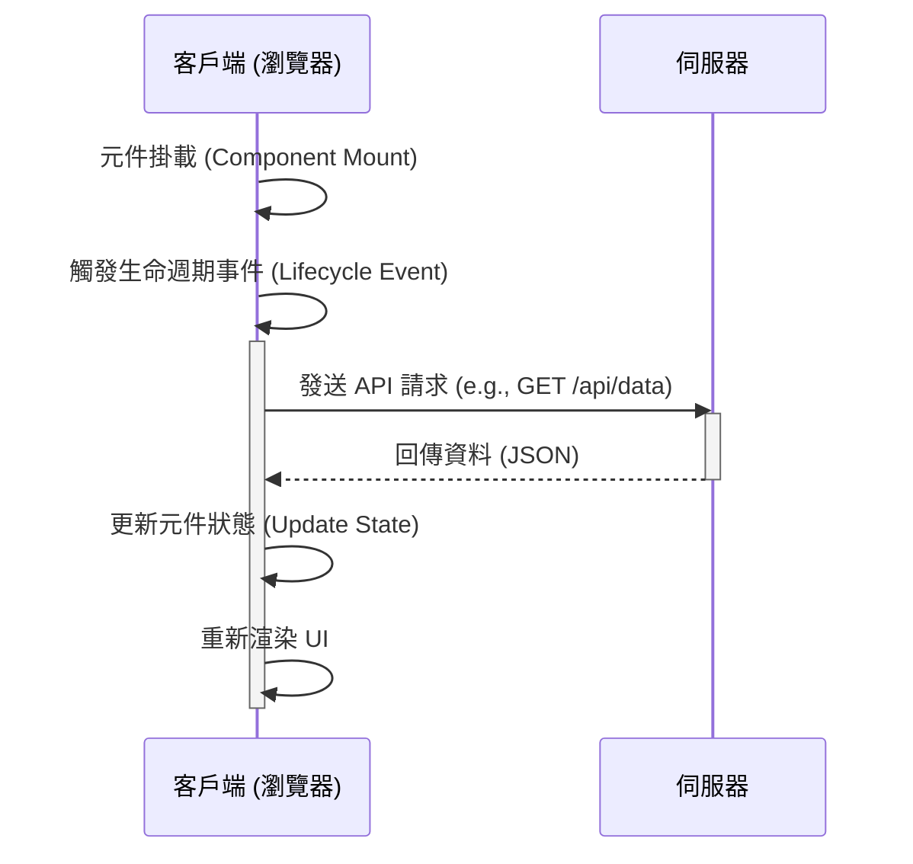

# __TOPIC_NAME__ - Client Analysis

---

## 1. 📝 核心摘要與依賴 (Core Summary & Dependencies)

### 1.1 📂 分析檔案資訊 (Analyzed Files)

| 檔案路徑 |
|---------|
| [待補充：被分析的原始檔案完整路徑] |

### 1.2 📦 依賴關係 (Dependencies)

| 類型 | 名稱 | 用途 | 檔案連結 |
|------|------|------|----------|
| Component | [元件名稱] | [元件用途] | [分析文件連結] |
| Service | [服務名稱] | [服務用途] | [分析文件連結] |
| Hook | [Hook名稱] | [Hook用途] | [分析文件連結] |
| Helper | [工具名稱] | [工具用途] | [分析文件連結] |

**說明：** 此表格追蹤本元件依賴的所有外部元件、服務與工具。

---

## 2. 📋 分析指引 (Analysis Guidelines)

**分析目標：**
分析前端頁面元件的驅動邏輯。專注：UI 結構、互動流程、狀態管理、依賴追蹤、效能與可訪問性。

**核心規則：**
- 章節結構不變：禁止新增或刪除預設章節
- 來源檔案限定：只分析 1.1 節列出的檔案
- 依賴註記：未分析的依賴記錄在 1.2 節
- 程式碼真實性：禁止使用 `...` 省略或編造內容
- 品質清單不變：僅更新勾選狀態 `[ ]` -> `[x]`

---

## 3. 前端架構藍圖 (Frontend Architecture Blueprint)

### 3.1 View 引擎 / 框架架構 (View Engine / Framework)

[待補充：說明使用的前端技術、版本、架構模式與設計原則]

**技術選型：**
- [待補充]

**架構模式：**
- [待補充]

### 3.2 資料初始化流程 (Data Initialization)

[待補充：說明資料初始化的主要業務邏輯步驟]

**執行步驟：**
1. [待補充]
2. [待補充]
3. [待補充]

**流程圖：**


**原始碼分析：**
```typescript
// [待補充：完整初始化程式碼，禁止使用 ... 省略]
```

### 3.3 狀態/事件管理策略 (State/Event Management)

[待補充：說明狀態管理模式、狀態結構、讀取與更新流程]

**執行步驟：**
1. [待補充]
2. [待補充]
3. [待補充]

**流程圖：**
```mermaid
graph TD
    A[Component] -->|1. 觸發事件 (e.g., onClick)| B(Event Handler);
    B -->|2. 調度 Action (Dispatch)| C{Action};
    C -->|3. 執行 Reducer/Setter| D[Reducer / Setter];
    D -->|4. 更新狀態| E(Store);
    E -->|5. 通知元件| A;
    A -->|6. 重新渲染| F[UI];
```

### 3.4 前端路由 (Frontend Routing)

[待補充：說明路由方案、路由定義、導航方式、路由保護]

**執行步驟：**
1. [待補充]
2. [待補充]
3. [待補充]

**流程圖：**
```mermaid
graph TD
    A[使用者點擊連結或輸入 URL] --> B{路由系統};
    B -->|URL 是否匹配 /dashboard?| C[/dashboard 配置];
    B -->|URL 是否匹配 /profile?| D[/profile 配置];
    B -->|URL 不匹配| E[404 Not Found 頁面];
    C --> F[渲染 Dashboard 元件];
    D --> G[渲染 Profile 元件];
```

---

## 5. DOM 架構與渲染邏輯 (UI Architecture & Rendering Logic)

### 5.1 元件結構

[待補充：說明元件主要的 HTML/JSX 結構]

**HTML/JSX 結構：**
```html
<!-- [待補充：完整頁面 DOM 主要結構，禁止使用 ... 省略] -->
```

---

### 5.2 條件式渲染邏輯 (Conditional Rendering)

[待補充：說明條件式渲染邏輯與渲染複雜度]

**流程圖：**
```mermaid
graph TD
A{[主要判斷條件]}
A -- Yes --> B[顯示];
A -- No --> C[隱藏];
```

---

## 8. 📋 品質檢查清單 (Quality Checklist)

### ⭐ 基礎框架級 (Foundation Level)
- [ ] **1.1 📂 分析檔案資訊**：分析的檔案路徑已填寫。
- [ ] **3.1 View 引擎 / 框架架構**：前端技術選型與架構模式已說明。
- [ ] **5.1 元件結構**：元件的 UI 結構 (HTML/JSX/CSHTML) 已提供。

### ⭐⭐ 核心邏輯級 (Core Architecture Level)
- [ ] **3.2 資料初始化流程**：資料初始化流程的說明、步驟、流程圖皆已完成。
- [ ] **3.3 狀態/事件管理策略**：狀態管理策略的說明、步驟、流程圖皆已完成。
- [ ] **3.4 前端路由**：前端路由方案的說明、步驟、流程圖皆已完成。

### ⭐⭐⭐ 整合分析級 (Core Logic Level)
- [ ] **1.2 📦 依賴關係**：依賴關係表已初步填寫。
- [ ] **5.2 條件式渲染邏輯**：主要的條件式渲染邏輯與流程圖已分析。
- [ ] **程式碼分析**：`3.2 資料初始化流程` 中的 `原始碼分析` 區塊已根據實際檔案填寫（此階段可為偽代碼）。

### ⭐⭐⭐⭐ 架構品質級 (Architecture Quality Level)
- [ ] **完整性**：文件內所有 `[待補充]` 標記皆已移除，並替換為基於原始碼的真實分析內容。
- [ ] **程式碼真實性**：所有程式碼片段皆為專案中的**實際程式碼**，**逐字複製**，無任何省略或編造。
- [ ] **流程圖真實性**：所有 Mermaid 圖表中的元素（函式名、類別名、流程步驟）皆能在原始碼中找到明確對應。
- [ ] **無推測性內容**：文件中所有分析內容皆基於**已提供的原始碼檔案**，無任何基於推測的內容。
- [ ] **依賴關係完整性**：`1.2 📦 依賴關係` 表已完整填寫，包含所有依賴項的用途與檔案連結。

### ⭐⭐⭐⭐⭐ 功能實作完整分析 (Full Implementation Analysis)
- [ ] **文件準確性**：所有技術細節（API 規格、型別定義、參數說明）與實際程式碼完全一致。
- [ ] **依賴關係最終確認**：`1.2 📦 依賴關係` 表中的所有依賴項皆有對應的分析文件連結，且無懸空的依賴。
- [ ] **程式碼完整性驗證**：所有關鍵邏輯的程式碼片段皆完整呈現，無使用 `...` 或註解省略。
- [ ] **可驗證性**：所有分析結果皆可透過閱讀原始碼檔案進行驗證，無法驗證的內容必須明確標記為「推測」或「建議」。
- [ ] **分析深度**：所有分析區塊都提供了深入且具體的說明，而不僅是表面描述。

---

> **🎯 分析品質**：⭐ 基礎框架  
> **📅 開始日期**：__CURRENT_DATE__  
> **📅 最後更新**：__CURRENT_DATE__  
