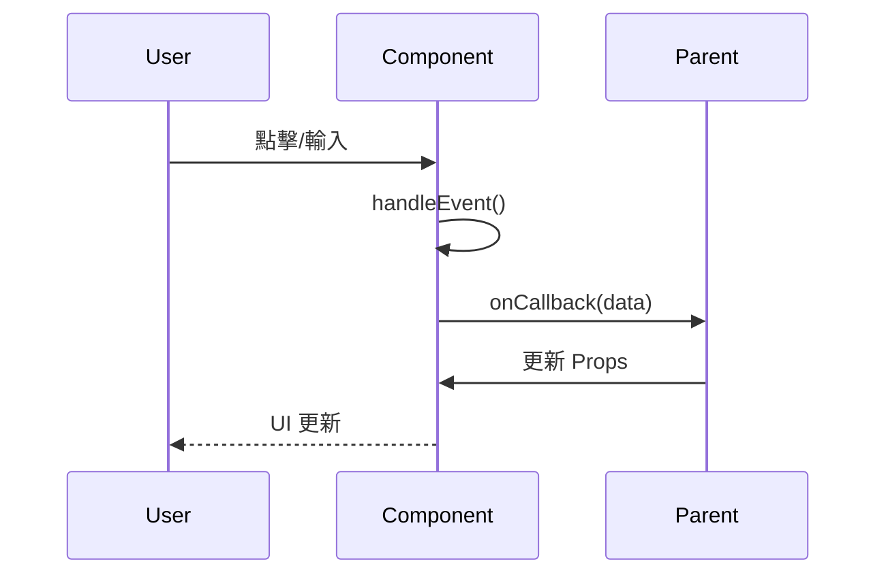
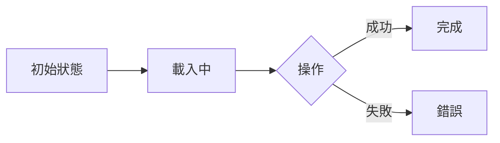

# __NAME__ - Component Analysis

> **🎯 分析品質**：⭐ 基礎框架 (0%)  
> **📅 開始日期**：__CURRENT_DATE__  
> **📅 最後更新**：__CURRENT_DATE__  
> **📊 分析階段**：📝 待分析  
> **🔗 相關文件**：[連結到 shared/overview.md](../overview.md)

---

## 1. 📝 核心摘要與依賴 (Core Summary & Dependencies)

### 1.1 📂 分析檔案資訊 (Analyzed Files)

| 檔案路徑 |
|---------|
| [待補充：被分析的原始檔案完整路徑] |

### 1.2 📦 依賴關係 (Dependencies)

| 類型 | 名稱 | 用途 | 檔案連結 |
|------|------|------|----------|
| Component | [子元件名稱] | [元件用途] | [分析文件連結] |
| Hook | [Hook名稱] | [Hook用途] | [分析文件連結] |
| Helper | [工具名稱] | [工具用途] | [分析文件連結] |

**說明：** 此表格追蹤本元件依賴的所有外部元件、Hooks 與工具。

---

## 2. 📋 分析指引 (Analysis Guidelines)

**此文件的分析目標：**

本文件用於分析**共用 UI 元件**，重點在於：

1. **Props 介面**：清楚定義元件的輸入介面，包含必需/可選參數、預設值
2. **元件結構**：記錄 JSX/HTML 結構、樣式實作方案
3. **互動行為**：分析元件如何響應使用者操作、如何通過回調與父元件通訊
4. **可重用性**：評估元件的抽象程度、在多少場景下可重用
5. **無障礙性**：檢查 a11y 支援、鍵盤導航、ARIA 屬性

**AI Agent 注意事項：**
- 此為共用元件分析，應該是純粹的 UI 元件，不包含複雜的業務邏輯
- Props 介面必須完整定義，這是元件的契約
- 必須提供多種使用範例（基本用法、進階用法、組合用法）
- 所有依賴的子元件和 Hook 都必須記錄到依賴關係表
- 重點評估可重用性和可訪問性

---

## 3. 元件基本資訊 (Component Information)

### 3.1 元件定義

**基本資訊：**
- **元件名稱**：[待補充]
- **檔案路徑**：`/src/components/ComponentName.tsx`
- **元件類型**：🎨 展示型元件 / 📦 容器型元件 / 🔄 邏輯型元件
- **技術框架**：React / Vue / Angular / Web Component

---

### 3.2 設計目的

**核心職責：**
[待補充：用 2-3 句話描述此元件的主要責任]

**使用場景：**
- **場景1**：[待補充]
- **場景2**：[待補充]

**設計原則：**
- [待補充：遵循的設計原則，例如：單一職責、組合優於繼承]

---

## 4. Props 介面定義 (Props Interface)

### 4.1 Props 定義

**TypeScript 介面：**
```typescript
interface ComponentProps {
    // [待補充：Props 介面定義]
    
    // 必需 Props
    prop1: string;
    prop2: number;
    
    // 可選 Props
    prop3?: boolean;
    prop4?: () => void;
    
    // 子元素
    children?: React.ReactNode;
}
```

---

### 4.2 Props 說明

| Prop 名稱 | 類型 | 必需 | 預設值 | 說明 |
|----------|------|------|--------|------|
| `prop1` | `string` | 是 | - | [待補充：用途說明] |
| `prop2` | `number` | 是 | - | [待補充：用途說明] |
| `prop3` | `boolean` | 否 | `false` | [待補充：用途說明] |
| `prop4` | `() => void` | 否 | - | [待補充：回調函式用途] |

---

### 4.3 預設值

```typescript
const defaultProps = {
    prop3: false,
    prop4: () => {}
};
```

---

## 5. 元件結構 (Component Structure)

### 5.1 HTML/JSX 結構

**結構說明：**
[待補充：描述元件的 DOM 結構層次]

**程式碼：**
```jsx
// [待補充：元件的 JSX 結構]
const ComponentName = ({ prop1, prop2, prop3 }) => {
    return (
        <div className="component-container">
            <header className="component-header">
                {/* Header 內容 */}
            </header>
            <main className="component-body">
                {/* Main 內容 */}
            </main>
            <footer className="component-footer">
                {/* Footer 內容 */}
            </footer>
        </div>
    );
};
```

---

### 5.2 關鍵 DOM 結構

**DOM 節點說明：**
- [待補充：列出元件中的關鍵 DOM 元素及其用途]

**選取器清單：**
| 選取器 | 元素類型 | 用途 | 備註 |
|--------|----------|------|------|
| `.container` | div | 最外層容器 | 控制版面 |
| `#unique-id` | [類型] | [用途] | [備註] |

**DOM 結構圖：**
```
[待補充：純文字樹狀結構]
component-root
  ├── .header
  │   ├── .title
  │   └── .actions
  ├── .body
  │   └── .content
  └── .footer
```

**DOM 操作邏輯：**
- [待補充：元件如何透過 refs 或選取器操作 DOM]

---

### 5.3 樣式實作

**樣式方案：**
- [ ] CSS Modules - `ComponentName.module.css`
- [ ] Styled Components - `const StyledDiv = styled.div`
- [ ] Tailwind CSS - `className="..."`
- [ ] SCSS - `ComponentName.scss`

**主要樣式類別：**
- `.component-container` - [待補充：用途]
- `.component-header` - [待補充：用途]
- `.component-body` - [待補充：用途]

**樣式範例：**
```css
.component-container {
    /* [待補充：樣式定義] */
}
```

---

### 5.4 互動行為

**互動流程：**
1. **使用者操作**：[待補充]
2. **觸發事件**：[待補充]
3. **狀態更新**：[待補充]
4. **UI 回饋**：[待補充]

**互動序列圖：**


---

## 6. 狀態與生命週期 (State & Lifecycle)

### 6.1 內部狀態

**狀態變數：**
```typescript
const [state1, setState1] = useState<Type>(initialValue);
const [state2, setState2] = useState<Type>(initialValue);
```

**狀態說明：**
- `state1` - [待補充：用途說明]
- `state2` - [待補充：用途說明]

**狀態流向：**


---

### 6.2 生命週期 / 副作用

**useEffect / Hooks：**
```typescript
useEffect(() => {
    // [待補充：副作用邏輯]
    // 例如：資料載入、訂閱事件
    
    return () => {
        // 清理邏輯
    };
}, [dependencies]);
```

**副作用說明：**
- **效果1**：[待補充：觸發時機與用途]
- **效果2**：[待補充：觸發時機與用途]

---

## 7. 使用範例 (Usage Examples)

### 7.1 基本用法

```jsx
import ComponentName from './components/ComponentName';

const App = () => {
    return (
        <ComponentName
            prop1="value"
            prop2={123}
        />
    );
};
```

---

### 7.2 進階用法

```jsx
// [待補充：進階使用範例，例如：組合多個 Props、自訂樣式]
<ComponentName
    prop1="value"
    prop2={123}
    prop3={true}
    prop4={() => console.log('callback')}
>
    <ChildContent />
</ComponentName>
```

---

### 7.3 組合範例

```jsx
// [待補充：與其他元件組合使用的範例]
<ParentComponent>
    <ComponentName {...props1} />
    <ComponentName {...props2} />
</ParentComponent>
```

---

## 8. 架構與品質分析 (Architecture & Quality Analysis)

### 8.1 可重用性評估

**可重用性分析：**
- **當前使用次數**：[待補充：在幾個地方使用]
- **重用潛力**：高 / 中 / 低
- **抽象化程度**：[待補充：評估]

**改善建議：**
- [待補充：如何提升可重用性]

---

### 8.2 可訪問性 (Accessibility)

**a11y 檢查清單：**
- [ ] 語義化 HTML 標籤（使用 `<button>` 而非 `<div>`）
- [ ] ARIA 屬性完整（`aria-label`, `aria-describedby`）
- [ ] 鍵盤導航支援（Tab 鍵、Enter 鍵）
- [ ] 焦點管理（focus trap, focus restore）
- [ ] 色彩對比度符合 WCAG 2.1 AA 標準
- [ ] 螢幕閱讀器友善（alt text, aria-live）

**已實作的 a11y 特性：**
- [待補充：已實作的無障礙功能]

---

### 8.3 效能優化

**效能檢查清單：**
- [ ] 使用 React.memo 避免不必要的重渲染
- [ ] Props 穩定性（避免每次傳入新物件/函式）
- [ ] 懶加載（React.lazy, Suspense）
- [ ] 虛擬化（大量列表）

**優化建議：**
- [待補充：具體的優化方案]

---

### 8.4 測試覆蓋

**測試策略：**
- [ ] 單元測試（Jest）
- [ ] 元件測試（React Testing Library）
- [ ] 快照測試（Snapshot）
- [ ] 視覺回歸測試（Storybook + Chromatic）

**測試範例：**
```typescript
describe('ComponentName', () => {
    it('should render correctly', () => {
        // [待補充：測試案例]
    });
});
```

---

## 9. 📋 品質檢查清單 (Quality Checklist)

### ⭐ 基礎框架 (1-40%)
- [ ] 文件元數據完整（日期、品質等級）
- [ ] 元件基本資訊完整
- [ ] Props 介面已定義

### ⭐⭐⭐ 邏輯完成 (41-70%)
- [ ] 元件結構已分析
- [ ] 互動流程圖已繪製
- [ ] 使用範例已提供

### ⭐⭐⭐⭐ 架構完整 (71-90%)
- [ ] **依賴關係表已完成**
- [ ] **所有依賴項都已建立分析檔案**
- [ ] 可訪問性檢查已完成
- [ ] 效能優化已評估

### ⭐⭐⭐⭐⭐ 完整分析 (91-100%)
- [ ] 可重用性分析完整
- [ ] a11y 改善建議明確
- [ ] 測試策略已規劃
- [ ] 優化方案具體

---

**當前品質等級**：⭐ 基礎框架 (0%)

