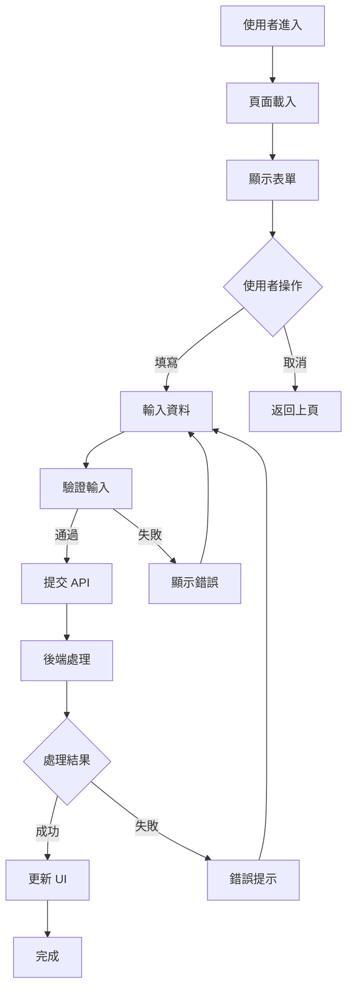
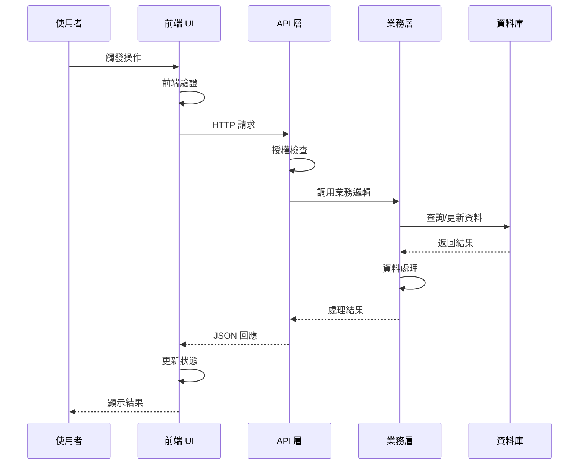
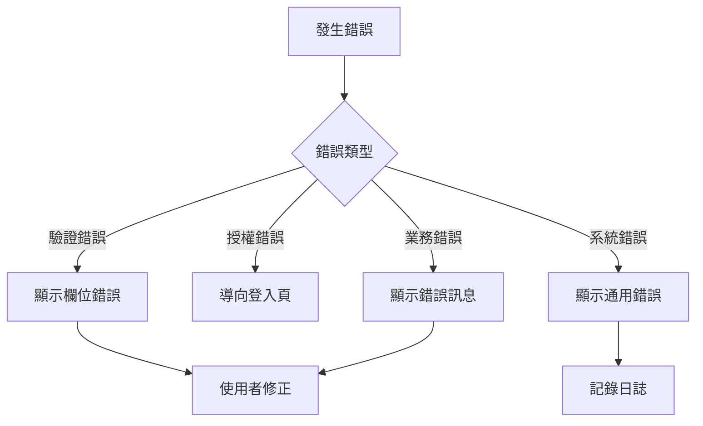
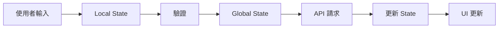
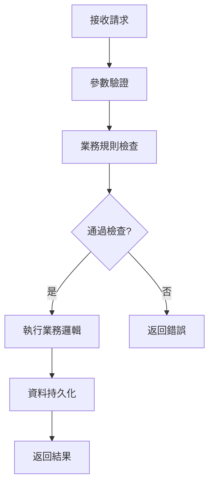
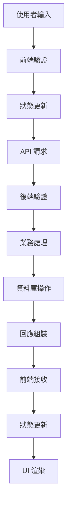

# [功能名稱] - Feature Analysis

> **🎯 分析品質**：⭐ 基礎框架 (0%)  
> **📅 開始日期**：YYYY-MM-DD  
> **📅 最後更新**：YYYY-MM-DD  
> **📊 分析階段**：📝 待分析  
> **🔗 相關文件**：[連結到 overview.md](./overview.md)

---

## 📂 分析檔案資訊

**涉及的檔案：**
- [待補充：此功能涉及的所有前後端檔案路徑]

**範例：**
```
前端：
- /ClientApp/src/pages/VipMember/Index.tsx
- /ClientApp/src/components/MemberForm.tsx

後端：
- /Controllers/VipMemberController.cs
- /Services/MemberService.cs
- /Repositories/MemberRepository.cs
```

---

## 📋 分析指引 (Analysis Guidelines)

**此文件的分析目標：**

本文件用於分析**跨前後端的完整功能流程**，重點在於：

1. **端到端流程**：從使用者操作到後端處理再到 UI 回饋的完整鏈路
2. **前後端協作**：分析前端頁面/元件如何調用後端 API，資料如何流轉
3. **業務價值**：說明此功能解決什麼問題，為業務/使用者帶來什麼價值
4. **依賴拓撲**：梳理涉及的所有前後端檔案，建立完整的依賴關係圖
5. **整合測試**：規劃正常/異常/邊界的測試場景

**AI Agent 注意事項：**
- 此為功能級分析，範圍大於單一 API 或元件，需要宏觀視角
- 必須繪製系統互動序列圖，展示前端 UI → API → Service → DB 的完整流程
- 必須分析資料在前後端之間的轉換邏輯（DTO 映射）
- 所有涉及的檔案都必須列在「分析檔案資訊」和「依賴關係表」中
- 重點關注邊界情況和異常處理流程

---

## 1. 功能概覽 (Feature Overview)

### 1.1 功能描述

**功能摘要：**
[待補充：用 2-3 句話描述此功能的核心價值]

**業務價值：**
- [待補充：此功能解決了什麼問題]
- [待補充：為使用者/業務帶來什麼價值]

---

## 2. 完整流程分析 (Complete Flow Analysis)

### 2.1 使用者操作流程

**操作步驟：**
1. **步驟1**：使用者進入頁面
2. **步驟2**：查看/輸入資料
3. **步驟3**：觸發操作（例如：點擊提交）
4. **步驟4**：系統處理請求
5. **步驟5**：顯示結果回饋

**完整流程圖：**


---

### 2.2 系統互動序列

**端到端互動：**


---

### 2.3 邊界情況與異常處理

**邊界情況：**
1. **情況1**：[描述] → [處理方式]
2. **情況2**：[描述] → [處理方式]

**異常處理流程：**


---

## 3. 前端實作分析 (Frontend Implementation)

### 3.1 涉及的頁面/元件

**主要頁面：**
- `PageName` - [待補充：頁面路徑] - [分析文件連結]

**使用的元件：**
- `Component1` - [待補充：元件用途] - [分析文件連結]
- `Component2` - [待補充：元件用途] - [分析文件連結]

---

### 3.2 前端路由

**路由配置：**
- **路徑**：`/path/to/page`
- **參數**：`?param1=value&param2=value`
- **守衛**：[待補充：路由守衛邏輯]

---

### 3.3 前端狀態管理

**狀態流向：**


---

## 4. 後端實作分析 (Backend Implementation)

### 4.1 涉及的 API 端點

**API 清單：**
- `GET /api/resource` - [待補充：用途] - [分析文件連結]
- `POST /api/resource` - [待補充：用途] - [分析文件連結]

---

### 4.2 Controller 層

**Controller 方法：**
- `ControllerName.MethodName` - [待補充：職責] - [分析文件連結]

---

### 4.3 Service 層

**業務邏輯服務：**
- `ServiceName.MethodName` - [待補充：業務邏輯] - [分析文件連結]

**業務流程：**


---

## 5. 資料流分析 (Data Flow Analysis)

### 5.1 完整資料流向

**資料流向圖：**


---

### 5.2 資料結構

**前端資料模型：**
```typescript
interface FrontendModel {
    // [待補充：前端資料結構]
}
```

**後端資料模型：**
```csharp
public class BackendModel
{
    // [待補充：後端資料結構]
}
```

---

### 5.3 資料轉換

**轉換邏輯：**
- **前端 → 後端**：[待補充：轉換說明]
- **後端 → 前端**：[待補充：轉換說明]

---

## 6. 📦 依賴關係 (Dependencies)

| 類型 | 名稱 | 用途 | 檔案連結 |
|------|------|------|----------|
| Page | [頁面名稱] | [頁面用途] | [分析文件連結] |
| Component | [元件名稱] | [元件用途] | [分析文件連結] |
| API | [API名稱] | [API用途] | [分析文件連結] |
| Service | [服務名稱] | [服務用途] | [分析文件連結] |

**說明：** 此表格追蹤實現此功能所需的所有前後端元件。

---

## 7. 整合測試場景 (Integration Test Scenarios)

### 7.1 正常流程測試

**測試案例：**
1. **案例1**：[正常操作流程]
   - 前置條件：[待補充]
   - 執行步驟：[待補充]
   - 預期結果：[待補充]

---

### 7.2 異常流程測試

**測試案例：**
1. **案例1**：[異常處理流程]
   - 觸發條件：[待補充]
   - 預期行為：[待補充]

---

### 7.3 邊界條件測試

**測試案例：**
1. **案例1**：[邊界情況]
   - 測試條件：[待補充]
   - 預期結果：[待補充]

---

## 8. 架構與品質分析 (Architecture & Quality Analysis)

### 8.1 效能考量

**效能關鍵點：**
- [待補充：識別效能瓶頸]

**優化建議：**
- [待補充：具體優化方案]

---

### 8.2 安全性評估

**安全檢查清單：**
- [ ] 輸入驗證（前端 + 後端）
- [ ] 授權檢查
- [ ] CSRF 防護
- [ ] XSS 防護
- [ ] 敏感資料加密

**安全風險：**
- [待補充：已識別的安全風險]

---

### 8.3 技術債識別

**已知問題：**
1. **問題1**：[描述] - 優先級：P0/P1/P2
2. **問題2**：[描述] - 優先級：P0/P1/P2

**改善建議：**
- [待補充：重構或改善方案]

---

## 9. 📋 品質檢查清單 (Quality Checklist)

### ⭐ 基礎框架 (1-40%)
- [ ] 文件元數據完整（日期、品質等級）
- [ ] 功能描述完整
- [ ] 使用者故事已定義

### ⭐⭐⭐ 邏輯完成 (41-70%)
- [ ] 完整流程圖已繪製
- [ ] 系統互動序列圖已繪製
- [ ] 前端實作已分析
- [ ] 後端實作已分析

### ⭐⭐⭐⭐ 架構完整 (71-90%)
- [ ] **依賴關係表已完成**
- [ ] **所有依賴項都已建立分析檔案**
- [ ] 資料流分析完整
- [ ] 測試場景已規劃

### ⭐⭐⭐⭐⭐ 完整分析 (91-100%)
- [ ] 效能優化建議具體
- [ ] 安全性評估完整
- [ ] 技術債已識別
- [ ] 改善方案明確

---

**當前品質等級**：⭐ 基礎框架 (0%)

