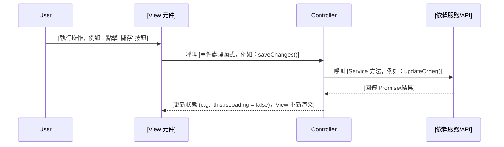

# __NAME__ - Feature Analysis

> **🎯 分析品質**：⭐ 基礎框架  
> **📅 開始日期**：__CURRENT_DATE__  
> **📅 最後更新**：__CURRENT_DATE__  
> **🔗 相關文件**：[連結到 overview.md](../overview.md)

---

## 1. 📝 核心摘要與依賴 (Core Summary & Dependencies)

### 1.1 📂 分析檔案資訊 (Analyzed Files)

| 檔案路徑 |
|---------|
| [待補充：被分析的原始檔案完整路徑] |

### 1.2 📦 依賴關係 (Dependencies)

| 類型 | 名稱 | 用途 | 檔案連結 |
|------|------|------|----------|
| Page | [頁面名稱] | [頁面用途] | [分析文件連結] |
| Component | [元件名稱] | [元件用途] | [分析文件連結] |
| API | [API名稱] | [API用途] | [分析文件連結] |
| Service | [服務名稱] | [服務用途] | [分析文件連結] |

**說明：** 此表格追蹤實現此功能所需的所有前後端元件。

---

## 2. 📋 分析指引 (Analysis Guidelines)

**此文件的分析目標：**

本文件用於分析**前端功能區塊 (Feature) 的 UI 與業務邏輯**，重點在於：

1. **UI 結構**：記錄元件的 HTML/JSX 結構、關鍵 DOM 元素與樣式。
2. **互動流程**：分析使用者操作如何觸發事件、更新狀態、與後端 API 互動。
3. **業務邏輯**：深入分析 Controller 中的核心業務邏輯與條件判斷。
4. **資料流**：梳理 State、Props、Service 資料的完整流向。
5. **依賴追蹤**：追蹤所有使用的 Component、Service、API 並建立依賴關係表。

**AI Agent 注意事項：**
- 此為前端功能級分析，通常對應一個頁面中的某個特定功能區塊。
- 必須用序列圖清楚展示使用者操作 → View → Controller → Service 的完整互動流程。
- 所有依賴的元件/服務/API 都必須記錄到依賴關係表，並確認是否已建立分析檔案。
- 狀態變數 (`State`) 和傳入屬性 (`Props`) 必須詳細說明用途。
- 條件式渲染 (`Conditional Rendering`) 邏輯需要被分析，以了解 UI 如何根據狀態變化。
- 必須附上關鍵的程式碼片段，例如事件處理函式、服務調用、和核心業務邏輯。
- **核心規則**：
  - 章節結構不變：嚴格禁止新增或刪除此範本預設的任何章節。
  - 來源檔案限定：只能分析使用者提供或 `### 1.1 📂 分析檔案資訊` 中列出的檔案。
  - 依賴註記：任何未分析的依賴項，應記錄在 `### 1.2 📦 依賴關係` 中，而不是擅自分析。
  - 品質清單不變：嚴格禁止修改品質檢查清單的項目或等級，僅能更新勾選狀態 `[ ]` -> `[x]`。
---

## 3. 介面與互動分析 (UI & Interaction Analysis)
*此區塊專注於從使用者視角分析 UI 的組成與互動行為。*

### 3.1 元件結構 (Component Structure)
> **Phase 1**: 自動填充外層容器（HTML/Component 最外層元素）  
> **Phase 2**: 補充詳細的內部結構分析和關鍵 DOM 元素說明

[Phase 1 已填充：此功能區塊的外層容器]

**外層容器**：
```html
<!-- [Phase 1 已自動填充：此功能區塊的最外層 HTML 元素] -->
```

[Phase 2 待補充：詳細的內部結構分析]

**關鍵 DOM 元素**：
```html
<!-- [Phase 2 待補充：此區塊內的重要 HTML 結構片段] -->
```

### 3.2 互動流程 (Interaction Flow)
[待補充：簡述此區塊的主要使用者互動流程，例如用戶點擊按鈕後觸發的事件鏈。]



### 3.3 條件式渲染邏輯 (Conditional Rendering)
[待補充：分析此區塊的渲染複雜度。條件過多可能意味著元件職責不清。] 
```mermaid
graph TD
A{[主要判斷條件]}
A -- Yes --> B[顯示];
A -- No --> C[隱藏];
```

---

## 4. 實作細節分析 (Implementation Detail Analysis)
*此區塊專注於深入程式碼，分析該功能的具體實現方式。*

### 4.1 對應 Controller 方法 (Corresponding Controller Methods)
> **Phase 2**: 補充完整的 Controller 方法分析

* **程式碼片段**:
```
[待補充：貼上與此區塊功能最直接相關的 Controller/事件處理方法]
```

* **說明**:
    [待補充：描述此方法的核心職責、觸發時機以及它如何協調 View 和 Service。]

### 4.2 核心業務邏輯 (Core Business Logic)
* **程式碼片段**:

    ```typescript
    // [待補充：貼上最能體現此區塊業務規則的關鍵程式碼]
    if (someCondition) {
        this.someService.doSomething();
    }
    ```
* **說明**:
    [待補充：深入分析這段程式碼的執行細節與業務規則，解釋其「如何」實現功能，包含重要的條件判斷和商業邏輯。]

### 4.3 資料流與狀態變數 (Data Flow & State Variables)
* **資料流向**:
    ```mermaid
    graph TD
        subgraph Controller
            A[SalePageIndexController]
        end
        subgraph View
            B["View Component (ng-repeat)"]
        end
        subgraph Service
            C[SalePageService]
        end

        C -- 提供資料 --> A
        A -- this.orderList --> B
    ```
* **相關狀態變數**:
    ```typescript
    // [待補充：貼上此區塊在 Controller 中依賴的核心狀態變數]
    public orderList: IOrder[] = [];
    public isLoading: boolean = false;
    public errorMessage: string | null = null;
    ```
* **說明**:
    [待補充：解釋圖中的資料如何從 Service 流向 Controller 再到 View，並說明各個狀態變數在此區塊中的具體作用。]

### 4.4 相依服務與工具 (Dependent Services/Utilities)

#### 4.4.1 服務依賴註入
* **程式碼片段**:
    ```typescript
    // [待補充：列出此區塊邏輯中呼叫到的主要依賴]
    constructor(
        public salePageService: Services.SalePageService,
        public analyticsUtil: Utilities.AnalyticsUtility
    )
    ```
* **說明**:
    [待補充：說明此區塊的功能實現依賴了哪些外部 Service 或 Utility，以及它們各自提供了什麼能力。]

#### 4.4.2 API 端點與資料結構 (API Endpoints & Data Structures)

##### API 1: [API 名稱，例如：取得訂單列表]
* **服務方法**:
    ```typescript
    // [待補充：Service 中對應的方法簽名]
    public getList(params: IParams): Promise<IResponse> {
        return this.$http.get('/api/list', { params });
    }
    ```

* **HTTP 請求**:
    - **Method**: `GET` / `POST` / `PUT` / `DELETE`
    - **Endpoint**: `/api/list`
    - **Query Parameters** (如適用):
        ```typescript
        interface IParams {
            ...
        }
        ```

* **Request Payload** (如適用於 POST/PUT/PATCH):
    ```typescript
    // [待補充：如果是 POST/PUT/PATCH 請求，描述 request body 結構]
    interface IRequest {
        ...
    }
    ```

* **Response Payload**:
    ```typescript
    // [待補充：描述 API 回應的資料結構]
    interface IResponse {
        ...
    }

* **錯誤處理**:
    ```typescript
    // [待補充：描述錯誤處理邏輯]
    try {
        ...
    } catch (error) {
        if (error.status === 401) {
            ...
        } else if (error.status === 400) {
            ...
        } else {
            ...
        }
    }
    ```
    常見錯誤碼：
    - `400 Bad Request`: 參數格式錯誤或缺少必要參數
    - `401 Unauthorized`: 未登入或 token 過期
    - `403 Forbidden`: 無權限存取
    - `404 Not Found`: 資源不存在
    - `500 Internal Server Error`: 伺服器內部錯誤

##### API 2: [其他 API 名稱]
[待補充：如有多個 API 調用，請複製上方結構繼續描述]

#### 4.4.3 非 API 依賴服務
* **Utility/Helper 說明**:
    ```typescript
    // [待補充：描述不涉及 API 調用的工具類依賴]
    // 例如：日期格式化工具、驗證工具、追蹤工具等
    this.analyticsUtil.trackEvent('order_list_viewed', {
        page: this.currentPage,
        timestamp: Date.now()
    });
    ```
* **說明**:
    [待補充：說明這些工具類的用途和調用時機]

#### 4.4.4 外部追蹤與服務 (External Tracking & Services)
[待補充：除了內部服務，此區塊是否還觸發了其他外部服務？例如：Google Analytics 事件、Adobe Analytics 追蹤、A/B 測試等。]

---

## 5. 📋 品質檢查清單 (Quality Checklist)

### ⭐ 基礎框架級 (Foundation Level)
- [ ] **1.1 📂 分析檔案資訊**：分析的檔案路徑已填寫。
- [ ] **3.1 元件結構**：外層容器的 HTML 結構已填充。
- [ ] **3.2 互動流程**：基本互動流程的文字描述已提供。

### ⭐⭐ 核心邏輯級 (Core Logic Level)
- [ ] **3.1 元件結構**：關鍵 DOM 元素的 HTML 程式碼片段已補充。
- [ ] **3.2 互動流程**：完整的 Mermaid `sequenceDiagram` 已繪製。
- [ ] **3.3 條件式渲染邏輯**：渲染邏輯的 Mermaid 圖與說明已提供。

### ⭐⭐⭐ 整合分析級 (Integration Analysis Level)
- [ ] **4.1 對應 Controller 方法**：Controller 方法的程式碼片段和說明已提供。
- [ ] **4.2 核心業務邏輯**：核心業務邏輯的程式碼片段和說明已提供。
- [ ] **4.3 資料流與狀態變數**：完整的 Mermaid `graph` 資料流向圖已繪製。
- [ ] **4.3 資料流與狀態變數**：至少列出 3 個核心狀態變數及其說明。

### ⭐⭐⭐⭐ 架構品質級 (Architecture Quality Level)
- [ ] **1.2 📦 依賴關係**：依賴關係表已完整填寫，且相關檔案連結已建立。
- [ ] **4.4.1 服務依賴註入**：所有依賴注入的服務及其用途已說明。
- [ ] **4.4.2 API 端點與資料結構**：所有調用的 API 端點規格（請求/回應）已詳細描述。
- [ ] **4.4.4 外部追蹤與服務**：外部追蹤與服務的分析已完成。

### ⭐⭐⭐⭐⭐ 功能實作完整分析 (Full Implementation Analysis)
- [ ] **完整性**：文件內所有 `[待補充]` 標記皆已移除，並替換為基於原始碼的真實分析內容。
- [ ] **程式碼真實性**：所有程式碼片段（TypeScript, HTML）皆為專案中的實際程式碼，而非範本預設值。
- [ ] **圖表準確性**：所有 Mermaid 圖表（序列圖、資料流向圖）皆準確反映功能的實際互動與資料流。
- [ ] **API 規格準確性**：`4.4.2 API 端點與資料結構` 中描述的 API 規格與後端實作完全一致。
- [ ] **依賴關係最終確認**：`1.2 📦 依賴關係` 表中的所有依賴項皆有對應的分析文件連結，且無懸空的依賴。

---

**當前品質等級**：⭐ 基礎框架

