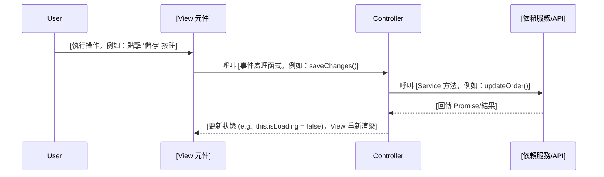
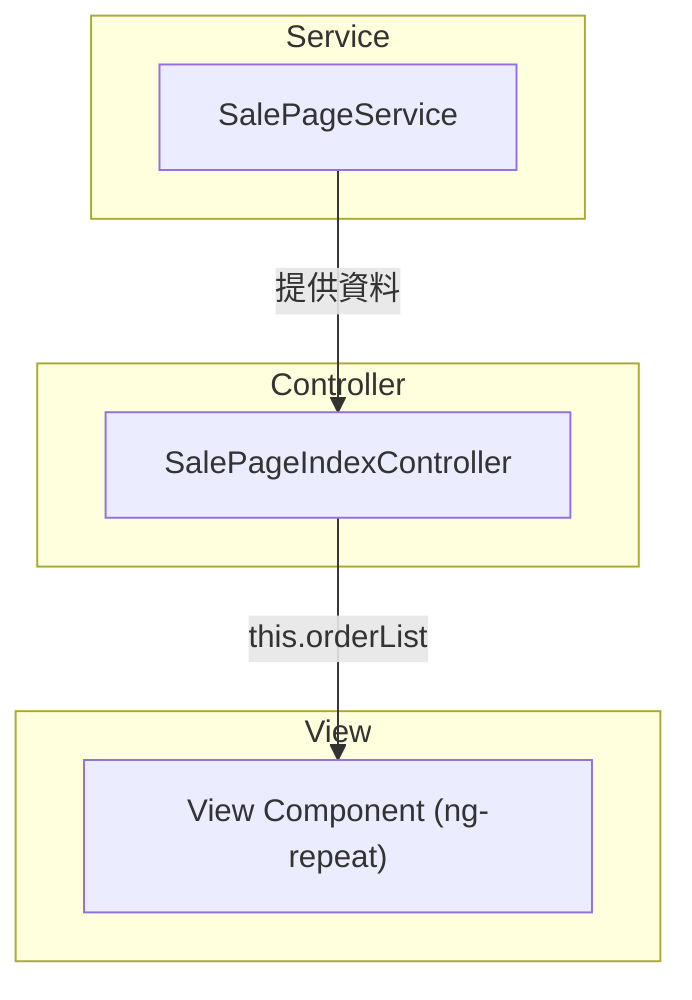

# __NAME__ - Feature Analysis

> **🎯 分析品質**：⭐ 基礎框架  
> **📅 開始日期**：__CURRENT_DATE__  
> **📅 最後更新**：__CURRENT_DATE__  
> **🔗 相關文件**：[連結到 overview.md](../overview.md)

---

## 1. 📝 核心摘要與依賴 (Core Summary & Dependencies)

### 1.1 📂 分析檔案資訊 (Analyzed Files)

| 檔案路徑 |
|---------|
| [待補充：被分析的原始檔案完整路徑] |

### 1.2 📦 依賴關係 (Dependencies)

| 類型 | 名稱 | 用途 | 檔案連結 |
|------|------|------|----------|
| Page | [頁面名稱] | [頁面用途] | [分析文件連結] |
| Component | [元件名稱] | [元件用途] | [分析文件連結] |
| API | [API名稱] | [API用途] | [分析文件連結] |
| Service | [服務名稱] | [服務用途] | [分析文件連結] |

**說明：** 此表格追蹤實現此功能所需的所有前後端元件。

---

## 2. 📋 分析指引 (Analysis Guidelines)

**分析目標：**
分析前端功能區塊的 UI 與業務邏輯。專注：UI 結構、互動流程、業務邏輯、資料流、依賴追蹤。

**核心規則：**
- 章節結構不變：禁止新增或刪除預設章節
- 來源檔案限定：只分析 1.1 節列出的檔案
- 依賴註記：未分析的依賴記錄在 1.2 節
- 程式碼真實性：禁止使用 `...` 省略或編造內容
- 品質清單不變：僅更新勾選狀態 `[ ]` -> `[x]`
---

## 3. 介面與互動分析 (UI & Interaction Analysis)
*此區塊專注於從使用者視角分析 UI 的組成與互動行為。*

### 3.1 元件結構 (Component Structure)

[待補充：說明此功能區塊的外層容器與內部結構]

**外層容器：**
```html
<!-- [待補充：貼上功能區塊的最外層 HTML 元素，禁止使用 ... 省略] -->
```

**關鍵 DOM 元素：**
```html
<!-- [待補充：完整 DOM 結構，禁止使用 ... 省略] -->
```

### 3.2 互動流程 (Interaction Flow)

[待補充：說明主要使用者互動流程]

**流程圖：**


### 3.3 條件式渲染邏輯 (Conditional Rendering)

[待補充：說明渲染邏輯與複雜度]

**流程圖：**
```mermaid
graph TD
A{[主要判斷條件]}
A -- Yes --> B[顯示];
A -- No --> C[隱藏];
```

---

## 4. 實作細節分析 (Implementation Detail Analysis)
*此區塊專注於深入程式碼，分析該功能的具體實現方式。*

### 4.1 對應 Controller 方法 (Corresponding Controller Methods)

[待補充：說明此功能對應的 Controller 方法的核心職責與觸發時機]

**程式碼片段:**
```typescript
// [待補充：完整實際程式碼，禁止使用 ... 省略]
```

**說明:**
[待補充：說明方法的核心職責、觸發時機、如何協調 View 和 Service]

### 4.2 核心業務邏輯 (Core Business Logic)

[待補充：說明核心業務規則與執行細節]

**程式碼片段:**
```typescript
// [待補充：完整實際業務邏輯程式碼，禁止使用 ... 省略]
if (someCondition) {
    this.someService.doSomething();
}
```

**說明:**
[待補充：說明執行細節與業務規則、條件判斷、商業邏輯]

### 4.3 資料流與狀態變數 (Data Flow & State Variables)

[待補充：說明資料如何從 Service 流向 Controller 再到 View，以及各狀態變數的作用]

**資料流向:**


**相關狀態變數:**
```typescript
// [待補充：貼上核心狀態變數定義]
public orderList: IOrder[] = [];
public isLoading: boolean = false;
public errorMessage: string | null = null;
```

### 4.4 相依服務與工具 (Dependent Services/Utilities)

#### 4.4.1 服務依賴註入

[待補充：說明依賴的外部 Service 或 Utility 及其提供的能力]

**程式碼片段:**
```typescript
// [待補充：完整依賴註入程式碼]
constructor(
    public salePageService: Services.SalePageService,
    public analyticsUtil: Utilities.AnalyticsUtility
)
```

#### 4.4.2 API 端點與資料結構 (API Endpoints & Data Structures)

##### API 1: [API 名稱]

[待補充：說明 API 用途]

**服務方法:**
```typescript
// [待補充：貼上 Service 方法簽名]
public getList(params: IParams): Promise<IResponse> {
    return this.$http.get('/api/list', { params });
}
```

**HTTP 請求:**
- **Method**: `GET` / `POST` / `PUT` / `DELETE`
- **Endpoint**: `/api/list`
- **Query Parameters** (如適用):
```typescript
interface IParams {
    // [待補充]
}
```

**Request Payload** (如適用於 POST/PUT/PATCH):
```typescript
interface IRequest {
    // [待補充]
}
```

**Response Payload:**
```typescript
interface IResponse {
    // [待補充]
}
```

**錯誤處理:**
```typescript
try {
    // [待補充]
} catch (error) {
    if (error.status === 401) {
        // [待補充]
    } else if (error.status === 400) {
        // [待補充]
    } else {
        // [待補充]
    }
}
```

**常見錯誤碼：**
- `400 Bad Request`: 參數格式錯誤或缺少必要參數
- `401 Unauthorized`: 未登入或 token 過期
- `403 Forbidden`: 無權限存取
- `404 Not Found`: 資源不存在
- `500 Internal Server Error`: 伺服器內部錯誤

##### API 2: [其他 API 名稱]
[待補充：如有多個 API 調用，請複製上方結構繼續描述]

#### 4.4.3 非 API 依賴服務

[待補充：說明不涉及 API 調用的工具類依賴及其用途和調用時機]

**Utility/Helper:**
```typescript
// [待補充：貼上工具類使用範例]
this.analyticsUtil.trackEvent('order_list_viewed', {
    page: this.currentPage,
    timestamp: Date.now()
});
```

#### 4.4.4 外部追蹤與服務 (External Tracking & Services)

[待補充：說明觸發的外部服務，如 Google Analytics、Adobe Analytics、A/B 測試等]

---

## 5. 📋 品質檢查清單 (Quality Checklist)

### ⭐ 基礎框架級 (Foundation Level)
- [ ] **1.1 📂 分析檔案資訊**：分析的檔案路徑已填寫。
- [ ] **3.1 元件結構**：外層容器的 HTML 結構已填充。
- [ ] **3.2 互動流程**：基本互動流程的文字描述已提供。

### ⭐⭐ 核心邏輯級 (Core Logic Level)
- [ ] **3.1 元件結構**：關鍵 DOM 元素的 HTML 程式碼片段已補充。
- [ ] **3.2 互動流程**：完整的 Mermaid `sequenceDiagram` 已繪製。
- [ ] **3.3 條件式渲染邏輯**：渲染邏輯的 Mermaid 圖與說明已提供。

### ⭐⭐⭐ 整合分析級 (Integration Analysis Level)
- [ ] **4.1 對應 Controller 方法**：Controller 方法的程式碼片段和說明已提供。
- [ ] **4.2 核心業務邏輯**：核心業務邏輯的程式碼片段和說明已提供。
- [ ] **4.3 資料流與狀態變數**：完整的 Mermaid `graph` 資料流向圖已繪製。
- [ ] **4.3 資料流與狀態變數**：至少列出 3 個核心狀態變數及其說明。

### ⭐⭐⭐⭐ 架構品質級 (Architecture Quality Level)
- [ ] **完整性**：文件內所有 `[待補充]` 標記皆已移除，並替換為基於原始碼的真實分析內容。
- [ ] **程式碼真實性**：所有程式碼片段皆為專案中的**實際程式碼**，**逐字複製**，無任何省略或編造。
- [ ] **流程圖真實性**：所有 Mermaid 圖表中的元素（函式名、類別名、流程步驟）皆能在原始碼中找到明確對應。
- [ ] **無推測性內容**：文件中所有分析內容皆基於**已提供的原始碼檔案**，無任何基於推測的內容。
- [ ] **1.2 📦 依賴關係**：依賴關係表已完整填寫，且相關檔案連結已建立。
- [ ] **4.4.1 服務依賴註入**：所有依賴注入的服務及其用途已說明。
- [ ] **4.4.2 API 端點與資料結構**：所有調用的 API 端點規格（請求/回應）已詳細描述。
- [ ] **4.4.4 外部追蹤與服務**：外部追蹤與服務的分析已完成。

### ⭐⭐⭐⭐⭐ 功能實作完整分析 (Full Implementation Analysis)
- [ ] **文件準確性**：所有技術細節（API 規格、型別定義、參數說明）與實際程式碼完全一致。
- [ ] **依賴關係最終確認**：`1.2 📦 依賴關係` 表中的所有依賴項皆有對應的分析文件連結，且無懸空的依賴。
- [ ] **程式碼完整性驗證**：所有關鍵邏輯的程式碼片段皆完整呈現，無使用 `...` 或註解省略。
- [ ] **可驗證性**：所有分析結果皆可透過閱讀原始碼檔案進行驗證，無法驗證的內容必須明確標記為「推測」或「建議」。
- [ ] **API 規格準確性**：`4.4.2 API 端點與資料結構` 中描述的 API 規格與後端實作完全一致。

---

> **🎯 分析品質**：⭐ 基礎框架  
> **📅 開始日期**：__CURRENT_DATE__  
> **📅 最後更新**：__CURRENT_DATE__  
