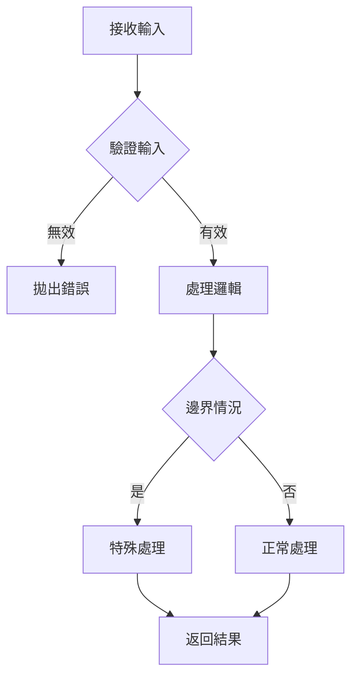

# __NAME__ - Helper Analysis

> **🎯 分析品質**：⭐ 基礎框架 (0%)  
> **📅 開始日期**：__CURRENT_DATE__  
> **📅 最後更新**：__CURRENT_DATE__  
> **📊 分析階段**：📝 待分析  
> **🔗 相關文件**：[連結到 shared/overview.md](../overview.md)

---

## 1. 📝 核心摘要與依賴 (Core Summary & Dependencies)

### 1.1 📂 分析檔案資訊 (Analyzed Files)

| 檔案路徑 |
|---------|
| [待補充：被分析的原始檔案完整路徑] |

### 1.2 📦 依賴關係 (Dependencies)

| 類型 | 名稱 | 用途 | 檔案連結 |
|------|------|------|----------|
| Helper | [其他 Helper] | [輔助功能] | [分析文件連結] |
| Library | [第三方套件] | [套件用途] | - |

**說明：** 此表格追蹤本 Helper 依賴的所有外部工具與套件。

---

## 2. 📋 分析指引 (Analysis Guidelines)

**此文件的分析目標：**

本文件用於分析**工具函式/類別**，重點在於：

1. **函式簽名**：清楚定義參數、回傳值、TypeScript 型別
2. **核心邏輯**：說明演算法、處理步驟、時間/空間複雜度
3. **邊界處理**：分析對空值、極值、異常輸入的處理方式
4. **純函式檢查**：評估是否為純函式、是否有副作用
5. **使用文檔**：提供清晰的使用範例和常見陷阱說明

**AI Agent 注意事項：**
- 此為工具函式分析，應該是無狀態的、可重用的純函式（或接近純函式）
- 必須完整定義 TypeScript 型別和 JSDoc 註解
- 必須用流程圖展示核心邏輯，並標註時間複雜度
- 必須詳細列出邊界情況處理（空值、空陣列、極值等）
- 提供「何時使用」和「何時不使用」的指引
- 所有依賴的其他 Helper 都必須記錄到依賴關係表

---

## 3. Helper 基本資訊 (Helper Information)

### 3.1 函式/類別定義

**基本資訊：**
- **名稱**：[待補充]
- **檔案路徑**：`/src/utils/HelperName.ts`
- **類型**：🔧 工具函式 / 📦 工具類別 / 🎨 格式化 / ✅ 驗證
- **匯出方式**：Named Export / Default Export

---

### 3.2 功能描述

**核心功能：**
[待補充：用 2-3 句話描述此 Helper 的主要功能]

**使用場景：**
- **場景1**：[待補充]
- **場景2**：[待補充]
- **場景3**：[待補充]

---

## 4. 函式簽名 (Function Signatures)

### 4.1 主要函式列表

| 函式名稱 | 參數 | 回傳值 | 說明 |
|---------|------|--------|------|
| `function1()` | `(param: Type)` | `ReturnType` | [待補充] |
| `function2()` | `(param: Type)` | `ReturnType` | [待補充] |

---

### 4.2 TypeScript 定義

**函式簽名：**
```typescript
// [待補充：完整的 TypeScript 函式定義]

/**
 * @description [待補充：函式說明]
 * @param {Type} param1 - [待補充：參數說明]
 * @param {Type} param2 - [待補充：參數說明]
 * @returns {ReturnType} [待補充：回傳值說明]
 * @example
 * const result = functionName(param1, param2);
 */
export function functionName(
    param1: Type,
    param2: Type
): ReturnType {
    // 實作
}
```

---

### 4.3 參數與回傳值

**參數說明：**
- `param1` - [Type] [待補充：參數用途]
- `param2` - [Type] [待補充：參數用途]

**回傳值說明：**
- [ReturnType] [待補充：回傳值說明]

---

## 5. 實作細節 (Implementation Details)

### 5.1 核心邏輯

**執行步驟：**
1. **步驟1**：[待補充]
2. **步驟2**：[待補充]
3. **步驟3**：[待補充]

**邏輯流程：**


**程式碼實作：**
```typescript
export function functionName(param: Type): ReturnType {
    // [待補充：實際實作程式碼]
    
    // 1. 驗證
    if (!isValid(param)) {
        throw new Error('Invalid parameter');
    }
    
    // 2. 處理
    const result = process(param);
    
    // 3. 返回
    return result;
}
```

---

### 5.2 演算法說明

**演算法描述：**
[待補充：描述使用的演算法或處理邏輯]

**時間複雜度**：O(?) [待補充]  
**空間複雜度**：O(?) [待補充]

**演算法步驟：**
```
1. [步驟1]
2. [步驟2]
3. [步驟3]
```

---

### 5.3 邊界情況處理

**邊界情況：**

| 情況 | 輸入 | 預期行為 | 實際處理 |
|------|------|----------|---------|
| 空值 | `null` / `undefined` | [待補充] | [待補充] |
| 空陣列 | `[]` | [待補充] | [待補充] |
| 極值 | `Number.MAX_VALUE` | [待補充] | [待補充] |

**錯誤處理：**
```typescript
// 錯誤處理範例
if (edgeCase) {
    throw new Error('Edge case not supported');
    // 或返回預設值
    return defaultValue;
}
```

---

## 6. 使用範例 (Usage Examples)

### 6.1 基本用法

```typescript
import { functionName } from '@/utils/HelperName';

// 基本使用
const result = functionName(input);
console.log(result);
```

---

### 6.2 進階用法

```typescript
// 進階使用範例
const result = functionName(complexInput, {
    option1: true,
    option2: 'value'
});
```

---

### 6.3 常見陷阱

**陷阱1：** [待補充：常見錯誤用法]
```typescript
// ❌ 錯誤用法
const wrong = functionName(null);

// ✅ 正確用法
const correct = functionName(validInput);
```

**陷阱2：** [待補充：另一個常見錯誤]
```typescript
// ❌ 錯誤
// ...

// ✅ 正確
// ...
```

---

## 7. 架構與品質分析 (Architecture & Quality Analysis)

### 7.1 效能分析

**時間複雜度分析：**
- **最佳情況**：O(?) [待補充]
- **平均情況**：O(?) [待補充]
- **最差情況**：O(?) [待補充]

**效能檢查清單：**
- [ ] 避免不必要的循環
- [ ] 使用高效的資料結構
- [ ] 避免重複計算
- [ ] 記憶化（Memoization）應用

**優化建議：**
- [待補充：具體的優化方案]

---

### 7.2 純函式檢查

**純函式特性：**
- [ ] 相同輸入總是產生相同輸出
- [ ] 無副作用（不修改外部狀態）
- [ ] 不依賴外部狀態
- [ ] 不修改輸入參數

**副作用檢查：**
- [待補充：是否有副作用？如果有，說明原因]

---

### 7.3 型別安全

**型別定義完整性：**
```typescript
// 完整的型別定義
type InputType = {
    // ...
};

type ReturnType = {
    // ...
};

// 泛型支援（如適用）
function genericFunction<T>(param: T): T {
    // ...
}
```

---

### 7.4 測試覆蓋率

**測試策略：**
- [ ] 單元測試（正常流程）
- [ ] 邊界條件測試
- [ ] 錯誤處理測試
- [ ] 效能測試

**測試範例：**
```typescript
describe('functionName', () => {
    it('should return correct result for valid input', () => {
        const result = functionName(validInput);
        expect(result).toBe(expectedOutput);
    });
    
    it('should throw error for invalid input', () => {
        expect(() => functionName(invalidInput)).toThrow();
    });
    
    it('should handle edge cases', () => {
        const result = functionName(edgeCaseInput);
        expect(result).toBe(expectedEdgeOutput);
    });
});
```

---

## 8. 文檔與註解 (Documentation)

### 8.1 JSDoc 註解

**完整 JSDoc：**
```typescript
/**
 * @description [待補充：詳細功能描述]
 * 
 * @param {Type} param1 - [待補充：參數說明]
 * @param {Type} param2 - [待補充：參數說明]
 * 
 * @returns {ReturnType} [待補充：回傳值說明]
 * 
 * @throws {ErrorType} [待補充：可能拋出的錯誤]
 * 
 * @example
 * // 範例1
 * const result1 = functionName(input1);
 * 
 * @example
 * // 範例2
 * const result2 = functionName(input2, options);
 * 
 * @see {@link RelatedFunction} 相關函式
 */
```

---

### 8.2 使用文檔

**何時使用：**
- [待補充：適合使用此 Helper 的情境]

**何時不使用：**
- [待補充：不適合使用的情境]

**替代方案：**
- [待補充：其他可用的替代方案]

---

## 9. 📋 品質檢查清單 (Quality Checklist)

### ⭐ 基礎框架 (1-40%)
- [ ] 文件元數據完整（日期、品質等級）
- [ ] 函式簽名完整
- [ ] 基本功能描述清晰

### ⭐⭐⭐ 邏輯完成 (41-70%)
- [ ] 核心邏輯流程圖已繪製
- [ ] 演算法說明完整
- [ ] 邊界情況處理已定義
- [ ] 使用範例已提供

### ⭐⭐⭐⭐ 架構完整 (71-90%)
- [ ] **依賴關係表已完成**
- [ ] **所有依賴項都已建立分析檔案**
- [ ] 效能分析完整（時間/空間複雜度）
- [ ] 純函式檢查已完成
- [ ] 型別安全已確認

### ⭐⭐⭐⭐⭐ 完整分析 (91-100%)
- [ ] JSDoc 註解完整
- [ ] 測試覆蓋率充足
- [ ] 效能優化建議具體
- [ ] 常見陷阱已記錄
- [ ] 使用文檔完整

---

**當前品質等級**：⭐ 基礎框架 (0%)

