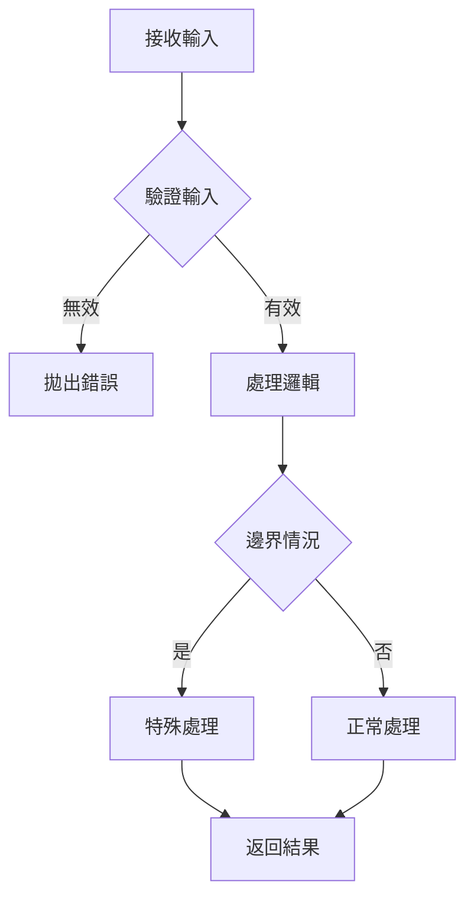

# __NAME__ - Helper Analysis

---

## 1. 📝 核心摘要與依賴 (Core Summary & Dependencies)

### 1.1 📂 分析檔案資訊 (Analyzed Files)

| 檔案路徑 |
|---------|
| [待補充：被分析的原始檔案完整路徑] |

### 1.2 📦 依賴關係 (Dependencies)

| 類型 | 名稱 | 用途 | 檔案連結 |
|------|------|------|----------|
| Helper | [其他 Helper] | [輔助功能] | [分析文件連結] |
| Library | [第三方套件] | [套件用途] | - |

**說明：** 此表格追蹤本 Helper 依賴的所有外部工具與套件。

---

## 2. 📋 分析指引 (Analysis Guidelines)

**目標：** 分析工具函式/類別（函式簽名、核心邏輯、邊界處理、純函式檢查、使用文檔）

**規則：**
- 章節結構不變 | 來源限定 1.1 節 | 依賴記錄於 1.2 節
- 程式碼真實性：禁止 `...` 省略或編造 | 品質清單：僅更新勾選狀態
---

## 3. Helper 基本資訊 (Helper Information)

### 3.1 函式/類別定義

**基本資訊：**
- **名稱**：[待補充]
- **檔案路徑**：`/src/utils/HelperName.ts`
- **類型**：🔧 工具函式 / 📦 工具類別 / 🎨 格式化 / ✅ 驗證
- **匯出方式**：Named Export / Default Export

---

### 3.2 功能描述

[待補充：說明此 Helper 的主要功能]

**使用場景：**
- **場景1**：[待補充]
- **場景2**：[待補充]
- **場景3**：[待補充]

---

## 4. 函式簽名 (Function Signatures)

### 4.1 主要函式列表

| 函式名稱 | 參數 | 回傳值 | 說明 |
|---------|------|--------|------|
| `function1()` | `(param: Type)` | `ReturnType` | [待補充] |
| `function2()` | `(param: Type)` | `ReturnType` | [待補充] |

---

### 4.2 TypeScript 定義

[待補充：完整的 TypeScript 函式定義與 JSDoc]

**函式簽名：**
```typescript
/**
 * @description [待補充]
 * @param {Type} param1 - [待補充]
 * @param {Type} param2 - [待補充]
 * @returns {ReturnType} [待補充]
 * @example
 * const result = functionName(param1, param2);
 */
export function functionName(
    param1: Type,
    param2: Type
): ReturnType {
    // 實作
}
```

---

### 4.3 參數與回傳值

**參數說明：**
- `param1` - [Type] [待補充：參數用途]
- `param2` - [Type] [待補充：參數用途]

**回傳值說明：**
- [ReturnType] [待補充：回傳值說明]

---

## 5. 實作細節 (Implementation Details)

### 5.1 核心邏輯

[待補充：說明演算法與處理步驟]

**執行步驟：**
1. **步驟1**：[待補充]
2. **步驟2**：[待補充]
3. **步驟3**：[待補充]

**邏輯流程：**


**程式碼實作：**
```typescript
// [待補充：貼上實際程式碼，禁止使用 ... 省略]
export function functionName(param: Type): ReturnType {
    // 1. 驗證
    if (!isValid(param)) {
        throw new Error('Invalid parameter');
    }
    
    // 2. 處理
    const result = process(param);
    
    // 3. 返回
    return result;
}
```

---

### 5.2 演算法說明

[待補充：說明演算法或處理邏輯]

**時間複雜度**：O(?) [待補充]  
**空間複雜度**：O(?) [待補充]

**演算法步驟：**
1. [步驟1]
2. [步驟2]
3. [步驟3]

---

### 5.3 邊界情況處理

[待補充：說明邊界情況處理方式]

**邊界情況：**

| 情況 | 輸入 | 預期行為 | 實際處理 |
|------|------|----------|---------|
| 空值 | `null` / `undefined` | [待補充] | [待補充] |
| 空陣列 | `[]` | [待補充] | [待補充] |
| 極值 | `Number.MAX_VALUE` | [待補充] | [待補充] |

**錯誤處理：**
```typescript
if (edgeCase) {
    throw new Error('Edge case not supported');
    // 或返回預設值
    return defaultValue;
}
```

---

## 6. 使用範例 (Usage Examples)

### 6.1 基本用法

```typescript
import { functionName } from '@/utils/HelperName';

// 基本使用
const result = functionName(input);
console.log(result);
```

---

### 6.2 進階用法

```typescript
// 進階使用範例
const result = functionName(complexInput, {
    option1: true,
    option2: 'value'
});
```

---

### 6.3 常見陷阱

[待補充：說明常見錯誤用法]

**陷阱1：**
```typescript
// ❌ 錯誤用法
const wrong = functionName(null);

// ✅ 正確用法
const correct = functionName(validInput);
```

**陷阱2：**
```typescript
// ❌ 錯誤
// [待補充]

// ✅ 正確
// [待補充]
```

---

## 7. 架構與品質分析 (Architecture & Quality Analysis)

### 7.1 效能分析

**時間複雜度分析：**
- **最佳情況**：O(?) [待補充]
- **平均情況**：O(?) [待補充]
- **最差情況**：O(?) [待補充]

**效能檢查清單：**
- [ ] 避免不必要的循環
- [ ] 使用高效的資料結構
- [ ] 避免重複計算
- [ ] 記憶化（Memoization）應用

---

### 7.2 純函式檢查

[待補充：評估是否為純函式及是否有副作用]

**純函式特性：**
- [ ] 相同輸入總是產生相同輸出
- [ ] 無副作用（不修改外部狀態）
- [ ] 不依賴外部狀態
- [ ] 不修改輸入參數

---

### 7.3 型別安全

[待補充：說明型別定義完整性]

**型別定義：**
```typescript
type InputType = {
    // [待補充]
};

type ReturnType = {
    // [待補充]
};

// 泛型支援（如適用）
function genericFunction<T>(param: T): T {
    // [待補充]
}
```

---

## 8. 文檔與註解 (Documentation)

### 8.1 JSDoc 註解

[待補充：提供完整的 JSDoc 註解範例]

**完整 JSDoc：**
```typescript
/**
 * @description [待補充]
 * 
 * @param {Type} param1 - [待補充]
 * @param {Type} param2 - [待補充]
 * 
 * @returns {ReturnType} [待補充]
 * 
 * @throws {ErrorType} [待補充]
 * 
 * @example
 * const result1 = functionName(input1);
 * 
 * @example
 * const result2 = functionName(input2, options);
 * 
 * @see {@link RelatedFunction}
 */
```

---

### 8.2 使用文檔

[待補充：說明使用時機與替代方案]

**何時使用：**
- [待補充]

**何時不使用：**
- [待補充]

**替代方案：**
- [待補充]

---

## 9. 📋 品質檢查清單 (Quality Checklist)

### ⭐ 基礎框架級 (Foundation Level)
- [ ] **1.1 📂 分析檔案資訊**：分析的檔案路徑已填寫。
- [ ] **3.1 函式/類別定義**：Helper 的基本資訊已填寫。
- [ ] **3.2 功能描述**：核心功能與使用場景已描述。
- [ ] **4.2 TypeScript 定義**：提供帶有 JSDoc 的完整 TypeScript 函式簽名。

### ⭐⭐ 核心邏輯級 (Core Logic Level)
- [ ] **5.1 核心邏輯**：Mermaid 流程圖與程式碼實作皆已完成。
- [ ] **5.2 演算法說明**：演算法、時間複雜度與空間複雜度皆已說明。
- [ ] **5.3 邊界情況處理**：無重要邊界情況。

### ⭐⭐⭐ 整合分析級 (Integration Analysis Level)
- [ ] **1.2 📦 依賴關係**：依賴關係表已填寫完整。
- [ ] **6. 使用範例**：提供基本、進階、以及常見陷阱的程式碼範例。
- [ ] **7.1 效能分析**：效能檢查清單已完成評估。
- [ ] **7.2 純函式檢查**：純函式檢查清單已完成評估。

### ⭐⭐⭐⭐ 架構品質級 (Architecture & Quality Level)
- [ ] **完整性**：文件內所有 `[待補充]` 標記皆已移除，並替換為基於原始碼的真實分析內容。
- [ ] **程式碼真實性**：所有程式碼片段皆為專案中的**實際程式碼**，**逐字複製**，無任何省略或編造。
- [ ] **流程圖真實性**：所有 Mermaid 圖表中的元素（函式名、類別名、流程步驟）皆能在原始碼中找到明確對應。
- [ ] **無推測性內容**：文件中所有分析內容皆基於**已提供的原始碼檔案**，無任何基於推測的內容。
- [ ] **8.1 JSDoc 註解**: 已提供符合真實程式碼的 JSDoc 範例。
- [ ] **8.2 使用文檔**: 已提供清晰的「何時使用/不使用」說明 (隱含在功能描述中)。

### ⭐⭐⭐⭐⭐ 功能實作完整分析 (Full Implementation Analysis)
- [ ] **文件準確性**：所有技術細節（API 規格、型別定義、參數說明）與實際程式碼完全一致。
- [ ] **依賴關係最終確認**：`1.2 📦 依賴關係` 表中的所有依賴項皆有對應的分析文件連結，且無懸空的依賴。
- [ ] **程式碼完整性驗證**：所有關鍵邏輯的程式碼片段皆完整呈現，無使用 `...` 或註解省略。
- [ ] **可驗證性**：所有分析結果皆可透過閱讀原始碼檔案進行驗證，無法驗證的內容必須明確標記為「推測」或「建議」。
- [ ] **複雜度分析**：時間與空間複雜度分析準確反映實際演算法。

---

> **🎯 分析品質**：⭐ 基礎框架  
> **📅 開始日期**：__CURRENT_DATE__  
> **📅 最後更新**：__CURRENT_DATE__  
