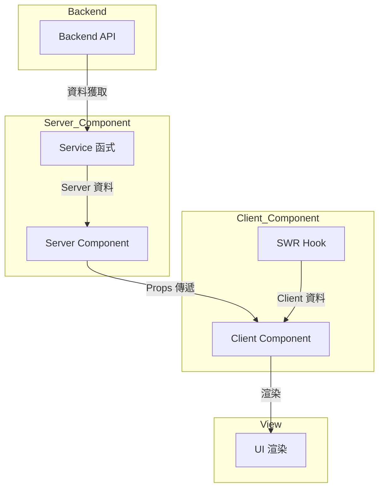

# [填入頁面/模組/功能名稱]

---

## 1. 📋 分析指引 (Analysis Guidelines)

**分析目標：**
分析功能頁面/模組的完整實作規劃。專注：使用者故事、API 設計、狀態管理、元件拆解、錯誤處理、驗收標準。

**核心規則：**
- 章節結構不變：禁止新增或刪除預設章節
- 使用者導向：從使用者角度出發，定義清楚的使用者故事與驗收標準
- API 優先：明確定義所有 API 規格，包含請求/回應格式、錯誤處理
- 程式碼真實性：禁止使用 `...` 省略或編造內容
- 可驗證性：所有驗收標準必須可測試、可驗證
- 完整性：確保所有 `[待填寫]` 標記皆已替換為實際內容

**填寫順序建議：**
1. **功能定義階段**：第 2-3 節（功能職責、認證與路由）
2. **資料設計階段**：第 4-5 節（資料流與 API、狀態管理）
3. **UI 設計階段**：第 6-9 節（互動流程、檔案結構、佈局、元件組合）
4. **品質保證階段**：第 10-12 節（錯誤處理、測試、驗收標準）

---

## 1.1 📂 分析檔案資訊 (Analyzed Files)

| 檔案路徑 |
|---------|
| [待填寫：來源分析文件的完整路徑] |

**說明**：此表格記錄此重構文件所基於的來源分析文件，用於追溯和品質比對。

---

## 2. 功能職責 (Responsibility)

### 2.1 背景目的與使用者故事 (Background, Objective & User Story)

1. **目的 (Objective):**

   **[待填寫]** 簡潔說明「為什麼」要開發這個功能？它解決了什麼商業問題或使用者痛點？提供了什麼價值？

2. **使用者故事 (User Story):**

    **[待填寫]** 從使用者的角度描述需求。
    - **格式：** As a `[使用者類型]`, I want to `[執行某個動作]`, so that `[我能獲得的價值/好處]`。
    - **範例：** As a `網站管理員`, I want to `手動停用特定使用者的帳號`, so that `我能即時阻擋違規使用者的存取`。

3. **關鍵功能點 (Key Features List):**

    **[待填寫]** 條列出此功能範疇內包含的主要項目 (Bullet points)，作為後續「驗收標準」的基礎。
    - 範例：
       - 顯示使用者列表 (分頁、搜尋)
       - 管理員可編輯使用者角色
       - 管理員可切換使用者「啟用/停用」狀態
       - (Scope Out) 本期不做「刪除使用者」功能

---


## 3. 相關文件 (Related Documents)

 **[待填寫]** 附上所有與此功能相關的參考文件連結。
1. **UI/UX 設計 (UI/UX Design):**
   - Mockups / Prototypes (Figma, Sketch 連結)
   - 設計系統 (Design System) (若有使用特定元件庫的規範)

2. **Legacy / 舊版分析文件:**
   - (如果是功能重構或改版，請附上舊版功能的分析文件)

---

## 4. 認證與路由保護 (Auth & Guarding)

 **[待填寫]** 說明此功能/頁面的存取權限。
1. **路由路徑 (Route Path):**
2. **權限要求 (Required Permissions):**
3. **未授權處理 (Unauthorized Handling):**

---

## 5. 資料流與 API (Data Flow & API)

### 5.1 資料模型 (Data Model / TypeScript Interfaces)

**[待填寫]** 定義此功能會用到的主要資料結構 (建議直接貼上 `interface` 或 `type` 定義)。
```typescript
 // e.g.,
 interface User {
   id: string;
   name: string;
   email: string;
   role: 'Admin' | 'User';
   status: 'Active' | 'Inactive';
 }
```

### 5.2 資料獲取 (Data Fetching)

**[待填寫]** 描述頁面載入 (Mount) 或元件互動時，需要呼叫哪些 API 來獲取資料。

### 5.3 資料提交 (Data Mutation)

**[待填寫]** 描述使用者執行哪些操作時，會觸發資料的 新增(Create) / 修改(Update) / 刪除(Delete)。

### 5.4 API 規格 (API Specifications)

**[待填寫]** 條列分析 Codebase 內既有 Api 是否有支援。
 - **(1) 獲取使用者列表**
    - **Method:** `GET`
    - **Endpoint:** `/api/v1/users`
    - **Query Params:** `page: number`, `limit: number`, `search: string`
    - **Success Response (200):** `{ data: User[], total: number }`

 - **(2) 更新使用者狀態**
    - **Method:** `PUT`
    - **Endpoint:** `/api/v1/users/{id}/status`
    - **Request Body:** `{ status: 'Active' | 'Inactive' }`
    - **Success Response (200):** `User`

### 5.5 條件式渲染邏輯 (Conditional Rendering)

**[待填寫]** 說明元件的條件式渲染邏輯，包含所有判斷條件和渲染規則。

**條件判斷清單**：
- [待填寫] 外層容器顯示條件（例如：必須有資料且數量 > 0）
- [待填寫] 隱藏條件（例如：特定模式下隱藏）
- [待填寫] 標題顯示條件（例如：翻譯就緒且有標題）
- [待填寫] 樣式條件（例如：根據設定決定樣式）
- [待填寫] 選中狀態判斷（例如：ID 比對）

**流程圖**：
```mermaid
graph TD
    A{[主要判斷條件]}
    A -- Yes --> B[顯示內容]
    A -- No --> C[不渲染或隱藏]
    B --> D{次要條件}
    D -- Yes --> E[顯示子元素]
    D -- No --> F[不顯示子元素]
```

**範例說明**：
```typescript
// 條件式渲染範例
if (!groupData?.SalePageItems?.length) {
  return null; // 沒有資料時不渲染
}

{displayTitle && (
  <p className="group-title">{displayTitle}</p> // 有標題時顯示
)}
```

### 5.6 資料流與狀態變數 (Data Flow & State Variables)

**[待填寫]** 說明資料在元件之間的流向，以及相關的狀態變數。

**資料流向圖**：


**狀態變數說明**：

| 變數名稱 | 型別 | 用途 | 資料來源 | 影響範圍 |
|---------|------|------|---------|---------|
| [待填寫] | `[型別]` | [用途說明] | [資料來源] | [影響範圍] |
| [待填寫] | `[型別]` | [用途說明] | [資料來源] | [影響範圍] |

**範例**：
```typescript
// 狀態變數範例
interface ComponentState {
  // Server Component 狀態
  serverData: ServerData;        // 從 service 函式取得
  selectedItem: Item | null;     // Server 端計算
  
  // Client Component 狀態
  isLoading: boolean;            // 從 SWR hook 取得
  localState: string;            // 使用 useState 管理
}
```

---

## 6. 狀態管理 (State Management)

### 6.1 全域/共享狀態 (Global/Shared State)

**[待填寫]** 說明如何獲取和管理伺服器資料、哪些狀態需要跨元件、跨頁面共享，並說明技術選型 (e.g., SWR, Zustand/Reducer, Context API)。

**Server Component 資料獲取**:
- 使用 `services/*.service.ts` 中的函式
- 配合 `unstable_cache` 進行快取
- 例如：`await getProducts()`, `await checkIsLogin()`

**Client Component 資料獲取**:
- 使用 SWR hooks (`hooks/use*.ts`)
- 例如：`useIsLogin()`, `useAuthInfo()`, `useProducts()`
- 說明何時需要重新驗證資料

### 6.2 客戶端狀態 (Client State)

**[待填寫]** 說明需要哪些全域或本地狀態。

**全域狀態** (Zustand + Reducer):
- 列出需要的 stores
- 例如：購物車 (`store/cart.store.ts`)、UI 設定 (`store/ui.store.ts`)
- 說明狀態的結構和主要 actions

**本地狀態** (useState):
- 表單輸入、開關狀態
- 僅限單一組件使用的簡單狀態

---

## 7. 互動流程 (Interaction Flow)

### 7.1 主要使用案例 (Main Use Case / Happy Path)

 **[待填寫]** 描述使用者最常規、最順利的操作流程 (Step-by-step)。
 1. 管理員進入「使用者管理」頁面。
 2. 頁面顯示「使用者列表」第一頁。
 3. 管理員點擊 A 使用者的「編輯」按鈕。
 4. 彈出「編輯 Modal」，並顯示 A 使用者的資料。
 5. 管理員將 A 的角色從 'User' 改為 'Admin'。
 6. 點擊「儲存」。
 7. Modal 關閉，列表刷新，A 使用者的角色更新為 'Admin'。

### 7.2 流程圖 (Sequence Diagram - Optional)

 **[待填寫]** 使用 Mermaid 繪製前端、後端、資料庫之間的互動時序圖，釐清複雜流程。
 ```mermaid
 
 ```

---


## 8. 檔案結構 (File Structure)

**[待填寫]** 分析 Codebase 命名規則，規劃此功能相關的程式碼檔案組織。
```bash
apps/frontend/
├── app/(auth)/
│   └── login/
│       ├── _components/
│       │   ├── LoginForm.tsx      # 登入表單元件
│       │   └── SocialLogin.tsx    # 第三方登入元件
│       ├── _lib/
│       │   └── validation.ts      # 表單驗證邏輯
│       ├── _actions/
│       │   └── login-actions.ts   # Server Actions
│       └── page.tsx               # 頁面進入點
├── store/
│   └── auth.store.ts              # Zustand store（如需要）
└── components/
    └── ui/                        # 共用 UI 元件
        ├── Button.tsx
        └── Input.tsx
 ```

---

## 9. 佈局 (Layout)

### 9.1 頁面結構 (Page Structure)

**[待填寫]** 描述此頁面使用了哪個「佈局」(Layout)，以及頁面內部的區塊劃分。

### 9.2 響應式設計 (RWD/AWD) 規劃

**[待填寫]** 說明此功能在不同裝置 (Mobile, Desktop) 上的呈現方式或斷點 (Breakpoint)。

---

## 10. 功能元件組合 (Feature Composition)

### 10.1 元件拆解 (Component Breakdown)

**[待填寫]** 將 UI 拆解成可複用的 (Reusable) 和功能的 (Feature) 元件，並定義其職責。

**注意**: API 重構文件通常不需要此章節。

**Server/Client Component 分離檢查**：
- [ ] 每個元件都已標記為 Server Component 或 Client Component
- [ ] Server Component 負責資料獲取和靜態渲染
- [ ] Client Component 只處理最小必要的互動邏輯
- [ ] 資料計算在 Server 端完成，不使用 `useMemo`
- [ ] 只有 Link 等互動元件需要 Client Component

**詳細標準請參考**：[refactor-constitution.md](../../.analysis-kit/memory/refactor-constitution.md) 和 [refactor-coding-standard.md](../../.analysis-kit/memory/refactor-coding-standard.md)

---

**範例（Feature 重構）：**

- **`LoginForm` (Client Component)**
  - **職責**: 登入表單，處理使用者輸入與提交
  - **類型**: 
     - [x] Client Component
     - [ ] Server Component
  - **資料來源**: `useIsLogin()` (SWR hook)
  - **狀態管理**: React Hook Form
  - **Props**: 無
  - **互動**: 表單提交、顯示錯誤訊息

- **`ProductList` (Server Component)**
  - **職責**: 顯示商品列表（SSR）
  - **類型**: 
     - [ ] Client Component
     - [x] Server Component
  - **資料來源**: `await getProducts()` (service 函式)
  - **Props**: 無
  - **互動**: 無（純展示）

- **`AddToCartButton` (Client Component)**
  - **職責**: 加入購物車按鈕，處理點擊互動
  - **類型**: 
     - [x] Client Component
     - [ ] Server Component
  - **資料來源**: 無
  - **狀態管理**: `useCartStore()` (Zustand)
  - **Props**: `productId: string`, `productName: string`
  - **互動**: 點擊後呼叫 `addItem` action

- **`Button` (Reusable Component)**
  - **職責**: 統一的按鈕樣式（基礎 UI 元件）
  - **類型**: 
     - [x] Client Component
     - [ ] Server Component
  - **Props**: `variant: 'primary' | 'secondary'`, `onClick`, `children`

---

## 11. 錯誤處理與邊界情況 (Error Handling & Edge Cases)

**[待填寫]** 條列出所有可預期的錯誤和特殊狀態，以及前端應如何應對。
- **前端驗證 (Client-side Validation):**
- **API 錯誤 (API Errors):**
- **邊界情況 (Edge Cases):**

---


## 12. 審查與測試 (Review & QA)

### 12.1 關鍵測試案例 (Key Test Cases)

 **[待填寫]** 條列出「必須」通過的測試情境，並標註優先級（P0 = 最高優先級，P1 = 中等優先級，P2 = 較低優先級）。

**P0 - 核心功能（必須通過）**：
- [待填寫] 成功新增/編輯使用者
- [待填寫] 欄位留空點擊儲存，應顯示必填錯誤
- [待填寫] API 錯誤時應顯示錯誤提示

**P1 - 重要功能（建議通過）**：
- [待填寫] 列表在 Loading 時應顯示骨架屏
- [待填寫] 搜尋無結果時應顯示空狀態
- [待填寫] 在手機版 (768px 以下) 檢視，表格應變為卡片樣式

**P2 - 次要功能（可選）**：
- [待填寫] 其他次要測試情境

---

## 13. 驗收標準 (Acceptance Criteria - AC)

 **[待填寫]** 條列出 PO/PM/QA 用來驗收此功能的具體標準，並標註優先級（P0 = 最高優先級，P1 = 中等優先級，P2 = 較低優先級）。

**P0 - 核心功能（必須通過）**：
- [待填寫] 進入頁面後應正確顯示使用者列表，且包含必要的欄位
- [待填寫] 編輯使用者角色後，列表應即時更新顯示

**P1 - 重要功能（建議通過）**：
- [待填寫] 搜尋功能應正確過濾列表內容
- [待填寫] 分頁功能應正確顯示和切換頁面

**P2 - 次要功能（可選）**：
- [待填寫] 其他次要驗收標準

---

## 14. 📋 品質檢查清單 (Quality Checklist)

### ⭐ 基礎框架級 (Foundation Level)
- [ ] **1.1 分析檔案資訊**：來源分析文件路徑已填寫
- [ ] **2.1 背景目的與使用者故事**：目的、使用者故事和關鍵功能點已填寫
- [ ] **3. 相關文件**：相關文件連結已提供（UI/UX 設計、Legacy 分析文件）
- [ ] **4. 認證與路由保護**：路由路徑、權限要求和未授權處理已說明
- [ ] **5.1 資料模型**：主要資料結構（TypeScript interfaces）已定義

### ⭐⭐ 核心邏輯級 (Core Logic Level)
- [ ] **5.2 資料獲取**：頁面載入時需要呼叫的 API 已列出
- [ ] **5.3 資料提交**：資料新增/修改/刪除的操作已說明
- [ ] **5.4 API 規格**：所有 API endpoints 規格已詳細描述（Method, Endpoint, Request/Response）
- [ ] **5.5 條件式渲染邏輯**：條件式渲染邏輯與流程圖已提供
- [ ] **5.6 資料流與狀態變數**：資料流向圖和狀態變數說明已完成
- [ ] **6. 狀態管理**：Server/Client 狀態管理策略已明確規劃
- [ ] **7.1 主要使用案例**：Happy Path 操作流程已描述

### ⭐⭐⭐ 整合分析級 (Integration Analysis Level)
- [ ] **7.2 流程圖**：複雜流程的 Mermaid sequence diagram 已繪製
- [ ] **8. 檔案結構**：檔案組織結構已規劃，符合 Next.js App Router 規範
- [ ] **9.1 頁面結構**：頁面佈局和區塊劃分已說明
- [ ] **9.2 響應式設計**：Mobile/Desktop 呈現方式已規劃
- [ ] **10.1 元件拆解**：所有元件已拆解並標記 Server/Client Component 類型
- [ ] **11. 錯誤處理與邊界情況**：錯誤處理策略和邊界情況已列出

### ⭐⭐⭐⭐ 架構品質級 (Architecture Quality Level)
- [ ] **完整性**：文件內所有 `[待填寫]` 標記皆已移除，並替換為實際內容
- [ ] **程式碼真實性**：所有程式碼片段皆為實際規劃或參考範例，無使用 `...` 省略或編造內容
- [ ] **流程圖真實性**：所有 Mermaid 圖表中的元素（函式名、類別名、流程步驟）皆能在規劃或參考中找到對應
- [ ] **技術規範一致性**：所有技術選型符合 [refactor-constitution.md](../../.analysis-kit/memory/refactor-constitution.md) 規範
- [ ] **編碼標準遵循**：所有實作細節符合 [refactor-coding-standard.md](../../.analysis-kit/memory/refactor-coding-standard.md) 標準
- [ ] **12.1 測試策略**：測試類型和測試目標已明確說明
- [ ] **12.2 關鍵測試案例**：必須通過的測試情境已列出

### ⭐⭐⭐⭐⭐ 功能實作完整分析 (Full Implementation Analysis)
- [ ] **文件準確性**：所有技術細節（API 規格、型別定義、參數說明）與實際需求完全一致
- [ ] **可驗證性**：所有驗收標準（AC）皆可測試、可驗證，符合優先級格式
- [ ] **功能一致性比對**：已完成 targetFile 與 sourceFile 的功能一致性比對，所有比對項目一致
- [ ] **功能一致性報告**：已生成功能一致性比對報告，並標記所有不一致項目
- [ ] **Server/Client 分離驗證**：所有元件已正確標記 Server/Client Component，並符合分離原則
- [ ] **Props 設計驗證**：所有 Props 設計符合最小化原則，不傳遞完整資料物件
- [ ] **Next.js 原生功能驗證**：導航使用 Next.js Link，圖片使用 Next.js Image，符合原生功能優先原則
- [ ] **響應式設計驗證**：使用單一元件 + CSS 控制響應式，避免建立兩個獨立元件
- [ ] **Cache 設計驗證**：Service 層的 cache key 包含所有參數，支援 tags 清除快取

---

## 15. 功能一致性比對報告 (Functionality Consistency Report)

> **[AI 自動生成 - 功能一致性比對]**

此章節由 AI 自動生成，比對目標文件與源文件的功能一致性。**必須在完成內容填充後執行，作為最後的驗證步驟。**

### 15.0 比對檢查清單

執行比對前，確認以下項目：

- [ ] 已讀取所有源文件（`LEGACY_ANALYSIS_FILES`）
- [ ] 已讀取目標文件（`REFACTOR_DOC_FILE`）
- [ ] 已理解源文件的核心業務邏輯
- [ ] 已理解目標文件的架構設計

**比對時必須檢查的關鍵欄位**：

1. **商業邏輯**：
   - [ ] 核心業務規則是否一致（例如：排序邏輯、篩選條件、計算公式）
   - [ ] 特殊情況處理是否一致（例如：邊界條件、錯誤處理）
   - [ ] 資料轉換邏輯是否一致（例如：格式化、單位轉換）

2. **關鍵功能點**：
   - [ ] 功能數量是否一致
   - [ ] 每個功能的描述是否對應
   - [ ] 是否有功能遺漏或新增

3. **API 端點**：
   - [ ] API 路徑是否一致
   - [ ] 請求參數是否一致
   - [ ] 回應格式是否一致
   - [ ] 錯誤處理是否一致

4. **資料模型**：
   - [ ] 資料結構欄位是否一致
   - [ ] 資料型別是否對應
   - [ ] 必填欄位是否一致

5. **互動流程**：
   - [ ] 使用者操作步驟是否一致
   - [ ] 系統回應是否一致
   - [ ] 錯誤處理流程是否一致

6. **條件式渲染**：
   - [ ] 所有條件判斷是否一致
   - [ ] 顯示/隱藏邏輯是否一致
   - [ ] 樣式切換條件是否一致

7. **狀態變數**：
   - [ ] 狀態變數數量是否一致
   - [ ] 狀態變數用途是否對應
   - [ ] 狀態變數來源是否一致

### 15.1 比對項目清單

**[待填寫]** 填入所有 7 個比對項目的比對結果。

| 比對項目 | 源文件章節 | 目標文件章節 | 比對結果 | 備註 |
|---------|-----------|-------------|---------|------|
| 商業邏輯 | 4.2 | 4.2（如適用）或分散在多個章節 | [待填寫] ✅一致 / ⚠️不一致 / ➕新增 | [說明不一致或新增的原因] |
| 關鍵功能點 | 2.1 / 1.2 | 2.1 | [待填寫] ✅一致 / ⚠️不一致 / ➕新增 | [說明不一致或新增的原因] |
| API 端點 | 4.4.2 / 5.4 | 5.4 | [待填寫] ✅一致 / ⚠️不一致 / ➕新增 | [說明不一致或新增的原因] |
| 資料模型 | 4.4.2 / 5.1 | 5.1 | [待填寫] ✅一致 / ⚠️不一致 / ➕新增 | [說明不一致或新增的原因] |
| 互動流程 | 3.2 / 7.1 | 7.1 | [待填寫] ✅一致 / ⚠️不一致 / ➕新增 | [說明不一致或新增的原因] |
| 條件式渲染 | 3.3 / 5.5 | 5.5 | [待填寫] ✅一致 / ⚠️不一致 / ➕新增 | [說明不一致或新增的原因] |
| 狀態變數 | 4.3 / 5.6 | 5.6 | [待填寫] ✅一致 / ⚠️不一致 / ➕新增 | [說明不一致或新增的原因] |

**格式要求**：
- 比對結果必須使用以下格式之一：`✅一致`、`⚠️不一致`、`➕新增`
- 備註欄位必須說明不一致或新增的具體原因
- 如果發現不一致，必須在 15.3 節提供詳細說明

### 15.2 比對結果摘要

**[待填寫]** 統計比對結果，列出所有一致、不一致和新增項目。

**✅ 一致項目**：
- [待填寫] [項目名稱]：完全一致（簡要說明）

**⚠️ 不一致項目**（需要人工確認）：
- [待填寫] [項目名稱]：[說明不一致的地方，例如：源文件有 5 個功能點，目標文件只有 4 個，缺少「刪除功能」]

**➕ 新增項目**（AI 補充，需驗證）：
- [待填寫] [項目名稱]：[說明新增的原因，例如：根據 Next.js 最佳實踐新增的 `unstable_cache` 快取機制]

**統計**：
- 總比對項目：7 項
- ✅ 一致項目：{N} 項
- ⚠️ 不一致項目：{N} 項
- ➕ 新增項目：{N} 項

### 15.3 詳細比對說明

**[待填寫]** 針對每個不一致或新增項目，提供詳細的比對說明。**如果所有項目都一致，可簡要說明。**

**格式要求**：
- 每個比對項目使用一個子節標題（例如：`#### 15.3.1 商業邏輯比對`）
- 必須包含源文件和目標文件的對比
- 必須說明比對結果和原因
- 如果發現不一致，必須標記為 `> **[功能不一致 - 需要人工確認]**`
- 如果新增項目，必須標記為 `> **[AI 補充 - 請驗證]**`

**範例**：
```
### 商業邏輯比對

**源文件（008-商品頁群組.md）**：
- 頁面初始化時從 SalePageModel.SalePageGroup 取得群組資料
- 透過 URL 正規表達式判斷是否為簡化商品頁
- 使用 getSelectedGroupItem() 找出當前選中的項目
- 點擊當前商品時不執行導頁（防呆設計）

**目標文件**：
- ✅ Server Component 從 salePageData.SalePageGroup 取得群組資料
- ✅ 簡化商品頁判斷移至 Layout 層處理
- ✅ Server 端直接計算選中項目（不使用 useMemo）
- ✅ Link 元件 onClick 中檢查 isSelected 避免重複導航

**比對結果**：✅ 邏輯一致，實作方式符合 Next.js 最佳實踐

### 關鍵功能點比對

**源文件（008-商品頁群組.md）**：
- 顯示群組商品列表
- 圓形/方形圖示樣式切換
- 商品切換導航功能
- 標題組合邏輯（4 種優先順序）
- 當前商品視覺標示

**目標文件**：
- ✅ 顯示群組商品列表
- ✅ 圓形/方形圖示樣式切換
- ✅ 商品切換導航功能
- ✅ 標題組合邏輯（4 種優先順序）
- ✅ 當前商品視覺標示

**比對結果**：✅ 完全一致
```

---

> **🎯 分析品質**：⭐ 基礎框架  
> **📅 開始日期**：__CURRENT_DATE__  
> **📅 最後更新**：__CURRENT_DATE__  