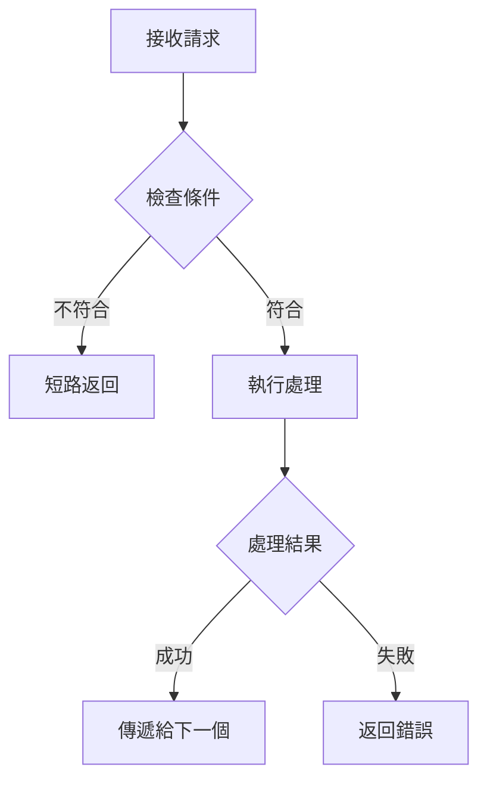
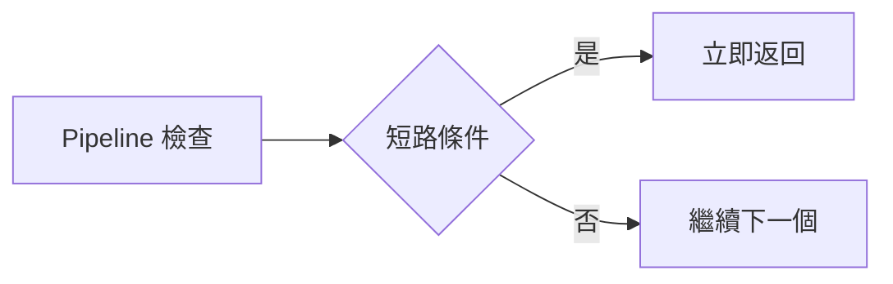

# __NAME__ - Request Pipeline Analysis

---

## 1. 📝 核心摘要與依賴 (Core Summary & Dependencies)

### 1.1 📂 分析檔案資訊 (Analyzed Files)

| 檔案路徑 |
|---------|
| [待補充：被分析的原始檔案完整路徑] |

### 1.2 📦 依賴關係 (Dependencies)

| 類型 | 名稱 | 用途 | 檔案連結 |
|------|------|------|----------|
| Service | [服務名稱] | [服務用途] | [分析文件連結] |
| Helper | [工具名稱] | [工具用途] | [分析文件連結] |

**說明：** 此表格追蹤本 Pipeline 元件依賴的所有外部服務與工具。

---

## 2. 📋 分析指引 (Analysis Guidelines)

**分析目標：**
分析請求管線元件（Filter/Middleware）。專注：執行時機、處理邏輯、適用範圍、依賴追蹤、效能與安全。

**核心規則：**
- 章節結構不變：禁止新增或刪除預設章節
- 來源檔案限定：只分析 1.1 節列出的檔案
- 依賴註記：未分析的依賴記錄在 1.2 節
- 程式碼真實性：禁止使用 `...` 省略或編造內容
- 品質清單不變：僅更新勾選狀態 `[ ]` -> `[x]`

---

## 3. Pipeline 元件資訊 (Component Information)

### 3.1 元件定義

**基本資訊：**
- **元件名稱**：[待補充]
- **檔案路徑**：[待補充]
- **元件類型**：🔐 認證 / 🛡️ 授權 / 📝 日誌 / 🔄 轉換 / ⚡ 快取
- **執行階段**：Before Request / After Request / Both

---

### 3.2 註冊方式與順序

**註冊方式：**
```csharp
// .NET MVC Filter
[AttributeName(Order = 1)]
public class ControllerName : Controller { }
```

或

```typescript
// Express Middleware
app.use(middlewareName);
```

**執行順序：**
1. Middleware 1 (Order = 1)
2. Middleware 2 (Order = 2)
3. **此 Middleware** (Order = N)
4. Middleware N+1

---

### 3.3 適用範圍

[待補充：說明此 Pipeline 元件的適用範圍]

**適用目標：**
- [ ] 全域（所有請求）
- [ ] Controller 層級
- [ ] Action 層級
- [ ] 特定路由

---

## 4. 執行邏輯 (Execution Logic)

### 4.1 觸發條件

[待補充：說明觸發時機與條件判斷]

**觸發時機：**
- [待補充]

**條件判斷：**
```typescript
if (condition) {
    // 執行 Pipeline 邏輯
}
```

---

### 4.2 處理流程

**執行步驟：**
1. **步驟1**：接收請求/回應
2. **步驟2**：執行檢查/轉換
3. **步驟3**：決定是否繼續
4. **步驟4**：傳遞給下一個 Pipeline

**流程圖：**


**關鍵決策點：**
- **決策1**：[待補充：條件與影響]
- **決策2**：[待補充：條件與影響]

---

### 4.3 短路邏輯

[待補充：說明短路條件與回應方式]

**短路回應：**
```csharp
// 直接返回回應
return new JsonResult(new { error = "..." });
```

**短路流程：**


---

## 5. 請求/回應處理 (Request/Response Handling)

### 5.1 請求攔截

[待補充：說明請求攔截邏輯與驗證處理]

**攔截邏輯：**
```csharp
// [待補充：貼上實際程式碼，禁止使用 ... 省略]
public override void OnActionExecuting(ActionExecutingContext context)
{
    // 檢查條件
    if (!isValid)
    {
        context.Result = new JsonResult(new { error = "..." });
        return;
    }
    
    base.OnActionExecuting(context);
}
```

**攔截處理：**
- **驗證1**：[待補充]
- **驗證2**：[待補充]

---

### 5.2 回應修改

[待補充：說明回應修改邏輯]

**修改邏輯：**
```csharp
// [待補充：貼上實際程式碼，禁止使用 ... 省略]
public override void OnActionExecuted(ActionExecutedContext context)
{
    if (context.Result is JsonResult result)
    {
        // 修改回應內容
    }
    
    base.OnActionExecuted(context);
}
```

---

### 5.3 標頭處理

**請求標頭讀取：**
```csharp
var header = context.HttpContext.Request.Headers["HeaderName"];
```

**回應標頭設定：**
```csharp
context.HttpContext.Response.Headers.Add("HeaderName", "Value");
```

---

## 6. 使用範例 (Usage Examples)

### 6.1 基本使用

```csharp
// 套用在 Controller
[PipelineName(Order = 1)]
public class MyController : Controller
{
    // ...
}
```

---

### 6.2 套用在 Action

```csharp
// 套用在特定 Action
[PipelineName]
public ActionResult MyAction()
{
    // ...
}
```

---

### 6.3 組合使用

```csharp
// 多個 Pipeline 組合
[Pipeline1(Order = 1)]
[Pipeline2(Order = 2)]
[Pipeline3(Order = 3)]
public class MyController : Controller
{
    // ...
}
```

---

## 7. 架構與品質分析 (Architecture & Quality Analysis)

### 7.1 效能影響評估

**效能影響：**
- **執行時間**：[待補充：平均執行時間]
- **資源消耗**：[待補充：CPU/記憶體使用]

**效能檢查清單：**
- [ ] 避免重複計算
- [ ] 快取常用資料
- [ ] 非同步處理（如適用）
- [ ] 避免阻塞操作

---

### 7.2 安全性檢查

**安全責任：**
[待補充：此 Pipeline 在安全性方面的責任]

**安全檢查清單：**
- [ ] 輸入驗證
- [ ] 授權檢查
- [ ] SQL 注入防護
- [ ] XSS 防護
- [ ] CSRF 防護

**安全風險：**
- [待補充：已識別的安全風險]

---

### 7.3 錯誤處理

**錯誤處理策略：**
```csharp
try
{
    // Pipeline 邏輯
}
catch (Exception ex)
{
    // 錯誤處理
    logger.Error(ex);
    context.Result = new JsonResult(new { error = "..." });
}
```

**錯誤類型：**
- `ExceptionType1` - [待補充：處理方式]
- `ExceptionType2` - [待補充：處理方式]

---

### 7.4 日誌記錄

**日誌策略：**
- **記錄時機**：[待補充：何時記錄日誌]
- **日誌等級**：Debug / Info / Warning / Error
- **記錄內容**：[待補充：記錄哪些資訊]

**日誌範例：**
```csharp
logger.Info($"Pipeline executed: {pipelineName}");
```

---

## 8. 📋 品質檢查清單 (Quality Checklist)

### ⭐ 基礎框架級 (Foundation Level)
- [ ] **1.1 📂 分析檔案資訊**：分析的檔案路徑已填寫。
- [ ] **3.1 元件定義**：Pipeline 元件的基本資訊已定義。
- [ ] **3.2 註冊方式與順序**：註冊方式與執行順序已說明。
- [ ] **3.3 適用範圍**：元件的適用範圍已闡述。

### ⭐⭐ 核心邏輯級 (Core Logic Level)
- [ ] **4.1 觸發條件**：Pipeline 的觸發條件已定義。
- [ ] **4.2 處理流程**：Mermaid 流程圖已繪製，且關鍵決策點已說明。
- [ ] **4.3 短路邏輯**：短路條件與回應方式已闡述。
- [ ] **5.1 請求攔截**：請求攔截的完整程式碼與處理邏輯已提供。

### ⭐⭐⭐ 整合分析級 (Integration Analysis Level)
- [ ] **1.2 📦 依賴關係**：依賴關係表已完整填寫。
- [ ] **6. 使用範例**：在 Controller、Action 等不同層級的使用範例已提供。
- [ ] **7.1 效能影響評估**：效能檢查清單已完成評估。
- [ ] **7.2 安全性檢查**：安全責任與安全性檢查清單已完成評估。
- [ ] **7.3 錯誤處理**：錯誤處理策略與程式碼範例已提供。

### ⭐⭐⭐⭐⭐ 功能實作完整分析 (Full Implementation Analysis)
- [ ] **完整性**：文件內所有 `[待補充]` 標記皆已移除，並替換為基於原始碼的真實分析內容。
- [ ] **程式碼真實性**：所有程式碼片段皆為專案中的**實際程式碼**，**逐字複製**，無任何省略或編造。
- [ ] **流程圖真實性**：所有 Mermaid 圖表中的元素（函式名、類別名、流程步驟）皆能在原始碼中找到明確對應。
- [ ] **無推測性內容**：文件中所有分析內容皆基於**已提供的原始碼檔案**，無任何基於推測的內容。
- [ ] **依賴關係最終確認**：`1.2 📦 依賴關係` 表中的所有依賴項皆有對應的分析文件連結，且無懸空的依賴。
- [ ] **可驗證性**：所有分析結果皆可透過閱讀原始碼檔案進行驗證，無法驗證的內容必須明確標記為「推測」或「建議」。

---

> **🎯 分析品質**：⭐ 基礎框架  
> **📅 開始日期**：__CURRENT_DATE__  
> **📅 最後更新**：__CURRENT_DATE__  
