# __NAME__ - Request Pipeline Analysis

> **🎯 分析品質**：⭐ 基礎框架 (0%)  
> **📅 開始日期**：__CURRENT_DATE__  
> **📅 最後更新**：__CURRENT_DATE__  
> **📊 分析階段**：📝 待分析  
> **🔗 相關文件**：[連結到 shared/overview.md](../overview.md)

---

## 1. 📝 核心摘要與依賴 (Core Summary & Dependencies)

### 1.1 📂 分析檔案資訊 (Analyzed Files)

| 檔案路徑 |
|---------|
| [待補充：被分析的原始檔案完整路徑] |

### 1.2 📦 依賴關係 (Dependencies)

| 類型 | 名稱 | 用途 | 檔案連結 |
|------|------|------|----------|
| Service | [服務名稱] | [服務用途] | [分析文件連結] |
| Helper | [工具名稱] | [工具用途] | [分析文件連結] |

**說明：** 此表格追蹤本 Pipeline 元件依賴的所有外部服務與工具。

---

## 2. 📋 分析指引 (Analysis Guidelines)

**此文件的分析目標：**

本文件用於分析**請求管線元件（Filter/Middleware）**，重點在於：

1. **執行時機**：記錄在請求/回應管線中的執行順序和觸發條件
2. **處理邏輯**：分析攔截邏輯、短路條件、回應修改
3. **適用範圍**：說明套用在全域/Controller/Action 的不同場景
4. **依賴追蹤**：追蹤依賴的 Service/Helper，建立依賴關係表
5. **效能與安全**：評估對請求的效能影響、承擔的安全責任

**AI Agent 注意事項：**
- 此為請求管線元件分析，關注在每個 HTTP 請求中都會執行的邏輯
- 必須清楚說明執行順序（Order）和短路條件
- 必須用流程圖展示請求 → 檢查 → 決策 → 繼續/短路 的邏輯
- 重點關注效能影響（每個請求都會執行）和安全責任（授權、驗證）
- 必須提供在不同層級（全域/Controller/Action）套用的範例

---

## 3. Pipeline 元件資訊 (Component Information)

### 3.1 元件定義

**基本資訊：**
- **元件名稱**：[待補充]
- **檔案路徑**：[待補充]
- **元件類型**：🔐 認證 / 🛡️ 授權 / 📝 日誌 / 🔄 轉換 / ⚡ 快取
- **執行階段**：Before Request / After Request / Both

---

### 3.2 註冊方式與順序

**註冊方式：**
```csharp
// .NET MVC Filter
[AttributeName(Order = 1)]
public class ControllerName : Controller { }
```

或

```typescript
// Express Middleware
app.use(middlewareName);
```

**執行順序：**
1. Middleware 1 (Order = 1)
2. Middleware 2 (Order = 2)
3. **此 Middleware** (Order = N)
4. Middleware N+1

---

### 3.3 適用範圍

**適用目標：**
- [ ] 全域（所有請求）
- [ ] Controller 層級
- [ ] Action 層級
- [ ] 特定路由

**範圍說明：**
[待補充：描述此 Pipeline 元件的適用範圍]

---

## 4. 執行邏輯 (Execution Logic)

### 4.1 觸發條件

**觸發時機：**
- [待補充：在什麼情況下觸發此 Pipeline]

**條件判斷：**
```typescript
if (condition) {
    // 執行 Pipeline 邏輯
}
```

---

### 4.2 處理流程

**執行步驟：**
1. **步驟1**：接收請求/回應
2. **步驟2**：執行檢查/轉換
3. **步驟3**：決定是否繼續
4. **步驟4**：傳遞給下一個 Pipeline

**流程圖：**

```mermaid
graph TD
    A[接收請求] --> B{檢查條件}
    B -->|不符合| C[短路返回]
    B -->|符合| D[執行處理]
    D --> E{處理結果}
    E -->|成功| F[傳遞給下一個]
    E -->|失敗| G[返回錯誤]
```


**關鍵決策點：**
- **決策1**：[待補充：條件與影響]
- **決策2**：[待補充：條件與影響]

---

### 4.3 短路邏輯

**短路條件：**
[待補充：在什麼情況下會短路（不繼續執行後續 Pipeline）]

**短路回應：**
```csharp
// 直接返回回應
return new JsonResult(new { error = "..." });
```

**短路流程：**

```mermaid
graph LR
    A[Pipeline 檢查] --> B{短路條件}
    B -->|是| C[立即返回]
    B -->|否| D[繼續下一個]
```


---

## 5. 請求/回應處理 (Request/Response Handling)

### 5.1 請求攔截

**攔截邏輯：**
```csharp
public override void OnActionExecuting(ActionExecutingContext context)
{
    // [待補充：請求攔截邏輯]
    
    // 檢查條件
    if (!isValid)
    {
        context.Result = new JsonResult(new { error = "..." });
        return;
    }
    
    base.OnActionExecuting(context);
}
```

**攔截處理：**
- **驗證1**：[待補充]
- **驗證2**：[待補充]

---

### 5.2 回應修改

**修改邏輯：**
```csharp
public override void OnActionExecuted(ActionExecutedContext context)
{
    // [待補充：回應修改邏輯]
    
    if (context.Result is JsonResult result)
    {
        // 修改回應內容
    }
    
    base.OnActionExecuted(context);
}
```

---

### 5.3 標頭處理

**請求標頭讀取：**
```csharp
var header = context.HttpContext.Request.Headers["HeaderName"];
```

**回應標頭設定：**
```csharp
context.HttpContext.Response.Headers.Add("HeaderName", "Value");
```

---

## 6. 使用範例 (Usage Examples)

### 6.1 基本使用

```csharp
// 套用在 Controller
[PipelineName(Order = 1)]
public class MyController : Controller
{
    // ...
}
```

---

### 6.2 套用在 Action

```csharp
// 套用在特定 Action
[PipelineName]
public ActionResult MyAction()
{
    // ...
}
```

---

### 6.3 組合使用

```csharp
// 多個 Pipeline 組合
[Pipeline1(Order = 1)]
[Pipeline2(Order = 2)]
[Pipeline3(Order = 3)]
public class MyController : Controller
{
    // ...
}
```

---

## 7. 架構與品質分析 (Architecture & Quality Analysis)

### 7.1 效能影響評估

**效能影響：**
- **執行時間**：[待補充：平均執行時間]
- **資源消耗**：[待補充：CPU/記憶體使用]

**效能檢查清單：**
- [ ] 避免重複計算
- [ ] 快取常用資料
- [ ] 非同步處理（如適用）
- [ ] 避免阻塞操作

**優化建議：**
- [待補充：具體的優化方案]

---

### 7.2 安全性檢查

**安全責任：**
[待補充：此 Pipeline 在安全性方面的責任]

**安全檢查清單：**
- [ ] 輸入驗證
- [ ] 授權檢查
- [ ] SQL 注入防護
- [ ] XSS 防護
- [ ] CSRF 防護

**安全風險：**
- [待補充：已識別的安全風險]

---

### 7.3 錯誤處理

**錯誤處理策略：**
```csharp
try
{
    // Pipeline 邏輯
}
catch (Exception ex)
{
    // 錯誤處理
    logger.Error(ex);
    context.Result = new JsonResult(new { error = "..." });
}
```

**錯誤類型：**
- `ExceptionType1` - [待補充：處理方式]
- `ExceptionType2` - [待補充：處理方式]

---

### 7.4 日誌記錄

**日誌策略：**
- **記錄時機**：[待補充：何時記錄日誌]
- **日誌等級**：Debug / Info / Warning / Error
- **記錄內容**：[待補充：記錄哪些資訊]

**日誌範例：**
```csharp
logger.Info($"Pipeline executed: {pipelineName}");
```

---

## 8. 📋 品質檢查清單 (Quality Checklist)

### ⭐ 基礎框架 (1-40%)
- [ ] 文件元數據完整（日期、品質等級）
- [ ] 元件基本資訊完整
- [ ] 註冊方式已說明

### ⭐⭐⭐ 邏輯完成 (41-70%)
- [ ] 執行流程圖已繪製
- [ ] 觸發條件已定義
- [ ] 處理邏輯已說明

### ⭐⭐⭐⭐ 架構完整 (71-90%)
- [ ] **依賴關係表已完成**
- [ ] **所有依賴項都已建立分析檔案**
- [ ] 效能影響已評估
- [ ] 安全性檢查已完成

### ⭐⭐⭐⭐⭐ 完整分析 (91-100%)
- [ ] 錯誤處理完整
- [ ] 日誌策略明確
- [ ] 使用範例完整
- [ ] 優化建議具體

---

**當前品質等級**：⭐ 基礎框架 (0%)

