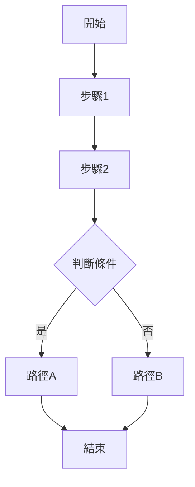

# __NAME__ - Server Analysis

---

## 1. 📝 核心摘要與依賴 (Core Summary & Dependencies)

### 1.1 📂 分析檔案資訊 (Analyzed Files)

| 檔案路徑 |
|---------|
| [待補充：被分析的原始檔案完整路徑] |

### 1.2 📦 依賴關係 (Dependencies)

| 類型 | 名稱 | 用途 | 檔案連結 |
|------|------|------|----------|
| Feature | [功能名稱] | [功能用途] | [分析文件連結] |
| API | [API名稱] | [API用途] | [分析文件連結] |
| Service | [服務名稱] | [服務用途] | [分析文件連結] |
| Request Pipeline | [管線元件] | [元件用途] | [分析文件連結] |

---

## 2. 📋 分析指引 (Analysis Guidelines)

**分析目標：**
分析後端請求處理函式的完整業務邏輯。專注：路由與參數、業務邏輯、服務調用、資料處理、依賴追蹤、效能與安全。

**核心規則：**
- 章節結構不變：禁止新增或刪除預設章節
- 來源檔案限定：只分析 1.1 節列出的檔案
- 依賴註記：未分析的依賴記錄在 1.2 節
- 程式碼真實性：禁止使用 `...` 省略或編造內容
- 品質清單不變：僅更新勾選狀態 `[ ]` -> `[x]`

---

## 3. 端點定義與路由 (Endpoint Definition & Routing)

### 3.1 處理函式定義 (Handler Definition)

**處理函式簽名**：
```js
// 概念性偽代碼
// [裝飾器/中介軟體，例如：授權、路由]
function [處理函式名稱](request, response) {
  // ... 函式實作 ...
}
```

**關鍵資訊**：
- **回傳型別**：[待補充：例如 View, JSON, XML, Redirection 等]
- **函式名稱**：[待補充]
- **參數列表**：[待補充：參數名稱、來源 (例如：request body, query params)、型別]

---

### 3.2 路由資訊 (Routing Information)

**路由配置**：
- **HTTP Method**：[待補充]
- **路由模式**：[待補充]
- **URL 範例**：[待補充：完整的 URL 範例]
- **查詢參數**：[待補充：QueryString 參數說明]

---

### 3.3 授權與中介軟體 (Authorization & Middleware)

[待補充：說明套用的裝飾器/中介軟體及其用途]

**套用的裝飾器/中介軟體：**
- `[Middleware/Decorator Name]` - [待補充]
- `[Middleware/Decorator Name (Order = N)]` - [待補充]

---

## 4. 業務邏輯分析 (Business Logic Analysis)

### 4.1 核心流程 (Core Flow)

[待補充：說明處理函式的主要業務邏輯步驟]

**執行步驟：**
1. [待補充]
2. [待補充]
3. [待補充]

**流程圖：**


---

### 4.2 服務調用 (Service Calls)

[待補充：說明調用的服務方法]

| 服務名稱 | 方法名稱 | 用途 | 參數 | 回傳值 |
|---------|---------|------|------|--------|
| [服務名] | [方法名] | [待補充] | [待補充] | [待補充] |

**範例程式碼：**
```js
// 取得會員資料
const member = memberService.getMember(memberId);

// 驗證權限
const hasPermission = authService.checkPermission(member.id, shop.id);
```

---

### 4.3 資料處理 (Data Processing)

[待補充：說明資料驗證、轉換、持久化邏輯]

**資料驗證：**
- [待補充]

**資料轉換：**
- [待補充]

**資料持久化：**
- [待補充]

---

### 4.4 視圖資料設定 (View Data Setup)

[待補充：說明傳遞給 View/Template 的資料]

**視圖資料：**
```js
view.setData({
  propertyName: value // [待補充]
});
```

---

## 5. 架構與品質分析 (Architecture & Quality Analysis)

### 5.1 錯誤處理 (Error Handling)
[待補充：異常處理策略、錯誤回應機制]

**異常類型**：
- `[ExceptionType]` - [待補充：處理方式]

**錯誤回應 (偽代碼)**：
```js
try {
  // 業務邏輯
} catch (error) {
  // 記錄錯誤日誌
  logger.error(error);
  // 回傳錯誤頁面或 JSON 回應
  response.status(500).render("ErrorView", { message: error.message });
}
```

---

### 5.2 安全性分析 (Security Analysis)
[待補充：安全性檢查項目]

**安全檢查清單**：
- [ ] 輸入驗證 (Input Validation)
- [ ] SQL 注入防護 (SQL Injection Prevention)
- [ ] XSS 防護 (Cross-Site Scripting Prevention)
- [ ] CSRF 防護 (Cross-Site Request Forgery Prevention)
- [ ] 授權檢查 (Authorization Check)
- [ ] 敏感資料處理 (Sensitive Data Handling)

**已知安全措施**：
- [待補充：已實作的安全機制]

**潛在風險**：
- [待補充：需要注意的安全風險]

---

### 5.3 相依性分析 (Dependency Analysis)
[待補充：此處理函式依賴的服務、元件、外部 API]

**注入的服務**：
- `serviceName` - [待補充：服務用途]

**外部 API 調用**：
- [待補充：第三方 API、內部微服務]

**資料庫存取**：
- [待補充：存取的資料表、Repository/ORM]

---

## 6. 📋 品質檢查清單 (Quality Checklist)

### ⭐ 基礎框架級 (Foundation Level)
- [ ] **1.1 📂 分析檔案資訊**：分析的檔案路徑已填寫。
- [ ] **3.1 處理函式定義**：處理函式簽名已提供。
- [ ] **3.2 路由資訊**：路由配置已填寫。

### ⭐⭐ 核心邏輯級 (Core Logic Level)
- [ ] **3.3 授權與中介軟體**：所有套用的裝飾器/中介軟體皆已列出並說明。
- [ ] **4.1 核心流程**：業務邏輯的執行步驟與 Mermaid 流程圖皆已完成。

### ⭐⭐⭐ 整合分析級 (Integration Analysis Level)
- [ ] **1.2 📦 依賴關係**：依賴關係表已初步填寫。
- [ ] **4.2 服務調用**：服務調用列表已完成。
- [ ] **4.3 資料處理**：資料驗證、轉換、持久化邏輯已說明。
- [ ] **4.4 視圖資料設定**：所有傳遞給視圖的資料皆已列出（如適用）。

### ⭐⭐⭐⭐ 架構品質級 (Architecture Quality Level)
- [ ] **5.1 錯誤處理**：異常處理策略和錯誤回應機制已說明。
- [ ] **5.2 安全性分析**：安全性檢查清單已完成評估。
- [ ] **5.3 相依性分析**：完整的相依性分析（注入服務、外部 API、資料庫存取）已完成。

### ⭐⭐⭐⭐⭐ 功能實作完整分析 (Full Implementation Analysis)
- [ ] **完整性**：文件內所有 `[待補充]` 標記皆已移除，並替換為基於原始碼的真實分析內容。
- [ ] **程式碼真實性**：所有程式碼片段皆為專案中的**實際程式碼**，**逐字複製**，無任何省略或編造。
- [ ] **流程圖真實性**：所有 Mermaid 圖表中的元素（函式名、類別名、流程步驟）皆能在原始碼中找到明確對應。
- [ ] **無推測性內容**：文件中所有分析內容皆基於**已提供的原始碼檔案**，無任何基於推測的內容。
- [ ] **依賴關係最終確認**：`1.2 📦 依賴關係` 表中的所有依賴項皆有對應的分析文件連結，且無懸空的依賴。
- [ ] **可驗證性**：所有分析結果皆可透過閱讀原始碼檔案進行驗證，無法驗證的內容必須明確標記為「推測」或「建議」。

---

> **🎯 分析品質**：⭐ 基礎框架  
> **📅 開始日期**：__CURRENT_DATE__  
> **📅 最後更新**：__CURRENT_DATE__  
