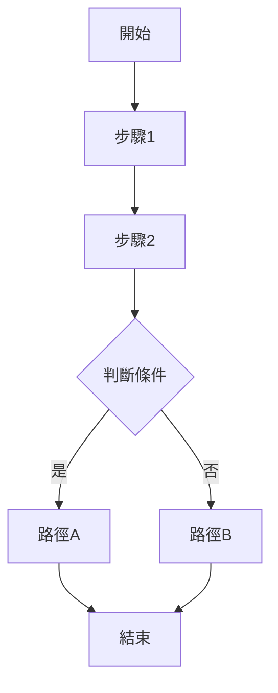

# __NAME__ - Server Analysis

> **🎯 分析品質**：⭐ 基礎框架  
> **📅 開始日期**：__CURRENT_DATE__  
> **📅 最後更新**：__CURRENT_DATE__  
> **🔗 相關文件**：[連結到 overview.md](./overview.md)

---

## 1. 📝 核心摘要與依賴 (Core Summary & Dependencies)

### 1.1 📂 分析檔案資訊 (Analyzed Files)

| 檔案路徑 |
|---------|
| [待補充：被分析的原始檔案完整路徑] |

### 1.2 📦 依賴關係 (Dependencies)

| 類型 | 名稱 | 用途 | 檔案連結 |
|------|------|------|----------|
| Feature | [功能名稱] | [功能用途] | [分析文件連結] |
| API | [API名稱] | [API用途] | [分析文件連結] |
| Service | [服務名稱] | [服務用途] | [分析文件連結] |
| Request Pipeline | [管線元件] | [元件用途] | [分析文件連結] |

---

## 2. 📋 分析指引 (Analysis Guidelines)

**此文件的分析目標：**

本文件用於分析**後端 Controller Action 的完整業務邏輯**，重點在於：

1. **路由與參數**：定義 HTTP Method、路由、參數綁定、過濾器 (Filters/Attributes)。
2. **業務邏輯**：分析 Action 方法從接收請求到返回回應的完整處理步驟。
3. **服務調用**：記錄所有對 Service Layer 的調用，了解其職責分離。
4. **資料處理**：分析資料驗證、轉換、以及與 View 的資料傳遞 (ViewBag/ViewData)。
5. **依賴追蹤**：追蹤 Action 依賴的所有 Service、Helper 等元件。
6. **效能與安全**：評估快取策略、資料庫查詢效率、安全防護措施。

**AI Agent 注意事項：**
- 此為後端 Controller Action 分析，專注於處理 HTTP 請求並回傳 View or a result。
- 必須用流程圖展示從接收請求到返回回應的完整邏輯，包含錯誤處理分支。
- 所有套用的屬性 (Attribute/Filter) 都必須說明其用途與執行順序。
- 所有依賴注入的服務都必須記錄到依賴關係表，並詳述每個依賴的用途。
- 必須附上關鍵業務邏輯的程式碼片段，並逐行註解說明。
- 資料流分析需包含從請求參數到服務調用，再到 `ViewBag/ViewData` 的完整過程。

---

## 3. 方法簽名與路由 (Method Signature & Routing)

### 3.1 方法定義 (Method Definition)
> **Phase 1**: 自動填充方法簽名  
> **Phase 2**: 補充詳細的參數說明和業務邏輯概述

[Phase 1 已填充：完整的方法簽名]

**完整方法簽名**：
```
[待補充：根據實際框架填充完整的方法定義，包含屬性/裝飾器]
```

**關鍵資訊**：
- **回傳型別**：[待補充：ActionResult / JsonResult / ViewResult 等]
- **方法名稱**：[待補充]
- **參數列表**：[待補充：參數名稱、型別、預設值]

---

### 3.2 路由資訊 (Routing Information)
> **Phase 1**: 自動填充 HTTP Method 和路由模式  
> **Phase 2**: 補充 URL 範例和查詢參數詳細說明

[Phase 1 已填充：HTTP Method 和路由模式]

**路由配置**：
- **HTTP Method**：[Phase 1 已填充]
- **路由模式**：[Phase 1 已填充]
- **URL 範例**：[Phase 2 待補充：完整的 URL 範例]
- **查詢參數**：[Phase 2 待補充：QueryString 參數說明]

---

### 3.3 授權與過濾器 (Authorization & Filters)
> **Phase 1**: 自動填充所有 Attribute  
> **Phase 2**: 補充每個 Attribute 的用途說明

[Phase 1 已填充：所有套用的 Attribute]

**套用的屬性**：
- `[AttributeName]` - [Phase 2 待補充：屬性用途說明]
- `[AttributeName(Order = N)]` - [Phase 2 待補充：執行順序與用途]

**範例**：
- `[RequireLoginGoLoginPage]` - 要求登入，未登入導向登入頁
- `[RequireReactTheme(Order = 2)]` - 要求 React 主題
- `[SetupLayoutArea(...)]` - 設定版面配置區域

---

## 4. 業務邏輯分析 (Business Logic Analysis)

### 4.1 核心流程 (Core Flow)
[待補充：此 Action 的主要業務邏輯步驟，使用流程圖或編號列表]

**執行步驟**：
1. [待補充：第一步]
2. [待補充：第二步]
3. [待補充：第三步]

**流程圖**（Mermaid）：


---

### 4.2 服務調用 (Service Calls)
[待補充：此 Action 調用的所有服務方法]

| 服務名稱 | 方法名稱 | 用途 | 參數 | 回傳值 |
|---------|---------|------|------|--------|
| [服務名] | [方法名] | [用途說明] | [參數列表] | [回傳型別] |

**範例**：
```csharp
// 取得會員資料
var member = _memberService.GetMember(memberId);

// 驗證權限
var hasPermission = _authService.CheckPermission(memberId, shopId);
```

---

### 4.3 資料處理 (Data Processing)
[待補充：資料驗證、轉換、持久化邏輯]

**資料驗證**：
- [待補充：輸入驗證規則]
- [待補充：業務規則驗證]

**資料轉換**：
- [待補充：資料映射、格式轉換]

**資料持久化**：
- [待補充：資料庫操作、快取更新]

---

### 4.4 ViewBag/ViewData 設定
[待補充：傳遞給 View 的資料]

```csharp
ViewBag.PropertyName = value;  // [待補充：用途說明]
```

---

## 5. 架構與品質分析 (Architecture & Quality Analysis)

### 5.1 錯誤處理 (Error Handling)
[待補充：異常處理策略、錯誤回應機制]

**異常類型**：
- `[ExceptionType]` - [待補充：處理方式]

**錯誤回應**：
```csharp
try
{
    // 業務邏輯
}
catch (SpecificException ex)
{
    // 錯誤處理
    Elmah.ErrorSignal.FromCurrentContext().Raise(ex);
    return View("ErrorView");
}
```

---

### 5.2 效能考量 (Performance Considerations)
[待補充：潛在的效能問題、優化建議]

**效能檢查清單**：
- [ ] 是否有 N+1 查詢問題？
- [ ] 是否有大量資料載入？
- [ ] 是否使用快取？
- [ ] 是否有非同步處理機會？

---

### 5.3 安全性分析 (Security Analysis)
[待補充：安全性檢查項目]

**安全檢查清單**：
- [ ] 輸入驗證 (Input Validation)
- [ ] SQL 注入防護 (SQL Injection Prevention)
- [ ] XSS 防護 (Cross-Site Scripting Prevention)
- [ ] CSRF 防護 (Cross-Site Request Forgery Prevention)
- [ ] 授權檢查 (Authorization Check)
- [ ] 敏感資料處理 (Sensitive Data Handling)

**已知安全措施**：
- [待補充：已實作的安全機制]

**潛在風險**：
- [待補充：需要注意的安全風險]

---

### 5.4 相依性分析 (Dependency Analysis)
[待補充：此 Action 依賴的服務、元件、外部 API]

**注入的服務**：
- `_serviceName` - [待補充：服務用途]

**外部 API 調用**：
- [待補充：第三方 API、內部微服務]

**資料庫存取**：
- [待補充：存取的資料表、Repository]

---

## 6. 📋 品質檢查清單 (Quality Checklist)

### ⭐ 基礎框架級 (Foundation Level)
- [ ] **1.1 📂 分析檔案資訊**：分析的檔案路徑已填寫。
- [ ] **3.1 方法定義**：完整的方法簽名已提供。
- [ ] **3.2 路由資訊**：路由配置（HTTP Method, 路由模式, URL 範例）已填寫。
- [ ] **3.3 授權與過濾器**：所有套用的屬性 (Attribute) 皆已列出並說明用途。

### ⭐⭐ 核心邏輯級 (Core Logic Level)
- [ ] **4.1 核心流程**：業務邏輯的執行步驟（列表）和 Mermaid 流程圖皆已完成。
- [ ] **4.3 資料處理**：資料驗證與轉換邏輯已說明。
- [ ] **4.4 ViewBag/ViewData 設定**：所有傳遞給 View 的資料皆已列出並說明用途（如適用）。

### ⭐⭐⭐ 整合分析級 (Integration Analysis Level)
- [ ] **1.2 📦 依賴關係**：依賴關係表已完整填寫。
- [ ] **4.2 服務調用**：所有調用的服務方法及其用途已列表說明。
- [ ] **5.4 相依性分析**：完整的相依性分析（注入的服務、外部 API、資料庫存取）已完成。

### ⭐⭐⭐⭐ 架構品質級 (Architecture Quality Level)
- [ ] **5.1 錯誤處理**：異常處理策略和錯誤回應機制已說明。
- [ ] **5.2 效能考量**：效能檢查清單已完成。
- [ ] **5.3 安全性分析**：安全性檢查清單已完成。

---

**當前品質等級**：⭐ 基礎框架

