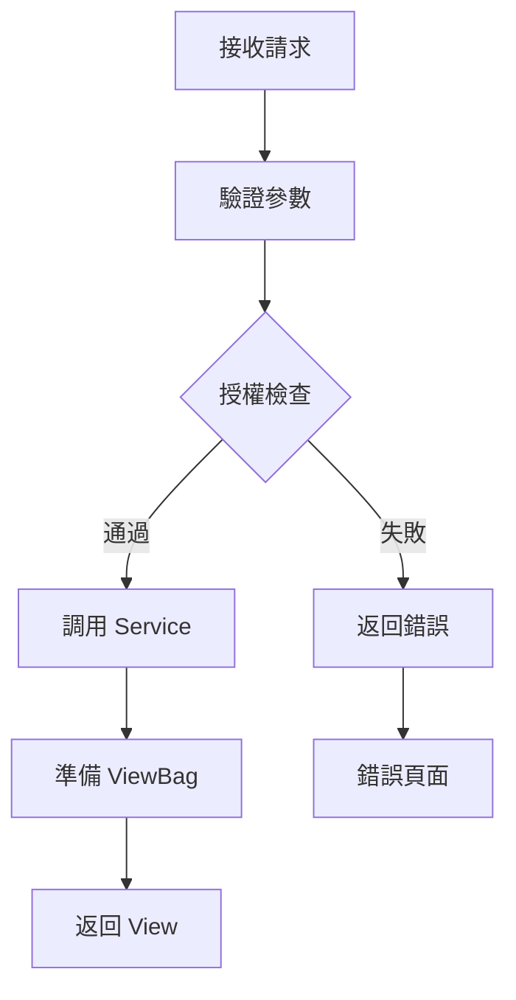

# __TOPIC_NAME__ - Server Analysis

> **🎯 分析品質**：⭐ 基礎框架 (0%)  
> **📅 開始日期**：__CURRENT_DATE__  
> **📅 最後更新**：__CURRENT_DATE__  
> **📊 分析階段**：📝 待分析  
> **🔗 相關文件**：[連結到 overview.md](./overview.md)

---

## 📂 分析檔案資訊

| 檔案路徑 |
|---------|
| [待補充：被分析的原始檔案完整路徑] |

---

## 📋 分析指引 (Analysis Guidelines)

**此文件的分析目標：**

本文件用於分析**後端 Controller 方法的頁面渲染邏輯**，重點在於：

1. **路由與授權**：記錄 HTTP 路由、方法簽名、套用的 Filter/Attribute
2. **頁面渲染流程**：分析如何準備 ViewBag/ViewData、組裝 View Model
3. **業務邏輯**：梳理從接收請求到返回 View 的完整流程
4. **服務調用**：追蹤所有依賴的 Service/Repository 並建立依賴關係表
5. **架構品質**：評估錯誤處理、效能、安全性

**AI Agent 注意事項：**
- 此為後端 Server-Side Rendering 分析，不是 API 端點分析
- 必須完整列出所有 ViewBag 設定，前端會依賴這些資料
- 所有調用的 Service 都必須記錄到依賴關係表，並確認是否已建立分析檔案
- 業務流程必須用條列 + Mermaid 圖表清楚說明

---

## 1. 方法簽名與路由 (Method Signature & Routing)

### 1.1 方法定義

**完整方法簽名：**
```csharp
[待補充：完整的方法定義，包含屬性/裝飾器]
public ActionResult MethodName(parameters)
{
    // ...
}
```

**關鍵資訊：**
- **回傳型別**：[待補充：ActionResult / JsonResult / ViewResult 等]
- **方法名稱**：[待補充]
- **參數列表**：[待補充：參數名稱、型別、預設值]

---

### 1.2 路由資訊

**路由配置：**
- **HTTP Method**：GET / POST / PUT / DELETE
- **路由模式**：`/Controller/Action/{id?}`
- **URL 範例**：`/VipMember/Index?shopId=123`
- **查詢參數**：[待補充：QueryString 參數說明]

---

### 1.3 授權與過濾器

**套用的屬性：**
- `[AttributeName]` - [待補充：屬性用途說明]
- `[AttributeName(Order = N)]` - [待補充：執行順序與用途]

**範例：**
```csharp
[RequireLoginGoLoginPage]
[RequireReactTheme(Order = 2)]
[SetupLayoutArea(...)]
```

---

## 2. 頁面渲染邏輯 (Page Rendering Logic)

### 2.1 ViewBag/ViewData 設定

**傳遞給 View 的資料：**

```csharp
ViewBag.PropertyName = value;  // [待補充：用途說明]
ViewData["Key"] = value;       // [待補充：用途說明]
```

**資料清單：**
- `ViewBag.PageTitle` - [待補充]
- `ViewBag.InitialData` - [待補充]

---

### 2.2 View 模型準備

**模型結構：**
```csharp
// [待補充：View Model 定義]
public class ViewModel
{
    // Properties
}
```

---

## 3. 業務邏輯分析 (Business Logic Analysis)

### 3.1 核心流程

**執行步驟：**
1. **參數驗證**：[描述驗證邏輯]
2. **權限檢查**：[描述權限驗證]
3. **資料載入**：[描述資料來源]
4. **業務處理**：[描述核心邏輯]
5. **View 渲染**：[描述渲染過程]

**流程圖：**


**關鍵決策點：**
- **決策1**：[描述條件與影響]
- **決策2**：[描述條件與影響]

---

### 3.2 服務調用

**調用的服務方法：**

| 服務名稱 | 方法名稱 | 用途 | 參數 | 回傳值 |
|---------|---------|------|------|--------|
| [服務名稱] | [方法名稱] | [用途說明] | [參數列表] | [回傳型別] |

**程式碼範例：**
```csharp
// 取得會員資料
var member = _memberService.GetMember(memberId);

// 驗證權限
var hasPermission = _authService.CheckPermission(memberId, shopId);
```

---

### 3.3 資料處理

**資料驗證：**
- [待補充：輸入驗證規則]
- [待補充：業務規則驗證]

**資料轉換：**
```csharp
// [待補充：資料映射、格式轉換範例]
var viewModel = Mapper.Map<ViewModel>(entity);
```

---

## 4. 📦 依賴關係 (Dependencies)

| 類型 | 名稱 | 用途 | 檔案連結 |
|------|------|------|----------|
| Service | [服務名稱] | [服務用途] | [分析文件連結] |
| Repository | [Repository名稱] | [資料存取用途] | [分析文件連結] |
| Helper | [工具名稱] | [工具用途] | [分析文件連結] |

**說明：** 此表格追蹤本 Controller 方法依賴的所有外部服務與元件。

---

## 5. 架構與品質分析 (Architecture & Quality Analysis)

### 5.1 錯誤處理

**異常處理策略：**
```csharp
try
{
    // 業務邏輯
}
catch (SpecificException ex)
{
    // 錯誤處理
    Elmah.ErrorSignal.FromCurrentContext().Raise(ex);
    return View("ErrorView");
}
```

**錯誤類型：**
- `[ExceptionType]` - [待補充：處理方式]

---

### 5.2 效能考量

**效能檢查清單：**
- [ ] 是否有 N+1 查詢問題？
- [ ] 是否有大量資料載入？
- [ ] 是否使用快取？
- [ ] 是否有非同步處理機會？

**優化建議：**
- [待補充：具體的優化方案]

---

### 5.3 安全性分析

**安全檢查清單：**
- [ ] 輸入驗證 (Input Validation)
- [ ] SQL 注入防護 (SQL Injection Prevention)
- [ ] XSS 防護 (Cross-Site Scripting Prevention)
- [ ] CSRF 防護 (Cross-Site Request Forgery Prevention)
- [ ] 授權檢查 (Authorization Check)
- [ ] 敏感資料處理 (Sensitive Data Handling)

**已知安全措施：**
- [待補充：已實作的安全機制]

---

## 6. 📋 品質檢查清單 (Quality Checklist)

### ⭐ 基礎框架 (1-40%)
- [ ] 文件元數據完整（日期、品質等級）
- [ ] 方法簽名完整
- [ ] 路由資訊明確
- [ ] 授權屬性列出

### ⭐⭐⭐ 邏輯完成 (41-70%)
- [ ] 核心流程描述完整（至少 3 步）
- [ ] 流程圖已繪製
- [ ] ViewBag 設定已列出
- [ ] 服務調用已分析

### ⭐⭐⭐⭐ 架構完整 (71-90%)
- [ ] **依賴關係表已完成**
- [ ] **所有依賴項都已建立分析檔案**
- [ ] 錯誤處理策略已說明
- [ ] 效能檢查清單已完成
- [ ] 安全性檢查清單已完成

### ⭐⭐⭐⭐⭐ 完整分析 (91-100%)
- [ ] 最佳實踐建議已提供
- [ ] 效能優化方案具體
- [ ] 安全風險已識別
- [ ] 重構建議已提出

---

**當前品質等級**：⭐ 基礎框架 (0%)

