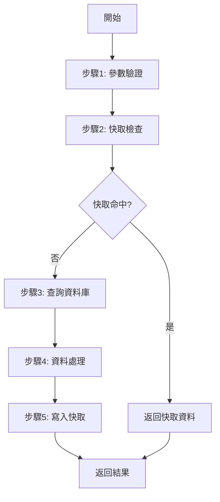

# __NAME__ - Service Method Analysis
> **🎯 分析品質**：⭐ 基礎框架 (0%)
> **📅 開始日期**：__CURRENT_DATE__
> **📅 最後更新**：__CURRENT_DATE__
> **📊 分析階段**：📝 待分析
> **🔗 相關文件**：[連結到 overview.md](./overview.md)

---

## 1. 📝 核心摘要與依賴 (Core Summary & Dependencies)

### 1.1 📂 分析檔案資訊 (Analyzed Files)
| 檔案路徑 |
|---------|
| [待補充：被分析的原始檔案完整路徑] |

### 1.2 📦 依賴關係 (Dependencies)
| 類型 | 名稱 | 用途 | 檔案連結 |
|------|------|------|----------|
| Service | [服務名稱] | [服務用途] | [分析文件連結] |
| Repository | [Repository名稱] | [資料存取用途] | [分析文件連結] |
| Helper | [工具名稱] | [工具用途] | [分析文件連結] |

**說明：** 此表格追蹤本 Service 方法依賴的所有外部服務與工具。

---

## 2. 📋 分析指引 (Analysis Guidelines)
**此文件的分析目標：**
本文件用於分析**後端 Service 層方法的具體實作**，重點在於：

1.  **業務邏輯**：深入分析核心業務流程、演算法與資料處理步驟。
2.  **資料存取**：記錄所有對 Repository 或其他資料來源的調用。
3.  **服務協作**：分析如何調用其他 Service 以完成複雜的業務流程。
4.  **快取策略**：詳細記錄快取的使用、Key 的管理與更新策略。
5.  **依賴追蹤**：追蹤所有依賴，建立完整的依賴關係表。

---

## 3. 方法簽名與介面 (Method Signature & Interface)

### 3.1 方法定義 (Method Definition)
**完整方法簽名**：
```
[待補充：根據實際程式語言填充完整的方法定義]
```
**關鍵資訊**：
- **回傳型別**：[待補充：完整的回傳型別]
- **方法名稱**：[待補充]
- **參數列表**：[待補充：參數名稱、型別、預設值、用途]
- **存取修飾詞**：[待補充：public / private / protected]

---

### 3.2 服務類別資訊 (Service Class Information)
**服務類別**：
- **命名空間/模組**：[待補充]
- **類別名稱**：[待補充]
- **實作介面**：[待補充]

**服務職責**：
- [待補充：此服務的核心職責]

---

### 3.3 相依注入 (Dependency Injection)
**建構函式簽名**：
```
[待補充：建構函式與依賴注入列表]
```
**依賴清單**：
- `_serviceName` - [待補充：服務用途與職責]

---

## 4. 業務邏輯分析 (Business Logic Analysis)

### 4.1 核心流程 (Core Flow)
**執行步驟**：
1. [待補充：第一步]
2. [待補充：第二步]
3. [待補充：第三步]

**流程圖**（Mermaid）：


---

### 4.2 資料存取層調用 (Data Access Layer Calls)
| Repository | 方法名稱 | 用途 | 查詢條件 | 回傳值 |
|-----------|---------|------|---------|--------|
| [Repository名] | [方法名] | [用途說明] | [查詢條件] | [回傳型別] |

---

### 4.3 其他服務調用 (Service Calls)
| 服務名稱 | 方法名稱 | 用途 | 參數 | 回傳值 |
|---------|---------|------|------|--------|
| [服務名] | [方法名] | [用途說明] | [參數列表] | [回傳型別] |

---

### 4.4 資料處理與轉換 (Data Processing & Transformation)
**資料驗證**：
- [待補充：輸入驗證規則]
- [待補充：業務規則驗證]
**資料轉換**：
```
// [待補充：資料映射、格式轉換範例]
```

---

## 5. 快取策略分析 (Caching Strategy Analysis)

### 5.1 快取機制 (Cache Mechanism)
**快取類型**：
- [ ] Memory Cache (記憶體快取)
- [ ] Redis Cache (分散式快取)
- [ ] 無快取

**快取策略**：
- **快取 Key 格式**：[待補充]
- **過期時間**：[待補充：秒數]
- **更新策略**：[待補充：主動更新 / 被動失效]

---

## 6. 架構與品質分析 (Architecture & Quality Analysis)

### 6.1 錯誤處理 (Error Handling)
**異常類型**：
- `[ExceptionType]` - [待補充：處理方式]
**錯誤日誌**：
- [待補充：日誌記錄策略]

---

### 6.2 相依性分析 (Dependency Analysis)
**內部依賴**：
- **Repository**: [列出所有使用的 Repository]
- **Service**: [列出所有調用的 Service]
**外部依賴**：
- **外部 API**: [列出調用的外部 API]
**資料庫存取**：
- **資料表**: [列出存取的資料表]

---

## 7. 📋 品質檢查清單 (Quality Checklist)

### ⭐ 基礎框架 (1-40%)
- [ ] 文件元數據完整
- [ ] 方法簽名完整
- [ ] 服務類別資訊已定義

### ⭐⭐⭐ 邏輯完成 (41-70%)
- [ ] 核心流程圖已繪製
- [ ] 資料處理邏輯已說明
- [ ] 資料存取層調用已列出
- [ ] 其他服務調用已列出

### ⭐⭐⭐⭐ 架構完整 (71-90%)
- [ ] **依賴關係表已完成**
- [ ] **所有依賴項都已建立分析檔案**
- [ ] 快取策略已分析
- [ ] 錯誤處理策略已說明

### ⭐⭐⭐⭐⭐ 完整分析 (91-100%)
- [ ] 完整的相依性分析
- [ ] 提供具體程式碼範例
- [ ] 包含最佳實踐與設計原則

---
**當前品質等級**：⭐ 基礎框架 (0%)
