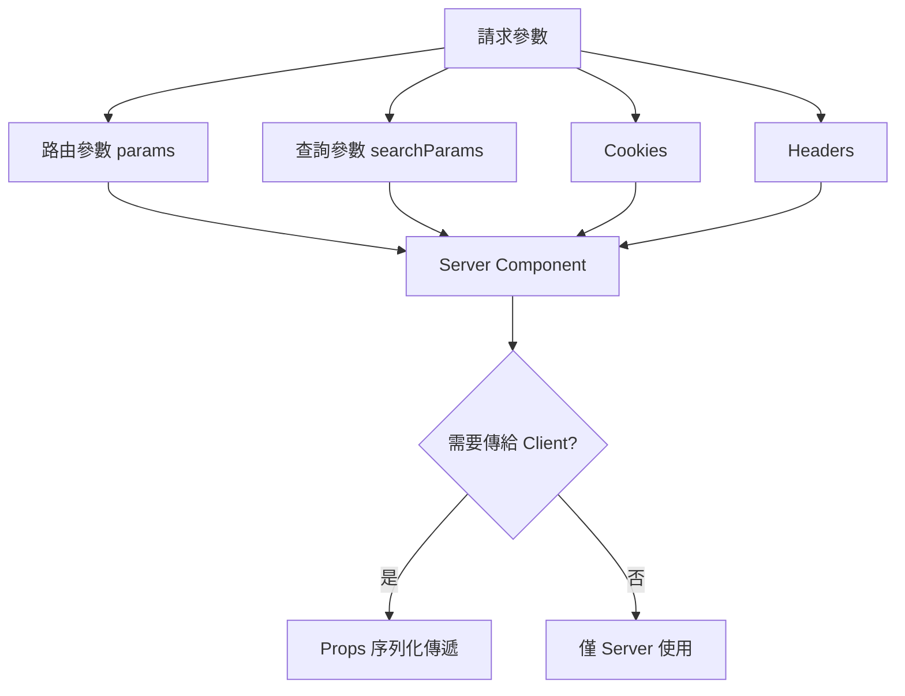
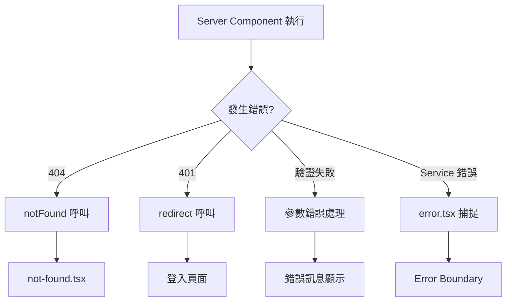
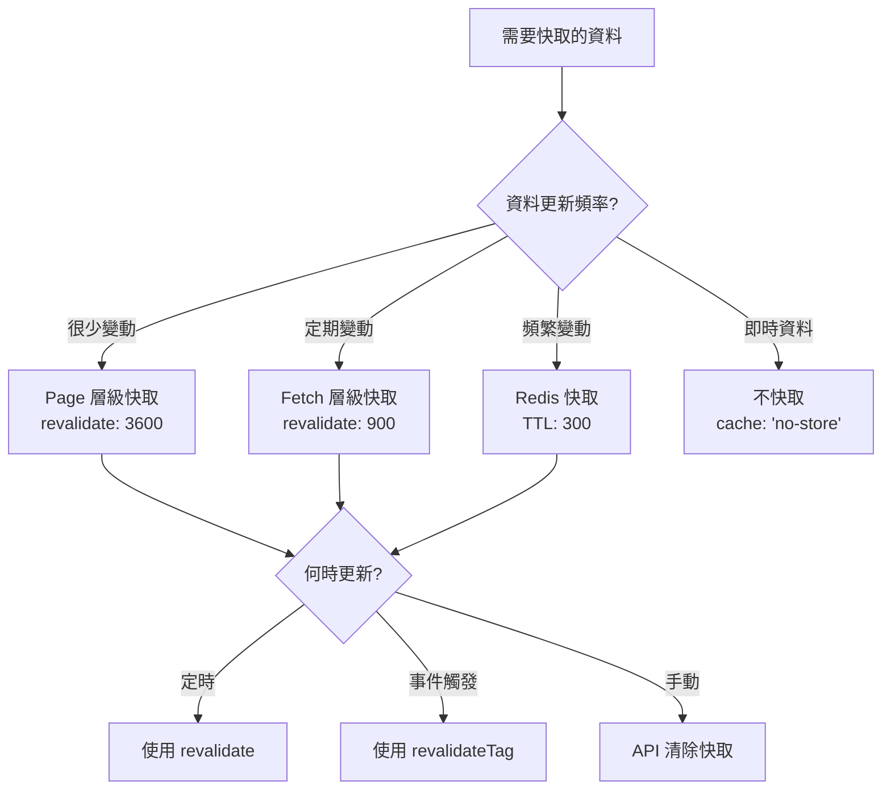

# [頁面名稱] 架構重構指引

> **專案目標**：[說明重構目標，例如：將舊有 AngularJS + ASP.NET MVC 商品頁，重構為基於 Next.js 15 App Router 的現代化 Web 應用]  
> **重構原則**：[說明重構範圍和限制，例如：純前端重構、後端透過 BFF 層提供 API、最大化利用 Server Components 提升效能]  
> **本機開發**：[說明本地開發環境配置，例如：`pnpm dev` 啟動 Next.js 應用，API 請求代理至 BFF]

---

## 1. 技術棧（依照專案規範）

### Frontend
- **框架**: Next.js 15 (App Router), React 18+
- **語言**: TypeScript 5+
- **樣式方案**: Tailwind CSS
- **狀態管理**:
  - **Server State**: SWR (用於 Client Components 資料獲取)
  - **Client State**: Zustand (用於全域 UI 狀態)
- **表單處理**: React Hook Form + Zod
- **測試框架**: Vitest, React Testing Library

---

## 2. Next.js App Router 檔案系統架構

### 2.1 專案根目錄結構

```
apps/frontend/
├── app/                                # 🌍 頁面
├── assets/                             # 🌍 全域靜態資源 (圖片, 字體)
├── components/                         # 🌍 共用元件
├── config/                             # 🌍 全域設定檔
├── constants/                          # 🌍 全域常數
├── hooks/                              # 🌍 全域共用 Hooks
├── lib/                                # 🌍 函式庫與第三方服務整合
├── providers/                          # 🌍 全域 Context Providers
├── services/                           # 🌍 全域 API 請求層
├── store/                              # 🌍 全域狀態管理 (Zustand)
├── styles/                             # 🌍 全域樣式
├── types/                              # 🌍 全域 TypeScript 型別
├── utils/                              # 🌍 全域工具函式
└── ...
```

### 2.2 Next.js 特殊檔案說明

#### `middleware.ts` (根目錄、頁面目錄)
**使用時機**：
- ✅ 需要在請求到達頁面前進行處理（驗證、重導向、國際化）
- ✅ 需要根據請求路徑執行條件邏輯
- ✅ 需要修改請求或回應標頭
- ✅ 需要實作 A/B Testing 或功能開關

**常見用途**：
```typescript
// middleware.ts
import { NextResponse } from 'next/server';
import type { NextRequest } from 'next/server';

export function middleware(request: NextRequest) {
  // 使用案例 1: 驗證檢查
  const token = request.cookies.get('auth-token');
  if (!token && request.nextUrl.pathname.startsWith('/dashboard')) {
    return NextResponse.redirect(new URL('/login', request.url));
  }

  // 使用案例 2: 國際化語言偵測
  const locale = request.cookies.get('NEXT_LOCALE')?.value || 'zh-TW';
  
  // 使用案例 3: 自訂 Header
  const response = NextResponse.next();
  response.headers.set('x-custom-header', 'value');
  
  return response;
}

// 設定要執行 middleware 的路徑
export const config = {
  matcher: [
    '/((?!api|_next/static|_next/image|favicon.ico).*)',
  ],
};
```

#### `instrumentation.ts` (根目錄)
**使用時機**：
- ✅ 需要在伺服器啟動時初始化監控工具（Sentry, DataDog）
- ✅ 需要註冊全域錯誤處理器
- ✅ 需要設定效能監控

```typescript
// instrumentation.ts
export async function register() {
  if (process.env.NEXT_RUNTIME === 'nodejs') {
    // 初始化 Sentry, DataDog 等監控工具
    await import('./lib/monitoring');
  }
}
```

---

## 3. App Router 路由結構與檔案命名規範

### 3.1 路由資料夾結構（Colocation 原則）

> **核心原則**：將頁面專用的程式碼（Components, Hooks, Types, Utils）放在該頁面的路由資料夾下。只有跨頁面共用的模組才提升到根目錄。

```
app/
├── (public)/                           # 📂 路由群組：公開頁面（不影響 URL）
│   ├── page.tsx                        # 🏠 首頁：/
│   ├── about/
│   │   └── page.tsx                    # 🏠 關於頁面：/about
│   └── contact/
│       └── page.tsx                    # 🏠 聯絡頁面：/contact
│
├── (auth)/                             # 📂 路由群組：認證相關頁面
│   ├── login/
│   │   ├── page.tsx                    # 🏠 登入頁面：/login
│   │   ├── loading.tsx                 # ⏳ Loading UI
│   │   └── components/
│   │       └── LoginForm.tsx           # 🧩 頁面專用元件
│   └── register/
│       └── page.tsx                    # 🏠 註冊頁面：/register
│
├── (shop)/                             # 📂 路由群組：商店相關頁面
│   ├── layout.tsx                      # 🎨 商店共用佈局
│   ├── products/
│   │   ├── page.tsx                    # 🏠 商品列表：/products
│   │   ├── loading.tsx                 # ⏳ Loading UI
│   │   ├── error.tsx                   # ❌ Error Boundary
│   │   └── [id]/                       # 🔗 動態路由：/products/:id
│   │       ├── page.tsx                # 🏠 商品詳情頁
│   │       ├── loading.tsx             # ⏳ Loading UI
│   │       ├── error.tsx               # ❌ Error Boundary
│   │       ├── not-found.tsx           # 🚫 404 頁面
│   │       ├── components/             # 📁 頁面專用元件
│   │       │   ├── ProductGallery.tsx  # 🧩 Server Component
│   │       │   ├── ProductInfo.tsx     # 🧩 Server Component
│   │       │   ├── AddToCartButton.tsx # 🧩 Client Component
│   │       │   └── ReviewSection.tsx   # 🧩 Client Component
│   │       ├── hooks/                  # 📁 頁面專用 Hooks
│   │       │   ├── useProductData.ts   # 🪝 SWR Data Hook
│   │       │   └── useAddToCart.ts     # 🪝 Business Logic Hook
│   │       ├── types/                  # 📁 頁面專用型別
│   │       │   ├── index.ts            # 📄 主要型別匯出
│   │       │   ├── api.types.ts        # 📄 API 回應型別
│   │       │   └── ui.types.ts         # 📄 UI Props 型別
│   │       └── utils/                  # 📁 頁面專用工具函式
│   │           └── price-calculator.ts # 🛠️ 價格計算邏輯
│   └── cart/
│       └── page.tsx                    # 🏠 購物車頁面：/cart
│
├── api/                                # 📂 API Routes (BFF Layer)
│   ├── products/
│   │   ├── route.ts                    # 🔌 GET /api/products
│   │   └── [id]/
│   │       ├── route.ts                # 🔌 GET /api/products/:id
│   │       └── reviews/
│   │           └── route.ts            # 🔌 GET /api/products/:id/reviews
│   └── cart/
│       ├── route.ts                    # 🔌 GET/POST /api/cart
│       └── [id]/
│           └── route.ts                # 🔌 PUT/DELETE /api/cart/:id
│
├── layout.tsx                          # 🎨 根佈局（全站共用）
├── loading.tsx                         # ⏳ 根 Loading UI
├── error.tsx                           # ❌ 根 Error Boundary
├── not-found.tsx                       # 🚫 全站 404 頁面
└── global-error.tsx                    # ❌ 全域錯誤處理（包含 layout 錯誤）
```

### 3.2 Next.js 特殊檔案（按優先順序）

| 檔案名稱 | 類型 | 用途 | 何時使用 |
|---------|------|------|---------|
| `layout.tsx` | Server Component | 定義頁面佈局（Header, Footer, Sidebar） | ✅ **必要**：每個路由層級至少需要一個 `layout.tsx` |
| `page.tsx` | Server/Client Component | 定義頁面主要內容 | ✅ **必要**：定義路由的實際頁面 |
| `loading.tsx` | Server Component | 定義 Suspense Loading UI | ✅ **必要**：提升使用者體驗 |
| `error.tsx` | Client Component | 定義 Error Boundary | ✅ **必要**：優雅處理錯誤 |
| `not-found.tsx` | Server Component | 定義 404 頁面 | 🔹 **推薦**：資源不存在時顯示 |
| `template.tsx` | Server Component | 類似 layout，但每次導航都重新掛載 | 🔹 **可選**：需要每次重置狀態時使用 |
| `default.tsx` | Server Component | Parallel Routes 的預設頁面 | 🔹 **可選**：使用平行路由時需要 |
| `route.ts` | API Route | 定義 API 端點 | ✅ **必要**：建立 BFF API 時使用 |

### 3.3 檔案命名規範

#### ✅ **必須遵守的命名規則**

| 類型 | 命名規範 | 範例 | 說明 |
|------|---------|------|------|
| **Page 元件** | `page.tsx` | `app/products/page.tsx` | Next.js 保留檔名，不可更改 |
| **Layout 元件** | `layout.tsx` | `app/products/layout.tsx` | Next.js 保留檔名，不可更改 |
| **Loading UI** | `loading.tsx` | `app/products/loading.tsx` | Next.js 保留檔名，不可更改 |
| **Error Boundary** | `error.tsx` | `app/products/error.tsx` | Next.js 保留檔名，不可更改 |
| **Not Found** | `not-found.tsx` | `app/products/not-found.tsx` | Next.js 保留檔名，不可更改 |
| **API Route** | `route.ts` | `app/api/products/route.ts` | Next.js 保留檔名，不可更改 |

#### ✅ **自定義檔案命名規範**

| 類型 | 命名規範 | 範例 | 說明 |
|------|---------|------|------|
| **React 元件** | PascalCase | `ProductCard.tsx`<br>`AddToCartButton.tsx` | 元件名稱與檔案名稱一致 |
| **Hooks** | camelCase | `useProductData.ts`<br>`useAddToCart.ts` | 必須以 `use` 開頭 |
| **Utils** | kebab-case | `price-calculator.ts`<br>`date-formatter.ts` | 使用連字號分隔 |
| **Types** | kebab-case | `product.types.ts`<br>`api.types.ts` | 使用 `.types.ts` 後綴 |
| **Constants** | kebab-case | `api-endpoints.ts`<br>`error-messages.ts` | 使用 `.constants.ts` 或直接 `.ts` |
| **Services** | kebab-case | `product.service.ts`<br>`auth.service.ts` | 使用 `.service.ts` 後綴 |
| **Stores (Zustand)** | kebab-case | `cart.store.ts`<br>`user.store.ts` | 使用 `.store.ts` 後綴 |

---

## 3.3 Next.js 特殊檔案的資料流向

> **填寫說明**：說明 Next.js 特殊檔案（middleware, instrumentation）在請求生命週期中的執行時機與資料流向。

### 📋 需要說明的內容

#### 1. **完整請求生命週期圖** (Mermaid Sequence Diagram)

**目的**：讓開發者理解從請求到響應的完整流程

**必須涵蓋的階段**：
```markdown
```mermaid
sequenceDiagram
    participant Browser
    participant Middleware
    participant Page as page.tsx
    participant Layout
    participant Service
    participant Cache
    participant DB

    Note: 請補充完整的 Server-Side 請求流程
    Browser->>Middleware: [填寫] 請求路徑
    Middleware->>Page: [填寫] 授權檢查後
    Page->>Service: [填寫] 資料取得
    Service->>Cache: [填寫] 快取檢查
    Cache->>DB: [填寫] 快取未命中
    ...
```
```

**必須說明的關鍵節點**：
- ⏱️ Middleware 執行時機（授權、參數驗證、重導向）
- 🔄 generateMetadata 執行順序（優先於 page.tsx）
- 📊 Server Component 資料獲取（並行 vs 循序）
- 🎨 Layout 包裹時機
- 💾 快取命中 vs 未命中的路徑
- 🚀 Hydration 階段

---

#### 2. **參數傳遞機制流程圖** (Mermaid Flow Chart)

**目的**：說明參數如何在 Server/Client 之間傳遞

**必須涵蓋的傳遞方式**：
```markdown

```

**必須說明的場景**：
- 路由參數：`/salepage/[id]` → `params.id`
- 查詢參數：`?cid=123&r=t` → `searchParams`
- Cookie 傳遞：使用者狀態、語系設定
- Header 傳遞：User-Agent、授權 Token
- Props 序列化：Server → Client 的資料傳遞限制

---

#### 3. **錯誤處理流程圖** (Mermaid Flow Chart)

**目的**：說明不同錯誤類型的處理路徑

**必須涵蓋的錯誤類型**：
```markdown

```

**必須說明的處理方式**：
- `notFound()` 觸發時機
- `redirect()` 使用場景
- `error.tsx` Error Boundary 範圍
- `global-error.tsx` 全域錯誤處理
- 錯誤日誌記錄策略

---

## 4. 程式碼分類與檔案配置原則

### 4.1 什麼程式碼應該寫在哪個資料夾？

#### 📁 `app/[route]/` - 路由專用程式碼

**放置規則**：
- ✅ **該頁面獨有**的元件、Hooks、Types、Utils
- ✅ **不會被其他頁面使用**的程式碼
- ❌ 不要放置會被多個頁面共用的程式碼

**範例**：
```typescript
// ✅ 正確：放在 app/products/[id]/components/
'use client';
export function AddToCartButton() {
  // 商品詳情頁專用的加入購物車按鈕
}

// ❌ 錯誤：應該移到 components/ 根目錄
'use client';
export function Button() {
  // 通用按鈕元件應該放在全域
}
```

#### 📁 `components/` - 全域共用元件

**放置規則**：
- ✅ **被 2 個以上頁面使用**的元件
- ✅ 基礎 UI 元件（Button, Input, Modal 等）
- ✅ 佈局元件（Header, Footer, Sidebar 等）

**資料夾結構**：
```
components/
├── ui/                    # shadcn/ui 或基礎 UI 元件
│   ├── button.tsx
│   ├── input.tsx
│   └── modal.tsx
├── layout/                # 佈局元件
│   ├── Header.tsx
│   ├── Footer.tsx
│   └── Sidebar.tsx
└── features/              # 功能性元件（跨頁面）
    ├── SearchBar.tsx
    ├── UserMenu.tsx
    └── NotificationBell.tsx
```

#### 📁 `services/` - 伺服器端 API 邏輯

**放置規則**：
- ✅ **僅在伺服器端執行**的程式碼（使用 `import 'server-only'`）
- ✅ 與下游 API 通訊的邏輯
- ✅ 資料聚合與轉換邏輯
- ❌ **不可**在 Client Components 中使用

**檔案命名**：`[module].service.ts`

**範例**：
```typescript
// services/product.service.ts
import 'server-only'; // 確保僅在伺服器端執行

export async function getProductById(id: string) {
  const response = await fetch(`https://api.example.com/products/${id}`);
  return response.json();
}
```

#### 📁 `lib/` - 函式庫與第三方整合

**放置規則**：
- ✅ 第三方函式庫的配置（axios, swr, zustand）
- ✅ 工具函式的封裝（API Client, Logger）
- ✅ 可在客戶端和伺服器端共用的邏輯

**資料夾結構**：
```
lib/
├── api-client.ts          # Axios 或 Fetch 封裝
├── swr-config.ts          # SWR 全域配置
├── monitoring.ts          # Sentry, DataDog 初始化
└── db.ts                  # 資料庫連線（僅伺服器端）
```

#### 📁 `hooks/` - 全域共用 Hooks

**放置規則**：
- ✅ **被 2 個以上頁面使用**的 Hooks
- ✅ 通用的業務邏輯 Hook（useDebounce, useIntersectionObserver）
- ❌ 頁面專用的 Hooks 應該放在 `app/[route]/hooks/`

**資料夾結構**：
```
hooks/
├── api/                   # 資料獲取 Hooks (SWR)
│   ├── useProducts.ts
│   └── useUser.ts
└── common/                # 通用 Hooks
    ├── useDebounce.ts
    ├── useMediaQuery.ts
    └── useLocalStorage.ts
```

#### 📁 `store/` - 全域狀態管理

**放置規則**：
- ✅ **跨多個頁面共享**的狀態（購物車、使用者資訊）
- ✅ 使用 Zustand 管理的全域狀態
- ❌ 單一頁面的狀態應該使用 `useState` 或放在頁面專用的 store

**檔案命名**：`[feature].store.ts`

**範例**：
```typescript
// store/cart.store.ts
import { create } from 'zustand';

interface CartState {
  items: CartItem[];
  addItem: (item: CartItem) => void;
  removeItem: (id: string) => void;
}

export const useCartStore = create<CartState>((set) => ({
  items: [],
  addItem: (item) => set((state) => ({ items: [...state.items, item] })),
  removeItem: (id) => set((state) => ({ items: state.items.filter(i => i.id !== id) })),
}));
```

#### 📁 `types/` - 全域型別定義

**放置規則**：
- ✅ **跨多個模組使用**的型別
- ✅ API 回應的通用型別
- ✅ 業務領域模型（User, Product, Order）
- ❌ 頁面專用型別應該放在 `app/[route]/types/`

**檔案命名**：`[module].types.ts` 或 `index.ts`

#### 📁 `utils/` - 全域工具函式

**放置規則**：
- ✅ **純函式**（無副作用）
- ✅ **跨多個模組使用**的工具函式
- ✅ 資料格式化、驗證、轉換等邏輯

**範例**：
```typescript
// utils/format.ts
export function formatCurrency(amount: number): string {
  return new Intl.NumberFormat('zh-TW', {
    style: 'currency',
    currency: 'TWD',
  }).format(amount);
}
```

#### 📁 `constants/` - 全域常數

**放置規則**：
- ✅ **不會改變的值**（API Endpoints, 錯誤訊息, 設定值）
- ✅ 使用 `as const` 確保型別安全

**範例**：
```typescript
// constants/api-endpoints.ts
export const API_ENDPOINTS = {
  PRODUCTS: '/api/products',
  CART: '/api/cart',
  USER: '/api/user',
} as const;
```

---

## 5. Server Components vs Client Components 決策樹

### 5.1 使用 Server Component 的情況

✅ **何時使用 Server Component**（預設選項）：
- 純展示資料，無需互動
- 需要直接存取後端資源（資料庫、檔案系統）
- 需要保護敏感資料（API Keys、Token）
- 大型相依套件（減少客戶端 Bundle Size）
- SEO 需求（內容需要被搜尋引擎索引）

**範例**：
```typescript
// app/products/[id]/components/ProductInfo.tsx
// ✅ Server Component（預設）
export async function ProductInfo({ productId }: { productId: string }) {
  const product = await getProductById(productId); // 直接呼叫 Service
  
  return (
    <div>
      <h1>{product.name}</h1>
      <p>{product.description}</p>
    </div>
  );
}
```

### 5.2 使用 Client Component 的情況

✅ **何時使用 Client Component**（加上 `'use client'`）：
- 需要使用者互動（onClick, onChange）
- 需要使用 React Hooks（useState, useEffect, useContext）
- 需要使用瀏覽器 API（localStorage, window, document）
- 需要使用第三方 UI 函式庫（需要客戶端 JS）

**範例**：
```typescript
// app/products/[id]/components/AddToCartButton.tsx
'use client'; // ✅ 明確標記為 Client Component

import { useState } from 'react';

export function AddToCartButton({ productId }: { productId: string }) {
  const [isAdding, setIsAdding] = useState(false);
  
  const handleClick = async () => {
    setIsAdding(true);
    await addToCart(productId);
    setIsAdding(false);
  };
  
  return (
    <button onClick={handleClick} disabled={isAdding}>
      {isAdding ? '加入中...' : '加入購物車'}
    </button>
  );
}
```

### 5.3 混合使用模式（推薦）

✅ **最佳實踐**：將 Client Component 推到元件樹的葉節點
```typescript
// ✅ 正確：Server Component 包含 Client Component
// app/products/[id]/page.tsx
import { ProductInfo } from './components/ProductInfo'; // Server Component
import { AddToCartButton } from './components/AddToCartButton'; // Client Component

export default async function ProductPage({ params }: { params: { id: string } }) {
  const product = await getProductById(params.id);
  
  return (
    <div>
      {/* Server Component：純展示 */}
      <ProductInfo product={product} />
      
      {/* Client Component：需要互動 */}
      <AddToCartButton productId={product.id} />
    </div>
  );
}
```

---

## 5.4 Middleware 使用場景指引

> **填寫說明**：說明哪些功能應該放在 Middleware，哪些應該放在 Page。

### 📋 Middleware 適用場景檢查表

#### ✅ **應該在 Middleware 處理的場景**

| 功能類型 | 範例 | 原因 |
|---------|------|------|
| **授權檢查** | [填寫] 檢查是否登入、檢查 Token 是否有效 | 在請求到達頁面前攔截，避免不必要的渲染 |
| **參數驗證** | [填寫] 驗證路由參數格式、檢查必填參數 | 提早返回錯誤，節省資源 |
| **重導向邏輯** | [填寫] 根據條件重導向（如語系、裝置類型） | 在 Edge 執行，速度更快 |
| **國際化處理** | [填寫] 語系偵測、URL 改寫 | 統一處理，避免在每個頁面重複 |
| **A/B Testing** | [填寫] 根據 Cookie 或 Header 決定版本 | 在請求層級決定，不影響頁面邏輯 |
| **速率限制** | [填寫] IP 限制、請求頻率控制 | 保護 API，防止濫用 |
| **IP 白名單** | [填寫] 內部功能僅允許公司 IP | 安全性檢查 |

#### ❌ **不應該在 Middleware 處理的場景**

| 功能類型 | 原因 | 應該放在哪裡 |
|---------|------|------------|
| **複雜的資料查詢** | Middleware 執行環境受限 | Services Layer |
| **資料庫操作** | 無法使用完整的 ORM | Server Components |
| **複雜的業務邏輯** | 增加 Middleware 複雜度 | Server Components |
| **UI 相關邏輯** | Middleware 無法返回 JSX | Page Components |

---

### 📝 Middleware 實作模板

**請根據您的專案需求，填寫以下模板：**

```typescript
// middleware.ts
import { NextResponse } from 'next/server';
import type { NextRequest } from 'next/server';

export function middleware(request: NextRequest) {
  // ===== 場景 1: [填寫場景名稱] =====
  // [填寫] 說明此場景的用途
  // 範例：檢查是否為官網
  const host = request.headers.get('host');
  if (/* [填寫] 條件判斷 */) {
    // [填寫] 處理邏輯
  }
  
  // ===== 場景 2: [填寫場景名稱] =====
  // [填寫] 說明此場景的用途
  
  // ===== 場景 3: [填寫場景名稱] =====
  // [填寫] 說明此場景的用途
  
  return NextResponse.next();
}

export const config = {
  matcher: [
    // [填寫] 需要執行 Middleware 的路徑
    // 範例：'/salepage/:path*'
  ],
};
```

---

### 🔄 舊系統功能對應表

**請填寫您的舊系統功能如何對應到 Middleware：**

| 舊系統功能 | 實作方式 | Middleware 處理內容 | 說明 |
|----------|---------|-------------------|------|
| `[RequireOfficialTheme]` | [填寫] Middleware 檢查 | [填寫] 檢查 Host + 設定 Cookie | [填寫] 原因與目的 |
| `IsFromCompany()` | [填寫] Middleware 檢查 | [填寫] IP 白名單驗證 | [填寫] 原因與目的 |
| 清除快取參數 | [填寫] Middleware 檢查 | [填寫] 驗證權限 + 設定 Header | [填寫] 原因與目的 |
| Session 驗證 | [填寫] Middleware 檢查 | [填寫] 檢查 Cookie/Token | [填寫] 原因與目的 |
| [填寫其他功能] | [填寫] | [填寫] | [填寫] |

---

## 5.5 頁面初始化流程圖

> **填寫說明**：說明 Server Component (`page.tsx`) 的初始化順序與資料流。

### 📋 必須繪製的流程圖

#### 1. **Server Component 初始化順序** (Mermaid Flow Chart)

**目的**：讓開發者理解頁面渲染的步驟順序

**模板**：
```markdown
```mermaid
graph TD
    A[請求到達] --> B[Middleware 執行]
    B --> C[generateMetadata 執行]
    C --> D[page.tsx 主體執行]
    D --> E{[填寫] 資料取得方式?}
    E -->|並行| F[Promise.all 呼叫]
    E -->|循序| G[逐一呼叫 Services]
    F --> H[資料聚合]
    G --> H
    H --> I[[填寫] 下一步處理]
    I --> J[Layout 包裹]
    J --> K[返回 RSC Payload]
```
```

---

#### 2. **資料驗證流程** (Mermaid Flow Chart)

**模板**：
```markdown
```mermaid
graph TD
    A[接收參數] --> B{[填寫] 參數驗證}
    B -->|失敗| C[redirect 或 notFound]
    B -->|通過| D[呼叫 Service Layer]
    D --> E{[填寫] 資料驗證}
    E -->|不存在| F[notFound 呼叫]
    E -->|無權限| G[redirect 登入]
    E -->|通過| H[繼續渲染]
```
```

---

### 📝 初始化步驟說明模板

**請詳細說明每個步驟的執行內容與時間估計：**

```markdown
### 頁面初始化步驟

#### 步驟 1: 參數解析與驗證 (預估 5-10ms)
- [填寫] 需要解析哪些參數
- [填寫] 使用什麼驗證工具 (Zod?)
- [填寫] 驗證失敗如何處理

#### 步驟 2: 權限檢查 (預估 10-20ms)
- [填寫] 需要檢查哪些權限
- [填寫] 如何取得使用者狀態
- [填寫] 未授權如何處理

#### 步驟 3: 並行資料取得 (預估 100-300ms)
- [填寫] 需要取得哪些資料
- [填寫] 為什麼選擇並行 (或循序)
- [填寫] 使用 Promise.all 的項目清單

#### 步驟 4: 資料驗證 (預估 5-10ms)
- [填寫] 需要驗證哪些資料
- [填寫] 如何處理資料不存在

#### 步驟 5: 資料轉換 (預估 10-20ms)
- [填寫] 需要轉換哪些格式
- [填寫] 為什麼需要轉換

#### 步驟 6: 傳遞給 Client Components (0ms)
- [填寫] 哪些資料需要傳給 Client
- [填寫] 使用什麼方式傳遞 (Props/Context)
```

---

### 🔄 與舊系統初始化對應表

**請填寫舊系統的初始化步驟如何對應到 Next.js：**

| 舊系統步驟 | Next.js 對應 | 說明 |
|----------|-------------|------|
| Controller 建構函式 | [填寫] Next.js 對應方式 | [填寫] 差異說明 |
| ViewBag 設定 | [填寫] Next.js 對應方式 | [填寫] 差異說明 |
| Service 調用順序 | [填寫] Next.js 對應方式 | [填寫] 改為並行的原因 |
| 資料驗證邏輯 | [填寫] Next.js 對應方式 | [填寫] 使用的工具 |
| [填寫其他步驟] | [填寫] | [填寫] |

---

## 5.6 SEO 與 Metadata 生成指引

> **填寫說明**：說明如何使用 `generateMetadata` 生成動態 SEO 標籤。

### 📋 必須實作的 SEO 項目檢查表

#### ✅ **基本 SEO 項目**

| 項目 | 必填 | Next.js API | 舊系統對應 |
|-----|------|------------|-----------|
| **Title** | ✅ | `title` | [填寫] ViewBag.Title |
| **Description** | ✅ | `description` | [填寫] ViewBag.MetaDescription |
| **Keywords** | 🔹 | `keywords` | [填寫] ViewBag.MetaKeywords |
| **Canonical URL** | ✅ | `alternates.canonical` | [填寫] 舊系統對應 |
| **Open Graph** | ✅ | `openGraph` | [填寫] ViewBag.MetaImages |
| **Twitter Card** | 🔹 | `twitter` | [填寫] 舊系統對應 |
| **結構化資料** | ✅ | `other['script:ld+json']` | [填寫] 舊系統對應 |

---

### 📝 generateMetadata 實作模板

**請根據您的專案需求，填寫以下模板：**

```typescript
// app/[route]/page.tsx
import { Metadata } from 'next';

export async function generateMetadata({ params, searchParams }: PageProps): Promise<Metadata> {
  // ===== 步驟 1: 取得資料 =====
  // [填寫] 從 Service Layer 取得資料
  const data = await get[YourData](params.id);
  
  // ===== 步驟 2: 資料驗證 =====
  if (!data) {
    return {
      title: '[填寫] 預設 Title',
    };
  }
  
  // ===== 步驟 3: 生成 Metadata =====
  return {
    // 基本 SEO
    title: `[填寫] ${data.name} - [填寫] 商店名稱`,
    description: '[填寫] 如何生成描述',
    keywords: '[填寫] 如何取得關鍵字',
    
    // Open Graph
    openGraph: {
      title: '[填寫]',
      description: '[填寫]',
      images: '[填寫] 如何取得圖片',
      type: '[填寫] 類型 (product/article/website)',
    },
    
    // Twitter Card
    twitter: {
      card: '[填寫] 卡片類型',
      title: '[填寫]',
      description: '[填寫]',
      images: '[填寫]',
    },
    
    // 結構化資料 (JSON-LD)
    other: {
      'script:ld+json': JSON.stringify({
        '@context': 'https://schema.org',
        '@type': '[填寫] Schema.org 類型',
        // [填寫] 其他屬性
      }),
    },
  };
}
```

---

### 🎯 generateMetadata 最佳實踐

**請根據以下原則填寫您的實作：**

1. **避免重複查詢** ✅
   - [填寫] 如何確保 generateMetadata 和 page.tsx 不重複查詢
   - [填寫] 使用 React `cache()` 的策略

2. **處理錯誤情況** ✅
   - [填寫] 資料不存在時的 Metadata
   - [填寫] 權限不足時的 Metadata

3. **動態 vs 靜態** ✅
   - [填寫] 哪些頁面應該靜態生成 `generateStaticParams`
   - [填寫] 哪些頁面應該動態生成

---

## 6. 資料獲取架構 (Services, API Routes, Data Hooks)

> **核心理念**：在現代 Next.js 架構中，我們將資料獲取分為清晰的三層：
> 1. **Services Layer (`services/`)**: 唯一的伺服器端資料入口，負責與下游 API 通訊。**僅供伺服器環境使用**。
> 2. **API Routes (`app/api/`)**: 為客戶端提供一個 BFF (Backend For Frontend) 端點，內部呼叫 Services Layer。
> 3. **Data Hooks (`hooks/api/`)**: 在客戶端（Client Components）使用，透過 SWR 呼叫 API Routes。

### 6.1 Services Layer (伺服器端核心邏輯)

**檔案位置**：`services/[module].service.ts`

**使用時機**：
- ✅ 與下游 API 通訊（舊系統、第三方服務）
- ✅ 資料聚合與轉換
- ✅ 在 Server Components 中直接呼叫
- ✅ 在 API Routes 中被呼叫

**設計原則**：
- 純伺服器端邏輯，使用 `import 'server-only'` 確保安全
- 可以在 Server Components 和 API Routes 中共用
- 避免不必要的內部 HTTP 請求

```typescript
// services/product.service.ts
import 'server-only'; // ✅ 確保僅在伺服器端執行

export async function getProductById(id: string) {
  // 步驟 1: 平行呼叫多個資料來源
  const [productInfo, reviews, relatedProducts] = await Promise.all([
    fetch(`https://legacy-api.com/products/${id}`, { 
      cache: 'no-store' // 或 'force-cache', 'revalidate'
    }).then(res => res.json()),
    fetch(`https://legacy-api.com/reviews?productId=${id}`).then(res => res.json()),
    fetch(`https://legacy-api.com/products/related/${id}`).then(res => res.json()),
  ]);

  // 步驟 2: 資料格式轉換（舊格式 → 新格式）
  return {
    id: productInfo.Id,
    name: productInfo.Name,
    price: productInfo.Price,
    description: productInfo.Desc,
    reviews: reviews.map((r: any) => ({
      id: r.ReviewId,
      content: r.Content,
      rating: r.Rating,
    })),
    relatedProducts: relatedProducts.Items,
  };
}
```

### 6.2 API Route (供 Client Components 使用的 BFF)

**檔案位置**：`app/api/[module]/[id]/route.ts`

**使用時機**：
- ✅ Client Components 需要獲取資料
- ✅ Client Components 需要重新驗證資料（SWR）
- ✅ 需要處理 POST/PUT/DELETE 請求

**設計原則**：
- 輕薄的 HTTP 介面，核心邏輯在 Services Layer
- 統一的錯誤處理
- 回傳標準的 JSON 格式

```typescript
// app/api/products/[id]/route.ts
import { NextResponse } from 'next/server';
import { getProductById } from '@/services/product.service'; // ✅ 呼叫 Services Layer

export async function GET(
  request: Request,
  { params }: { params: { id: string } }
) {
  try {
    const product = await getProductById(params.id);
    
    if (!product) {
      return new NextResponse('Product not found', { status: 404 });
    }
    
    return NextResponse.json(product);
  } catch (error) {
    console.error('Error fetching product:', error);
    return new NextResponse('Internal Server Error', { status: 500 });
  }
}

// POST 範例：新增評論
export async function POST(
  request: Request,
  { params }: { params: { id: string } }
) {
  const body = await request.json();
  // 呼叫 Services Layer 的新增評論函式
  // ...
}
```

---

## 6.4 Server-Side 快取策略指引

> **填寫說明**：說明如何在 Next.js 中實作多層次快取策略。

### 📋 快取層級決策樹

**請根據以下決策樹，填寫您的快取策略：**



---

### 📝 快取策略實作模板

#### 1. **Page 層級快取** (適用於整頁快取)

**使用時機**：[填寫] 說明何時使用 Page 層級快取

```typescript
// app/[route]/page.tsx

// [填寫] 快取時間設定（秒）
export const revalidate = 900;  // [填寫] 說明為什麼選擇這個時間

// [填寫] 動態 vs 靜態
export const dynamic = '[填寫] auto/force-dynamic/force-static';

// [填寫] 是否使用 ISR
export const dynamicParams = true;  // [填寫] true 或 false

export default async function Page({ params }: PageProps) {
  // [填寫] 頁面實作
}
```

---

#### 2. **Fetch 層級快取** (適用於單一資料來源)

**使用時機**：[填寫] 說明何時使用 Fetch 層級快取

```typescript
// services/[module].service.ts
import 'server-only';

export async function get[YourData](id: string) {
  const response = await fetch(`[填寫] API URL`, {
    next: {
      // [填寫] 快取時間
      revalidate: 900,
      
      // [填寫] 快取標籤（用於手動清除）
      tags: ['[填寫] 標籤名稱', `[填寫]-${id}`],
    },
  });
  
  return response.json();
}
```

---

#### 3. **Redis 快取整合** (適用於複雜查詢)

**使用時機**：[填寫] 說明何時使用 Redis 快取

```typescript
// services/[module].service.ts
import 'server-only';
import { cache } from 'react';
import { redis } from '@/lib/redis';

export const get[YourData] = cache(async (id: string) => {
  // [填寫] Redis Key 命名規則
  const cacheKey = `[填寫]:${id}`;
  
  // ===== 步驟 1: 檢查 Redis =====
  const cached = await redis.get(cacheKey);
  if (cached) {
    return JSON.parse(cached);
  }
  
  // ===== 步驟 2: 查詢資料 =====
  // [填寫] 資料來源（Database/API）
  const data = await [填寫資料來源];
  
  // ===== 步驟 3: 寫入 Redis =====
  // [填寫] TTL 時間（秒）
  await redis.set(cacheKey, JSON.stringify(data), { ex: 900 });
  
  return data;
});
```

---

#### 4. **手動清除快取** (適用於資料更新後)

**使用時機**：[填寫] 說明何時需要手動清除快取

```typescript
// app/api/revalidate/route.ts
import { revalidateTag, revalidatePath } from 'next/cache';

export async function POST(request: Request) {
  const { type, id } = await request.json();
  
  // ===== 方式 1: 清除特定標籤 =====
  if (type === 'tag') {
    // [填寫] 清除哪些標籤
    revalidateTag(`[填寫]-${id}`);
  }
  
  // ===== 方式 2: 清除整個路徑 =====
  if (type === 'path') {
    // [填寫] 清除哪些路徑
    revalidatePath(`[填寫]/${id}`);
  }
  
  return Response.json({ revalidated: true });
}
```

---

### 🔄 舊系統快取對應表

**請填寫您的舊系統快取如何遷移到 Next.js：**

| 舊系統快取機制 | Next.js 對應 | 快取時間 | 清除策略 | 說明 |
|-------------|------------|---------|---------|------|
| `[OutputCache]` | [填寫] Page revalidate | [填寫] 秒 | [填寫] 如何清除 | [填寫] 原因 |
| Redis Service 層 | [填寫] Redis 整合 | [填寫] TTL | [填寫] 如何清除 | [填寫] 原因 |
| SQL Server 快取 | [填寫] 對應方式 | [填寫] | [填寫] | [填寫] |
| `cleanCache = true` | [填寫] revalidateTag | N/A | [填寫] API 觸發 | [填寫] 原因 |
| [填寫其他快取] | [填寫] | [填寫] | [填寫] | [填寫] |

---

### 🎯 快取策略決策指引

**請根據資料特性選擇快取策略：**

| 資料類型 | 更新頻率 | 建議快取策略 | 快取時間 | 原因 |
|---------|---------|------------|---------|------|
| [填寫] 商品基本資訊 | [填寫] 很少 | [填寫] Page revalidate | [填寫] 1 小時 | [填寫] |
| [填寫] 商品庫存 | [填寫] 頻繁 | [填寫] Redis + 短 TTL | [填寫] 5 分鐘 | [填寫] |
| [填寫] 商品價格 | [填寫] 中等 | [填寫] Fetch cache | [填寫] 15 分鐘 | [填寫] |
| [填寫] 使用者狀態 | [填寫] 即時 | [填寫] 不快取 | N/A | [填寫] |
| [填寫] 分類樹 | [填寫] 很少 | [填寫] Page revalidate | [填寫] 1 天 | [填寫] |
| [填寫其他資料] | [填寫] | [填寫] | [填寫] | [填寫] |

---

### ⚠️ 快取陷阱與注意事項

**請檢查以下常見問題：**

1. **generateMetadata 與 page.tsx 重複查詢** ⚠️
   - [填寫] 如何使用 React `cache()` 避免重複
   - [填寫] 驗證是否真的只查詢一次

2. **快取過期時間設定不當** ⚠️
   - [填寫] 如何驗證快取時間是否合理
   - [填寫] 監控快取命中率

3. **忘記清除快取** ⚠️
   - [填寫] 資料更新時的清除機制
   - [填寫] 後台管理系統如何觸發清除

4. **序列化問題** ⚠️
   - [填寫] 哪些資料無法序列化（Date, Function）
   - [填寫] 如何處理序列化錯誤

---

## 6.5 參數傳遞與驗證指引

> **填寫說明**：說明如何在 Server/Client 之間傳遞參數，以及如何驗證參數。

### 📋 參數來源與取得方式

**請填寫您的頁面需要哪些參數：**

| 參數名稱 | 來源 | 取得方式 | 必填 | 驗證規則 | 說明 |
|---------|------|---------|------|---------|------|
| [填寫] id | [填寫] URL Path | `params.id` | ✅ | [填寫] 數字格式 | [填寫] 商品 ID |
| [填寫] cid | [填寫] Query String | `searchParams.cid` | 🔹 | [填寫] 可選數字 | [填寫] 分類 ID |
| [填寫] locale | [填寫] Cookie | `cookies().get()` | ✅ | [填寫] zh-TW/en-US | [填寫] 語系 |
| [填寫] token | [填寫] Header | `headers().get()` | 🔹 | [填寫] JWT 格式 | [填寫] 授權 Token |
| [填寫其他參數] | [填寫] | [填寫] | [填寫] | [填寫] | [填寫] |

---

### 📝 參數驗證實作模板

#### 1. **使用 Zod 驗證參數**

**請根據您的參數需求，填寫以下模板：**

```typescript
// app/[route]/types/params.schema.ts
import { z } from 'zod';

// ===== 路由參數驗證 =====
export const PageParamsSchema = z.object({
  // [填寫] 參數名稱與驗證規則
  id: z.string().regex(/^\d+$/, '[填寫] 錯誤訊息'),
  // [填寫] 更多參數
});

// ===== 查詢參數驗證 =====
export const SearchParamsSchema = z.object({
  // [填寫] 參數名稱與驗證規則
  cid: z.string().optional(),
  // [填寫] 更多參數
});

// [填寫] 匯出型別
export type PageParams = z.infer<typeof PageParamsSchema>;
export type SearchParams = z.infer<typeof SearchParamsSchema>;
```

```typescript
// app/[route]/page.tsx
import { PageParamsSchema, SearchParamsSchema } from './types/params.schema';

export default async function Page({ params, searchParams }: PageProps) {
  // ===== 步驟 1: 驗證參數 =====
  const validatedParams = PageParamsSchema.safeParse(params);
  const validatedSearch = SearchParamsSchema.safeParse(searchParams);
  
  // ===== 步驟 2: 處理驗證失敗 =====
  if (!validatedParams.success) {
    // [填寫] 如何處理驗證失敗
    // 選項：redirect, notFound, 顯示錯誤訊息
  }
  
  // ===== 步驟 3: 使用驗證後的參數 =====
  const { id } = validatedParams.data;
  // [填寫] 繼續處理
}
```

---

#### 2. **參數轉換與處理**

**請說明如何轉換參數格式：**

```typescript
// [填寫] 參數轉換邏輯
export function transformParams(params: RawParams): TransformedParams {
  return {
    // [填寫] 字串轉數字
    id: parseInt(params.id),
    
    // [填寫] 解密處理
    secret: decrypt(params.h),
    
    // [填寫] 預設值處理
    page: params.page ? parseInt(params.page) : 1,
    
    // [填寫] 其他轉換
  };
}
```

---

### 🔄 Server to Client 參數傳遞

**請說明如何將 Server 的資料傳遞給 Client：**

#### 方式 1: Props 傳遞（推薦）

```typescript
// Server Component
export default async function Page({ params }: PageProps) {
  const data = await get[YourData](params.id);
  
  // [填寫] 傳遞給 Client Component
  return <ClientComponent data={data} />;
}

// Client Component
'use client';
interface ClientComponentProps {
  data: [填寫型別];
}

export function ClientComponent({ data }: ClientComponentProps) {
  // [填寫] 使用 data
}
```

#### 方式 2: Context 傳遞（全域設定）

```typescript
// layout.tsx (Server Component)
export default async function Layout({ children }: LayoutProps) {
  const config = await getConfig();
  
  return (
    <ConfigProvider config={config}>
      {children}
    </ConfigProvider>
  );
}

// Client Component
'use client';
export function useConfig() {
  const context = useContext(ConfigContext);
  // [填寫] 使用 context
}
```

#### 方式 3: 序列化限制說明

**請說明哪些資料無法序列化：**

| 資料類型 | 能否序列化 | 解決方案 |
|---------|-----------|---------|
| 字串/數字/布林 | ✅ | 直接傳遞 |
| 純物件/陣列 | ✅ | 直接傳遞 |
| Date 物件 | ❌ | [填寫] 轉為 ISO 字串 |
| Function | ❌ | [填寫] 在 Client 重新定義 |
| Symbol | ❌ | [填寫] 避免使用 |
| [填寫其他] | [填寫] | [填寫] |

---

### 🔄 舊系統參數對應表

**請填寫舊系統參數如何對應到 Next.js：**

| 舊系統參數 | 來源 | Next.js 對應 | 處理方式 | 說明 |
|----------|------|------------|---------|------|
| `id` (路由) | RouteData | `params.id` | [填寫] 直接對應 | [填寫] |
| `cid` (查詢) | QueryString | `searchParams.cid` | [填寫] 直接對應 | [填寫] |
| `h` (隱藏) | QueryString | `searchParams.h` | [填寫] 需解密 | [填寫] |
| `ViewBag.IsOfficial` | Controller 設定 | [填寫] Cookie/Middleware | [填寫] 改為 Cookie | [填寫] |
| `ViewBag.ShopId` | Controller 設定 | [填寫] Props 傳遞 | [填寫] 從資料中取得 | [填寫] |
| [填寫其他參數] | [填寫] | [填寫] | [填寫] | [填寫] |

---

## 7. Frontend 實作模式

### 7.1 API Client 設定

**檔案位置**：`lib/api-client.ts`

**用途**：封裝 `fetch` 或 `axios`，提供統一的錯誤處理和配置

```typescript
// lib/api-client.ts
const BASE_URL = process.env.NEXT_PUBLIC_API_URL || '';

class APIError extends Error {
  constructor(public status: number, message: string) {
    super(message);
    this.name = 'APIError';
  }
}

export const apiClient = {
  async get<T>(url: string): Promise<T> {
    const response = await fetch(`${BASE_URL}${url}`, {
      method: 'GET',
      headers: {
        'Content-Type': 'application/json',
      },
    });
    
    if (!response.ok) {
      throw new APIError(response.status, 'Failed to fetch data');
    }
    
    return response.json();
  },
  
  async post<T>(url: string, data: any): Promise<T> {
    const response = await fetch(`${BASE_URL}${url}`, {
      method: 'POST',
      headers: {
        'Content-Type': 'application/json',
      },
      body: JSON.stringify(data),
    });
    
    if (!response.ok) {
      throw new APIError(response.status, 'Failed to post data');
    }
    
    return response.json();
  },
  
  // PUT, DELETE 等方法...
};
```

### 7.2 Server Component (`page.tsx`) - 資料初始化與 SEO

**檔案位置**：`app/[route]/page.tsx`

**核心原則**：
- ✅ **直接**呼叫 `services/` 中的函式（不呼叫自己的 API Route）
- ✅ 最大化伺服器端渲染效能
- ✅ 優化 SEO（動態生成 Metadata）

```typescript
// app/products/[id]/page.tsx
import { Metadata } from 'next';
import { notFound } from 'next/navigation';
import { getProductById } from '@/services/product.service'; // ✅ 直接呼叫 Service
import { ProductGallery } from './components/ProductGallery'; // Server Component
import { ProductInteractive } from './components/ProductInteractive'; // Client Component

// 設定頁面快取策略
export const revalidate = 900; // ISR: 每 15 分鐘重新驗證

interface PageProps {
  params: { id: string };
}

// 動態生成 SEO Metadata
export async function generateMetadata({ params }: PageProps): Promise<Metadata> {
  try {
    const product = await getProductById(params.id);
    return {
      title: `${product.name} - 商品詳情`,
      description: product.description,
      openGraph: {
        title: product.name,
        description: product.description,
        images: [product.mainImage],
      },
    };
  } catch {
    return { title: '商品不存在' };
  }
}

// 頁面主體
export default async function ProductPage({ params }: PageProps) {
  let product;
  
  try {
    product = await getProductById(params.id); // ✅ 直接呼叫，無網路延遲
  } catch (error) {
    notFound(); // 顯示 404 頁面
  }

  return (
    <div className="container mx-auto px-4 py-8">
      {/* Server Component：純展示，無需互動 */}
      <ProductGallery images={product.images} />
      
      {/* Client Component：需要互動（加入購物車、選擇規格等） */}
      <ProductInteractive initialData={product} />
    </div>
  );
}
```

### 7.3 Data Hook (封裝 SWR)

**檔案位置**：`hooks/api/use[Module].ts` 或 `app/[route]/hooks/use[Module].ts`

**用途**：在 Client Components 中進行資料的即時重新驗證

```typescript
// hooks/api/useProduct.ts
'use client';

import useSWR from 'swr';
import { apiClient } from '@/lib/api-client';
import type { Product } from '@/types/product';

const fetcher = (url: string) => apiClient.get<Product>(url);

export function useProduct(id: string, fallbackData?: Product) {
  const { data, error, isLoading, mutate } = useSWR(
    `/api/products/${id}`, // ✅ 呼叫 API Route
    fetcher,
    { 
      fallbackData, // ✅ 使用 Server Component 傳入的初始資料
      revalidateOnFocus: true, // 切換回頁面時重新驗證
      revalidateOnReconnect: true, // 網路重連時重新驗證
    }
  );

  return {
    product: data,
    isLoading,
    isError: !!error,
    mutate, // 手動觸發重新驗證
  };
}
```

### 7.4 Client Component - 處理互動

**檔案位置**：`app/[route]/components/[Component].tsx`

```typescript
// app/products/[id]/components/ProductInteractive.tsx
'use client';

import { useState } from 'react';
import { useProduct } from '@/hooks/api/useProduct';
import { useCartStore } from '@/store/cart.store';
import type { Product } from '@/types/product';

interface Props {
  initialData: Product;
}

export function ProductInteractive({ initialData }: Props) {
  const [quantity, setQuantity] = useState(1);
  const [selectedSpec, setSelectedSpec] = useState(initialData.specs[0]);
  
  // ✅ 使用 Data Hook 進行即時資料更新
  // initialData 作為 fallbackData，避免首次載入閃爍
  const { product, isLoading } = useProduct(initialData.id, initialData);
  
  // ✅ 使用 Zustand 全域狀態
  const addToCart = useCartStore((state) => state.addItem);

  const handleAddToCart = () => {
    addToCart({
      productId: product!.id,
      name: product!.name,
      price: product!.price,
      quantity,
      spec: selectedSpec,
    });
  };

  return (
    <div className="space-y-4">
      <h1 className="text-3xl font-bold">{product?.name}</h1>
      <p className="text-2xl text-red-600">NT$ {product?.price}</p>
      
      {/* 規格選擇 */}
      <div>
        <label>選擇規格</label>
        <select 
          value={selectedSpec.id} 
          onChange={(e) => setSelectedSpec(product!.specs.find(s => s.id === e.target.value)!)}
        >
          {product?.specs.map(spec => (
            <option key={spec.id} value={spec.id}>{spec.name}</option>
          ))}
        </select>
      </div>
      
      {/* 數量調整 */}
      <div>
        <button onClick={() => setQuantity(q => Math.max(1, q - 1))}>-</button>
        <span>{quantity}</span>
        <button onClick={() => setQuantity(q => q + 1)}>+</button>
      </div>
      
      {/* 加入購物車按鈕 */}
      <button 
        onClick={handleAddToCart}
        disabled={isLoading}
        className="w-full bg-blue-600 text-white py-3 rounded-lg"
      >
        {isLoading ? '載入中...' : '加入購物車'}
      </button>
    </div>
  );
}
```

---

## 8. 檔案建立檢查清單

> **使用說明**：按照此清單逐一建立檔案，確保專案結構完整。✅ 表示必需，🔹 表示可選。

### 8.1 伺服器端資料層

| 檔案路徑 | 說明 | 何時建立 |
|---|---|---|
| `services/[module].service.ts` | 伺服器端核心資料獲取邏輯 | ✅ **必需**：每個資料模組都需要 |
| `services/[module].types.ts` | Service 專用型別定義 | 🔹 **推薦**：當型別較多時獨立檔案 |

### 8.2 API 路由層 (BFF Layer)

| 檔案路徑 | 說明 | 何時建立 |
|---|---|---|
| `app/api/[module]/route.ts` | 列表查詢 API (GET /api/[module]) | 🔹 **可選**：需要列表頁時 |
| `app/api/[module]/[id]/route.ts` | 單筆查詢 API (GET /api/[module]/:id) | ✅ **必需**：Client Component 需要資料時 |
| `app/api/[module]/[id]/route.ts` (POST) | 新增/更新 API | 🔹 **可選**：需要修改資料時 |

### 8.3 API 客戶端

| 檔案路徑 | 說明 | 何時建立 |
|---|---|---|
| `lib/api-client.ts` | API 客戶端基礎配置 (fetch wrapper) | ✅ **必需**：專案初期建立一次 |

### 8.4 頁面層 (App Router)

| 檔案路徑 | 說明 | 何時建立 |
|---|---|---|
| `app/[route]/page.tsx` | 頁面主元件 (Server Component) | ✅ **必需**：定義路由 |
| `app/[route]/loading.tsx` | Loading UI (Suspense Fallback) | ✅ **必需**：提升 UX |
| `app/[route]/error.tsx` | Error Boundary | ✅ **必需**：優雅處理錯誤 |
| `app/[route]/not-found.tsx` | 404 頁面 | 🔹 **推薦**：資源不存在時 |
| `app/[route]/layout.tsx` | 頁面專屬佈局 | 🔹 **可選**：需要特殊佈局時 |

### 8.5 頁面專用元件

| 檔案路徑 | 說明 | 何時建立 |
|---|---|---|
| `app/[route]/components/[Component].tsx` | 頁面專用元件 (Server or Client) | ✅ **必需**：拆分頁面邏輯 |
| `app/[route]/components/[Interactive].tsx` | 互動元件 (Client Component) | ✅ **必需**：需要使用者互動時 |

### 8.6 頁面專用 Hooks

| 檔案路徑 | 說明 | 何時建立 |
|---|---|---|
| `app/[route]/hooks/use[Data].ts` | 資料獲取 Hook (SWR) | 🔹 **可選**：Client Component 需要即時資料時 |
| `app/[route]/hooks/use[Feature].ts` | 業務邏輯 Hook | 🔹 **可選**：邏輯複雜需要封裝時 |

### 8.7 頁面專用型別

| 檔案路徑 | 說明 | 何時建立 |
|---|---|---|
| `app/[route]/types/index.ts` | 頁面專用型別定義 | ✅ **必需**：型別安全 |

### 8.8 全域共用資源

| 檔案路徑 | 說明 | 何時建立 |
|---|---|---|
| `components/ui/[component].tsx` | 基礎 UI 元件 | ✅ **必需**：專案初期建立 |
| `components/layout/[component].tsx` | 佈局元件 (Header, Footer) | ✅ **必需**：專案初期建立 |
| `components/features/[component].tsx` | 功能元件（跨頁面） | 🔹 **可選**：2+ 頁面共用時 |
| `store/[feature].store.ts` | 全域狀態 (Zustand) | 🔹 **可選**：需要跨頁面共享狀態時 |
| `hooks/common/[hook].ts` | 通用 Hooks | 🔹 **可選**：2+ 頁面共用時 |

### 8.9 測試檔案

| 檔案路徑 | 說明 | 何時建立 |
|---|---|---|
| `app/[route]/__tests__/page.test.tsx` | 頁面測試 | ✅ **必需**：完成頁面後 |
| `app/[route]/components/__tests__/[Component].test.tsx` | 元件測試 | ✅ **必需**：完成元件後 |
| `services/__tests__/[module].test.ts` | Service 測試 | ✅ **必需**：完成 Service 後 |

---

## 9. .NET MVC 與 Next.js App Router 轉換對應表

> **填寫說明**：本章節提供完整的 .NET MVC 與 Next.js App Router 的轉換對應表，協助團隊理解如何將舊系統功能遷移到新架構。

---

### 9.1 核心架構對應

**請填寫您的專案在核心架構層面的對應關係：**

| .NET MVC 概念 | Next.js App Router 對應 | 差異說明 | 遷移建議 |
|--------------|------------------------|---------|---------|
| **Controller** | [填寫] Server Component (`page.tsx`) | [填寫] 無狀態 vs 有狀態 | [填寫] Controller 邏輯拆分方式 |
| **Action Method** | [填寫] async function Page() | [填寫] 每次請求重新執行 | [填寫] 初始化邏輯改寫建議 |
| **View (Razor)** | [填寫] JSX/TSX | [填寫] 語法差異 | [填寫] Razor 語法轉換指引 |
| **Partial View** | [填寫] Component | [填寫] 引入方式差異 | [填寫] Partial View 拆分策略 |
| **Layout** | [填寫] `layout.tsx` | [填寲] 巢狀佈局支援 | [填寫] Layout 階層規劃 |
| **ViewBag/ViewData** | [填寫] Props/Context | [填寫] 型別安全差異 | [填寫] ViewBag 遷移策略 |
| **TempData** | [填寫] Cookies/SearchParams | [填寫] 暫存機制差異 | [填寫] 替代方案 |
| **Session** | [填寫] Cookies/Database | [填寫] Next.js 預設無 Session | [填寫] 狀態管理方案 |
| **RouteData** | [填寫] `params` | [填寫] 路由參數取得方式 | [填寫] 動態路由規劃 |
| **QueryString** | [填寫] `searchParams` | [填寫] 查詢參數取得方式 | [填寫] 參數驗證建議 |
| **ModelState** | [填寫] Zod validation | [填寫] 驗證時機差異 | [填寫] 驗證策略 |
| [填寫其他] | [填寫] | [填寫] | [填寫] |

---

### 9.2 請求生命週期對應

**請填寫請求處理流程的對應關係：**

| .NET MVC 階段 | 執行內容 | Next.js App Router 對應 | 執行內容 | 關鍵差異 |
|--------------|---------|------------------------|---------|---------|
| **1. Application Start** | [填寫] Global.asax | [填寫] `instrumentation.ts` | [填寫] 伺服器啟動時執行 | [填寫] 執行時機差異 |
| **2. Routing** | [填寫] RouteConfig | [填寫] File-based routing | [填寫] 檔案系統即路由 | [填寫] 路由註冊方式差異 |
| **3. HTTP Module** | [填寫] IHttpModule | [填寫] `middleware.ts` | [填寫] 請求攔截處理 | [填寫] 執行環境差異 |
| **4. Authentication** | [填寫] AuthorizeAttribute | [填寫] Middleware 檢查 | [填寫] 授權驗證 | [填寫] 授權機制差異 |
| **5. Controller Init** | [填寫] Controller Constructor | [填寫] N/A (無狀態) | [填寫] 每次重新執行 | [填寫] 生命週期差異 |
| **6. Action Filter** | [填寫] OnActionExecuting | [填寫] Middleware/HOF | [填寫] 前置處理 | [填寫] 實作方式差異 |
| **7. Action Execute** | [填寫] Action Method | [填寫] Page Component | [填寫] 主要邏輯執行 | [填寫] 非同步處理差異 |
| **8. View Rendering** | [填寫] Razor Engine | [填寫] React RSC | [填寫] JSX 渲染 | [填寫] 渲染機制差異 |
| **9. Output Cache** | [填寫] OutputCacheAttribute | [填寫] `revalidate` / `cache` | [填寫] 頁面快取 | [填寫] 快取策略差異 |
| **10. Response** | [填寫] ActionResult | [填寫] JSX / redirect() | [填寫] 回應內容 | [填寫] 回應格式差異 |
| [填寫其他階段] | [填寫] | [填寫] | [填寫] | [填寫] |

---

### 9.3 路由與過濾器對應

**請填寫路由配置與過濾器的對應關係：**

| .NET MVC 功能 | 實作方式 | Next.js 對應 | 實作方式 | 轉換建議 |
|--------------|---------|-------------|---------|---------|
| **路由定義** | [填寫] `routes.MapRoute()` | [填寫] 檔案系統路由 | [填寫] `app/[route]/page.tsx` | [填寫] 路由結構規劃 |
| **動態路由** | [填寫] `{id}` in route | [填寫] `[id]` folder | [填寫] Dynamic Segments | [填寫] 命名規則轉換 |
| **可選參數** | [填寫] `{id?}` | [填寫] `[[...slug]]` | [填寫] Optional Catch-all | [填寫] 可選路由實作 |
| **路由約束** | [填寫] Route Constraints | [填寫] Middleware 驗證 | [填寫] 參數驗證邏輯 | [填寫] 驗證移至 Middleware |
| **授權過濾器** | [填寫] `[Authorize]` | [填寫] Middleware 檢查 | [填寫] 授權攔截 | [填寫] 授權邏輯實作 |
| **快取過濾器** | [填寫] `[OutputCache]` | [填寫] `export const revalidate` | [填寫] ISR 快取 | [填寫] 快取配置轉換 |
| **自訂 Attribute** | [填寫] `[RequireOfficialTheme]` | [填寫] Middleware 檢查 | [填寫] 條件判斷 | [填寫] 自訂邏輯遷移 |
| **Action Filter** | [填寫] `OnActionExecuting` | [填寫] HOC / Middleware | [填寫] 前置處理 | [填寫] Filter 改寫方式 |
| **Result Filter** | [填寫] `OnResultExecuting` | [填寫] Response 處理 | [填寫] 後置處理 | [填寫] 回應修改方式 |
| **Exception Filter** | [填寫] `OnException` | [填寫] `error.tsx` | [填寫] Error Boundary | [填寫] 錯誤處理遷移 |
| [填寫其他過濾器] | [填寫] | [填寫] | [填寫] | [填寫] |

---

### 9.4 資料傳遞機制對應

**請填寫資料如何在不同層級間傳遞：**

| .NET MVC 機制 | 使用場景 | Next.js 對應 | 使用場景 | 轉換步驟 |
|--------------|---------|-------------|---------|---------|
| **ViewBag** | [填寫] Controller → View | [填寫] Props | [填寫] Server → Client | [填寫] 1. 識別 ViewBag 用途<br/>[填寫] 2. 轉為 Props 或 Context |
| **ViewData** | [填寫] Controller → View | [填寫] Props | [填寫] Server → Client | [填寫] 同 ViewBag |
| **Model** | [填寫] 強型別傳遞 | [填寫] Props (TypeScript) | [填寫] 型別安全傳遞 | [填寫] Model 轉為 Interface |
| **TempData** | [填寫] 跨請求暫存 | [填寫] Cookies + redirect | [填寫] 重導向帶資料 | [填寫] 使用 searchParams 或 Cookie |
| **Session** | [填寫] 使用者狀態 | [填寫] Cookies / Database | [填寫] 持久化狀態 | [填寫] 改用 JWT + Cookie 或 Database Session |
| **RouteData** | [填寫] 路由參數 | [填寫] `params` | [填寫] 動態路由參數 | [填寫] 直接對應 |
| **QueryString** | [填寫] URL 參數 | [填寫] `searchParams` | [填寫] 查詢參數 | [填寫] 直接對應 |
| **HttpContext.Items** | [填寫] 請求範圍資料 | [填寫] React Context | [填寫] 組件樹共享 | [填寫] 改用 Context API |
| **Cookies** | [填寫] 客戶端存儲 | [填寫] `cookies()` | [填寫] Server 讀寫 Cookie | [填寫] 使用 next/headers |
| **Headers** | [填寫] 請求標頭 | [填寫] `headers()` | [填寫] Server 讀取 Header | [填寫] 使用 next/headers |
| [填寫其他機制] | [填寫] | [填寫] | [填寫] | [填寫] |

---

### 9.5 Service 層對應

**請填寫 Service 層的架構對應：**

| .NET MVC 模式 | 實作方式 | Next.js 對應 | 實作方式 | 重構建議 |
|--------------|---------|-------------|---------|---------|
| **依賴注入** | [填寫] Constructor Injection | [填寫] 直接 import | [填寫] ES6 模組系統 | [填寫] DI 改為模組引入 |
| **Service Interface** | [填寫] IService | [填寫] TypeScript Interface | [填寫] 型別定義 | [填寫] Interface 轉為 TS |
| **Service 實作** | [填寫] ServiceImpl : IService | [填寫] Service function | [填寫] 函式實作 | [填寫] Class 改為 Function |
| **Singleton Service** | [填寫] DI Container | [填寫] 模組快取 | [填寫] ES6 模組單例 | [填寫] 生命週期差異 |
| **Scoped Service** | [填寫] Per Request | [填寫] N/A (無狀態) | [填寫] 每次重新執行 | [填寫] 狀態管理改變 |
| **Transient Service** | [填寫] Per Call | [填寫] Function call | [填寫] 函式呼叫 | [填寫] 直接對應 |
| **Repository Pattern** | [填寫] IRepository<T> | [填寫] Service function | [填寫] 資料存取函式 | [填寫] Repository 簡化 |
| **Unit of Work** | [填寫] IUnitOfWork | [填寫] Transaction | [填寫] Database Transaction | [填寫] 交易處理方式 |
| **Manager 類別** | [填寫] XxxManager | [填寫] Service function | [填寫] 業務邏輯函式 | [填寫] Manager 重構為 Service |
| **Helper 類別** | [填寫] Static Helper | [填寫] Utils function | [填寫] 工具函式 | [填寫] Helper 改為 Utils |
| [填寫其他模式] | [填寫] | [填寫] | [填寫] | [填寫] |

---

### 9.6 快取機制對應

**請填寫快取策略的對應關係：**

| .NET MVC 快取 | 配置方式 | 快取層級 | Next.js 對應 | 配置方式 | 快取層級 | 遷移步驟 |
|--------------|---------|---------|-------------|---------|---------|---------|
| **OutputCache** | [填寫] `[OutputCache]` Attribute | [填寫] 頁面層級 | [填寫] `export const revalidate` | [填寫] Page 匯出變數 | [填寫] 頁面層級 | [填寫] 1. 記錄快取時間<br/>[填寫] 2. 設定 revalidate |
| **MemoryCache** | [填寫] `IMemoryCache` | [填寫] 應用層級 | [填寫] React `cache()` | [填寫] 函式包裹 | [填寫] 請求層級 | [填寫] 改為請求範圍快取 |
| **Redis Cache** | [填寫] `IDistributedCache` | [填寫] 分散式 | [填寫] Redis Client | [填寫] 手動整合 | [填寫] 分散式 | [填寫] 保持 Redis 架構 |
| **SQL Cache** | [填寫] Query Cache | [填寫] 資料庫層級 | [填寫] Database Cache | [填寫] ORM 配置 | [填寫] 資料庫層級 | [填寫] ORM 快取配置 |
| **Response Cache** | [填寫] `ResponseCache` Attribute | [填寫] HTTP 層級 | [填寫] `cache` option | [填寫] fetch 配置 | [填寫] HTTP 層級 | [填寫] fetch cache 配置 |
| **清除快取** | [填寫] `HttpContext.Response.Cache.SetNoStore()` | [填寫] 手動清除 | [填寫] `revalidateTag()` | [填寫] API 呼叫 | [填寫] 手動清除 | [填寫] 建立清除 API |
| **VaryByParam** | [填寫] CacheProfile 設定 | [填寫] 參數變化 | [填寫] 自動處理 | [填寫] Next.js 自動 | [填寫] 自動變化 | [填寫] 無需設定 |
| **快取相依** | [填寫] Cache Dependency | [填寫] 相依失效 | [填寫] `tags` | [填寫] fetch tags | [填寫] 標籤管理 | [填寫] 設定 cache tags |
| [填寫其他快取] | [填寫] | [填寫] | [填寫] | [填寫] | [填寫] | [填寫] |

---

### 9.7 錯誤處理對應

**請填寫錯誤處理機制的對應：**

| .NET MVC 錯誤處理 | 觸發時機 | Next.js 對應 | 觸發時機 | 實作差異 |
|-----------------|---------|-------------|---------|---------|
| **try-catch** | [填寫] Action 內 | [填寫] try-catch | [填寫] Server Component 內 | [填寫] 相同用法 |
| **HandleError Attribute** | [填寫] Controller 層級 | [填寫] `error.tsx` | [填寫] 路由層級 | [填寫] Error Boundary |
| **Global Error Handler** | [填寫] Application_Error | [填寫] `global-error.tsx` | [填寫] 全域錯誤 | [填寫] 根層級錯誤 |
| **Custom Error Page** | [填寫] customErrors config | [填寫] `not-found.tsx` | [填寫] 404 錯誤 | [填寫] 404 處理 |
| **HTTP Status Code** | [填寫] `return HttpStatusCode(404)` | [填寫] `notFound()` | [填寫] 拋出 404 | [填寫] 函式呼叫 |
| **Redirect** | [填寫] `return Redirect()` | [填寫] `redirect()` | [填寫] 重導向 | [填寫] 函式呼叫 |
| **Model Validation** | [填寫] `ModelState.IsValid` | [填寫] Zod parse | [填寫] 資料驗證 | [填寫] 驗證工具差異 |
| **ELMAH** | [填寫] 錯誤日誌 | [填寫] Sentry / DataDog | [填寫] 錯誤監控 | [填寫] 第三方整合 |
| [填寫其他錯誤] | [填寫] | [填寫] | [填寫] | [填寫] |

---

### 9.8 第三方整合對應

**請填寫第三方服務的整合方式：**

| 整合項目 | .NET MVC 方式 | Next.js 方式 | 整合位置 | 遷移建議 |
|---------|-------------|-------------|---------|---------|
| **資料庫 ORM** | [填寫] Entity Framework | [填寫] Prisma / Drizzle | [填寫] Services Layer | [填寫] ORM 遷移步驟 |
| **Authentication** | [填寫] ASP.NET Identity | [填寫] NextAuth.js | [填寫] Middleware / API | [填寫] 認證架構遷移 |
| **支付整合** | [填寫] Server-side SDK | [填寫] Server-side SDK | [填寫] API Routes | [填寫] SDK 整合方式 |
| **Email 服務** | [填寫] SMTP / SendGrid | [填寫] Resend / SendGrid | [填寫] API Routes | [填寫] Email 發送遷移 |
| **檔案上傳** | [填寫] IFormFile | [填寫] FormData API | [填寫] API Routes | [填寫] 檔案處理方式 |
| **Analytics** | [填寫] Server + Client | [填寫] Client-side | [填寫] Client Components | [填寫] 追蹤碼整合 |
| **CDN** | [填寫] BundleConfig | [填寫] next.config.js | [填寫] 配置檔 | [填寫] 靜態資源配置 |
| **監控服務** | [填寫] Application Insights | [填寫] Vercel Analytics | [填寫] 自動整合 | [填寫] 監控工具遷移 |
| [填寫其他整合] | [填寫] | [填寫] | [填寫] | [填寫] |

---

### 9.9 部署與環境對應

**請填寫部署架構的對應：**

| 部署項目 | .NET MVC | Next.js | 差異說明 | 調整建議 |
|---------|---------|---------|---------|---------|
| **執行環境** | [填寫] IIS / Windows Server | [填寫] Node.js / Docker | [填寫] 運行時差異 | [填寫] 容器化建議 |
| **Web Server** | [填寫] IIS | [填寫] Nginx / Vercel | [填寫] 反向代理 | [填寫] Server 配置 |
| **環境變數** | [填寫] Web.config | [填寫] .env.local | [填寫] 設定方式 | [填寫] 環境變數遷移 |
| **連線字串** | [填寫] connectionStrings | [填寫] DATABASE_URL | [填寫] 格式差異 | [填寫] 連線設定 |
| **靜態資源** | [填寫] /Content, /Scripts | [填寫] /public, CDN | [填寫] 目錄結構 | [填寫] 資源組織方式 |
| **Build Output** | [填寫] /bin, /obj | [填寫] /.next | [填寫] 輸出目錄 | [填寫] 建構流程 |
| **Health Check** | [填寫] /health endpoint | [填寫] /api/health | [填寫] 健康檢查 | [填寫] 監控端點 |
| **Logging** | [填寫] NLog / log4net | [填寫] Pino / Winston | [填寫] 日誌工具 | [填寫] 日誌遷移 |
| [填寫其他項目] | [填寫] | [填寫] | [填寫] | [填寫] |

---

### 9.10 轉換檢查清單

**請使用此檢查清單追蹤遷移進度：**

#### ✅ **架構層面**
- [ ] [填寫] Controller 拆分為 Server Components
- [ ] [填寫] ViewBag/ViewData 改為 Props
- [ ] [填寫] Partial Views 改為 Components
- [ ] [填寫] Layout 階層規劃完成
- [ ] [填寫] 路由結構對應完成

#### ✅ **資料層面**
- [ ] [填寫] Service 層重構完成
- [ ] [填寫] Repository Pattern 簡化
- [ ] [填寫] 依賴注入改為模組引入
- [ ] [填寫] ORM 遷移完成（如需要）
- [ ] [填寫] 快取策略實作完成

#### ✅ **功能層面**
- [ ] [填寫] 授權機制遷移
- [ ] [填寫] 錯誤處理實作
- [ ] [填寫] 參數驗證實作
- [ ] [填寫] 第三方整合完成
- [ ] [填寫] API Routes 建立完成

#### ✅ **效能層面**
- [ ] [填寫] 快取策略優化
- [ ] [填寫] 並行資料載入
- [ ] [填寫] 圖片優化
- [ ] [填寫] Bundle Size 優化
- [ ] [填寫] SEO 優化完成

#### ✅ **測試層面**
- [ ] [填寫] 單元測試遷移
- [ ] [填寫] 整合測試實作
- [ ] [填寫] E2E 測試實作
- [ ] [填寫] 效能測試完成
- [ ] [填寫] 相容性測試完成

---

### 9.11 常見轉換陷阱

**請記錄遷移過程中發現的常見問題：**

| 陷阱類型 | .NET MVC 慣用做法 | Next.js 錯誤做法 | 正確做法 | 說明 |
|---------|-----------------|----------------|---------|------|
| **狀態管理** | [填寫] Controller 有狀態 | [填寫] 試圖在 Server Component 使用 useState | [填寫] Client Component 使用 useState | [填寫] Server/Client 差異 |
| **生命週期** | [填寫] Constructor 初始化 | [填寫] 試圖使用 useEffect 在 Server | [填寫] 直接在 async function 處理 | [填寫] 無生命週期概念 |
| **Session** | [填寫] Session["key"] | [填寫] 試圖使用 Session | [填寫] Cookies 或 Database | [填寫] 無內建 Session |
| **ViewBag 型別** | [填寫] dynamic ViewBag | [填寫] any 型別 Props | [填寫] TypeScript Interface | [填寫] 型別安全 |
| **同步執行** | [填寫] 同步 Service 呼叫 | [填寫] 未使用 await | [填寫] async/await | [填寫] 非同步為主 |
| [填寫其他陷阱] | [填寫] | [填寫] | [填寫] | [填寫] |

---

## 10. 驗收標準 (Acceptance Criteria)

### Phase 1: 基礎架構設定
- [ ] 建立專案根目錄結構（`app/`, `components/`, `lib/`, `services/` 等）
- [ ] 設定 TypeScript 配置（`tsconfig.json`, path aliases）
- [ ] 設定 Tailwind CSS
- [ ] 建立 `lib/api-client.ts` API 客戶端
- [ ] 建立全域佈局元件（Header, Footer）

### Phase 2: Services Layer & API Routes
- [ ] 在 `services/[module].service.ts` 中建立伺服器端資料獲取函式
- [ ] 使用 `import 'server-only'` 確保僅在伺服器端執行
- [ ] 在 `app/api/[module]/[id]/route.ts` 建立 API Route
- [ ] API Route 呼叫 Services Layer 函式
- [ ] 使用 Postman 或 curl 驗證 API Route 回應正確

### Phase 3: Server Components & SEO
- [ ] 建立 `app/[route]/page.tsx` (Server Component)
- [ ] 實作 `generateMetadata` 函式生成動態 SEO 標籤
- [ ] 在頁面元件中**直接**呼叫 Services Layer 獲取資料
- [ ] 建立 `loading.tsx` 和 `error.tsx` 處理邊界情況
- [ ] 設定適當的快取策略（`revalidate` 或 `cache`）
- [ ] 檢視頁面原始碼，確認 SEO 標籤正確生成

### Phase 4: Client Components & 互動
- [ ] 建立需要互動的 Client Components（標記 `'use client'`）
- [ ] Server Component 將 `initialData` 傳遞給 Client Component
- [ ] 使用 `useState` 管理本地 UI 狀態
- [ ] [可選] 建立 Data Hook 封裝 SWR，進行即時資料重新驗證
- [ ] [可選] 使用 Zustand 管理跨元件共享的全域狀態
- [ ] 驗證所有互動功能正常運作（按鈕、表單、狀態更新）

### Phase 5: 測試與品質
- [ ] 為所有元件編寫單元測試（React Testing Library）
- [ ] 為 Services Layer 編寫測試（Vitest）
- [ ] 測試覆蓋率達 80% 以上
- [ ] 執行 Lighthouse 測試：
  - Performance Score > 90
  - Accessibility Score > 90
  - Best Practices Score > 90
- [ ] 通過 ESLint 和 TypeScript 檢查，無錯誤

### Phase 6: 部署與文件
- [ ] 更新專案 README，記錄新架構
- [ ] 建立 API 文件（如適用）
- [ ] 建立 Storybook 文件（如適用）
- [ ] 通過 QA 環境驗收測試
- [ ] 部署至 Production 環境
- [ ] 設定監控與錯誤追蹤（Sentry, DataDog）

---

## 10. 常見問題與最佳實踐

### Q1: Server Component 什麼時候應該直接呼叫 Services，什麼時候應該呼叫 API Route？
**答**：
- ✅ **Server Component**: 永遠**直接**呼叫 `services/` 中的函式
- ✅ **Client Component**: 透過 API Route 呼叫（使用 SWR 或 Data Hook）

```typescript
// ✅ 正確：Server Component 直接呼叫 Service
// app/products/[id]/page.tsx
import { getProductById } from '@/services/product.service';

export default async function ProductPage({ params }) {
  const product = await getProductById(params.id); // ✅ 直接呼叫
  return <div>{product.name}</div>;
}

// ✅ 正確：Client Component 透過 API Route
// app/products/[id]/components/ProductInteractive.tsx
'use client';
import { useProduct } from '@/hooks/api/useProduct';

export function ProductInteractive({ initialData }) {
  const { product } = useProduct(initialData.id, initialData); // ✅ 呼叫 API Route
  return <button>{product.name}</button>;
}
```

### Q2: 何時使用 `'use client'`？
**答**：只有在需要以下功能時才加上 `'use client'`：
- ✅ React Hooks（useState, useEffect, useContext 等）
- ✅ 瀏覽器 API（window, document, localStorage 等）
- ✅ 事件處理器（onClick, onChange 等）
- ✅ 第三方 UI 函式庫（需要客戶端 JS）

**預設情況下，所有元件都是 Server Component，除非明確標記。**

### Q3: 如何決定元件應該放在 `app/[route]/components/` 還是 `components/`？
**答**：
- ✅ 放在 `app/[route]/components/`：**僅在該頁面使用**的元件
- ✅ 放在 `components/`：**被 2 個以上頁面使用**的元件

**原則：先放在頁面內，當第二個頁面需要時再提升到全域。**

### Q4: Services Layer 可以直接存取資料庫嗎？
**答**：
- ✅ **可以**，Services Layer 是純伺服器端邏輯
- ✅ 使用 `import 'server-only'` 確保安全
- ✅ 可以使用 Prisma、Drizzle 等 ORM

```typescript
// services/product.service.ts
import 'server-only';
import { prisma } from '@/lib/db';

export async function getProductById(id: string) {
  return await prisma.product.findUnique({
    where: { id },
    include: { reviews: true },
  });
}
```

### Q5: 如何處理錯誤？
**答**：分層處理錯誤：
- **Services Layer**: 拋出錯誤，不處理 UI
- **API Route**: 捕捉錯誤，回傳適當的 HTTP 狀態碼
- **Server Component**: 使用 `error.tsx` 捕捉錯誤
- **Client Component**: 使用 SWR 的 `error` 狀態

```typescript
// services/product.service.ts
export async function getProductById(id: string) {
  const response = await fetch(`/api/products/${id}`);
  if (!response.ok) {
    throw new Error('Product not found'); // ✅ 拋出錯誤
  }
  return response.json();
}

// app/api/products/[id]/route.ts
export async function GET(request, { params }) {
  try {
    const product = await getProductById(params.id);
    return NextResponse.json(product);
  } catch (error) {
    return new NextResponse('Product not found', { status: 404 }); // ✅ 回傳 HTTP 錯誤
  }
}

// app/products/[id]/error.tsx
'use client';
export default function Error({ error, reset }) {
  return (
    <div>
      <h2>發生錯誤：{error.message}</h2>
      <button onClick={reset}>重試</button>
    </div>
  );
}
```

### Q6: 什麼時候使用 Zustand，什麼時候使用 useState？
**答**：
- ✅ **useState**：單一元件或父子元件間的狀態
- ✅ **Zustand**：跨多個頁面、多個元件共享的狀態（如購物車、使用者資訊）

```typescript
// ❌ 錯誤：單一頁面的狀態不需要 Zustand
const useProductPageStore = create((set) => ({
  quantity: 1,
  setQuantity: (q) => set({ quantity: q }),
}));

// ✅ 正確：使用 useState
function ProductPage() {
  const [quantity, setQuantity] = useState(1);
  // ...
}

// ✅ 正確：跨頁面共享的購物車狀態使用 Zustand
const useCartStore = create((set) => ({
  items: [],
  addItem: (item) => set((state) => ({ items: [...state.items, item] })),
}));
```

### Q7: Next.js App Router 的快取策略如何選擇？
**答**：
- ✅ **`cache: 'force-cache'`** (預設)：適合不常變動的資料（如產品資訊）
- ✅ **`cache: 'no-store'`**：適合即時資料（如庫存、價格）
- ✅ **`revalidate: 900`** (ISR)：適合定期更新的資料（每 15 分鐘）

```typescript
// 靜態快取（適合不常變動的資料）
const product = await fetch(`/api/products/${id}`, {
  cache: 'force-cache'
});

// 不快取（適合即時資料）
const stock = await fetch(`/api/stock/${id}`, {
  cache: 'no-store'
});

// ISR（增量靜態再生）
export const revalidate = 900; // 每 15 分鐘重新驗證
```

### Q8: 如何組織頁面專用的 Types？
**答**：
- ✅ 簡單頁面：所有型別放在 `types/index.ts`
- ✅ 複雜頁面：拆分為 `api.types.ts`, `ui.types.ts`, `domain.types.ts`

```typescript
// app/products/[id]/types/index.ts
export interface Product {
  id: string;
  name: string;
  price: number;
}

export interface ProductPageProps {
  params: { id: string };
}

// app/products/[id]/types/api.types.ts
export interface ProductApiResponse {
  data: Product;
  meta: { timestamp: number };
}

// app/products/[id]/types/ui.types.ts
export interface ProductCardProps {
  product: Product;
  onAddToCart: () => void;
}
```

---

## 11. 效能優化建議

### 11.1 減少 Client Component 的使用
- ✅ 預設使用 Server Component
- ✅ 只在必要時才加上 `'use client'`
- ✅ 將 Client Component 推到元件樹的葉節點

### 11.2 優化資料獲取
- ✅ 使用 `Promise.all()` 平行呼叫多個 API
- ✅ 使用 `revalidate` 設定適當的快取策略
- ✅ 使用 SWR 的 `fallbackData` 避免客戶端首次載入閃爍

### 11.3 程式碼分割
- ✅ 使用 `next/dynamic` 動態載入大型元件
- ✅ 將第三方函式庫延遲載入

```typescript
import dynamic from 'next/dynamic';

const HeavyComponent = dynamic(() => import('./HeavyComponent'), {
  loading: () => <p>載入中...</p>,
  ssr: false, // 僅在客戶端載入
});
```

### 11.4 圖片優化
- ✅ 使用 `next/image` 組件
- ✅ 設定適當的 `sizes` 屬性
- ✅ 使用 WebP 格式

```typescript
import Image from 'next/image';

<Image
  src="/product.jpg"
  alt="Product"
  width={800}
  height={600}
  sizes="(max-width: 768px) 100vw, 800px"
  priority // 首屏圖片使用 priority
/>
```

---

## 12. 部署檢查清單

### 12.1 環境變數設定
- [ ] 設定 `NEXT_PUBLIC_API_URL`
- [ ] 設定 `DATABASE_URL`（如有使用資料庫）
- [ ] 設定 `SENTRY_DSN`（如有使用 Sentry）
- [ ] 確認所有敏感資料不在客戶端暴露

### 12.2 建構優化
- [ ] 執行 `pnpm build` 確認建構成功
- [ ] 檢查 Bundle Size（避免超過 500KB）
- [ ] 啟用 `output: 'standalone'`（Docker 部署時）

### 12.3 監控與日誌
- [ ] 設定 Sentry 或其他錯誤追蹤工具
- [ ] 設定 Vercel Analytics 或 Google Analytics
- [ ] 設定 Log 收集（如 DataDog, LogRocket）

### 12.4 SEO 檢查
- [ ] 確認所有頁面都有 `generateMetadata`
- [ ] 設定 `robots.txt` 和 `sitemap.xml`
- [ ] 測試 Open Graph 和 Twitter Card 預覽
- [ ] 使用 Google Search Console 驗證

---

## 13. 參考資源

### 官方文件
- [Next.js App Router 文件](https://nextjs.org/docs/app)
- [React Server Components](https://react.dev/reference/rsc/server-components)
- [SWR 文件](https://swr.vercel.app/)
- [Zustand 文件](https://docs.pmnd.rs/zustand/getting-started/introduction)

### 最佳實踐
- [Next.js 效能優化](https://nextjs.org/docs/app/building-your-application/optimizing)
- [Server Component vs Client Component 決策樹](https://nextjs.org/docs/app/building-your-application/rendering/composition-patterns)
- [App Router 快取機制](https://nextjs.org/docs/app/building-your-application/caching)
