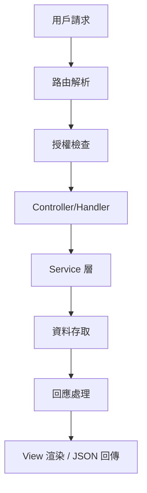

# [功能名稱] - Architecture Analysis

> **🎯 分析品質**：⭐ 基礎框架級 (Foundation Level)  
> **📅 最後更新**：[日期]  
> **📊 文件狀態**：📝 架構分析框架 (Architecture Framework)  
> **📄 說明**：本文件專注於系統架構分析，包括前後端架構、業務邏輯、資料流、效能安全等深度分析。  
> **🔗 相關文件**：請參閱 [README.md](./README.md) 的「功能元件清單」章節。

---

## 🎨 章節 1: 前端架構 (Frontend Layer)

### 1.1 View 引擎 / 框架架構

**技術選型**：
- [描述使用的前端技術及其版本]

**架構模式**：
- [描述使用的架構模式與設計原則]

#### 1.1.1 頁面佈局結構 (Page Layout Structure)

[在此處描述主要 View 的結構，可以使用樹狀圖來呈現，以利於理解整體佈局]

- `[Root View File]`
  - `[Main Container]`
    - `[Section 1]`
      - `[Component A]`
      - `[Component B]`
    - `[Section 2]`
      - `[Component C]`

---

### 1.2 資料初始化流程 (Data Initialization)

**伺服器端資料 (Server-Side Data)**：
- **主要資料模型**：`[資料模型名稱]`
- **初始資料注入**：[描述如何將資料從伺服器傳遞到客戶端]

**客戶端初始化 (Client-Side Initialization)**：
- **資料取得方式**：[描述前端如何取得初始資料]
- **載入策略**：[描述同步/非同步載入模式]

---

### 1.3 狀態管理策略 (State Management)

**狀態管理方案**：
- [描述使用的狀態管理方案]

**狀態結構**：
- [描述主要的狀態結構]

**狀態更新模式**：
- [描述狀態如何更新、誰可以更新、更新流程]

---

### 1.4 前端路由 (Frontend Routing)

**路由方案**：
- [描述路由方案]

**路由配置**：
```typescript
// 路由表範例
const routes = [
  { path: '/vip-member', component: VipMemberPage },
  { path: '/vip-member/profile', component: ProfilePage },
];
```

---

### 1.5 已知前端技術債 (Known Frontend Technical Debt)

**UI 層面**：
1. [待補充：UI 相關的技術債]
   - 影響：[待補充]
   - 優先級：[待補充：P0/P1/P2]

**狀態管理**：
1. [待補充：狀態管理相關問題]

**效能問題**：
1. [待補充：前端效能瓶頸]

---

## 🎮 章節 2: 後端架構 (Backend Layer)

### 2.1 Controller / Route Handler 架構

**技術方案**：
- [描述 Controller/Route Handler 的實作方式與繼承結構]

---

### 2.2 路由與端點策略 (Routing & Endpoints)

**路由前綴**：
- [描述路由前綴]

**端點清單**：
- `GET /endpoint` - [用途說明]
- `POST /endpoint` - [用途說明]

---

### 2.3 授權與過濾器模式 (Authorization & Filters)

**授權與過濾器範例**：
```
[根據實際框架填充授權屬性或中間件的使用方式]
```

**授權策略**：
- [描述認證機制]
- [描述授權檢查邏輯]

---

### 2.4 請求/回應處理模式 (Request/Response Pattern)

**資料驗證**：
- [描述輸入驗證機制]

**回應格式**：
```typescript
// 標準回應格式
{
  "success": true,
  "data": {},
  "message": ""
}
```

---

### 2.5 已知後端技術債 (Known Backend Technical Debt)

**架構層面**：
1. [待補充：後端架構問題]
   - 影響：[待補充]
   - 優先級：[待補充：P0/P1/P2]

**效能問題**：
1. [待補充：後端效能瓶頸]

---

## 🔧 章節 3: 業務邏輯層 (Business Logic Layer)

### 3.1 服務依賴注入 (Service Dependency Injection)

**注入的服務**：
```
[列出主要的服務依賴注入]
```

---

### 3.2 業務邏輯封裝模式 (Business Logic Encapsulation)

**服務層職責**：
- [描述 Service 層的職責範圍]
- [描述業務規則如何封裝]

---

### 3.3 資料存取層 (Data Access Layer)

**Repository 模式**：
- [描述是否使用 Repository Pattern]
- [描述資料存取抽象化程度]

**ORM 使用**：
- [描述 ORM 的使用方式]

---

### 3.4 第三方服務整合 (Third-Party Integration)

**外部 API**：
- [列出整合的第三方服務]
- [描述整合方式與錯誤處理]

---

## 🔄 章節 4: 資料流與整合 (Data Flow & Integration)

### 4.1 請求生命週期 (Request Lifecycle)



---

### 4.2 前後端資料流 (Frontend-Backend Data Flow)

**SSR 模式**：
```
伺服器 → 產生 HTML + 初始資料 → 客戶端接收
```

**CSR 模式**：
```
客戶端 → API 請求 → 伺服器處理 → JSON 回應 → 客戶端渲染
```

**混合模式**：
```
SSR 首次載入 + CSR 後續互動
```

---

### 4.3 外部 API 調用 (External API Calls)

**整合清單**：
- [列出所有外部 API]
- [描述調用時機與資料流]

---

### 4.4 快取策略 (Caching Strategy)

**快取層級**：
- **瀏覽器快取**：[描述靜態資源快取策略]
- **CDN 快取**：[描述 CDN 配置]
- **伺服器快取**：[描述 Redis / Memory Cache 使用]
- **資料庫快取**：[描述查詢快取]

---

### 4.5 錯誤處理與日誌 (Error Handling & Logging)

**錯誤處理策略**：
- [描述異常處理機制]
- [描述錯誤回應格式]

**日誌記錄**：
- [描述日誌框架]
- [描述日誌等級與記錄內容]

---

## 📊 章節 5: 效能與安全性 (Performance & Security)

### 5.1 效能指標 (Performance Metrics)

**前端效能**：
- **FCP (First Contentful Paint)**：[待測量]
- **LCP (Largest Contentful Paint)**：[待測量]
- **TTI (Time to Interactive)**：[待測量]
- **JS Bundle Size**：[待測量]

**後端效能**：
- **API 回應時間**：[待測量]
- **資料庫查詢時間**：[待測量]
- **併發處理能力**：[待測量]

---

### 5.2 安全性檢查清單 (Security Checklist)

- [ ] **輸入驗證**：所有用戶輸入都經過驗證
- [ ] **SQL 注入防護**：使用參數化查詢 / ORM
- [ ] **XSS 防護**：輸出編碼、CSP 設定
- [ ] **CSRF 防護**：使用 Anti-Forgery Token
- [ ] **授權檢查**：每個端點都有適當的授權
- [ ] **敏感資料**：密碼加密、個資加密傳輸
- [ ] **HTTPS**：強制使用 HTTPS
- [ ] **依賴套件**：定期更新、漏洞掃描

**已知安全問題**：
- [列出已知的安全風險]

---

### 5.3 SEO 策略 (SEO Strategy)

**Meta 標籤**：
- [描述 Meta 標籤生成方式]

**結構化資料**：
```json
{
  "@context": "https://schema.org",
  "@type": "WebPage",
  "name": "頁面名稱"
}
```

**SSR vs CSR**：
- [描述 SEO 考量下的渲染策略選擇]

---

## 🔍 章節 6: 監控與改善 (Monitoring & Improvements)

### 6.1 監控指標 (Monitoring Metrics)

**系統監控**：
- **可用性**：[描述服務可用性監控]
- **錯誤率**：[描述錯誤追蹤機制]
- **回應時間**：[描述效能監控]

**業務監控**：
- **關鍵流程**：[描述業務指標監控]
- **用戶行為**：[描述用戶分析工具]

---

### 6.2 已知技術債 (Known Technical Debt)

**高優先級（P0）**：
1. [待補充：必須立即處理的技術債]
   - 影響：[待補充]
   - 預估工時：[待補充]

**中優先級（P1）**：
1. [待補充：重要但非緊急的技術債]
   - 影響：[待補充]
   - 預估工時：[待補充]

**低優先級（P2）**：
1. [待補充：可延後處理的技術債]
   - 影響：[待補充]
   - 預估工時：[待補充]

---

### 6.3 改善建議 (Improvement Recommendations)

**架構層面**：
1. [待補充：架構優化建議]
   - 目標：[待補充]
   - 預期效益：[待補充]

**效能優化**：
1. [待補充：效能優化方向]
   - 目標：[待補充]
   - 預期效益：[待補充]

**程式碼品質**：
1. [待補充：程式碼品質提升建議]
   - 目標：[待補充]
   - 預期效益：[待補充]

---

## 📋 分析品質等級檢查清單 (Quality Level Checklist)

### ⭐ 基礎框架級 (Foundation Level)
- [ ] **前端技術選型**: 1.1 包含前端技術及其版本說明
- [ ] **後端技術方案**: 2.1 包含 Controller/Route Handler 架構說明
- [ ] **路由配置**: 2.2 列出主要端點清單（至少 3 個）
- [ ] **資料流說明**: 4.1 包含請求生命週期流程圖

### ⭐⭐ 資料流程層級 (Data Flow Level)
*需滿足基礎框架級 + 以下條件*
- [ ] **資料初始化**: 1.2 包含 SSR/CSR 資料初始化流程說明
- [ ] **狀態管理**: 1.3 包含完整的狀態管理策略說明
- [ ] **前後端資料流**: 4.2 說明 SSR/CSR/混合模式的資料流向
- [ ] **錯誤處理**: 4.5 包含錯誤處理策略和日誌記錄方式

### ⭐⭐⭐ 業務邏輯層級 (Business Logic Level)
*需滿足資料流程層級 + 以下條件*
- [ ] **服務依賴注入**: 3.1 列出主要的服務依賴
- [ ] **業務邏輯封裝**: 3.2 說明 Service 層職責範圍
- [ ] **資料存取層**: 3.3 說明 Repository Pattern 或 ORM 使用方式
- [ ] **快取策略**: 4.4 包含多層次快取策略（瀏覽器/CDN/伺服器/資料庫）

### ⭐⭐⭐⭐ 架構層級 (Architecture Level)
*需滿足業務邏輯層級 + 以下條件*
- [ ] **授權策略**: 2.3 包含完整的授權與過濾器模式說明
- [ ] **第三方整合**: 3.4 列出所有第三方服務整合清單
- [ ] **效能指標**: 5.1 包含前端和後端效能指標（至少各 3 項）
- [ ] **安全性檢查**: 5.2 完成安全性檢查清單（至少 6 項）
- [ ] **技術債識別**: 6.2 列出已知技術債（至少分 P0/P1/P2 三級）

### ⭐⭐⭐⭐⭐ 深度分析級 (Deep Analysis Level)
*需滿足架構層級 + 以下條件*
- [ ] **SEO 策略**: 5.3 包含完整的 SEO 策略（Meta 標籤、結構化資料、渲染策略）
- [ ] **監控指標**: 6.1 包含系統監控和業務監控指標
- [ ] **改善建議**: 6.3 提供至少 3 個面向的改善建議（架構/效能/程式碼品質）
- [ ] **前端技術債**: 1.5 列出至少 3 項前端技術債及優先級
- [ ] **後端技術債**: 2.5 列出至少 2 項後端技術債及優先級

---

## 📊 品質等級說明

- ⭐ **基礎框架級**：包含前後端技術選型、基本路由、資料流程圖等基本資訊
- ⭐⭐ **資料流程層級**：補充完整的資料初始化、狀態管理、錯誤處理流程
- ⭐⭐⭐ **業務邏輯層級**：包含服務依賴、業務邏輯封裝、資料存取層、快取策略詳細分析
- ⭐⭐⭐⭐ **架構層級**：包含授權、第三方整合、效能指標、安全性、技術債分析
- ⭐⭐⭐⭐⭐ **深度分析級**：包含完整的 SEO、監控、改善建議、所有層面的技術債識別

---

**文件狀態**：📝 架構分析框架 (Architecture Framework)  
**品質等級**：⭐ 基礎框架級 (Foundation Level)

