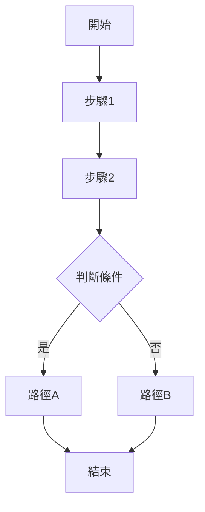

# Server Analysis: [功能區塊名稱]

> **🎯 分析品質**：⭐ 基礎框架級 (Foundation Level)  
> **📅 最後更新**：[日期]  
> **📊 文件狀態**：📝 Server Action 框架 (Server Action Framework)  
> **🔗 相關文件**：[待補充：相關 View 或 Service 分析文件連結]

---

## 1. 方法簽名與路由 (Method Signature & Routing)
> **填充階段**: Phase 1 自動填充（基本資訊） → Phase 2 補充詳細說明

### 1.1 方法定義 (Method Definition)
> **Phase 1**: 自動填充方法簽名  
> **Phase 2**: 補充詳細的參數說明和業務邏輯概述

[Phase 1 已填充：完整的方法簽名]

**完整方法簽名**：
```
[待補充：根據實際框架填充完整的方法定義，包含屬性/裝飾器]
```

**關鍵資訊**：
- **回傳型別**：[待補充：ActionResult / JsonResult / ViewResult 等]
- **方法名稱**：[待補充]
- **參數列表**：[待補充：參數名稱、型別、預設值]

---

### 1.2 路由資訊 (Routing Information)
> **Phase 1**: 自動填充 HTTP Method 和路由模式  
> **Phase 2**: 補充 URL 範例和查詢參數詳細說明

[Phase 1 已填充：HTTP Method 和路由模式]

**路由配置**：
- **HTTP Method**：[Phase 1 已填充]
- **路由模式**：[Phase 1 已填充]
- **URL 範例**：[Phase 2 待補充：完整的 URL 範例]
- **查詢參數**：[Phase 2 待補充：QueryString 參數說明]

---

### 1.3 授權與過濾器 (Authorization & Filters)
> **Phase 1**: 自動填充所有 Attribute  
> **Phase 2**: 補充每個 Attribute 的用途說明

[Phase 1 已填充：所有套用的 Attribute]

**套用的屬性**：
- `[AttributeName]` - [Phase 2 待補充：屬性用途說明]
- `[AttributeName(Order = N)]` - [Phase 2 待補充：執行順序與用途]

**範例**：
- `[RequireLoginGoLoginPage]` - 要求登入，未登入導向登入頁
- `[RequireReactTheme(Order = 2)]` - 要求 React 主題
- `[SetupLayoutArea(...)]` - 設定版面配置區域

---

## 2. 業務邏輯分析 (Business Logic Analysis)

### 2.1 核心流程 (Core Flow)
[待補充：此 Action 的主要業務邏輯步驟，使用流程圖或編號列表]

**執行步驟**：
1. [待補充：第一步]
2. [待補充：第二步]
3. [待補充：第三步]

**流程圖**（Mermaid）：


---

### 2.2 服務調用 (Service Calls)
[待補充：此 Action 調用的所有服務方法]

| 服務名稱 | 方法名稱 | 用途 | 參數 | 回傳值 |
|---------|---------|------|------|--------|
| [服務名] | [方法名] | [用途說明] | [參數列表] | [回傳型別] |

**範例**：
```csharp
// 取得會員資料
var member = _memberService.GetMember(memberId);

// 驗證權限
var hasPermission = _authService.CheckPermission(memberId, shopId);
```

---

### 2.3 資料處理 (Data Processing)
[待補充：資料驗證、轉換、持久化邏輯]

**資料驗證**：
- [待補充：輸入驗證規則]
- [待補充：業務規則驗證]

**資料轉換**：
- [待補充：資料映射、格式轉換]

**資料持久化**：
- [待補充：資料庫操作、快取更新]

---

### 2.4 ViewBag/ViewData 設定
[待補充：傳遞給 View 的資料]

```csharp
ViewBag.PropertyName = value;  // [待補充：用途說明]
```

---

## 3. 架構與品質分析 (Architecture & Quality Analysis)

### 3.1 錯誤處理 (Error Handling)
[待補充：異常處理策略、錯誤回應機制]

**異常類型**：
- `[ExceptionType]` - [待補充：處理方式]

**錯誤回應**：
```csharp
try
{
    // 業務邏輯
}
catch (SpecificException ex)
{
    // 錯誤處理
    Elmah.ErrorSignal.FromCurrentContext().Raise(ex);
    return View("ErrorView");
}
```

---

### 3.2 效能考量 (Performance Considerations)
[待補充：潛在的效能問題、優化建議]

**效能檢查清單**：
- [ ] 是否有 N+1 查詢問題？
- [ ] 是否有大量資料載入？
- [ ] 是否使用快取？
- [ ] 是否有非同步處理機會？

**優化建議**：
- [待補充：具體的優化方案]

---

### 3.3 安全性分析 (Security Analysis)
[待補充：安全性檢查項目]

**安全檢查清單**：
- [ ] 輸入驗證 (Input Validation)
- [ ] SQL 注入防護 (SQL Injection Prevention)
- [ ] XSS 防護 (Cross-Site Scripting Prevention)
- [ ] CSRF 防護 (Cross-Site Request Forgery Prevention)
- [ ] 授權檢查 (Authorization Check)
- [ ] 敏感資料處理 (Sensitive Data Handling)

**已知安全措施**：
- [待補充：已實作的安全機制]

**潛在風險**：
- [待補充：需要注意的安全風險]

---

### 3.4 相依性分析 (Dependency Analysis)
[待補充：此 Action 依賴的服務、元件、外部 API]

**注入的服務**：
- `_serviceName` - [待補充：服務用途]

**外部 API 調用**：
- [待補充：第三方 API、內部微服務]

**資料庫存取**：
- [待補充：存取的資料表、Repository]

---

## 📋 分析品質等級檢查清單 (Quality Level Checklist)

### ⭐ 基礎框架級 (Foundation Level)
- [ ] **方法簽名完整**: 1.1 包含完整的方法定義（回傳型別、方法名稱、參數）
- [ ] **路由資訊明確**: 1.2 包含 HTTP Method、路由模式、URL 範例
- [ ] **授權屬性列出**: 1.3 列出所有 Attribute 及其用途

### ⭐⭐ 業務邏輯層級 (Business Logic Level)
*需滿足基礎框架級 + 以下條件*
- [ ] **核心流程描述**: 2.1 包含完整的執行步驟（至少 3 步）
- [ ] **流程圖完整**: 2.1 包含 Mermaid 流程圖
- [ ] **ViewBag 設定**: 2.4 列出傳遞給 View 的資料（如適用）

### ⭐⭐⭐ 服務依賴層級 (Service Dependency Level)
*需滿足業務邏輯層級 + 以下條件*
- [ ] **服務調用分析**: 2.2 列出所有調用的服務方法及用途
- [ ] **資料處理說明**: 2.3 包含資料驗證、轉換、持久化邏輯
- [ ] **相依性清單**: 3.4 列出注入的服務、外部 API、資料庫存取

### ⭐⭐⭐⭐ 架構層級 (Architecture Level)
*需滿足服務依賴層級 + 以下條件*
- [ ] **錯誤處理分析**: 3.1 包含異常處理策略和錯誤回應機制
- [ ] **效能評估**: 3.2 完成效能檢查清單（N+1 查詢、快取、非同步）
- [ ] **安全性檢查**: 3.3 完成安全檢查清單（輸入驗證、SQL 注入、XSS、CSRF 等）
- [ ] **相關 View 連結**: 4.1 列出對應的 View 檔案路徑及分析連結

### ⭐⭐⭐⭐⭐ 深度分析級 (Deep Analysis Level)
*需滿足架構層級 + 以下條件*
- [ ] **測試覆蓋率**: 3.5 列出單元測試和整合測試狀態
- [ ] **技術債識別**: 3.6 列出至少 2 個已知問題或改善建議
- [ ] **重構建議**: 3.6 提供具體的重構方案和預期效益
- [ ] **API 文檔連結**: 4.3 提供 API 文檔或 Swagger 連結（如適用）

---

## 📊 品質等級說明

- ⭐ **基礎框架級**：包含方法簽名、路由、授權屬性等基本資訊
- ⭐⭐ **業務邏輯層級**：補充完整的業務邏輯流程和核心處理步驟
- ⭐⭐⭐ **服務依賴層級**：包含服務調用、資料處理、API 端點詳細分析
- ⭐⭐⭐⭐ **架構層級**：包含效能、安全性、相依性、技術債分析
- ⭐⭐⭐⭐⭐ **深度分析級**：包含完整的測試覆蓋率、文檔、改善建議

---

**文件狀態**：📝 Server Action 框架 (Server Action Framework)  
**品質等級**：⭐ 基礎框架級 (Foundation Level)

