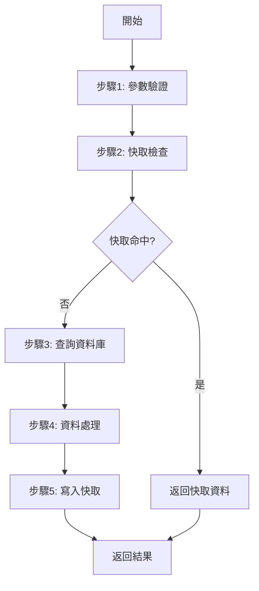

# Service Method Analysis: [服務方法名稱]

> **🎯 分析品質**：⭐ 基礎框架級 (Foundation Level)  
> **📅 最後更新**：[日期]  
> **📊 文件狀態**：📝 Service 方法框架 (Service Method Framework)  
> **🔗 相關文件**：[待補充：相關 Action 或 Repository 分析文件連結]

---

## 1. 方法簽名與介面 (Method Signature & Interface)
> **填充階段**: Phase 1 自動填充（基本資訊） → Phase 2 補充詳細說明

### 1.1 方法定義 (Method Definition)
> **Phase 1**: 自動填充方法簽名  
> **Phase 2**: 補充詳細的參數說明和業務邏輯概述

[Phase 1 已填充：完整的方法簽名]

**完整方法簽名**：
```
[待補充：根據實際程式語言填充完整的方法定義]
```

**關鍵資訊**：
- **回傳型別**：[待補充：完整的回傳型別]
- **方法名稱**：[待補充]
- **參數列表**：[待補充：參數名稱、型別、預設值、用途]
- **存取修飾詞**：[待補充：public / private / protected]

---

### 1.2 服務類別資訊 (Service Class Information)
> **Phase 1**: 自動填充服務類別基本資訊  
> **Phase 2**: 補充服務職責與設計模式

[Phase 1 已填充：服務類別名稱與命名空間]

**服務類別**：
- **命名空間/模組**：[例如：NineYi.WebStore.Frontend.BLV2.SalePagesV2]
- **類別名稱**：[例如：SalePageV2Service]
- **實作介面**：[例如：ISalePageV2Service]

**服務職責**：
- [待補充：此服務的核心職責]
- [待補充：服務範圍與邊界]

---

### 1.3 相依注入 (Dependency Injection)
> **Phase 1**: 自動填充注入的服務  
> **Phase 2**: 補充每個依賴的用途說明

[Phase 1 已填充：建構函式中的依賴注入]

**建構函式簽名**：
```
[待補充：建構函式與依賴注入列表]
```

**依賴清單**：
- `_serviceName` - [待補充：服務用途與職責]

---

## 2. 業務邏輯分析 (Business Logic Analysis)

### 2.1 核心流程 (Core Flow)
[待補充：此方法的主要業務邏輯步驟，使用流程圖或編號列表]

**執行步驟**：
1. [待補充：第一步]
2. [待補充：第二步]
3. [待補充：第三步]

**流程圖**（Mermaid）：


---

### 2.2 資料存取層調用 (Data Access Layer Calls)
[待補充：此方法調用的所有 Repository 或 DAL 方法]

| Repository | 方法名稱 | 用途 | 查詢條件 | 回傳值 |
|-----------|---------|------|---------|--------|
| [Repository名] | [方法名] | [用途說明] | [查詢條件] | [回傳型別] |

**範例**：
```csharp
// 取得商品頁資料
var salePageData = _salePageRepository.GetSalePageById(salePageId);

// 取得SKU資訊
var skuList = _salePageRepository.GetSaleProductSKUBySKUIds(shopId, skuIds);
```

---

### 2.3 其他服務調用 (Service Calls)
[待補充：此方法調用的其他 Service 方法]

| 服務名稱 | 方法名稱 | 用途 | 參數 | 回傳值 |
|---------|---------|------|------|--------|
| [服務名] | [方法名] | [用途說明] | [參數列表] | [回傳型別] |

**範例**：
```csharp
// 取得多語系內容
var multilingualData = _multilingualService.GetList<SalePageMultilingualEntity>(
    MultilingualModuleTypeEnum.SalePage,
    salePageIds,
    shopId,
    language
);

// 取得商店預設設定
var shopDefault = _shopDefaultService.GetShopDefaultValue(
    shopId,
    ShopDefaultGroupTypeDefEnum.SalePage,
    ShopDefaultKeyEnum.EnableIsComingSoon,
    true
);
```

---

### 2.4 資料處理與轉換 (Data Processing & Transformation)
[待補充：資料驗證、轉換、映射邏輯]

**資料驗證**：
- [待補充：輸入驗證規則]
- [待補充：業務規則驗證]

**資料轉換**：
```csharp
// [待補充：資料映射、格式轉換範例]
var entity = Mapper.Map<TargetEntity>(sourceEntity);
```

**資料聚合**：
- [待補充：如何組合多個來源的資料]

---

## 3. 快取策略分析 (Caching Strategy Analysis)

### 3.1 快取機制 (Cache Mechanism)
[待補充：此方法的快取策略]

**快取類型**：
- [ ] Memory Cache (記憶體快取)
- [ ] Redis Cache (分散式快取)
- [ ] 無快取

**快取設定**：
```csharp
// [待補充：快取相關程式碼]
var cacheKeyEntity = this.GetCacheKey("TypeName", new string[] { key1, key2 });
var result = this.DataCacheService.GetRedisCacheData<T>(
    cacheKeyEntity.ServiceName,
    cacheKeyEntity.TypeName,
    cacheKeyEntity.Key,
    () => {
        // 快取未命中時的處理邏輯
        return fetchData();
    },
    expirationSeconds: 900, // 15 分鐘
    enableCache: true,
    cleanCache: false
);
```

**快取策略**：
- **快取 Key 格式**：[待補充]
- **過期時間**：[待補充：秒數]
- **更新策略**：[待補充：主動更新 / 被動失效]
- **快取穿透防護**：[待補充：是否有防護機制]

---

### 3.2 快取 Key 管理 (Cache Key Management)
[待補充：快取 Key 的生成與管理邏輯]

**CacheKey 結構**：
```
ServiceName:TypeName-Version:Key
例如：SalePageV2:SalePageV2ProcessContext-2023121401:100-12345-secret-Web-0
```

**版本控制**：
- [待補充：如何管理快取版本]

---

## 4. 架構與品質分析 (Architecture & Quality Analysis)

### 4.1 錯誤處理 (Error Handling)
[待補充：異常處理策略、錯誤回應機制]

**異常類型**：
- `[ExceptionType]` - [待補充：處理方式]

**錯誤處理範例**：
```csharp
try
{
    // 業務邏輯
}
catch (WebException ex)
{
    var msg = $"外部服務異常：{ex.Message}";
    this.Logger.Error(msg);
    throw new ServiceException(msg, ex);
}
catch (Exception ex)
{
    this.Logger.Error(ex.ToString());
    throw;
}
```

**錯誤日誌**：
- [待補充：日誌記錄策略]

---

### 4.2 相依性分析 (Dependency Analysis)
[待補充：此方法依賴的所有外部資源]

**內部依賴**：
- **Repository**: [列出所有使用的 Repository]
- **Service**: [列出所有調用的 Service]
- **Utility**: [列出所有使用的工具類]

**外部依賴**：
- **外部 API**: [列出調用的外部 API]
- **第三方服務**: [列出整合的第三方服務]

**資料庫存取**：
- **資料表**: [列出存取的資料表]
- **預存程序**: [列出調用的預存程序（如有）]

---

## 📋 分析品質等級檢查清單 (Quality Level Checklist)

### ⭐ 基礎框架級 (Foundation Level)
- [ ] **方法簽名完整**: 1.1 包含完整的方法定義（回傳型別、方法名稱、參數）
- [ ] **服務類別資訊**: 1.2 包含命名空間、類別名稱、實作介面
- [ ] **依賴注入列表**: 1.3 列出建構函式中的所有依賴

### ⭐⭐ 業務邏輯層級 (Business Logic Level)
*需滿足基礎框架級 + 以下條件*
- [ ] **核心流程描述**: 2.1 包含完整的執行步驟（至少 3 步）
- [ ] **流程圖完整**: 2.1 包含 Mermaid 流程圖
- [ ] **資料處理說明**: 2.4 包含資料驗證、轉換邏輯

### ⭐⭐⭐ 資料存取層級 (Data Access Level)
*需滿足業務邏輯層級 + 以下條件*
- [ ] **Repository 調用**: 2.2 列出所有 Repository 方法及用途
- [ ] **Service 調用**: 2.3 列出所有 Service 方法及用途
- [ ] **快取策略**: 3.1 包含完整的快取機制說明

### ⭐⭐⭐⭐ 架構層級 (Architecture Level)
*需滿足資料存取層級 + 以下條件*
- [ ] **錯誤處理分析**: 4.1 包含異常處理策略和錯誤日誌
- [ ] **效能評估**: 4.2 完成效能檢查清單
- [ ] **安全性檢查**: 4.3 完成安全檢查清單
- [ ] **相依性分析**: 4.5 列出所有內部和外部依賴

### ⭐⭐⭐⭐⭐ 深度分析級 (Deep Analysis Level)
*需滿足架構層級 + 以下條件*
- [ ] **測試覆蓋率**: 4.6 列出單元測試和整合測試狀態
- [ ] **技術債識別**: 4.7 列出至少 2 個已知問題或改善建議
- [ ] **Processor 模式**: 4.4 詳細分析 Processor 執行流程（如適用）
- [ ] **完整文檔**: 5. 包含所有相關資源連結

---

## 📊 品質等級說明

- ⭐ **基礎框架級**：包含方法簽名、服務類別、依賴注入等基本資訊
- ⭐⭐ **業務邏輯層級**：補充完整的業務邏輯流程和核心處理步驟
- ⭐⭐⭐ **資料存取層級**：包含 Repository/Service 調用、快取策略詳細分析
- ⭐⭐⭐⭐ **架構層級**：包含效能、安全性、相依性、技術債分析
- ⭐⭐⭐⭐⭐ **深度分析級**：包含完整的測試覆蓋率、文檔、改善建議

---

**文件狀態**：📝 Service 方法框架 (Service Method Framework)  
**品質等級**：⭐ 基礎框架級 (Foundation Level)

