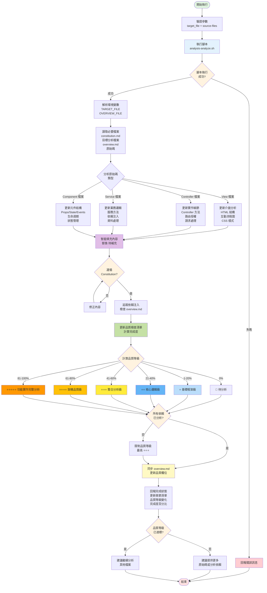

## 📥 輸入資料 (User Input)

**使用者參數**：`$ARGUMENTS` 的格式為 `[target_file] [source-files...]`

**`target_file` (可選)**：

- **格式**: 要更新的分析檔案名稱或路徑
- **說明**: 
  - 指定要更新的單一分析檔案。腳本會自動在當前 Topic 目錄下搜尋對應的 `.md` 檔案。
  - **若省略此參數，指令將進入批次模式**，自動分析 `overview.md` 中列出的所有檔案。
- **範例**:
  - `"features/001-會員註冊"`
  - `"server.md"`

**`source-files...` (可選)**：

- **格式**: 一個或多個原始碼檔案路徑
- **說明**:
  - 在**單一檔案模式**下，提供這些原始碼檔案供 AI 進行深度分析。
  - 在**批次模式**下，此參數會被忽略，AI 會自動從每個 `.md` 檔案的「分析檔案資訊」區塊尋找原始碼。
- **支援的檔案類型**:
  - **.NET MVC**: `.cshtml`, `.cs` (Controller, Service, Filter, Utility)
  - **React/Node.js**: `.tsx`, `.jsx`, `.ts`, `.js`
  - **Vue**: `.vue`

---

## 📊 流程概覽 (Flow Overview)



---

## 🚀 執行步驟 (Phases)

[ **CRITICAL**: 必須嚴格按照以下階段順序執行。]

### Phase 0: 設置與讀取上下文 (Setup & Context)

1. **驗證參數**: 檢查 `$ARGUMENTS` 包含目標檔案名稱。

2. **執行分析腳本**:
   
   使用 `run_terminal_cmd` 執行：
   ```bash
   .analysis-kit/scripts/analysis-analyze.sh <target_file> [source-files...]
   ```
   
   腳本會執行：
   - ✅ 驗證目標檔案存在
   - ✅ 在當前 Topic 目錄下尋找檔案
   - ✅ 確定對應的 overview.md
   - ✅ 分類原始碼檔案（View/Controller/Service/Component）
   - ✅ 輸出環境變數供 AI 使用

3. **讀取必要檔案**:

   - 讀取 `.analysis-kit/memory/constitution.md` (分析規則憲法)
   - 讀取目標分析檔案（腳本輸出的 `TARGET_FILE`）
   - 讀取對應的 `overview.md`（腳本輸出的 `OVERVIEW_FILE`）
   - 讀取所有提供的原始碼檔案

### Phase 1: 深度分析與智能填充 (Deep Analysis & Smart Filling)

[ **CRITICAL**: 這是此指令的核心工作，需要根據 constitution.md 進行高品質分析。]

### Phase 1.0: 真實性驗證檢查點 (Reality Check)

[ **CRITICAL**: 在開始任何分析之前，必須先通過此檢查點。]

**強制驗證清單**：

1. **原始碼檔案驗證**
   - [ ] 確認所有要分析的原始碼檔案都已透過 `read_file` 工具完整讀取到 context 中
   - [ ] 確認檔案內容不為空，且包含實際程式碼
   - [ ] 若無原始碼檔案，則**只能**優化既有的分析內容格式，**絕對禁止**新增任何程式碼片段或流程圖

2. **分析範圍驗證**
   - [ ] 列出本次分析能夠更新的章節清單（基於提供的檔案類型）
   - [ ] 列出必須保持原狀的章節清單（因未提供對應檔案）
   - [ ] 明確標記哪些章節會保持 `[待補充]` 狀態

3. **禁止行為清單**
   - ❌ **絕對禁止**編造不存在於原始碼中的函式名稱、類別名稱、變數名稱
   - ❌ **絕對禁止**根據 View 檔案推測 Controller/Service 的實作邏輯
   - ❌ **絕對禁止**根據 Controller 推測 Service 層的實作細節
   - ❌ **絕對禁止**繪製未在原始碼中明確看到的流程圖或序列圖
   - ❌ **絕對禁止**在程式碼片段中使用 `...` 或 `// ... more code ...` 省略內容
   - ❌ **絕對禁止**使用 `[待補充]` 或概念性註解來替代實際程式碼

**若未通過驗證**：
- 立即停止分析流程
- 向使用者回報缺少哪些原始碼檔案
- 建議使用者提供完整的原始碼檔案後再次執行

### Phase 1.1: 狀態變數追蹤原則

[ **CRITICAL**: 分析功能時，必須同時追蹤變數的「使用」和「賦值」]

**變數使用分析（3.3 條件式渲染邏輯）**：
- 記錄變數在 View 層如何被使用（ng-if, ng-show 等條件）
- 記錄顯示邏輯的判斷條件
- 列出涉及的 Controller 變數（不需要在此說明賦值來源）

**變數賦值分析（4.3 資料流與狀態變數）**：
- 追蹤變數在 Controller 中的賦值位置（方法名稱）
- 記錄賦值的觸發時機（初始化/$onInit/事件處理/API 回調）
- **完整貼出賦值相關的程式碼片段**，包括：
  - 條件判斷邏輯
  - 資料轉換/映射邏輯
  - 錯誤處理
  - 預設值設定
- 標註資料的最源頭（API 欄位/計算公式/常數）

**分析範例**：

對於變數 `IsPointPayOption`：

**在 3.3 章節記錄**：
| 點數兌換 | `IsPointPayOption === true` | `IsPointPayOption` |

**在 4.3 章節記錄**：
**變數：`IsPointPayOption`**
- **賦值方法**：`initSalePageData()`
- **觸發時機**：頁面初始化時，從 API 回應中解析商品付款選項
- **程式碼片段**：
```typescript
private initSalePageData(response: ISalePageResponse) {
    const paymentOptions = response.SalePageModel.PaymentOptions || [];
    this.IsPointPayOption = paymentOptions.some(opt => opt.Type === 'Point');
}
```
- **資料來源**：API `/api/salepage/{id}` 的 `SalePageModel.PaymentOptions` 欄位
- **資料轉換**：檢查付款選項陣列中是否包含類型為 'Point' 的選項

---

**1. 分析原始碼並規劃更新**:

[ **CRITICAL**: 必須完整保留目標檔案的所有章節結構，只針對性更新能從原始碼分析到的章節。]

**分析原則**:
- ✅ **保留所有章節**: 目標檔案中的所有章節必須完整保留
- ✅ **選擇性更新**: 只更新能從提供的原始碼中分析到的章節
- ✅ **保持佔位符**: 無法分析的章節保持 `[待補充]` 狀態或原有內容不變
- ✅ **不刪除已有內容**: 已填充的章節不應被刪除或覆蓋，除非有新資訊可以更新
- ❌ **禁止推測**: 絕對禁止根據部分資訊推測未提供檔案的實作細節

**檔案類型與可更新章節對應**:

| 原始碼類型 | 可更新的章節 | 保持原狀的章節 |
|-----------|-------------|----------------|
| `.cshtml` (View) | 介面分析、HTML 結構、前端互動、UI 元件 | Controller 實作、Service 層、API 規格 |
| `*Controller.cs` | 路由分析、Controller 方法、授權、請求處理 | View 層細節、Service 實作細節 |
| `*Service.cs` | 業務邏輯、方法實作、依賴注入、資料處理 | View 層、Controller 層 |
| `.tsx`/`.jsx` | 元件結構、Props/State、Hooks、前端邏輯 | 後端 API、Server 層 |
| `*/api/*.ts` | API 規格、Request/Response、路由 | View 層、UI 互動 |

根據原始碼檔案類型，決定要更新目標檔案的哪些章節：

- **View 檔案** (`.cshtml`, `.tsx`, `.vue`):
  - 更新「介面分析」章節
  - 填充 HTML 結構分析
  - 繪製互動流程 Mermaid 圖
  - 分析 CSS 樣式和響應式設計
  - **保留**「Controller 實作」、「Service 層」等後端章節
  
- **Controller 檔案** (`*Controller.cs`, `*/api/*.ts`):
  - 更新「實作細節分析」章節
  - 填充 Controller 方法分析
  - 追蹤路由和授權屬性
  - 分析請求/回應處理
  - **保留**「介面分析」、「Service 實作」等其他層章節
  
- **Service 檔案** (`*Service.cs`, `*Service.ts`):
  - 更新「業務邏輯」章節
  - 填充服務方法分析
  - 追蹤依賴注入
  - 分析資料處理和驗證
  - **保留**「介面分析」、「Controller 層」等其他層章節
  
- **Component 檔案** (`.tsx`, `.jsx`, `.vue`):
  - 更新「元件結構」章節
  - 分析 Props/State/Events
  - 追蹤生命週期和 Hooks
  - 分析狀態管理
  - **保留**後端相關章節

**範例**:
```markdown
# 若只提供 TradesOrderDetail.cshtml 進行分析

## 介面分析
[更新: 詳細的 HTML 結構、AngularJS 指令分析、Mermaid 流程圖]

## Controller 實作
[待補充]  # ← 保持此狀態，因為未提供 Controller 檔案

## 業務邏輯
[待補充]  # ← 保持此狀態，因為未提供 Service 檔案
```

**2. 智能填充內容**:

使用 `search_replace` 工具，精準替換 `[待補充]` 佔位符：

- **程式碼片段**: 使用適當的語法高亮標記（```csharp, ```typescript 等）
- **Mermaid 圖表**: 
  - 流程圖 (`flowchart TD`)
  - 序列圖 (`sequenceDiagram`)
  - 類別圖 (`classDiagram`)
- **說明文字**: 清晰、具體、有見地的分析
- **連結追蹤**: 建立到相關分析檔案的連結

**3. 遵循 Constitution.md 規範**:

- ✅ 分析深度標準：根據目標品質等級提供相應深度
- ✅ 命名規範：使用一致的術語和格式
- ✅ Mermaid 圖表規範：遵循繪製標準
- ✅ 程式碼摘錄原則：選取關鍵程式碼並加註解
- ✅ 架構模式識別：識別 MVC、DDD、Clean Architecture 等

**4. 依賴注入追蹤**:

- 掃描分析內容中提及的所有服務、元件、工具類別
- 檢查 overview.md 中是否已註冊對應的分析檔案
- 若依賴項未分析，在「依賴關係」章節中標記並建議建立

### Phase 2: 更新品質檢查清單 (Update Quality Checklist)

[ **CRITICAL**: 必須在同一次操作中更新品質檢查清單。檢查清單的文字內容來自範本，**不可修改**，AI 的唯一任務是根據分析進度將 `[ ]` 更新為 `[x]`。]

**1. 更新檢查項目**:

根據已填充的章節，將品質檢查清單從 `[ ]` 更新為 `[x]`：

**2. 判斷內容符合度**:

**內容符合度驗證**：
- [ ] 確認所有勾選為 `[x]` 的項目，其對應的章節內容確實已從原始碼中填充
- [ ] 確認所有程式碼片段皆為實際程式碼，無 `[待補充]` 或概念性範例
- [ ] 確認所有 Mermaid 圖表的元素皆能在原始碼中找到對應

**符合度判斷規則**：
- 若某章節仍包含 `[待補充]`，則該章節對應的檢查項目**不得**勾選
- 若某章節的程式碼使用 `...` 省略，則「程式碼真實性」項目**不得**勾選
- 若某章節的 Mermaid 圖表包含推測性內容，則「流程圖準確性」項目**不得**勾選

**3. 確定品質等級**:

根據品質檢查清單中已完成的**最高層級**來確定品質等級：

- **📝 待分析**：所有檢查項目皆未勾選
- **⭐ 基礎框架級**：⭐ 層級的所有項目已勾選，但 ⭐⭐ 層級尚未完成
- **⭐⭐ 核心邏輯級**：⭐ 和 ⭐⭐ 層級的所有項目已勾選，但 ⭐⭐⭐ 層級尚未完成
- **⭐⭐⭐ 整合分析級**：⭐ 到 ⭐⭐⭐ 層級的所有項目已勾選，但 ⭐⭐⭐⭐ 層級尚未完成
- **⭐⭐⭐⭐ 架構品質級**：⭐ 到 ⭐⭐⭐⭐ 層級的所有項目已勾選，且所有依賴已分析，但 ⭐⭐⭐⭐⭐ 層級尚未完成
- **⭐⭐⭐⭐⭐ 功能實作完整分析**：所有層級的項目皆已勾選

**重要**：品質等級必須**循序漸進**，只有當低層級完全完成後，才能晉升至高層級

### Phase 3: 同步 overview.md (Sync Overview)

[ **CRITICAL**: 必須同步更新 overview.md 的品質等級欄位。]

**1. 讀取 overview.md**: 讀取對應的 overview.md（Topic 或 Shared）

**2. 更新品質等級**:

找到目標檔案在「分析檔案清單」表格中的條目，更新品質等級欄位：

```markdown
## 📂 分析檔案清單

| 檔案 | 品質等級 |
|------|----------|
| [server.md](./server.md) | ⭐⭐⭐ 整合分析級 |
| [features/001-會員註冊](./features/001-會員註冊.md) | ⭐⭐⭐⭐⭐ 功能實作完整分析 |
```

**3. 使用 `search_replace` 精準更新**: 只更新對應檔案的那一列品質等級

### Phase 4: 回報完成狀態 (Report)

1. **確認產出**:

   - ✅ 已更新檔案：`<TARGET_FILE>`
   - ✅ 更新的主要章節：列出已填充的章節清單
   - ✅ 品質等級變化：`<OLD_LEVEL> → <NEW_LEVEL>`
   - ✅ 已完成層級：列出已完成的品質層級（⭐ 到 ⭐⭐⭐⭐⭐）
   - ✅ overview.md 已同步：確認
   - ✅ 依賴項檢查：列出未分析的依賴項（若有）

2. **建議下一步**:

   - 🔜 若品質等級未達 ⭐⭐⭐⭐⭐，建議：
     - 提供更多原始碼檔案再次執行 `/analysis.analyze`
     - 或分析依賴的服務/元件檔案
   
   - 🔜 若品質等級已達目標：
     - 繼續分析其他檔案
     - 或進入重構階段（若所有分析完成）
   
   - 📝 若發現未分析的依賴項：
     - 建議使用 `/analysis.create` 建立對應的分析檔案

---

## 🔑 關鍵規則 (Key Rules)

[ **CRITICAL**: AI 在執行所有步驟時必須遵守的規則。]

- **規則 1**: 必須使用 `search_replace` 進行檔案修改，嚴禁直接覆蓋整個檔案。

- **規則 1.1** [ **CRITICAL** ]: **完整保留所有章節結構**。絕對不能刪除或跳過目標檔案中的任何章節，即使該章節無法從提供的原始碼中更新。無法更新的章節必須保持原狀（`[待補充]` 或已有內容）。

- **規則 1.2** [ **CRITICAL** ]: **選擇性更新原則 + 禁止推測**。只更新能從提供的原始碼中明確分析到的章節：
  - 若只提供 `.cshtml` 檔案 → 只更新介面分析相關章節，保留 Controller、Service 章節不變
  - 若只提供 `*Controller.cs` → 只更新 Controller 實作章節，保留 View、Service 章節不變
  - 若只提供 `*Service.cs` → 只更新業務邏輯章節，保留 View、Controller 章節不變
  - **禁止根據前端程式碼推測後端 API 實作細節**
  - **禁止根據 Controller 推測 Service 層實作邏輯**
  - **只記錄原始碼中能明確看到的事實**，不寫入任何推測性內容
  - 以此類推

- **規則 2**: 填充內容時，必須精準替換 `[待補充]` 佔位符，不得刪除其他章節。

- **規則 3**: 所有 Mermaid 圖表必須語法正確且有意義，不要使用佔位符範例。

- **規則 4** [ **CRITICAL** ]: **程式碼片段完整性與真實性**
  - 所有程式碼片段必須**逐字**複製自已提供的原始碼檔案
  - **嚴格禁止**使用 `...`、`// ... more code ...`、`/* 省略 */` 等任何形式的省略
  - 若程式碼過長（超過 50 行），應：
    - 分段貼上多個獨立的程式碼區塊
    - 每個區塊前用文字說明：「此為 [檔案名稱] 的第 X-Y 行」
    - 在區塊之間用文字說明中間省略的邏輯概要
  - 若程式碼包含註解，必須保留原始註解，不可替換為自己的註解
  - 若要加註解說明，應在程式碼區塊**之後**另外用文字說明，而非修改程式碼本身

- **規則 5**: 品質檢查清單必須在同一次 `search_replace` 操作中更新。

- **規則 5.1** [ **CRITICAL** ]: **嚴格遵守品質檢查清單範本**。AI **嚴禁**修改、增加或刪除品質檢查清單中的任何文字項目。唯一的任務是根據分析進度，將對應項目的狀態從 `[ ]` 更新為 `[x]`。

- **規則 6**: overview.md 的品質等級必須與目標檔案的品質檢查清單一致。

- **規則 7**: 依賴注入檢查機制：
  - 若依賴項未分析，品質等級最高只能到 ⭐⭐⭐（整合分析級）
  - 所有依賴項都已分析完成，才能達到 ⭐⭐⭐⭐（架構品質級）或更高

- **規則 8**: 若 source-files 未提供或不足，AI 應基於檔案現有內容進行優化和補充。

- **規則 9**: 所有檔案路徑必須使用腳本輸出的絕對路徑。

- **規則 10**: 遵循 constitution.md 定義的所有分析標準和規範。

- **規則 11**: **模板章節不變原則**：嚴格禁止新增或刪除任何 `template` 中預先定義的章節。分析內容必須填充至既有結構中。

- **規則 12**: **來源檔案限定原則**：分析範圍嚴格限定於使用者提供的原始碼檔案 (`source-files`)，以及目標分析檔案 `### 1.1 📂 分析檔案資訊 (Analyzed Files)` 中已標記的檔案。嚴禁分析任何未明確指定的檔案。

- **規則 13**: **未知依賴處理**：若在分析過程中發現未提供的依賴檔案（例如某個 Service 或 Component），應在 `### 1.2 📦 依賴關係 (Dependencies)` 表格中註記，而非試圖分析它。

- **規則 14**: **品質等級不變原則**：嚴格禁止新增、刪除或修改 `## 📋 品質檢查清單` 中的檢查項目文字或品質等級定義。AI 的唯一任務是根據分析進度更新核取方塊 `[ ]` -> `[x]`。

- **規則 15** [ **CRITICAL** ]: **Mermaid 圖表真實性驗證**
  - 所有 Mermaid 圖表（flowchart、sequenceDiagram、classDiagram）中的元素必須在原始碼中有明確對應
  - 圖表中的函式名稱、類別名稱、變數名稱必須與原始碼完全一致
  - 圖表中的流程步驟必須能在原始碼中找到對應的程式碼邏輯
  - 若原始碼中的流程不清楚或缺少某段邏輯，應在圖表後標註「⚠️ 此流程圖基於現有程式碼推測，部分步驟未在提供的檔案中找到實作」
  - **嚴格禁止**繪製純粹基於推測或想像的流程圖

- **規則 16** [ **CRITICAL** ]: **未提供檔案時的處理原則**
  - 若某章節所需的原始碼檔案未提供，該章節必須保持 `[待補充]` 或原有內容不變
  - 若目標檔案本身就不存在任何已填充內容，則該章節保持空白或範本狀態
  - **嚴格禁止**根據相關檔案推測未提供檔案的內容
  - 在依賴關係表中，未提供的依賴項應標記為「待分析」或「待建立」
