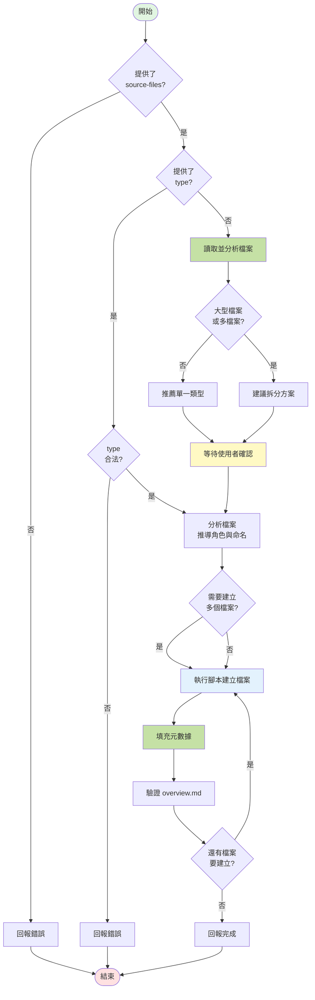

## 📥 輸入參數

使用者參數格式：`[type] <source-files...>`

- **`type`** (選填): 指定分析類型
  - Topic 類型: `server` | `client` | `feature` | `api`
  - Shared 類型: `request-pipeline` | `component` | `helper`
  
- **`source-files...`** (必填): 一個或多個原始碼檔案路徑
  - 支援: `.cshtml`, `.cs`, `.tsx`, `.jsx`, `.ts`, `.js`, `.vue`
  - 若未提供 `type`，AI 會自動分析檔案特徵並建議類型

---

## 📊 執行流程



---

## 🚀 執行步驟

### 步驟 1: 參數驗證與檔案分析

**驗證 source-files**:
- 確認至少提供一個檔案路徑
- 若未提供，回報錯誤並結束

**驗證 type（若提供）**:
- 檢查是否為合法類型：`server` | `client` | `feature` | `api` | `request-pipeline` | `component` | `helper`
- 若無效，回報錯誤並結束

**讀取檔案基本資訊**:
- 使用 `read_file` 讀取所有 source-files
- 記錄檔案大小（行數）
- 分析檔案副檔名和命名模式

---

### 步驟 2: 類型判斷與拆分建議

[ **注意**: 只在未提供 `type` 時執行此步驟 ]

#### 2.1 檔案特徵分析

**檔案角色識別**:
```
.cshtml                  → View
*Controller.cs           → Controller
*Service.cs/*Repository  → Service
*Filter.cs/*Middleware   → Filter/Middleware
.tsx/.jsx/.vue          → Component
*/api/*.ts/*.js         → API Route
*Helper.ts/*Util.ts     → Utility
```

**內容特徵優先**:
- 包含 `[Route("api/"` → 強烈建議 `api`
- 包含 `IActionFilter` / `IMiddleware` → 強烈建議 `request-pipeline`
- 包含 `@model` + Razor 語法 → 建議 `client`
- 包含 React Hooks → 建議 `component` 或 `client`

**命名模式判斷**:
- 檔名含 Detail/List/Index + .cshtml → 建議 `client`
- *Controller.cs (非 api) → 建議 `server`
- 多個相關檔案 → 建議 `feature`

**共用性判斷** (決定 Topic vs Shared):
- `component` / `helper` / `request-pipeline` → `analysis/shared/`
- `server` / `client` / `feature` / `api` → 當前 Topic 目錄

#### 2.2 拆分建議機制

**觸發條件**:

1. **單一大型檔案** (>500 行):
   - 掃描 View 的主要 HTML 結構區塊
   - 掃描 Controller 的 Action 方法
   - 識別功能區塊的行號範圍

2. **多個相關檔案**:
   - 判斷檔案間的關聯性（Controller + View + Service）
   - 評估是否適合合併或分別建立

**建議方案格式**:

**情境 A - 簡單檔案** (< 500 行，單一功能):
```markdown
📊 **檔案類型分析**

**檔案**: `Controllers/MemberController.cs` (280 行)

**推薦類型**: `server`

**理由**: MVC Controller，包含會員相關的頁面邏輯

**其他選項**:
- `feature`: 如果想與 Service/View 一起分析

---

❓ **請確認**
1. ✅ 使用 `server` (推薦)
2. 🔄 改用 `feature`
3. 🔄 其他類型

請回覆數字或類型名稱
```

**情境 B - 大型檔案** (>500 行):
```markdown
🔍 **大型檔案分析**

**檔案**: `Views/TradesOrderDetail.cshtml` (1394 行)

**識別到 8 個主要區塊**:
1. 訂單資訊與工具列 (44-166)
2. 商品清單與明細 (167-633)
3. 付款資訊 (644-803)
4. 配送資訊 (804-911)
5. 發票資訊 (913-1025)
6. 點數回饋 (1127-1208)
7. 優惠券回饋 (1209-1291)
8. 活動登記 (1084-1126)

---

❓ **建議拆分方案**
1. 📄 分析整個頁面 (使用 `client` 類型)
2. 🧩 拆分成多個功能 (建立 8 個 `feature` 檔案) ⭐ 推薦
3. 🎯 只分析特定區塊 (請指定區塊編號，如: 1,2,6)

請回覆數字
```

**情境 C - 多檔案**:
```markdown
🔍 **多檔案分析**

**識別到相關檔案**:
- `TradesOrderController.cs` (163 行, 3 個 Actions)
- `TradesOrderDetail.cshtml` (1394 行)
- `OrderService.cs` (450 行)

---

❓ **建議方案**
1. 📦 合併成單一 `feature` 分析 (包含所有檔案)
2. 📑 分別建立 (server + client + feature，共 3 個檔案) ⭐ 推薦
3. 🎯 自訂組合

請回覆數字
```

#### 2.3 等待使用者確認

- 展示分析結果和建議方案
- **停止執行**，等待使用者回應
- 根據使用者選擇，記錄要建立的檔案清單：
  - 單一檔案：`{ type, files: [...], name }`
  - 多個檔案：`[{ type, files: [...], name, focus_range }, ...]`

---

### 步驟 3: 建立分析檔案

[ **CRITICAL**: AI 在此階段的唯一任務是呼叫腳本，而不是手動操作檔案。]

**1. 組合腳本命令**:

根據【步驟 2】中使用者確認的方案，組合出最終要執行的 `analysis-create.sh` 命令。

- **命令格式**:
  ```bash
  .analysis-kit/scripts/analysis-create.sh --json --type "<type>" --name "<name>" [source-files...]
  ```
- **參數說明**:
  - `--json`: 確保腳本以 JSON 格式回報結果。
  - `--type`: 使用者確認的分析類型 (`feature`, `api` 等)。
  - `--name`: AI 根據原始碼分析後，建議並經使用者確認的**中文**檔案名稱。
  - `[source-files...]`: 原始的檔案路徑。

**2. 執行建立腳本**:

使用 `run_terminal_cmd` 執行組合好的命令。如果需要建立多個檔案（拆分情境），則依序執行多次。

**3. 解析腳本輸出**:

從腳本的 JSON 輸出中，獲取新建立檔案的路徑 (`FILE_PATH`) 和檔名 (`FILE_NAME`)，用於後續的回報。

### 步驟 4: 回報完成

**1. 驗證產出**:

- 根據腳本回傳的 `FILE_PATH`，確認檔案已成功建立。
- 腳本已自動完成 `overview.md` 的註冊，AI 無需手動驗證。

**2. 回報結果**:

```markdown
✅ **建立完成**

**已建立檔案**:
- `<FILE_PATH>`

**檔案類型**: `<type>`

**已註冊到**: `<OVERVIEW_FILE>`

**品質等級**: 📝 待分析

---

🔜 **下一步**

使用 `/analysis.analyze` 進行實質內容分析。
```

---

## 🔑 關鍵規則

[ **CRITICAL**: AI 必須遵守以下規則 ]

1.  **職責分離**: AI 的核心職責是**分析、建議、與使用者確認**。所有檔案的建立、重新命名、內容填充和註冊工作，都必須**完全委派**給 `analysis-create.sh` 腳本。

2.  **禁止手動操作檔案**: AI **嚴禁**在此指令中使用 `edit_file` 或 `search_replace` 來建立或修改任何分析檔案或 `overview.md`。

3.  **參數化呼叫**: 必須使用 `--type` 和 `--name` 參數，將使用者確認的類型和 AI 建議的中文名稱準確傳遞給腳本。

4.  **自動判斷必須確認**: 未提供 `type` 時，必須展示建議並等待使用者回應。

5.  **大型檔案必須建議拆分**: 檔案 >500 行時，提供拆分選項。

6.  **品質等級固定**: 腳本建立的檔案品質等級固定為 📝 待分析。

---

## 💡 使用範例

```bash
# 基本用法 - 指定類型
/analysis.create feature Controllers/OrderController.cs Views/Order/Detail.cshtml

# 自動判斷類型
/analysis.create Views/MemberProfile.cshtml
# AI 會分析後推薦 `client` 類型

# API 檔案
/analysis.create api Controllers/Api/ProductsController.cs
# AI 偵測到 [Route("api/")] 後推薦 `api`

# 共用元件 (自動建立到 shared/)
/analysis.create component Components/Button.tsx

# 大型檔案 - 會建議拆分
/analysis.create Views/CheckoutPage.cshtml
# AI 偵測到 800 行，建議拆分成多個 feature

# 多相關檔案 - 會詢問方案
/analysis.create Controllers/OrderController.cs Services/OrderService.cs Views/Order/Detail.cshtml
# AI 詢問：1) 合併成 feature  2) 分別建立  3) 自訂

# Filter/Middleware (自動建立到 shared/)
/analysis.create Filters/AuthFilter.cs

# Helper (自動建立到 shared/)
/analysis.create Utils/DateHelper.ts
```

---

## 🎯 檔案類型對應

| 類型 | 建立位置 | 範本 | 用途 |
|------|---------|------|------|
| `server` | Topic 根目錄 | server-template.md | 後端頁面邏輯 |
| `client` | Topic 根目錄 | client-template.md | 前端頁面邏輯 |
| `feature` | Topic/features/ | feature-template.md | 功能分析 |
| `api` | Topic/apis/ | api-template.md | API 規格 |
| `request-pipeline` | shared/request-pipeline/ | request-pipeline-template.md | Filter/Middleware |
| `component` | shared/components/ | component-template.md | 共用元件 |
| `helper` | shared/helpers/ | helper-template.md | 輔助函式 |

---

## ⚠️ 錯誤處理

**常見錯誤**:

1. **未提供 source-files**: 
   - 錯誤訊息：「必須提供至少一個原始碼檔案」
   
2. **type 無效**: 
   - 錯誤訊息：「無效的類型，請使用: server, client, feature, api, component, request-pipeline, helper」

3. **檔案不存在**: 
   - 錯誤訊息：「找不到檔案: <path>」

4. **不在 analysis 分支**: 
   - 錯誤訊息：「請先執行 /analysis.init 初始化分析環境」

5. **範本檔案缺失**: 
   - 錯誤訊息：「找不到範本檔案: .analysis-kit/templates/<type>-template.md」

---

## 📊 類型判斷邏輯摘要

**判斷優先順序**:
1. 內容強特徵 (如 `[Route("api/"`) 優先於檔名
2. 多相關檔案優先考慮 `feature` 類型
3. 共用性判斷決定 Topic vs Shared

**典型案例**:

| 檔案特徵 | 推薦類型 | 位置 |
|---------|---------|------|
| `.cshtml` 主頁面 | `client` | Topic |
| `*Controller.cs`