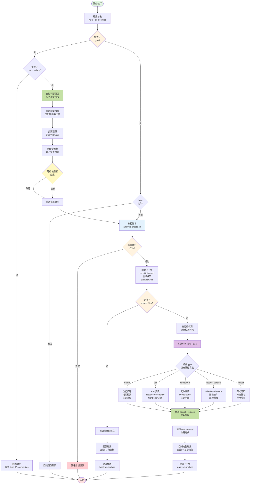

## 📥 輸入資料 (User Input)

**使用者參數**：`$ARGUMENTS` 的格式為 `<type> [source-files...]` 或 `[source-files...]`

**`type` (可選)**：

- **格式**: 字串，必須是以下類型之一

- **Topic 類型**（建立在當前 Topic 目錄）:
  - `server` - 後端頁面渲染邏輯分析（通常在 init 時已建立）
  - `client` - 前端頁面驅動邏輯分析（通常在 init 時已建立）
  - `feature` - 重點功能分析 → `features/[###]-[name].md`
  - `api` - API Endpoint 規格分析 → `apis/[###]-[name].md`

- **Shared 類型**（建立在 `analysis/shared/` 目錄）:
  - `request-pipeline` - Filter/Middleware 分析 → `shared/request-pipeline/[###]-[name].md`
  - `component` - 共用 UI 元件分析 → `shared/components/[###]-[name].md`
  - `helper` - 共用輔助函式分析 → `shared/helpers/[###]-[name].md`

- **自動判斷模式**: 若未提供 `type`，但提供了 `source-files`，AI 會根據檔案特徵自動推薦合適的類型並與使用者確認

**`source-files...` (可選)**：

- **格式**: 一個或多個原始碼檔案路徑

- **說明**: 提供原始碼檔案後，AI 會進行第一次分析 (First Pass) 並填充基礎資訊

- **支援的檔案類型**:
  - **.NET MVC**: `.cshtml` (View), `.cs` (Controller, Service, Filter)
  - **React/Node.js**: `.tsx`/`.jsx` (Component), `.ts`/`.js` (API Route, Service)
  - **Vue**: `.vue` (Component)

---

## 📊 流程概覽 (Flow Overview)



---

## 🚀 執行步驟 (Phases)

[ **CRITICAL**: 必須嚴格按照以下階段順序執行。]

### Phase -1: 類型自動判斷 (Auto Type Detection) - 僅當未提供 type 時執行

[ **CRITICAL**: 當使用者未提供 `<type>` 但提供了 `source-files` 時，必須執行此階段。]

1. **檢查參數**:
   - 確認 `$ARGUMENTS` 中沒有合法的 type 作為第一個參數
   - 確認有提供 source-files（至少一個檔案路徑）
   - 如果兩者都沒有，回報錯誤並結束

2. **讀取並分析檔案**:
   
   使用 `read_file` 讀取提供的所有 source-files，分析以下特徵：
   
   **檔案副檔名判斷**:
   - `.cshtml` → 可能是 `client` (主要頁面 View) 或 `feature` (功能相關 View)
   - `*Controller.cs` → 可能是 `server` (頁面 Controller) 或 `api` (API Controller) 或 `feature` (功能相關)
   - `*Service.cs`, `*Repository.cs` → 可能是 `feature` (業務邏輯) 或 `helper` (共用服務)
   - `*Filter.cs`, `*Middleware.cs`, `*Attribute.cs` → 可能是 `request-pipeline`
   - `.tsx`, `.jsx`, `.vue` → 可能是 `component` (共用元件) 或 `client` (頁面元件)
   - `*/api/*.ts`, `*/api/*.js` → 可能是 `api`
   - `*Helper.ts`, `*Util.ts`, `*Utils.ts` → 可能是 `helper`
   
   **檔案內容特徵判斷**:
   - 包含 `[Route("api/`、`[HttpGet]`、`[HttpPost]` → 強烈建議 `api`
   - 包含 `IActionFilter`、`IAuthorizationFilter`、`IMiddleware` → 強烈建議 `request-pipeline`
   - 檔案開頭有 `@model`、大量 Razor 語法 → 可能是 `client`
   - 包含 AngularJS/Angular controller (`ng-controller`) → 可能是 `client`
   - 包含 React Hooks (`useState`, `useEffect`) → 可能是 `component` 或 `client`
   - 包含多個獨立的 utility 函式 → 可能是 `helper`
   
   **檔案命名模式判斷**:
   - 檔案名稱包含 "Detail"、"List"、"Index" → 可能是頁面相關 (`client` 或 `server`)
   - 檔案名稱是複數形式或包含 "Controller" → 可能是 API 或功能
   - 多個相關檔案（Controller + Service + View）→ 建議 `feature`

2.1. **功能區塊識別與選擇性分析** [ **CRITICAL** ]:
   
   對於大型或複雜檔案，AI 必須進行深度分析並識別可拆分的功能區塊：
   
   **Controller 檔案的 Action 識別**:
   - 識別所有 public ActionResult 方法
   - 分析每個 Action 的路由、參數、功能說明（從註解）
   - 列出 Action 清單供使用者選擇
   
   **View 檔案的功能區塊識別**:
   - 識別主要的 HTML 結構區塊（通常有明確的 class 或 id）
   - 識別 AngularJS/Vue/React 的 controller/component 綁定
   - 識別功能區域（如：訂單資訊、付款資訊、配送資訊、發票區塊、回饋區塊）
   - 分析各區塊的獨立性和複雜度
   
   **識別標準**:
   - **大型檔案**: 超過 500 行 → 建議拆分
   - **多功能 Controller**: 包含 3 個以上 Action → 提供選擇
   - **複雜 View**: 包含多個獨立功能區塊 → 提供拆分選項
   - **多個 Component/Service**: TypeScript 檔案包含多個 export → 可拆分分析
   
   **生成功能區塊清單範例**:
   
   對於 Controller:
   ```markdown
   🔍 **檔案結構分析: TradesOrderController.cs**
   
   檔案大小: 163 行
   類型: MVC Controller
   
   **識別到的 Actions**:
   1. `TradesOrderList` (Line 85-96)
      - 用途: 訂單查詢頁（重導到 V2）
      - 路由: /TradesOrder/TradesOrderList
      - 複雜度: 低（簡單重導）
   
   2. `TradesOrderDetail` (Line 111-119) 
      - 用途: 訂單明細查詢頁（重導到 V2）
      - 路由: /TradesOrder/TradesOrderDetail/{tid}
      - 複雜度: 低（簡單重導）
   
   3. `SupplierContact` (Line 130-161)
      - 用途: 維修資料查詢
      - 路由: /TradesOrder/SupplierContact
      - 複雜度: 中（包含業務邏輯）
   ```
   
   對於 View:
   ```markdown
   🔍 **檔案結構分析: TradesOrderDetail.cshtml**
   
   檔案大小: 1394 行
   類型: ASP.NET MVC Razor View
   前端框架: AngularJS
   
   **識別到的主要功能區塊**:
   1. 訂單資訊區 (Line 44-166)
      - TG-header: 訂單編號、工具列
      - 包含: 退換貨連結、取消訂單、物流進度
      - 複雜度: 高
   
   2. 商品清單區 (Line 167-633)
      - TM-block, TS-block: 商品明細
      - 包含: 商品資訊、規格、狀態、發票、退款資訊
      - 複雜度: 高
   
   3. 付款資訊區 (Line 644-803)
      - 包含: 付款總額、付款方式、ATM 資訊
      - 複雜度: 中
   
   4. 配送資訊區 (Line 804-911)
      - 包含: 配送方式、收件人、地址、取貨門市
      - 複雜度: 中
   
   5. 發票資訊區 (Line 913-1025)
      - 包含: 電子發票、發票索取資訊
      - 複雜度: 中
   
   6. 點數回饋區 (Line 1127-1208)
      - 動態顯示點數回饋資訊
      - 複雜度: 中
   
   7. 優惠券回饋區 (Line 1209-1291)
      - 動態顯示優惠券回饋資訊
      - 複雜度: 中
   
   8. 登記活動區 (Line 1084-1126)
      - 活動登記表單
      - 複雜度: 低
   ```

3. **生成推薦結果**:
   
   根據分析結果，生成推薦報告：
   
   ```markdown
   📊 **檔案類型自動判斷結果**
   
   **分析的檔案**:
   - `<file1>` - <角色描述> (.cshtml View)
   - `<file2>` - <角色描述> (*Controller.cs)
   - ...
   
   **判斷依據**:
   - ✅ 檔案副檔名: .cshtml (ASP.NET MVC View)
   - ✅ 檔案命名: TradesOrderDetail (訂單明細頁面)
   - ✅ 內容特徵: 包含大量 Razor 語法和 AngularJS 指令
   - ✅ 相關檔案: <列出可能相關的其他檔案>
   
   **推薦類型**: `<primary_type>`
   
   **理由**: <詳細說明為什麼推薦這個類型>
   
   **其他可能的類型**:
   - `<alternative_type_1>`: <使用場景說明>
   - `<alternative_type_2>`: <使用場景說明>
   ```

4. **與使用者互動確認**:
   
   根據步驟 2.1 的分析結果，提供不同的互動選項：
   
   **情境 A: 簡單檔案（< 500 行，單一功能）**
   
   向使用者詢問：
   
   ```
   ❓ **請確認要建立的分析類型**
   
   我推薦使用 `<primary_type>` 類型，您可以：
   
   1. ✅ 接受推薦 - 使用 `<primary_type>` 類型
   2. 🔄 選擇其他類型 - 請指定：`server` / `client` / `feature` / `api` / `component` / `request-pipeline` / `helper`
   
   請回覆您的選擇（輸入數字或類型名稱）
   ```
   
   **情境 B: Controller 包含多個 Actions**
   
   ```
   🔍 **檔案結構分析: TradesOrderController.cs**
   
   識別到 3 個 Actions（詳細資訊見上方）
   
   ❓ **請選擇分析方式**
   
   1. 📄 **分析整個 Controller** 
      - 類型: `server` 或 `feature`
      - 包含所有 3 個 Actions
      - 適合: 想要了解整體 Controller 架構
   
   2. 🎯 **只分析特定 Action(s)**
      - 類型: `feature` 或 `api`（根據 Action 性質）
      - 請指定要分析的 Action 名稱（可多選，用逗號分隔）
      - 範例: `TradesOrderDetail` 或 `TradesOrderDetail, SupplierContact`
   
   請回覆您的選擇（輸入數字或 Action 名稱）
   ```
   
   **情境 C: View 檔案包含多個功能區塊（> 500 行）**
   
   ```
   🔍 **檔案結構分析: TradesOrderDetail.cshtml**
   
   檔案很大（1394 行），識別到 8 個主要功能區塊（詳細資訊見上方）
   
   ❓ **請選擇分析方式**
   
   1. 📄 **分析整個頁面**
      - 類型: `client`
      - 包含所有功能區塊
      - 適合: 想要了解整體頁面架構
      - ⚠️ 警告: 檔案很大，分析會比較複雜
   
   2. 🧩 **拆分成多個功能分析**
      - 類型: `feature`（每個功能區塊獨立建立）
      - 建議拆分為: 訂單資訊、商品清單、付款資訊、配送資訊、發票資訊、回饋機制
      - 適合: 深入了解特定功能的實作細節
   
   3. 🎯 **只分析特定區塊**
      - 類型: `feature`
      - 請指定要分析的區塊編號（可多選，用逗號分隔）
      - 範例: `6,7`（分析點數回饋和優惠券回饋）
   
   請回覆您的選擇（輸入數字或區塊編號）
   ```
   
   **情境 D: 多個相關檔案（Controller + View + Script）**
   
   ```
   🔍 **多檔案分析**
   
   識別到以下相關檔案:
   - TradesOrderController.cs (163 行, 3 個 Actions)
   - TradesOrderDetail.cshtml (1394 行, 8 個區塊)
   - tradesOrderDetailController.ts (前端邏輯)
   
   ❓ **請選擇分析方式**
   
   1. 📦 **完整功能分析**
      - 類型: `feature`
      - 建立一個分析檔案，包含所有相關檔案
      - 適合: 想要了解訂單明細的完整流程
   
   2. 📑 **分層分析**
      - 建立多個分析檔案:
        - `server`: TradesOrderController.cs (後端)
        - `client`: TradesOrderDetail.cshtml (View)
        - `client`: tradesOrderDetailController.ts (前端)
      - 適合: 想要分層理解各層職責
   
   3. 🎯 **自訂組合**
      - 請指定要分析的檔案和方式
   
   請回覆您的選擇（輸入數字）
   ```

5. **等待使用者回應並處理**:
   
   - **注意**: 此階段必須停止並等待使用者回應，不可繼續執行後續步驟
   
   **處理不同情境的回應**:
   
   **情境 A 回應處理**:
   - 使用者接受推薦 → 使用推薦的 type，繼續 Phase 0
   - 使用者指定其他類型 → 使用指定的 type，繼續 Phase 0
   
   **情境 B 回應處理（Controller Actions）**:
   - 選項 1（整個 Controller）→ 使用 `server` type，分析所有 Actions
   - 選項 2（特定 Action）→ 記錄使用者選擇的 Action 名稱，判斷類型：
     - 如果 Action 包含 API 特徵（`[Route("api/`）→ 使用 `api` type
     - 否則使用 `feature` type
     - 在 Phase 1 分析時，只聚焦於選定的 Action(s)
   
   **情境 C 回應處理（View 區塊）**:
   - 選項 1（整個頁面）→ 使用 `client` type，分析完整 View
   - 選項 2（拆分分析）→ **特殊處理**：
     - 為每個主要功能區塊建立獨立的 `feature` 分析檔案
     - 需要多次執行 Phase 0-3，每次針對一個區塊
     - 建議的區塊拆分：
       ```
       [001]-訂單資訊與工具列.md
       [002]-商品清單與明細.md
       [003]-付款資訊.md
       [004]-配送資訊.md
       [005]-發票資訊.md
       [006]-回饋機制(點數與優惠券).md
       [007]-活動登記.md
       ```
   - 選項 3（特定區塊）→ 記錄選擇的區塊編號，使用 `feature` type
   
   **情境 D 回應處理（多檔案）**:
   - 選項 1（完整功能）→ 使用 `feature` type，分析所有檔案
   - 選項 2（分層分析）→ **特殊處理**：
     - 為每個檔案建立對應的分析檔案
     - 需要多次執行 Phase 0-3
   - 選項 3（自訂）→ 根據使用者輸入處理
   
   **記錄分析範圍**:
   - 將使用者選擇記錄到變數 `$ANALYSIS_SCOPE`：
     ```
     type: server | client | feature | api | ...
     files: [檔案路徑列表]
     focus: {
       controller_actions: [Action名稱] | "all"
       view_blocks: [區塊編號] | "all"
       line_ranges: [[start, end], ...]
     }
     ```
   
   繼續執行 Phase 0

### Phase 0: 設置與讀取上下文 (Setup & Context)

1. **驗證參數**: 
   - 如果提供了 `<type>`，檢查是否為合法類型
   - 如果經過 Phase -1，使用確認後的 type

2. **執行建立腳本**:
   
   使用 `run_terminal_cmd` 執行：
   ```bash
   .analysis-kit/scripts/analysis-create.sh <type> [source-files...]
   ```
   
   腳本會執行：
   - ✅ 驗證分析分支和目錄
   - ✅ 判斷目標目錄（Topic 或 Shared）
   - ✅ 計算檔案序號 `[###]`
   - ✅ 從 source-files 推導檔案名稱
   - ✅ 複製範本建立新檔案
   - ✅ 更新對應的 overview.md

3. **讀取上下文**:

   - 讀取 `.analysis-kit/memory/constitution.md` (分析規則憲法)
   - 讀取腳本建立的新檔案
   - 讀取對應的 `overview.md` (Topic 或 Shared)
   - 若提供 source-files，讀取所有原始碼檔案

### Phase 1: 初始分析與填充 (First Pass Analysis)

[ **CRITICAL**: 這是此指令的主要工作。]

**如果未提供 source-files**:

1. **確認檔案已建立**: 驗證腳本已建立檔案並註冊到 overview.md
2. **回報結果**: 告知使用者檔案已建立，品質等級為 📝 待分析
3. **建議下一步**: 提示使用 `/analysis.analyze` 進行深度分析

**如果提供了 source-files**:

1. **技術棧偵測**: 根據檔案副檔名判斷技術棧 (dotnet-mvc, react, vue, nodejs)

2. **檔案角色分類**:
   - View 檔案（.cshtml, .vue）
   - Controller 檔案（*Controller.cs, */api/*.ts）
   - Service 檔案（*Service.cs, *Service.ts）
   - Component 檔案（.tsx, .jsx）
   - Utility 檔案（其他）

3. **根據 constitution.md 進行初始分析**:
   
   依據分析類型填充範本的基礎資訊區塊：
   
   - **feature 類型**:
     - 填充「功能概述」
     - 列出相關檔案清單
     - 識別主要流程
   
   - **api 類型**:
     - 填充「API 基本資訊」（路由、HTTP 方法）
     - 列出 Request/Response 參數
     - 識別調用的 Controller 方法
   
   - **component 類型**:
     - 填充「元件基本資訊」
     - 列出 Props/State
     - 識別主要功能
   
   - **request-pipeline 類型**:
     - 填充「Filter/Middleware 資訊」
     - 列出觸發條件
     - 識別處理邏輯
   
   - **helper 類型**:
     - 填充「輔助函式清單」
     - 列出主要方法簽名
     - 識別使用場景

4. **使用 `search_replace` 更新新建立的檔案**:
   
   將分析結果填充到範本的 `[待補充]` 佔位符中。

### Phase 2: 確認註冊完成 (Verify Registration)

1. **讀取 overview.md**: 確認新檔案已正確註冊到「分析檔案清單」表格中。

2. **驗證格式**: 確認表格格式正確：
   ```markdown
   | [檔案名稱](路徑) | 📝 待分析 |
   ```

3. **檢查初始品質**: 若進行了初始分析，品質等級可能為 ⭐ 基礎框架

### Phase 3: 回報完成狀態 (Report)

1. **確認產出**:

   - ✅ 已建立檔案：`<FILE_PATH>`
   - ✅ 檔案類型：`<type>`
   - ✅ 已註冊到：`<OVERVIEW_FILE>`
   - ✅ 初始品質等級：`<QUALITY_LEVEL>`
   - ✅ 技術棧（若提供原始碼）：`<TECH_STACK>`
   - ✅ 分析的檔案（若提供原始碼）：列出分類後的檔案清單

2. **建議下一步**:

   - 🔜 使用 `/analysis.analyze <檔案名稱> [source-files...]` 提升分析品質
   - 📝 目標品質等級：⭐⭐⭐ 邏輯完成 或更高
   - 🔄 可繼續使用 `/analysis.create` 建立更多分析檔案

---

## 🔑 關鍵規則 (Key Rules)

[ **CRITICAL**: AI 在執行所有步驟時必須遵守的規則。]

- **規則 0**: 當使用者未提供 `<type>` 但提供了 source-files 時，必須執行 Phase -1 自動判斷類型，並等待使用者確認後才能繼續。

- **規則 1**: 必須先執行腳本建立檔案，再由 AI 進行內容分析。

- **規則 2**: 使用 `search_replace` 進行檔案修改，精準替換 `[待補充]` 佔位符。

- **規則 3**: 所有檔案路徑必須使用腳本輸出的絕對路徑。

- **規則 4**: 初始分析 (First Pass) 只填充基礎資訊，不需要完整的深度分析。

- **規則 5**: 檔案命名格式：
  - Topic 子項目：`[###]-<name>.md`（例如：`[001]-會員註冊.md`）
  - Topic 主檔案：`server.md`, `client.md`（無編號）

- **規則 6**: 檔案名稱由腳本從 source-files 自動推導，AI 可以建議更好的名稱。

- **規則 7**: overview.md 的更新由腳本自動完成，AI 只需驗證結果。

- **規則 8**: 遵循 constitution.md 定義的分析深度標準和命名規範。

- **規則 9**: 在 Phase -1 自動判斷時，必須讀取檔案內容進行深度分析，不能只靠檔名判斷。

- **規則 10**: 推薦類型時必須提供清晰的判斷依據和替代方案，讓使用者有足夠資訊做決定。

- **規則 11**: 對於大型檔案（> 500 行）或包含多個 Actions 的 Controller，必須執行功能區塊識別，提供拆分或選擇性分析的選項。

- **規則 12**: 當使用者選擇拆分分析或只分析特定部分時，AI 必須在 Phase 1 的分析中聚焦於選定的範圍，不要分散到其他部分。

- **規則 13**: 如果使用者選擇建立多個分析檔案（如拆分 View 區塊），需要依序為每個部分執行完整的 Phase 0-3 流程。

---

## 💡 使用範例

```bash
# 範例 1: 建立功能分析（Topic）- 指定類型
/analysis.create feature Controllers/MemberController.cs Services/MemberService.cs

# 範例 2: 建立 API 分析（Topic）- 指定類型
/analysis.create api Routes/api/members.ts

# 範例 3: 建立共用元件分析（Shared）- 指定類型
/analysis.create component Components/LoginForm.tsx

# 範例 4: 建立 Request Pipeline 分析（Shared）- 指定類型
/analysis.create request-pipeline Filters/AuthFilter.cs

# 範例 5: 建立輔助函式分析（Shared）- 指定類型
/analysis.create helper Utils/DateHelper.ts

# 範例 6: 建立空白檔案（稍後分析）
/analysis.create feature

# 範例 7: 自動判斷類型 - 單一 View 檔案
/analysis.create temp/TradesOrderDetail.cshtml
# AI 會分析檔案後推薦 `server` 或 `feature` 類型，並等待確認

# 範例 8: 自動判斷類型 - 多個相關檔案
/analysis.create Controllers/OrderController.cs Views/Order/Detail.cshtml Scripts/orderDetail.js
# AI 會分析後推薦 `feature` 類型（因為是完整功能相關的多個檔案）

# 範例 9: 自動判斷類型 - API Controller
/analysis.create Controllers/Api/ProductsController.cs
# AI 會分析檔案內容（包含 [Route("api/")）後推薦 `api` 類型

# 範例 10: 自動判斷類型 - React Component
/analysis.create Components/ProductCard.tsx
# AI 會分析是否為共用元件，推薦 `component` 或 `client`

# === 進階情境：選擇性分析 ===

# 範例 11: Controller 的特定 Action 分析
/analysis.create temp/TradesOrderController.cs
# AI 偵測到 3 個 Actions，詢問：
# 1. 分析整個 Controller
# 2. 只分析特定 Action (使用者回覆: TradesOrderDetail)
# → 建立 feature 分析，只聚焦於 TradesOrderDetail Action

# 範例 12: 大型 View 的拆分分析
/analysis.create temp/TradesOrderDetail.cshtml
# AI 偵測到 1394 行，識別 8 個功能區塊，詢問：
# 1. 分析整個頁面
# 2. 拆分成多個功能分析 (推薦)
# 3. 只分析特定區塊 (使用者回覆: 6,7 - 點數與優惠券回饋)
# → 建立 2 個 feature 分析檔案：
#    [001]-點數回饋.md
#    [002]-優惠券回饋.md

# 範例 13: 只分析特定功能區塊
/analysis.create temp/TradesOrderDetail.cshtml
# 使用者選擇: 選項 3, 區塊 3,4 (付款資訊、配送資訊)
# → 建立 2 個 feature 分析檔案

# 範例 14: 多檔案的完整功能分析
/analysis.create temp/TradesOrderController.cs temp/TradesOrderDetail.cshtml temp/tradesOrderDetailController.ts
# AI 識別到完整的 MVC 結構，詢問：
# 1. 完整功能分析 (單一檔案)
# 2. 分層分析 (3 個檔案)
# 使用者選擇 1 → 建立 [001]-訂單明細功能.md (包含所有層)
```

---

## 📊 分析深度說明

### 初始分析 (First Pass) - 本指令執行

- ✅ 識別主要元件/方法/API
- ✅ 列出相關檔案清單
- ✅ 填充基本資訊區塊
- ✅ 品質等級：📝 待分析 或 ⭐ 基礎框架

### 深度分析 (Deep Analysis) - 使用 /analysis.analyze

- 📝 完整業務邏輯分析
- 📝 Mermaid 流程圖/序列圖
- 📝 程式碼片段和註解
- 📝 依賴注入追蹤
- 📝 架構模式識別
- 📝 最佳實踐建議
- 📝 品質等級：⭐⭐⭐ 邏輯完成 至 ⭐⭐⭐⭐⭐ 完整分析

---

## 🎯 檔案類型對應表

| 類型 | 建立位置 | 範本檔案 | 用途 |
|------|---------|---------|------|
| `server` | Topic 根目錄 | server-template.md | 後端頁面渲染邏輯 |
| `client` | Topic 根目錄 | client-template.md | 前端頁面驅動邏輯 |
| `feature` | Topic/features/ | feature-template.md | 重點功能分析 |
| `api` | Topic/apis/ | api-template.md | API Endpoint 規格 |
| `request-pipeline` | shared/request-pipeline/ | request-pipeline-template.md | Filter/Middleware |
| `component` | shared/components/ | component-template.md | 共用 UI 元件 |
| `helper` | shared/helpers/ | helper-template.md | 共用輔助函式 |

---

## ⚠️ 錯誤處理

如果腳本執行失敗，可能的原因：

1. **不在 analysis 分支上**: 先執行 `/analysis.init`
2. **type 參數無效**: 檢查是否為合法類型
3. **原始碼檔案不存在**: 確認檔案路徑正確
4. **範本檔案缺失**: 確認 `.analysis-kit/templates/` 完整
5. **server.md 或 client.md 已存在**: 這些檔案在 init 時已建立
6. **未提供 type 也未提供 source-files**: 至少需要提供其中一個參數

AI 應將腳本的錯誤訊息完整回報給使用者。

---

## 🤖 類型自動判斷邏輯 (Auto Detection Logic)

### 判斷優先順序

1. **強特徵優先**: 檔案內容的強特徵（如 `[Route("api/`）優先於檔名
2. **多檔案模式**: 當提供多個相關檔案時，優先考慮 `feature` 類型
3. **共用性判斷**: 判斷檔案是否為共用資源（決定 Topic vs Shared）

### 典型判斷案例

| 檔案特徵 | 推薦類型 | 替代類型 | 判斷依據 |
|---------|---------|---------|---------|
| `.cshtml` + 頁面級 View | `client` | `feature` | 主要頁面的前端渲染邏輯 |
| `.cshtml` + 功能相關 | `feature` | `client` | 特定功能的 View 部分 |
| `*Controller.cs` + `[Route("api/"]` | `api` | - | API Endpoint |
| `*Controller.cs` + MVC | `server` | `feature` | 頁面 Controller |
| `*Filter.cs`, `*Attribute.cs` | `request-pipeline` | - | Request/Response 處理 |
| `.tsx` + 共用元件 | `component` | - | 可重用 UI 元件 |
| `.tsx` + 頁面元件 | `client` | - | 頁面級前端邏輯 |
| `*Helper.ts`, `*Utils.ts` | `helper` | - | 工具函式 |
| Controller + Service + View | `feature` | - | 完整功能實作 |

### 互動確認範本

當 AI 推薦類型後，應該提供以下資訊給使用者：

```markdown
📊 **檔案類型自動判斷結果**

**分析的檔案**:
- `temp/TradesOrderDetail.cshtml` - ASP.NET MVC View (訂單明細頁面)

**判斷依據**:
- ✅ 檔案副檔名: `.cshtml` (ASP.NET MVC Razor View)
- ✅ 檔案命名: `TradesOrderDetail` (明細頁面)
- ✅ 內容特徵: 包含大量 Razor 語法 (`@using`, `@ViewBag`)
- ✅ 前端框架: 使用 AngularJS (`ng-controller`, `ng-repeat`)
- ✅ 頁面複雜度: 高複雜度頁面（1394 行）

**推薦類型**: `client`

**理由**: 
這是一個完整的訂單明細頁面 View，包含後端 Razor 渲染邏輯和前端 AngularJS 互動。
作為主要頁面的前端 View 層分析，建議使用 `client` 類型來分析其前端渲染和互動邏輯。

**其他可能的類型**:
- `feature`: 如果您想將「訂單明細」作為一個完整功能來分析（包含 Controller、Service 等）
- 也可考慮拆分成多個 `feature` 分析（因為頁面很大，包含 8 個主要功能區塊）

---

❓ **請確認要建立的分析類型**

我推薦使用 `client` 類型，您可以：

1. ✅ **接受推薦** - 使用 `client` 類型
2. 🔄 **選擇 feature** - 將此視為完整功能分析
3. 🧩 **拆分分析** - 將頁面拆分成多個功能區塊（推薦，因為頁面很大）
4. 🔄 **其他類型** - 請指定：`server` / `api` / `component` / `request-pipeline` / `helper`

請回覆您的選擇（輸入數字、類型名稱，或直接說「接受」/「確認」）
```

---

## 🎯 選擇性分析最佳實踐 (Selective Analysis Best Practices)

### 何時使用選擇性分析

**建議使用情境**:
1. **大型 View 檔案** (> 500 行)
   - 包含多個獨立功能區塊
   - 每個區塊可以獨立理解
   - 範例: 訂單明細頁、會員中心頁

2. **多功能 Controller** (3+ Actions)
   - 各 Action 職責不同
   - 只需要了解特定功能
   - 範例: TradesOrderController, MemberController

3. **複雜功能頁面**
   - 包含多個子功能
   - 希望深入理解特定功能
   - 範例: 結帳流程的付款選項區塊

**不建議使用情境**:
- 檔案本身就很簡單（< 200 行）
- 功能高度耦合，難以拆分
- 需要完整理解整體架構

### 拆分分析的優勢

**優點**:
- ✅ **降低複雜度**: 每個分析檔案更專注、更容易理解
- ✅ **提升分析深度**: AI 可以對特定區塊進行更深入的分析
- ✅ **便於維護**: 當功能變更時，只需更新對應的分析檔案
- ✅ **團隊協作**: 不同團隊成員可以專注於不同的功能區塊

**注意事項**:
- ⚠️ **需要多個檔案**: 會產生多個分析檔案，需要良好的命名和組織
- ⚠️ **可能遺漏關聯**: 拆分後可能不容易看到功能間的關聯
- ⚠️ **需要 Overview**: 建議在 Topic 的 server.md 或 overview.md 中記錄整體架構

### 分析範圍標記規範

當進行選擇性分析時，在分析檔案中明確標記分析範圍：

```markdown
## 📌 分析範圍

**原始檔案**: `temp/TradesOrderDetail.cshtml` (1394 行)

**分析區塊**: 點數回饋區 (Line 1127-1208)

**相關功能**:
- 動態顯示點數回饋資訊
- 點數狀態管理
- 佔額資訊顯示

**未包含區塊**:
- 訂單資訊區 → 參考 `[001]-訂單資訊與工具列.md`
- 商品清單區 → 參考 `[002]-商品清單與明細.md`
- 付款資訊區 → 參考 `[003]-付款資訊.md`
- 配送資訊區 → 參考 `[004]-配送資訊.md`
- 發票資訊區 → 參考 `[005]-發票資訊.md`
- 優惠券回饋區 → 參考 `[007]-優惠券回饋.md`
```

### Controller Action 選擇性分析範例

```markdown
## 📌 分析範圍

**原始檔案**: `temp/TradesOrderController.cs` (163 行)

**分析 Action**: `TradesOrderDetail` (Line 111-119)

**Action 資訊**:
- 路由: `/TradesOrder/TradesOrderDetail/{tid}`
- 用途: 訂單明細查詢頁（重導到 V2）
- 參數: `tid` (訂單序號), `sid` (商品頁序號), `seq` (商品頁群組序號)

**其他 Actions**:
- `TradesOrderList` → 訂單查詢頁
- `SupplierContact` → 維修資料查詢
```

### 多檔案分析的命名建議

當選擇拆分或多檔案分析時，建議的命名規範：

**按功能區塊拆分** (View):
```
features/[001]-訂單資訊與工具列.md
features/[002]-商品清單與明細.md
features/[003]-付款資訊.md
features/[004]-配送資訊.md
```

**按 Action 拆分** (Controller):
```
features/[001]-訂單列表查詢.md
features/[002]-訂單明細查詢.md
features/[003]-維修資料查詢.md
```

**按層級拆分** (MVC 多檔案):
```
server.md                          # 後端 Controller 層
client.md                          # 前端 View + Script 層
features/[001]-訂單明細功能.md    # 或整合成單一 feature
```


