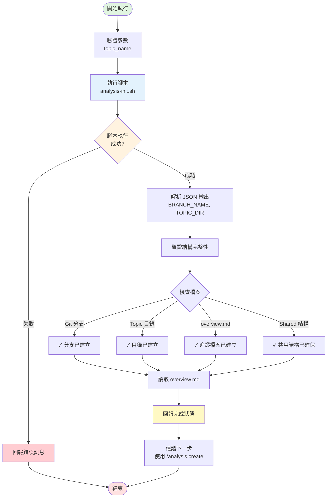

## 📥 輸入資料 (User Input)

**使用者參數**：`$ARGUMENTS` 的格式為 `<topic_name>`

**`topic_name` (必需)**：

- **格式**: 任意字串，建議使用中文描述功能主題

- **說明**: 此主題的名稱，將用於建立分支和目錄名稱（例如："會員管理功能"、"訂單處理系統"）

---

## 📊 流程概覽 (Flow Overview)



---

## 🚀 執行步驟 (Phases)

[ **CRITICAL**: 必須嚴格按照以下階段順序執行。]

### Phase 0: 執行腳本初始化環境 (Script Execution)

1.  **執行初始化腳本**:
    
    使用 `run_terminal_cmd` 執行：
    ```bash
    .analysis-kit/scripts/analysis-init.sh --json "<topic_name>"
    ```

2.  **解析腳本輸出**:
    
    腳本會輸出 JSON 格式結果，包含：
    - `BRANCH_NAME`: 新建立的 Git 分支名稱（例如：`analysis/001-會員管理功能`）
    - `TOPIC_DIR`: Topic 目錄完整路徑
    - `DIR_NAME`: 目錄名稱（例如：`001-會員管理功能`）

3.  **驗證結果**:
    
    確認以下項目已被腳本自動建立：
    - ✅ Git 分支已建立並切換
    - ✅ Topic 目錄已建立
    - ✅ `overview.md` 已建立（空的檔案清單表格）
    - ✅ `features/` 空目錄已建立
    - ✅ `apis/` 空目錄已建立
    - ✅ `components/` 空目錄已建立
    - ✅ `helpers/` 空目錄已建立
    - ✅ `request-pipeline/` 空目錄已建立

### Phase 1: 確認環境無需 AI 介入 (Verification Only)

[ **CRITICAL**: 此指令的主要工作由腳本完成，AI 只需確認和回報。]

1.  **讀取 overview.md**: 讀取新建立的 `overview.md`，確認結構正確。

2.  **確認結構完整**: 驗證所有必要檔案和目錄都已存在。

### Phase 2: 回報完成狀態 (Report)

1.  **確認產出**:

   - ✅ Git 分支：`<BRANCH_NAME>`
   - ✅ Topic 目錄：`<TOPIC_DIR>`
   - ✅ 標準檔案已建立：
     - `overview.md` (追蹤檔案清單，空的表格)
     - `features/` (功能分析目錄)
     - `apis/` (API 分析目錄)
     - `components/` (元件分析目錄)
     - `helpers/` (輔助函式分析目錄)
     - `request-pipeline/` (請求管線分析目錄)

2. **建議下一步**:

   - 🔜 使用 `/analysis.create <type> [source-files...]` 來建立具體的分析檔案
   - 📝 可用類型：`server`, `client`, `feature`, `api`, `request-pipeline`, `component`, `helper`

---

## 🔑 關鍵規則 (Key Rules)

[ **CRITICAL**: AI 在執行所有步驟時必須遵守的規則。]

- **規則 1**: 腳本負責所有環境建立工作，AI 僅需執行腳本並確認結果。

- **規則 2**: 必須使用 `--json` 參數執行腳本以取得結構化輸出。

- **規則 3**: 腳本會自動檢查 Git 未提交變更，若有衝突會中斷，AI 應回報錯誤訊息給使用者。

- **規則 4**: Topic 編號 `###` 由腳本自動計算，掃描現有 `analysis/` 目錄決定。

---

## 💡 使用範例

```bash
# 範例 1: 初始化會員管理功能分析
/analysis.init 會員管理功能

# 範例 2: 初始化訂單處理系統分析
/analysis.init 訂單處理系統

# 範例 3: 初始化支付流程分析
/analysis.init 支付流程
```

---

## 📊 預期產出結構

```
analysis/
└── 001-會員管理功能/              # 新建立的 Topic
    ├── overview.md                  # 追蹤清單（空的表格）
    ├── features/                    # 功能分析（空）
    ├── apis/                        # API 分析（空）
    ├── components/                  # 元件分析（空）
    ├── helpers/                     # 輔助函式分析（空）
    └── request-pipeline/            # 請求管線分析（空）
```

---

## ⚠️ 錯誤處理

如果腳本執行失敗，可能的原因：

1. **未在 Git 倉庫內**: 確認當前目錄是 Git 倉庫
2. **有未提交的變更**: 先提交或 stash 變更
3. **範本檔案不存在**: 確認 `.analysis-kit/templates/` 目錄完整
4. **權限問題**: 確認腳本有執行權限 (`chmod +x`)

AI 應將腳本的錯誤訊息完整回報給使用者。

