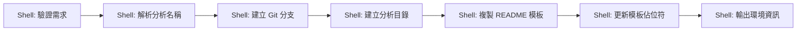
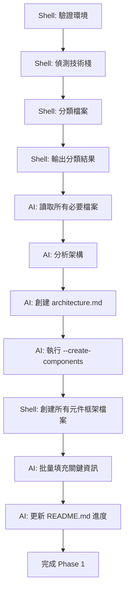
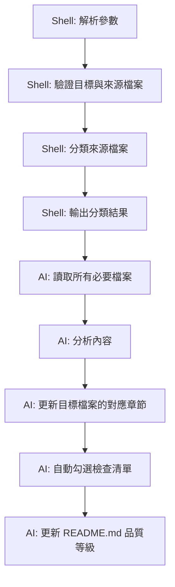

# Analysis Kit - 程式碼分析工具

## 概述

Analysis Kit 是專為多技術棧應用分析設計的程式碼分析工具，採用**模組化分析**方法，支援多階段漸進式分析以解決大型專案的 context window 限制問題。

**支援的技術棧**：
- .NET MVC + AngularJS (1.x)
- React / Next.js
- Vue.js / Nuxt.js
- Node.js + Express
- 其他前後端分離架構

---

## 🎯 核心設計原則

### 1. 職責分離原則 (Separation of Concerns)

**Shell 腳本職責**：
- ✅ 環境驗證（分支、目錄、檔案存在性）
- ✅ 檔案分類（技術棧偵測、檔案類型判斷）
- ✅ 資訊輸出（分類結果、路徑資訊）
- ❌ **不組裝 AI Prompt**
- ❌ **不提供 AI 指示**

**Markdown 指令檔案職責**：
- ✅ 完整的 AI 執行指示
- ✅ 檔案讀取清單
- ✅ 執行步驟定義
- ✅ 品質標準說明
- ✅ 使用範例

**設計優勢**：
```
┌─────────────────┐          ┌─────────────────┐
│ 指令檔案 (.md)   │          │ 腳本檔案 (.sh)   │
├─────────────────┤          ├─────────────────┤
│ ✅ AI 完整指示   │          │ ✅ 環境驗證      │
│ ✅ 執行步驟      │          │ ✅ 檔案分類      │
│ ✅ 品質標準      │  調用     │ ✅ 資訊輸出      │
│ ✅ 使用範例      ├─────────>│ ❌ 不組裝 Prompt │
└─────────────────┘          └─────────────────┘
     完整且彈性                    簡潔且可靠
```

---

### 2. 模組化分析原則 (Modular Approach)

每個元件分析包含三個層次：

1. **📄 基礎框架**（統一深度）
   - 所有元件都有一致的基本結構
   - 標準化的章節組織（介面分析、實作細節、架構品質）
   - 統一的分析深度基準線

2. **🔗 深度分析連結**（按需補充）
   - 模組化的分析入口點
   - 支援漸進式深化
   - 保持擴展彈性

3. **📊 分析狀態標示**（進度透明）
   - 明確標示每個元件的完成狀態
   - 視覺化進度追蹤
   - **基於內容完整度的品質等級指標**

---

### 3. 技術棧無關原則 (Tech-Stack Agnostic)

**智能檔案分類**：
- 自動偵測技術棧（.NET MVC, React, Vue, Node.js 等）
- 根據檔案類型自動分類（View/Controller/Component/API Route）
- 使用通用術語描述功能（元件、端點、路由）

**檔案類型映射**：

| 技術棧 | 前端檔案 | 後端檔案 | 生成檔案 |
|--------|---------|---------|---------|
| .NET MVC | `.cshtml` | `*Controller.cs` | `view-*.md` / `server-*.md` |
| React | `.jsx/.tsx` | API Routes | `component-*.md` / `server-*.md` |
| Vue | `.vue` | API Routes | `component-*.md` / `server-*.md` |
| Node.js | `.ejs/.pug` | `routes/*.js` | `page-*.md` / `server-*.md` |

---

### 4. 品質等級系統 (Content-Based Quality Levels)

基於**內容完整度**的品質等級系統：

| 等級 | 名稱 | 必要內容標準 | 檢查項目 |
|------|------|-------------|----------|
| ⭐ | **基礎框架級** | 結構完整 + 基本描述 + 檔案連結 | 3 項檢查點 |
| ⭐⭐ | **UI層完成級** | 上述 + HTML分析 + 互動圖 + CSS分析 | 7 項檢查點 |
| ⭐⭐⭐ | **邏輯層完成級** | 上述 + Controller分析 + 業務邏輯 + 資料流 | 11 項檢查點 |
| ⭐⭐⭐⭐ | **架構層完成級** | 上述 + 服務依賴 + 外部整合 + 效能評估 | 15 項檢查點 |
| ⭐⭐⭐⭐⭐ | **深度分析完成級** | 上述 + 重構建議 + 技術債 + 測試策略 | 19 項檢查點 |

每個等級都有具體的檢查清單，確保分析品質的客觀評估。

---

## 🚀 核心命令

### 命令 1: `/analysis-init` - 初始化分析環境

**🎯 用途**  
建立全新的分析任務環境，包含分析分支、目錄結構和基礎文件。

**📝 語法**
```bash
/analysis-init "分析任務名稱"
```

**🔧 功能說明**

| 功能模組 | 詳細說明 |
|---------|---------|
| **分支管理** | 自動建立 `analysis/{序號}-{名稱}` 格式的 Git 分支 |
| **目錄結構** | 在 `analysis/` 目錄下建立 `{序號}-{名稱}/` 子目錄 |
| **基礎文件** | 從模板複製並初始化 `README.md` |
| **進度追蹤** | 設置分析進度儀表板的基礎框架 |

**📂 產生的檔案結構**
```
analysis/
└── {序號}-{名稱}/
    └── README.md          # 分析進度儀表板（從 readme-template.md 建立）
```

**💡 使用範例**
```bash
/analysis-init "商品頁面分析"
# 產生:
# - Git 分支: analysis/001-salepage
# - 目錄: analysis/001-salepage/
# - 檔案: analysis/001-salepage/README.md
```

**⚙️ 內部執行流程**


**設計模式**：
- ✅ Shell 腳本：完全自主執行（環境創建）
- ✅ Markdown 指令：簡單指示（確認完成）

**🔗 下一步**  
執行 `/analysis-create <files...>` 來建立架構分析

---

### 命令 2: `/analysis-create` - 建立架構分析

**🎯 用途**  
分析原始碼檔案（View/Controller/Component/API Route），自動識別前後端元件並建立完整架構分析。

**📝 語法**
```bash
/analysis-create <type> <file1> [file2 ...]
```

**`type` 參數說明**

| 類型           | 主要用途                                                     |
| :------------- | :----------------------------------------------------------- |
| `architecture` | **(推薦)** 進行全面的前後端架構分析，建立 `architecture.md` 並產出所有元件的基礎框架。這是最常用的模式。 |
| `view`         | 專注於分析前端視圖檔案 (`.cshtml`, `.tsx` 等)，用於識別 UI 元件和互動流程。 |
| `server`       | 專注於分析後端端點檔案 (`*Controller.cs`, API Routes 等)。    |
| `service`      | 專注於分析服務層或業務邏輯檔案 (`*Service.cs` 等)。         |

**🌟 支援的技術棧**

| 技術棧 | 範例檔案 | 自動生成 |
|--------|---------|---------|
| **.NET MVC** | `Views/*.cshtml` + `*Controller.cs` | `architecture.md` + `view-*.md` + `server-*.md` |
| **React** | `components/*.tsx` + `api/routes/*.ts` | `architecture.md` + `component-*.md` + `endpoint-*.md` |
| **Vue** | `components/*.vue` + `api/*.js` | `architecture.md` + `component-*.md` + `endpoint-*.md` |
| **Node.js** | `views/*.ejs` + `routes/*.js` | `architecture.md` + `page-*.md` + `route-*.md` |

**🔧 功能說明**

| 功能模組 | 詳細說明 |
|---------|---------|
| **技術棧偵測** | 自動識別專案技術棧（.NET, React, Vue, Node.js 等） |
| **檔案分類** | 將檔案分類為 View/Controller/Component/API Route |
| **架構分析** | 生成 `architecture.md`（6 章節架構深度分析） |
| **基礎資訊整理** | 在 `README.md` 中整理技術棧、關鍵檔案等 |
| **元件框架創建** | 自動創建所有元件/端點分析檔案 |
| **關鍵資訊填充** | 填充 HTML 結構、方法簽名、路由等關鍵資訊 |
| **進度追蹤** | 在 `README.md` 中建立元件/端點清單與進度追蹤表 |

**📂 產生的檔案結構**
```
analysis/{序號}-{名稱}/
├── README.md                    # 分析總覽、技術棧、元件清單、進度追蹤
├── architecture.md              # 架構深度分析（6 章節）
├── view-01-功能名稱.md          # 前端視圖（.NET MVC / 任何 View）
├── component-01-元件名稱.md     # React/Vue 元件
├── server-01-方法名稱.md        # 後端端點（Controller Action / API Route）
├── service-method-01-方法名.md  # Service 層方法
└── ...                          # 其他元件/端點檔案
```

**💡 使用範例**

```bash
# 範例 1: .NET MVC 專案（首次執行，推薦使用 architecture）
/analysis-create architecture Views/Home/Index.cshtml Controllers/HomeController.cs
# → 偵測到 .NET MVC 技術棧
# → 生成 architecture.md + view-*.md + server-*.md

# 範例 1.1: 補充遺漏的 View 檔案（增量執行）
/analysis-create view Views/Home/_Header.cshtml Views/Home/_Footer.cshtml
# → 增量模式
# → 分析新檔案，識別 2 個新元件
# → AI 會將新元件合併到 README.md 與 architecture.md
# → 創建 view-06-*.md, view-07-*.md

# 範例 2: React 專案
/analysis-create architecture src/components/ProductList.tsx src/api/products.ts
# → 偵測到 React 技術棧
# → 生成 architecture.md + component-*.md + server-*.md

# 範例 3: Vue 專案
/analysis-create architecture src/views/Dashboard.vue src/api/users.js
# → 偵測到 Vue 技術棧
# → 生成 architecture.md + component-*.md + server-*.md

# 範例 4: 只分析前端
/analysis-create view Views/Product/List.cshtml
# → 只生成 architecture.md + view-*.md（無後端檔案）
```

**⚙️ 內部執行流程**


**設計模式**（參考範本）：
- ✅ Shell 腳本：環境驗證 + 技術棧偵測 + 檔案分類
- ✅ Markdown 指令：完整 AI 指示（讀取檔案、分析、創建文件）
- ✅ 雙向協作：Shell 提供分類資訊，AI 執行分析和文件創建

**🧠 AI 分析重點**
- 識別前端元件（基於 HTML 結構、Component 定義）
- 識別後端端點（基於 Controller Actions、API Routes）
- 提取每個元件的外層容器/簽名
- 分析使用者互動流程和業務邏輯分組
- 建立元件之間的依賴關係

**✅ 成功條件**
- 已執行 `/analysis-init`（分析目錄存在）
- 原始碼檔案存在且可讀取
- AI 成功識別至少一個功能元件/端點

**💡 智能增量模式**
- **首次執行**: 創建完整的 `architecture.md`（包含 6 章節架構分析）和 `README.md`（包含技術棧、元件清單等）
- **增量執行**: 分析新檔案，智能合併新元件/端點到 `README.md` 清單
  - ✅ 自動識別新元件/端點
  - ✅ 避免重複
  - ✅ 保留 `architecture.md` 和 `README.md` 的手動編輯
- **適用場景**: 大型專案分批分析、補充遺漏的檔案

**📊 Phase 1 成果**

**`architecture.md` 包含 6 章節**（專注於架構深度分析）：
1. 前端架構（View/Component、狀態管理、路由、技術債）
2. 後端架構（Controller/Route、授權、請求處理、技術債）
3. 業務邏輯層（服務依賴、業務邏輯封裝、資料存取、第三方整合）
4. 資料流與整合（請求生命週期、前後端資料流、快取策略、錯誤處理）
5. 效能與安全性（效能指標、安全檢查清單、SEO 策略）
6. 監控與改善（監控指標、已知技術債、改善建議）

**`README.md` 包含以下章節**（分析總覽與進度追蹤）：
- 分析資訊（編號、主題、分支、狀態）
- 分析目標
- 技術棧資訊（前後端技術、資料庫、第三方服務）
- 關鍵檔案清單（前後端主要檔案）
- 目錄結構
- 分析階段與進度
- 功能元件清單（前端元件表格）
- 後端端點清單（後端端點表格）
- 優先級說明（P0/P1/P2 定義）
- 下一步行動

**所有元件框架檔案已填充關鍵資訊**：
- **前端**：HTML 結構 / Component 簽名
- **後端**：方法簽名 / 路由 / 授權屬性

**品質等級**: ⭐ 基礎框架級 (Foundation Level)

**🔗 下一步**  
執行 `/analysis-update <file>` 開始補充詳細分析內容（Phase 2）

---

### 命令 3: `/analysis-update` - 補充分析內容

**🎯 用途**  
將程式碼檔案的分析內容補充到指定的元件檔案中。

**📝 語法**
```bash
/analysis-update "target_analysis_file" <file1> [file2 ...]
```

**🔧 功能說明**

| 功能模組 | 詳細說明 |
|---------|---------|
| **目標驗證** | Shell 腳本驗證指定的目標分析檔案 (`view-*.md` 等) 確實存在 |
| **檔案驗證** | Shell 腳本檢查所有輸入的原始碼檔案是否存在 |
| **檔案分類** | Shell 腳本將輸入的原始碼檔案分類為 View/Controller/Service 等，並輸出結果供 AI 參考 |
| **內容整合** | **AI** 根據分類結果，將分析內容整合到目標分析檔案的對應章節中 |
| **品質提升** | 用具體程式碼分析取代「[待補充]」標記 |
| **檢查清單更新** | AI 自動勾選完成的檢查項目 |

**📂 更新的檔案**
```
analysis/{序號}-{名稱}/
├── view-01-xxx.md        # 更新：對應章節的分析內容
├── component-01-xxx.md    # 更新：對應章節的分析內容
├── server-01-xxx.md       # 更新：對應章節的分析內容
└── README.md              # 更新：分析進度狀態（如需要）
```

**💡 使用範例**

```bash
# 範例 1: 使用 View 檔案，更新指定的 view-*.md 元件
/analysis-update "view-01-profile-display" Views/VipMember/Profile.cshtml
# → AI 將 Profile.cshtml 的分析內容，更新到 view-01-profile-display.md 的「1. 介面與互動分析」章節

# 範例 2: 使用 Controller 檔案，更新指定的 server-*.md 元件
/analysis-update "server-01-get-profile" Controllers/VipMemberController.cs
# → AI 將 VipMemberController.cs 的分析內容，更新到 server-01-get-profile.md 的「2. 實作細節分析」章節

# 範例 3: 針對特定元件，批次補充多個來源檔案的分析
/analysis-update "view-01-商品展示" Services/ProductService.cs Utilities/DataFormatter.js
# → AI 會將 ProductService.cs 和 DataFormatter.js 的分析內容，同時補充到 view-01-商品展示.md 的對應章節
```

**⚙️ 內部執行流程**



**設計模式**（已重構）：
- ✅ Shell 腳本：環境驗證 + 檔案分類（**不組裝 Prompt**）
- ✅ Markdown 指令：完整 AI 指示（6 步驟執行流程）
- ✅ AI 自主決策：匹配元件、更新內容、勾選檢查清單

**🎯 檔案類型路由規則**

| 檔案類型 | 檔案模式 | 主要更新章節 |
|---------|---------|------------|
| **View** | `*.cshtml`, `*.html`, `*.vue`, `*.jsx` | 1. 介面與互動分析 |
| **Controller** | `*Controller.cs`, `*Controller.ts`, API Routes | 2. 實作細節分析 |
| **Service** | `*Service.cs`, `*Service.ts` | 2. 實作細節分析 + 3. 架構與品質分析 |
| **Utility** | `*Utility.ts`, helpers | 2.4 相依服務與工具 |

**✅ 成功條件**
- 已執行 `/analysis-create`（architecture.md 和元件檔案存在）
- 所有輸入檔案存在且可讀取
- AI 成功將分析內容整合到對應元件

**📊 品質等級提升**
- ⭐ → ⭐⭐：補充了 HTML 結構和互動流程
- ⭐⭐ → ⭐⭐⭐：補充了 Controller 方法和業務邏輯
- ⭐⭐⭐ → ⭐⭐⭐⭐：補充了 Service 依賴和架構分析
- ⭐⭐⭐⭐ → ⭐⭐⭐⭐⭐：補充了技術債、改善建議、測試策略

**🔗 後續動作**  
1. AI 自動勾選完成的檢查清單項目
2. AI 自動更新 README.md 品質等級
3. 持續補充更多檔案直到達到目標品質等級

---

## 📁 檔案結構

```
project-directory/                    # 專案目錄（.analysis-tool-kit 的父目錄）
├── .analysis-tool-kit/               # 分析工具包
│   ├── scripts/
│   │   ├── analysis-init.sh                      # 初始化分析環境
│   │   ├── analysis-create.sh       # 建立架構分析（主命令）
│   │   ├── analysis-update.sh                    # 更新分析內容
│   │   ├── create-view-files.sh                 # (Deprecated) Wrapper 腳本
│   │   ├── analysis-paths.sh                     # 顯示路徑資訊
│   │   ├── common.sh                             # 共用函數
│   │   └── feature-utils.sh                      # 功能建立工具
│       ├── templates/
    │   │   ├── architecture-template.md              # 架構分析模板（6 章節）
    │   │   ├── view-template.md                      # 前端視圖分析模板
    │   │   ├── server-template.md                    # 後端端點分析模板
    │   │   ├── service-template.md                   # Service 方法分析模板
    │   │   └── readme-template.md                    # 進度追蹤模板
│   ├── memory/
│   │   └── constitution.md                       # 功能分析憲法
│   └── README.md                                 # 工具包說明文件（本文件）
├── analysis/                                     # 分析目錄（與 .analysis-tool-kit 同層）  
│   └── {###}-{Name}/
│       ├── architecture.md                       # 架構分析（6 章節）
│       ├── README.md                             # 進度追蹤
│       ├── view-01-xxx.md                        # 前端視圖分析（.NET MVC / 任何 View）
│       ├── component-01-xxx.md                   # React/Vue 元件分析
│       ├── server-01-xxx.md                      # 後端端點分析（Controller Action / API Route）
│       ├── service-method-01-xxx.md              # Service 層方法分析
│       └── ...                                   # 其他元件/端點
└── .cursor/commands/                             # Cursor 命令
    ├── analysis.init.md                          # 初始化分析環境命令
    ├── analysis.create.md                        # 建立架構分析命令
    └── analysis.update.md                        # 更新分析內容命令
```

---

## 💼 完整工作流程範例

### 範例 1: .NET MVC 專案分析 (推薦)

#### 🔍 Phase 1: 建立架構框架
```bash
# 步驟 1: 初始化分析（建立基礎架構）
/analysis-init "會員中心頁面分析"
# → 自動建立「會員中心頁面分析」任務 + git branch
# → 建立：README.md

# 步驟 2: 建立架構分析和元件框架
/analysis-create architecture Views/VipMember/Profile.cshtml Controllers/VipMemberController.cs
# → 偵測技術棧：.NET MVC
# → 分析 View 和 Controller 識別功能區塊和 Actions
# → 建立：architecture.md（6 章節架構分析）+ README.md（技術棧、元件清單）
# → 建立：所有 view-*.md 檔案（前端視圖）
# → 建立：所有 server-*.md 檔案（Controller Actions / API Routes）
# → 填充：HTML 結構（view）+ 方法簽名和路由（server）
# → 更新：README.md 進度表

# Phase 1 完成 ✅
# - architecture.md: 6 章節架構深度分析
# - README.md: 技術棧、元件清單、進度追蹤（總覽層次）
# - view-*.md: 所有前端視圖（包含 HTML 外層容器）
# - server-*.md: 所有後端端點（包含方法簽名和路由）
# - 品質等級: ⭐ 基礎框架級
```

#### 🔬 Phase 2: 補充詳細分析
```bash
# 步驟 3: 補充 View 層詳細分析
/analysis-update Views/VipMember/Profile.cshtml
# → 更新所有相關 view 的「1. 介面與互動分析」章節
# → 添加互動流程圖、UI 組件說明
# → 品質等級: ⭐ → ⭐⭐

# 步驟 4: 補充 Controller 詳細分析
/analysis-update Controllers/VipMemberController.cs
# → 更新所有相關 server 的「2. 實作細節分析」章節
# → 添加業務邏輯說明、資料流向圖
# → 品質等級: ⭐⭐ → ⭐⭐⭐

# 步驟 5: 補充 Service 層分析
/analysis-update Services/VipMemberService.cs
# → 更新所有相關 view/server 的「3. 架構與品質分析」章節
# → 添加服務依賴、外部整合分析
# → 品質等級: ⭐⭐⭐ → ⭐⭐⭐⭐

# 步驟 6: 補充工具層分析
/analysis-update Utilities/MemberUtility.ts
# → 更新所有相關元件的「2.4 相依服務與工具」章節
# → 品質等級: ⭐⭐⭐⭐ → ⭐⭐⭐⭐⭐
```

---

### 範例 2: React 專案分析

#### 🔍 Phase 1: 建立架構框架
```bash
# 步驟 1: 初始化分析
/analysis-init "產品列表頁面分析"

# 步驟 2: 建立架構分析（React 專案）
/analysis-create architecture src/components/ProductList.tsx src/api/products.ts
# → 偵測技術棧：React
# → 建立：architecture.md（6 章節架構分析）+ README.md（技術棧、元件清單）
# → 建立：component-*.md（React 元件）
# → 建立：server-*.md（API 端點）
# → 填充：Component 簽名 + API 路由
```

#### 🔬 Phase 2: 補充詳細分析
```bash
# 步驟 3: 補充元件詳細分析
/analysis-update src/components/ProductList.tsx src/components/ProductCard.tsx
# → 更新相關 component 的詳細分析

# 步驟 4: 補充 API 詳細分析
/analysis-update src/api/products.ts
# → 更新相關 server 的詳細分析
```

---

### 範例 3: 只有前端檔案

```bash
# 步驟 1: 初始化
/analysis-init "前端元件分析"

# 步驟 2: 建立架構（只提供前端檔案）
/analysis-create view Views/Home/Index.cshtml
# → 偵測技術棧：.NET MVC
# → 建立：architecture.md（前端為主）
# → 建立：view-*.md（前端視圖）
# → **不建立** server-*.md（因為沒有提供 Controller）

# 步驟 3-N: 補充詳細分析
/analysis-update Views/Home/Index.cshtml
# → 補充前端元件的詳細分析
```

---

## 🎯 核心優勢

| 優勢 | 說明 |
|------|------|
| **職責分離** | Shell 腳本只做驗證，Markdown 指令提供完整 AI 指示 |
| **技術棧無關** | 支援 .NET MVC, React, Vue, Node.js 等多種技術棧 |
| **智能檔案分類** | 自動偵測技術棧並分類檔案（View/Controller/Component/API Route） |
| **模組化分析** | 分階段處理大型專案，避免 context window 限制 |
| **品質等級制** | 基於 19 項檢查點的客觀品質評估系統 |
| **向後兼容** | 支援舊版 `overview.md` 格式 |
| **中文專業** | 適合中文技術團隊使用的專業分析工具 |

---

## 🔧 設計模式總結

### 三大命令的一致性設計

所有命令遵循相同的職責分離原則：

```
┌─────────────────────────────────────────────────────────────────┐
│                      命令執行架構                                  │
├─────────────────────────────────────────────────────────────────┤
│                                                                   │
│  User: /analysis-xxx <args>                                      │
│    ↓                                                              │
│  ┌───────────────────┐          ┌───────────────────┐          │
│  │ Markdown (.md)    │          │ Shell Script (.sh) │          │
│  │ - AI 完整指示     │ ───調用──> │ - 環境驗證        │          │
│  │ - 執行步驟        │          │ - 檔案分類        │          │
│  │ - 品質標準        │          │ - 資訊輸出        │          │
│  │ - 使用範例        │          │ ✅ 簡潔可靠       │          │
│  │ ✅ 完整彈性       │          └───────────────────┘          │
│  └───────────────────┘                                          │
│    ↓                                                              │
│  AI 執行（讀取檔案、分析、創建文件、更新進度）                        │
│                                                                   │
└─────────────────────────────────────────────────────────────────┘
```

### 命令對比表

| 命令 | Shell 職責 | Markdown 職責 | 設計評分 |
|------|-----------|-------------|---------|
| `analysis-init` | ✅ 環境創建 | ✅ 簡單指示 | ⭐⭐⭐⭐ |
| `analysis-create` | ✅ 驗證+偵測+分類 | ✅ 完整 AI 指示 | ⭐⭐⭐⭐⭐ |
| `analysis-update` | ✅ 驗證+分類 | ✅ 完整 AI 指示（6 步驟） | ⭐⭐⭐⭐⭐ |

---

## 🔗 相關資源

### 內部文件
- **分析憲法**: `.analysis-tool-kit/memory/constitution.md`
- **架構模板**: `.analysis-tool-kit/templates/architecture-template.md`
- **元件模板**: `.analysis-tool-kit/templates/view-template.md`, `server-template.md`, `service-template.md`
- **進度模板**: `.analysis-tool-kit/templates/readme-template.md`

### Cursor 命令
- **初始化**: `.cursor/commands/analysis.init.md`
- **建立架構**: `.cursor/commands/analysis.create.md`
- **更新內容**: `.cursor/commands/analysis.update.md`

### 分析產出
- **分析目錄**: `analysis/###-name/`
- **架構文件**: `architecture.md`
- **進度追蹤**: `README.md`
- **元件分析**: `view-*.md`, `component-*.md`, `server-*.md`, `service-method-*.md`

---

_Last updated: 2025-10-02 - v2.1 (Enhanced documentation and best practices)_
